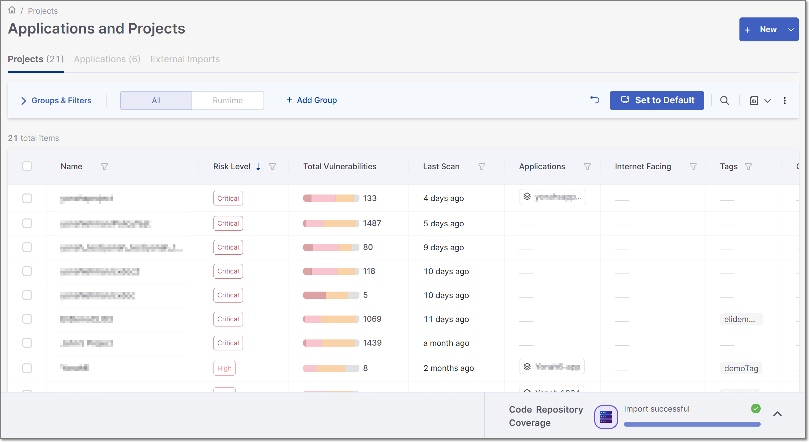
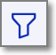
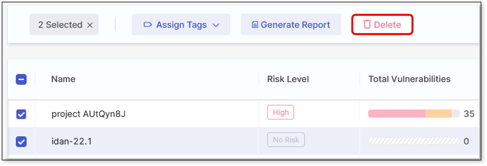
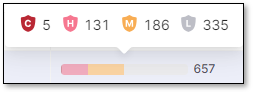
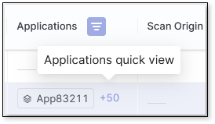
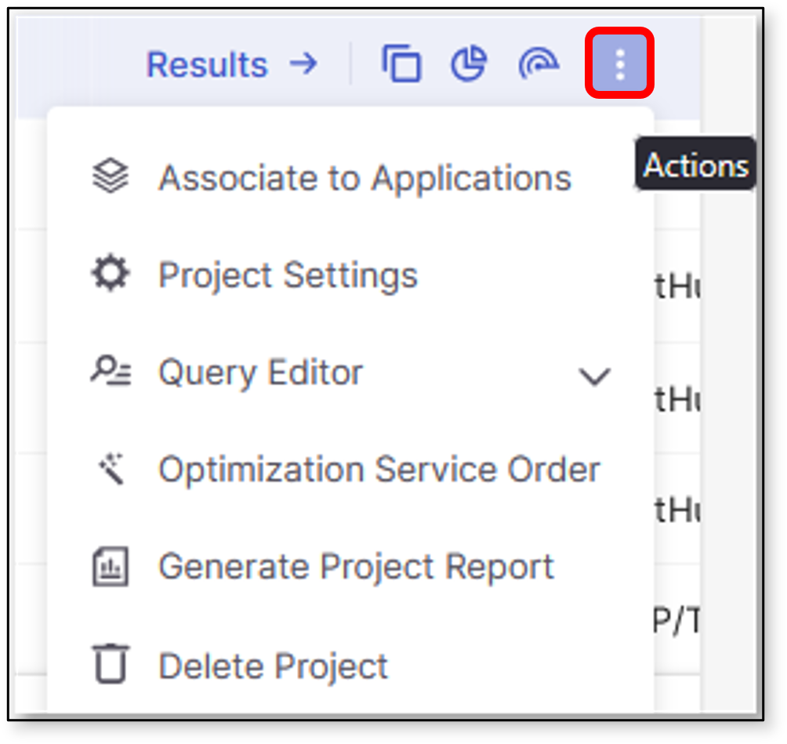
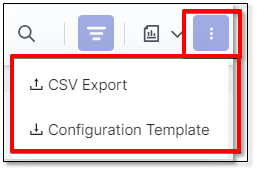

# Projects Page

The Checkmarx One Projects page displays all projects associated with a specific tenant. These projects can be either Checkmarx projects or Code Repository integration projects manually created by the user. For additional details on managing Checkmarx One projects, refer to [Managing Projects](README.md).

The page includes several elements, such as:

- The **New** button for creating new Projects. For more information, refer to [Creating Projects](creating-projects.md)
- Projects table
- Project actions
- Actions menus for generating reports, exporting the Projects table, configuring templates, and more
- Code Repository Coverage widget

## Understanding the Projects Table

The Projects Table is a great tool for understanding the projects in your tenant. Each row represents a project's latest successful scan and its details in the respective columns. For more details on the project columns, see [here](README.md#viewing-the-projects-tab). The table is customizable and searchable and can be exported as a .csv file for easy sharing or manipulation in an Excel worksheet.

### Customizing the Projects Table

Hone in on the projects you are working on by customizing the Project table view. The default table view shows projects that have never been scanned, sorted by the most recent project update or scan date in descending order. It displays 25 projects per page, as specified in the **Rows** dropdown. Use the dropdown to adjust the view to display 10, 50, or 100 projects per page. Use **Groups**, **Filters**, and **Sorting** to further manipulate your table view.

- **Groups**: The table view can be grouped by the Projects' risk levels. To enable risk level grouping, follow these steps:

  1. Click  then 
  2. Select the **Risk Level** group.
  3. Click **Add**.
- **Filters**: Filtering can be applied to single or multiple columns in the table. To enable filtering for a single column, hover over the desired column header and click  . Set the filter conditions and click **Select**. The table will then be filtered accordingly, and the applied filters will be added to the filters box above the table.

  Another option to enable filtering is to click  next to the Search field. This will toggle the  for all the table columns.
- **Sorting**: Clicking the header toggles the sorting of that column between ascending and descending order or removes the sort.

To delete a project, click  at the end of the project row and then **Delete**. To delete multiple projects, mark the checkboxes - to the left of the project names- and **Delete** from the table ribbon.

<figure><figcaption></figcaption></figure>

### Set Default Table Display

When you customize the display of a table by changing the grouping, applying a filter, sorting the results etc., the  button appears at the top of the page. Click on this button to save this view as your default. Each time that you log in to your account your **Default** view will be displayed.

If you then make changes while showing your customized **Default** view, a **Revert** button appears next to the **Set to Default** button . This will return you to the previously set **Default** view.

Alternatively, you can click on  again to set the current view as your Default. This will override and permanently delete the previous **Default** view.


Pagination and branch selection are not included in the **Default** view, as these tend to relate to a specific session.


## Project Actions

All actions available for a single Project appear upon hovering over the Project row in the table. Some actions are quick actions automatically displayed upon hovering, while the remaining supported actions can be found in the menu.

### Quick Actions

- Clicking anywhere on a Project row will open its results in the **Risk Orchestration** page.
- The total number of detected vulnerabilities in the scanned code is displayed in the **Total Vulnerabilities** column. Hovering over the vulnerability severity distribution bar displays a split of the vulnerabilities per severity.

  <figure><figcaption></figcaption></figure>
- **Applications Column** - displays applications associated with a given project. This column can be sorted and filtered by clicking the column header or the . Select **None** in the filter dropdown to view only projects with no associated applications. Hover over and click on an associated application to open its overview page. Hovering over and clicking the number next to the application will show a quick view of all applications associated with the project. You can then click on any application in the quick view to open its detailed overview page. Refer [here](https://docs.checkmarx.com/en/34965-166163-application-details-page.html#UUID-f9f5e310-2ff5-4858-1122-425641f00121_UUID-53d0544a-3a56-4bd9-e2a3-ba9fc26ff603) for more information on the Application Overview Page.

  
- **Scanner Results Icons** - The Scanner Results column shows which engines ran on the project during the last scan. Color indicates severity: darker colors represent more critical findings. Hovering over any of the **Scanner Results** icons will display the severity of that scanner for the last successfully completed scan. Clicking on the icon will open the last scan results in the Results Viewer.

  If the icons do not all fit in your table view, a +{#} link is displayed at the right side of the column. Hover over the link to see the additional scanners.
-  - This link will copy the Project's ID to the clipboard.
-  (Overview) - Redirects you to the project's overview page.
-  (Scan) - Initiates a new scan for the Project.

### Actions Menu

Selecting  at the end of the project's row opens that project's Actions menu, which includes the following options:

<figure><figcaption></figcaption></figure>

-  **Associate to Applications** - Assigns the project to an application.
-  **Project Settings** - Opens project settings.
-  **Query Editor** - Opens the default SAST or IaC Query Editor. If both options are available, a dropdown appears to select one.
-  **Optimization Service Order** - Orders Optimization service from the Checkmarx AppSec experts for this project.
-  **Generate Project Report** - Opens the **Generate Report** sliding pane, allowing you to set up and generate the project report.
-  **Delete Project** - Deletes the project.

## Other Actions

The Checkmarx One Projects page offers several other actions, including the ability to export the Projects table and configure the project template. These actions are located in the three-dot menu :

<figure><figcaption></figcaption></figure>

### CSV Export

To export the Projects table data in CSV format, click on **CSV Export** in the **Actions** menu next to the Search field.

### Configuration Template

To open the configuration template, click on **Configuration Template** in the **Actions** menu next to the Search field.

For additional information, refer to [Configuring Projects Using Config as Code Files](configuring-projects-using-config-as-code-files/README.md).

## Code Repository Coverage Widget

The Code Repository Coverage widget enhances Checkmarx One monitoring and coverage for the supported code repositories.

The widget is designed to provide the following capabilities:

- A quick view of the code repositories being monitored in the system.
- Repository coverage percentage - Only code repository organizations and repositories are counted excluding CI/CD ones.
- A list of organizations that are monitored for each supported code repository.
- How many repositories of the monitored organizations are being scanned in Checkmarx One.
- An option to add additional organizations/repositories to improve the code repository coverage.

For additional information, refer to Code Repository Coverage.
