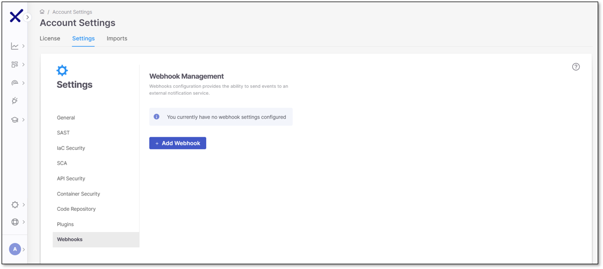
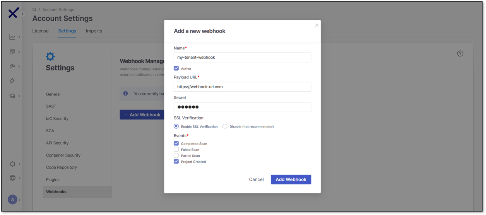
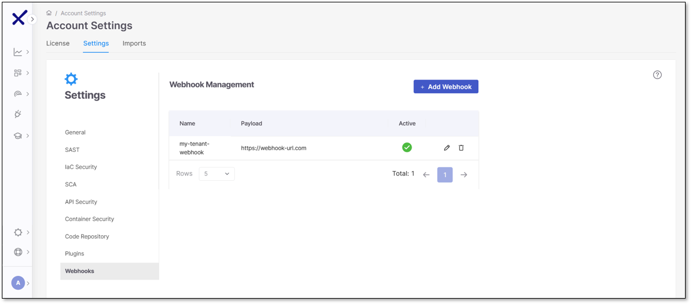

# Tenant-level Webhooks

**Webhooks** allow you to send post-scan events to an external notification service. You can manage webhooks at the tenant level, defining global settings that automatically apply across all projects. This eliminates the need to configure webhooks individually for each project, significantly reducing manual effort and streamlining administration.

Centralizing webhook management makes it easier to maintain consistency across all your projects. Admins can set up global webhooks once and have them apply everywhere while still letting [individual projects](configuring-projects.md#webhooks) use their own if needed. Global webhooks do not interfere with project-specific ones. They run separately, so anything you set at the tenant level does not override or block what is already set up in individual projects. This keeps everything aligned without locking you into a one-size-fits-all setup.

## Global Webhooks Configuration

Select **Webhooks** under **Account Settings** to add a new webhook.

Click **+ Add Webhook** to begin. You can create webhooks with the following fields:

- **Webhook Name**: Descriptive label
- **Active**: Toggle to activate webhook
- **Payload URL**: Endpoint for webhook delivery
- **Secret** (optional): For added security
- **SSL Verification**
- **Events**:

  - Completed Scan
  - Failed Scan
  - Partial Scan
  - Project Created (new trigger for when a project is created)

When done, you will see your active webhook and its payload.

## Permissions

To manage global webhooks, you will use the existing **manage-webhook** permission set, which includes the following:

- **Create**: Add new global webhooks
- **Read**: View existing global webhooks
- **Update**: Edit webhook settings
- **Delete**: Remove global webhooks
