# Viewing the Project Details Page

## Opening the Project Overview

Go to the **Workspace** > **Projects** page. Hover over the row of the relevant Project and click on the **Overview** icon.

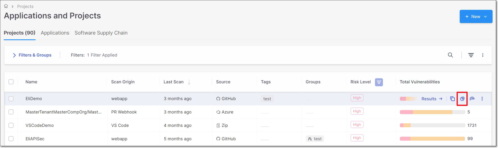

The **Project** page opens showing the **Overview** tab.

<figure>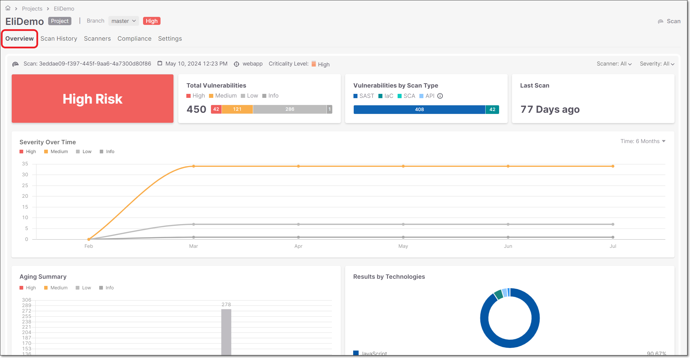<figcaption></figcaption></figure>

## Header Bar

<figure>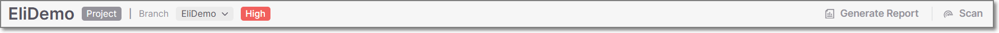<figcaption></figcaption></figure>

The header bar provides general project information and contains two action buttons. Throughout the Project Page, this top section remains static regardless of the active tab.

The following table describes the **Header Bar** elements:

| Item | Description | Example |
|---|---|---|
| **Project Name** | Name of the project currently on display | EliDemo |
| **Branch Filter** | Select the branch whose results you wish to view by clicking the dropdown menu next to **Branch** and choosing the desired option.  If no branch is selected, the results shown will reflect the most recent scan.  | Master |
| **Risk Level** | Displays the project risk level | • Critical • High • Medium • Low • Info |
| **Generate Report** | Click to generate a project report for the latest scan | |
| **Scan** 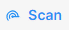 | Click to run a new scan | |

## Project Overview

Project **Overview** page presents aggregated information and analytics for a specific Project. This tab opens by default when you open the project page.

### Overview Widgets

#### Risk Level

The **Risk Level** widget displays the **project risk level**.

The data reflects the last scan in the project for the selected branch.

The widget shows as a colored area that depends on the risk level. It includes a text definition as well:

- Critical
- High
- Medium
- Low
- Info

<figure>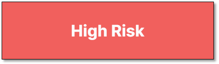<figcaption></figcaption></figure>

#### Total Vulnerabilities

The **Total Vulnerabilities** widget displays the **number of total vulnerabilities**, distributed by severity.

The summary includes vulnerabilities from the last scan of each engine in the project for the selected branch.

The widget includes the following indicators:

- The total number of vulnerabilities identified (for all scanners) in the last scan of the project.
- Stacked bars (Critical, High, Medium, Low, Info) with the number of vulnerabilities per severity.

#### Vulnerabilities by Scan Type

The **Vulnerabilities by Scan Type** widget displays the distribution of vulnerabilities by scan types.

The widget includes the following:

- A number of stacked bars - Reflecting the scan types usage, as follows:

  - SAST - Static Application Security Testing
  - IaC - IaC Security
  - SCA - Software Composition Analysis
  - API - API Security
  - CON - Container Security
  - SCS - Software Supply Chain Security
- The number of vulnerabilities per scan type.

<figure>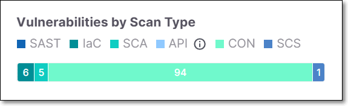<figcaption></figcaption></figure>

#### Last Scan

The **Last Scan** widget displays the number of days that have passed since the last completed scan to the current date.

<figure>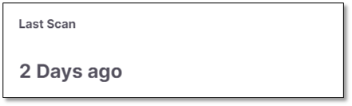<figcaption></figcaption></figure>

#### Severity Over Time

The **Severity Over Time** widget displays the latest vulnerabilities value distributed by severity (Critical, High, Medium, Low, Info).

The widget includes the following time ranges:

- **Week**
- **Month**
- **Three Months**
- **6 Months** (Default)
- **Year**

  
  When **Week** is selected, data points are shown for each day. When **Month** is selected, data points are shown for each week. For all other options, data points are shown on a monthly basis.
  

<figure>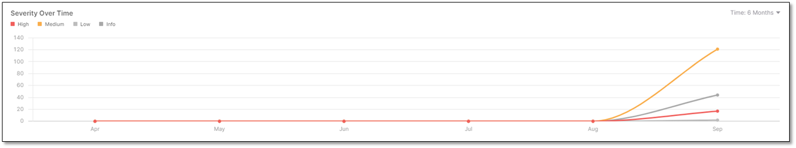<figcaption></figcaption></figure>

#### Aging Summary

The **Aging Summary** widget displays the number of vulnerabilities distributed by severities for the first discovery date in a specific time range.

The widget includes a bar chart presentation with the following parameters:

- **x-axis** - Displays 4 constant time ranges:

  - **0 - 30 days**
  - **30 - 60 days**
  - **60 - 90 days**
  - **90+ days**
- **y-axis** - Displays the number of vulnerabilities.
- **Chart data** - Stacked bars per each time range (Critical, High, Medium, Low, Info) with the number of vulnerabilities per bar type.

<figure>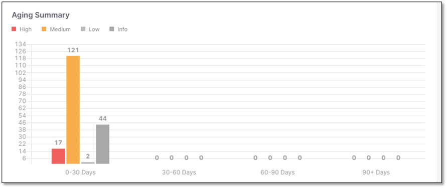<figcaption></figcaption></figure>

#### Results by Technologies

The **Results by Technologies** widget displays the percentage of vulnerabilities detected for each language and technology.

<figure>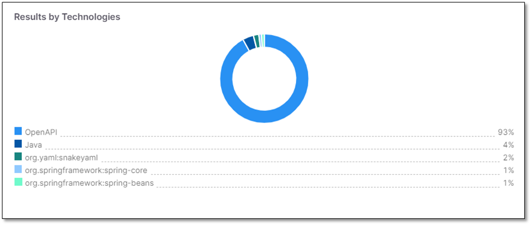<figcaption></figcaption></figure>

#### Compliance

The **Compliance** widget displays all the compliance standards that exist in the Checkmarx One Database.


By default, results are shown for all supported compliance standards. It is possible to configure your account to show results only for specific compliance standards that are relevant for your organization. This can be set via the [Scan Configuration API](https://checkmarx.stoplight.io/docs/checkmarx-one-api-reference-guide/branches/main/cs61sszap44td-scan-configuration-service#compliance-filtering).


The data indicates which scan has been verified for the compliance standards and which scan did not.

The widget includes the following:

- **A donut chart** that includes **Passed / Failed** compliance standards.
- A count of:

  - **Passed** compliance standards.
  - **Total** compliance standards.
- Clicking each item directs the user to the relevant standard in the **Compliance** tab as illustrated for **OWASP Top 10 API** as an example.

<figure>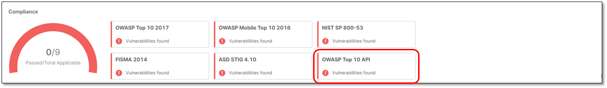<figcaption></figcaption></figure>

<figure>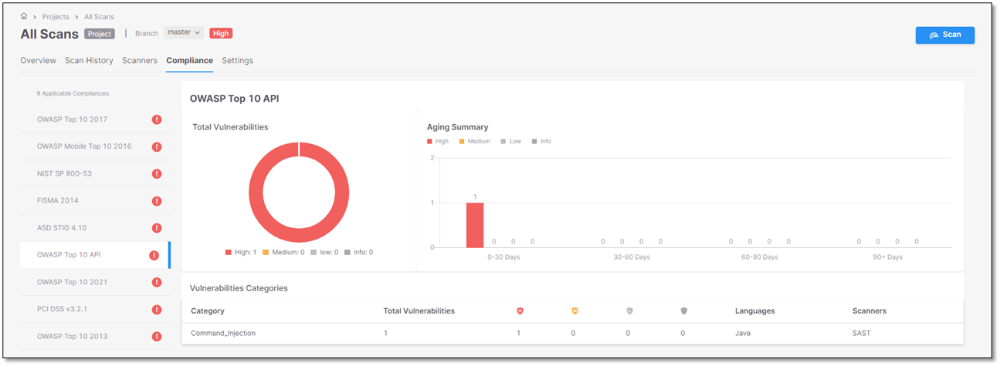<figcaption></figcaption></figure>

## Scan History

<figure>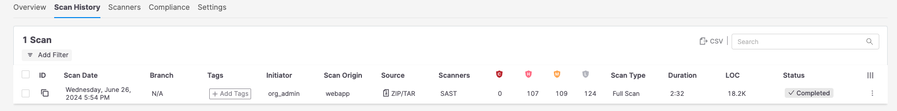<figcaption></figcaption></figure>

The **Scan History** tab displays a list of all the scans that were performed within a project.

Each record shows information about a scan that was completed.

The information appears in a table with each column indicating a different value. These values are listed and explained in the table below.

| **Column** | **Description** | **Possible Values** |
|---|---|---|
| **Scan Date** | The date and time on which the scan was performed | • For example **Thursday, September 15, 2022, 11:46 PM** |
| **Branch** | The branch that has been scanned For .zip files, the the value is **N/A**. | • **Master** (or any other branch) • **N/A** |
| **Tags** | Project tags | • Any value |
| **Initiator** | The client who initiated the scan | • **Username** • **CLI** • **GitHub-Action-Integration** |
| **Scan Origin** | Shows how the most recent scan of the Project was triggered. | • `webapp` - manual project triggered from the UI • `Push Webhook`/`PR Webhook` - code repository project triggered by a push or PR • `Project Scan` - code repository project triggered manually from the UI • `cli` - triggered from the Checkmarx One CLI tool • `Jenkins`/ `Azure DevOps`/ `VS Code` etc. - triggered from the specified plugin (CI/CD or IDE) |
| **Source** | Shows how the source code was accessed for the most recent scan. | • `ZIP/TAR` - manual project scan from an uploaded file • `GitHub`/ `GitLab`/ `Azure`/ `BitBucket` - the name of the code repository where the source code resides.  This can be a code repository project or a manual project that scanned code from a code repository.  |
| **Scanners** | The scanners that have been used for the scan | • **SAST** • **SCA** • **IaC Security** • **API Security** • **Container Security** • **SCS** |
| **Severity** | The amount of vulnerabilities, distributed by severities | • **Critical** • **High** • **Medium** • **Low** • **Info** |
| **Scan Type** | Scan Type | • **Full Scan** • **Incremental** |
| **Duration** | Scan duration | • **HH:MM:SS** |
| **LOC (Lines of Code)** | The number of lines of code scanned for SAST and IaC results, where analysis is performed directly on source files. For scans like SCA, which analyze dependencies rather than source code, this metric is not applicable. | |
| **Status** | Scan status | • **Completed**, • **Partial** - for example, it failed for one scanner, but for the remaining ones, the scan was completed • **Failed** - for all used scanners • **Canceled** |
| **Actions** | Actions that can be performed on the scan. | • Delete Scan • Generate Default Report • Customize Report • Download Source Code |

### Viewing the Scan Overview (Side Panel)

Click a scan to open the **Scan Overview** pane on the right side of the screen. which provides access to scan results, logs, and detailed analysis tools.

<figure><figcaption></figcaption></figure>

At the top of the pane, the following information is displayed:

- **Scan id**: the unique identifier of the scan (shown in bold).
- **Scan origin**: the platform used to initiate the scan.
- **Source**: the type of source code that was scanned.
- **Risk level**: The overall risk level of the scanned source.
- **Vulnerabilities**: A breakdown of vulnerabilities identified in the scan, categorized by severity.
- **Scan status**: The current status of the scan, e.g. completed.

Below this section, the pane is divided into two tabs: **Scanners** and **Scan Configuration**

#### Scanners Tab

The **Scanners** tab displays a card for each scanner included in the scan. Each card provides the following information and actions:

- **Scanner name**
- **Results**: Opens the scanner's results viewer.
- **More options** ( **menu**):

  - **Download logs** (SAST only): Exports detailed scan execution logs for troubleshooting and analysis.
  - **More details**: Displays a high-level timeline of the scan process.
  - **Audit Scan** (supported for SAST, IaC Security and Secret Detection scanners): Opens an audit session with a query editor for reviewing and analyzing scan results. For more information, see [SAST Query Editor](../resource-management/sast-query-editor/README.md), [IaC Security Query Editor](../resource-management/iac-security-query-editor.md) or [Secret Detection Query Editor](../resource-management/secret-detection-query-editor.md).
- **Scan date**
- **Scanner status** (for example, *Completed*)
- **Duration**: - The total time the scan took to complete.
- **Vulnerability bar**: A color-coded bar showing the number of vulnerabilities by severity.

#### Scan Configuration Tab

The **Scan Configuration** tab displays a detailed list of the configurations applied during the scan, organized by configuration type and indicating their origin—whether inherited from the environment, tenant, or project level, or defined directly at the scan level.

### Filtering the Scans List View

#### Filtering Branches

By default, the Scans list is filtered by **Branch**.

The Scans list view includes only the **Repository** based scans.

<figure>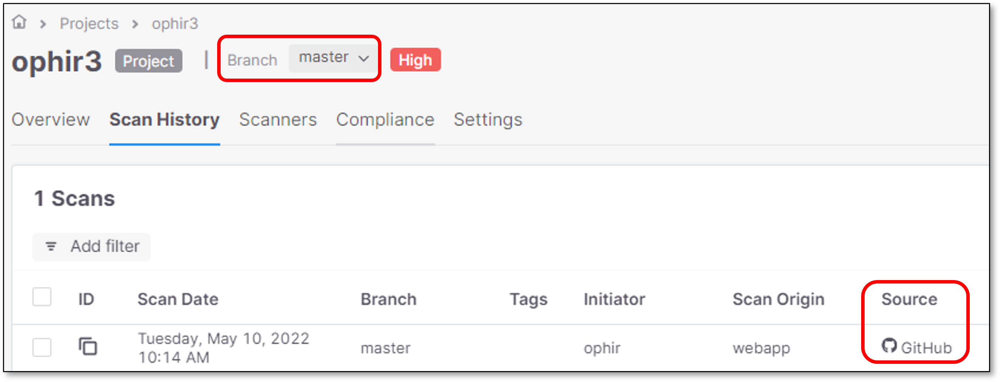<figcaption></figcaption></figure>

#### Filtering Zip Files

The zip source files filter is configured in Checkmarx One as **N/A**.

The Scans list view includes only the **zip files** scans.

<figure>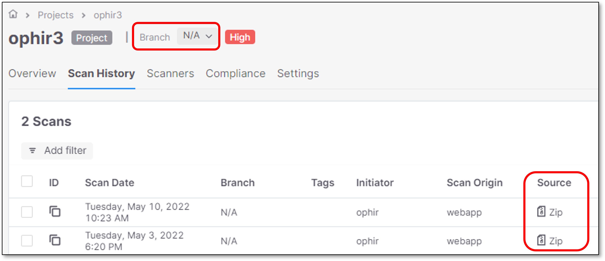<figcaption></figcaption></figure>

### Deleting a Scan

You can delete any scan marked as **Completed** from the Scan History screen.

**To delete a scan:**

1. Click  and then select  **Delete Scan**.
2. Click \<**OK**> to confirm your request.

### SAST Scans Comparison

SAST comparison lets you compare 2 SAST scans of the same repository branch or zip file to understand which vulnerabilities were added, resolved, or reoccurred between the two scans.

The feature also flags results that weren't re-evaluated because scan settings changed between the two scans, so they aren't mistaken for resolved vulnerabilities. Checkmarx One distinguishes between **New**, **Resolved**, **Recurring**, and **Not Evaluated** results, and lets you export the comparison as a .csv file.

#### Comparing SAST Results

To compare SAST results, perform the following:

1. Perform at least 2 SAST scans of the same repository branch or zip file.
2. Open the projects page by using one of the methods that appear in this link Viewing Scan Results
3. Click on **Scan History**

   <figure>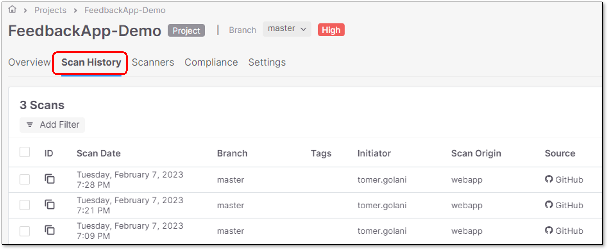<figcaption></figcaption></figure>
4. Select 2 scans from the list

   
   The scans can be full scans or incremental.
   

   <figure>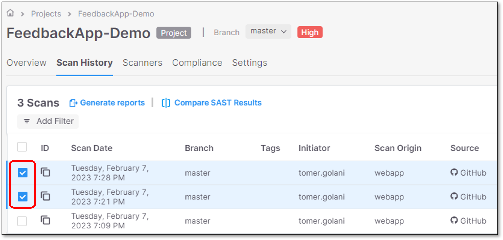<figcaption></figcaption></figure>
5. Click on **Compare SAST Results**

   <figure>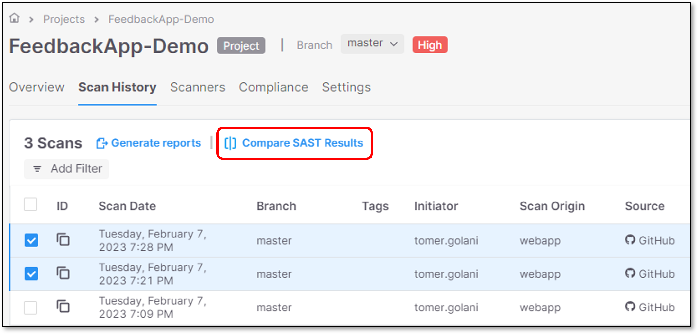<figcaption></figcaption></figure>
6. The **Comparative Preview Summary** pane opens.

   <figure>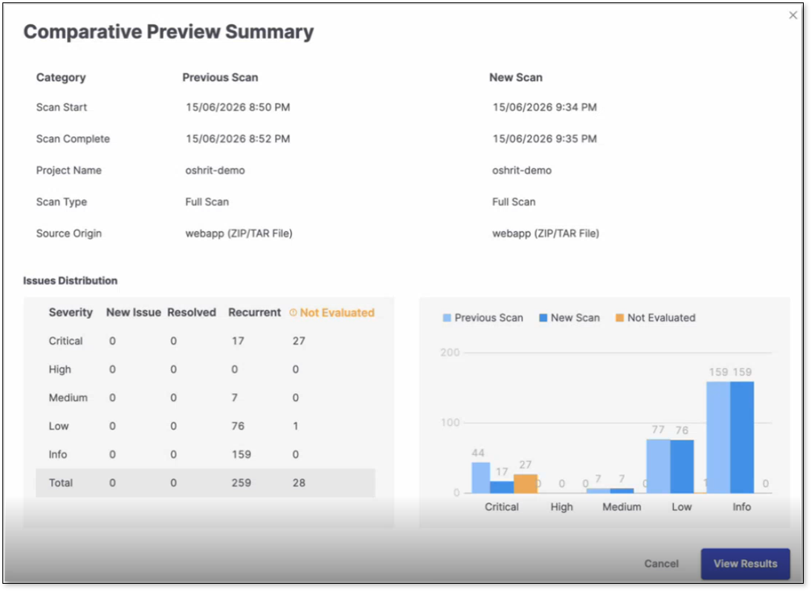<figcaption></figcaption></figure>
7. Click **View Results** to open the compare page. This page is similar to the results viewer. Grayed-out vulnerabilities have not been evaluated yet.

   <figure>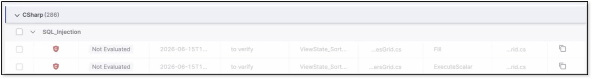<figcaption></figcaption></figure>


You will be able to see different results statuses:

- **New Issues:** Issues that were found only in the newer scan. You can also add notes, change the state and those changes are reflected in the most recent scan.
- **Resolved Issues:** Issues that were found only in the older scan. You can't add notes nor change the state because the result is resolved.
- **Recurring Issues:** Issues that were found in both scans. You can also add notes, change the state and those changes are reflected in the most recent scan.
- **Not Evaluated Issues**: Issues that were found in the older scan but were not re-tested in the newer scan (for example, due to a scan configuration change). These are not considered **Resolved**. The result details panel shows the reason the result was not evaluated.


You may also view and compare a current scan to a previous scan: Select a project's scan from the scan history page and click the compare icon 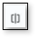. Filter the results by **Status**  > **Not Evaluated**.

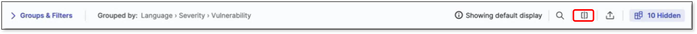

Export your results as a .csv file by clicking the export icon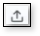.

#### Limitations

- The feature supports **only SAST scans**. If one of the selected scans doesn't contain SAST scanner the comparison option will be greyed out and disabled, with the suitable tooltip.
- The comparison is being performed using **2 SAST scans**. In case that the user selects more than 2 scans the comparison option will be greyed out and disabled, with the suitable tooltip.
- Results are no longer marked as **Resolved** solely due to a change in scan configuration between the two selected scans; such results are marked **Not Evaluated** instead.

## Scanners

The **Scanners** tab provides an overview of results from each specific scanners used for the last completed scan of the project. The widgets shown in each of the dashboards are explained in the sections below. The following section explains the shared functionality of the dashboard widgets.

### Dashboard Widget Functionality

#### Filter the Widget View

The default widget view is filtered according to the scanned source file **branch** - Repository scans.

The zip source files view is configured as **N/A**.

<figure><figcaption></figcaption></figure>


- For **repository scanned** files the main **branch** is **Master**, but it is possible to see also the sub-branches (In case they were scanned).
- It is also possible to set any scanned branch as **Primary**.
- If **zip** source files were scanned in the project, it is possible to switch the widgets view to **N/A**.


#### Pie Charts


The illustrated pie charts in this section are from different scans than the previous ones.


You may hide content from the pie charts or display additional information on content as explained below.

**To hide content from pie charts:**

Click the content Language/State. The relevant content appears crossed out and the result is hidden from the chart as illustrated below.

<figure>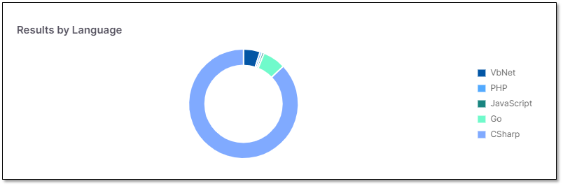<figcaption></figcaption></figure>

<figure>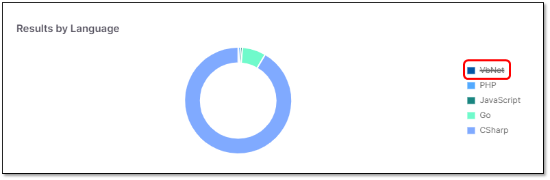<figcaption></figcaption></figure>

**To display additional information on a result:**

Hover over the desired pie chart section, a tooltip appears with information on the content as illustrated below.

<figure>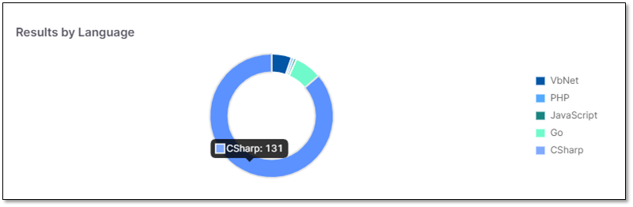<figcaption></figcaption></figure>

### SAST Scanner

The **SAST Scanner** screen provides an overview of the last completed SAST scan, using SAST widgets.

<figure>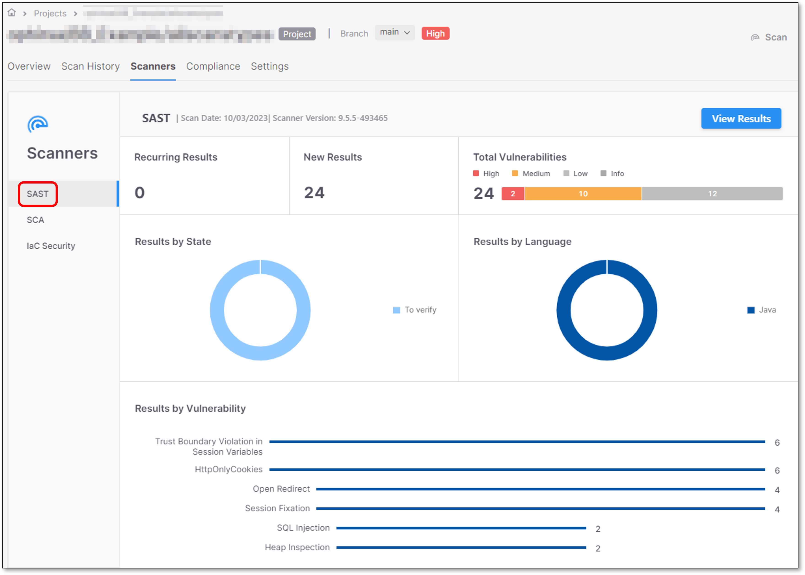<figcaption></figcaption></figure>

#### SAST Widgets

##### Recurring Results

**Recurring Results** widget displays the number of vulnerabilities with “recurrent” status.

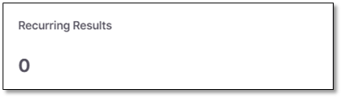

##### New Results

**New Results** widget displays the number of vulnerabilities with “new” status.

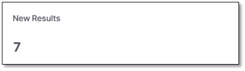

##### Total Vulnerabilities

**Total Vulnerabilities** widget displays the total number of vulnerabilities per severity - **Critical**, **High**, **Medium**, **Low**, **Info**.

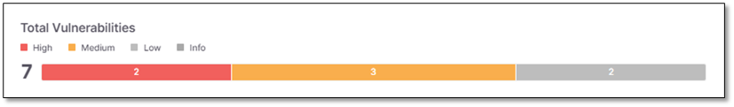

##### Results by State

**Results by State** widget presents the number of vulnerabilities per state (To Verify, Confirmed, Not exploitable, etc.).

##### Results by Language

**Results by Language** widget presents the number of vulnerabilities per language (VbNet, JavaScript, CSharp, etc.).

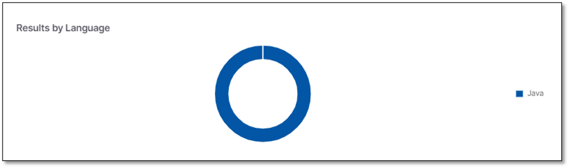

##### Results by Vulnerabilities

**Results by Vulnerabilities** widget presents the number of vulnerabilities per category (Stored XSS, XPath Injection, etc.).

<figure>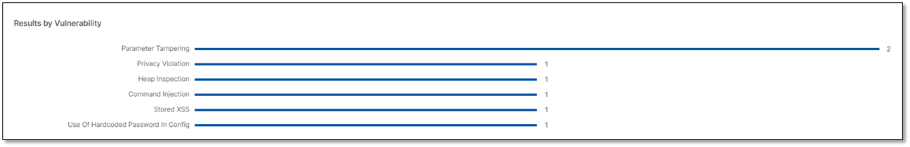<figcaption></figcaption></figure>

#### SAST Results

The **SAST Scanner** screen offers an option to directly open **SAST results**.

To open SAST results, click on **View Results**.

Clicking **View Results** redirects users to the SAST results filtered view.

For more information about SAST results, refer to [Viewing SAST Result](../viewing-scan-results-in-the-results-viewers/sast-results-viewer/README.md).

### SCA Scanner

The **SCA Scanner** screen provides an overview of the last completed SCA scan, using SCA widgets.

<figure>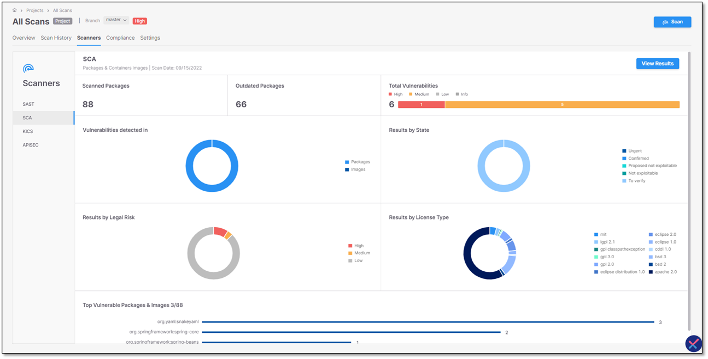<figcaption></figcaption></figure>

#### SCA Widgets

##### Scanned Packages

**Scanned Packages** widget displays the total number of scanned packages.

<figure>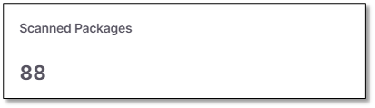<figcaption></figcaption></figure>

##### Outdated Packages

**Outdated Packages** widget displays the total number of outdated packages (i.e. packages for which a newer version is available) in your Project.

<figure>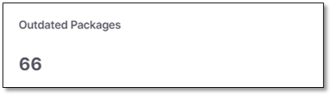<figcaption></figcaption></figure>

##### Total Vulnerabilities

**Total Vulnerabilities** widget displays the total number of vulnerable packages, distributed by severity - **Critical**, **High**, **Medium**, **Low**,

<figure>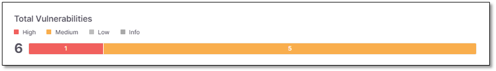<figcaption></figcaption></figure>

##### Vulnerabilities detected In

**Vulnerabilities detected In** widget displays the number of vulnerabilities distributed by the type of entity in which they were found (**Packages**, **Images**).

<figure>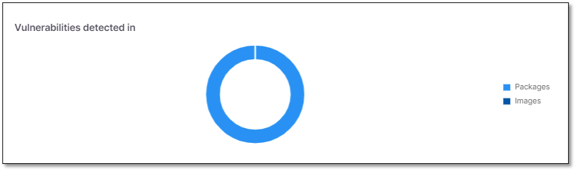<figcaption></figcaption></figure>

##### Results by State

**Results by State** widget displays the number of vulnerabilities distributed by the current state of the vulnerability.

<figure>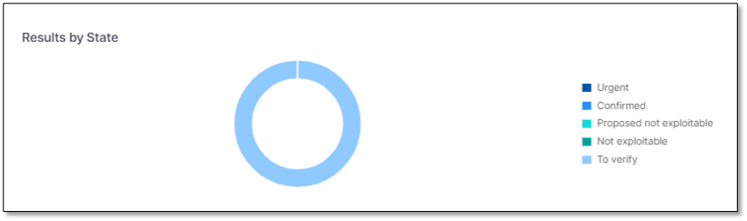<figcaption></figcaption></figure>

##### Legal Risks

**Legal Risk** widget displays the vulnerable scanned packages distributed by legal risk severity - **Critical**,**High**, **Medium**, **Low**.

<figure>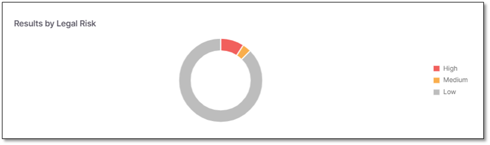<figcaption></figcaption></figure>

##### Results by License Type

**Results by License Type** widget displays the vulnerable scanned packages per license type - **zlib**, **public domain**, **mit**, **mozilla 1.1** etc.

<figure>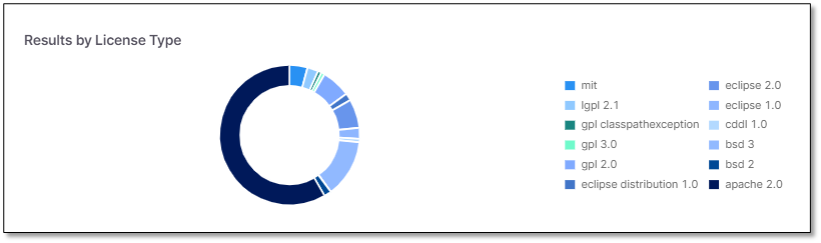<figcaption></figcaption></figure>

##### Top Vulnerable Packages

**Top Vulnerable Packages** widget shows the packages with the highest number of vulnerabilities. For each package, the number of vulnerabilities associated with that package is listed, for example **org.yaml:snakeyaml** has **3** vulnerabilities.

<figure>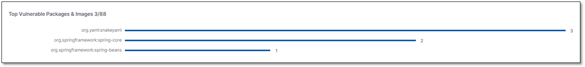<figcaption></figcaption></figure>

#### SCA Results

The **SCA Scanner** screen allows you to directly open **SCA results**.

To open SCA results, click on **View Results**.

Clicking **View Results** redirects users to the SCA results pages.

For a description of the information displayed on the SCA Results pages, refer to [Viewing SCA Results](../viewing-scan-results-in-the-results-viewers/sca-results-viewer.md).

### IaC Security Scanner

The **IaC Security Scanner** screen provides an overview of the last completed IaC Security scan, using IaC Security widgets.

<figure>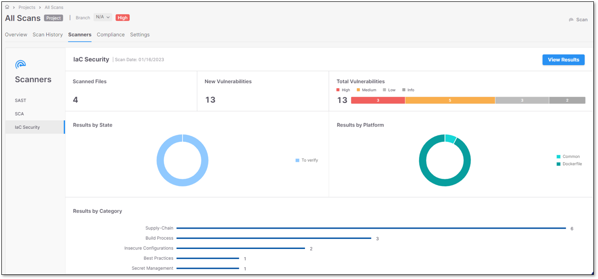<figcaption></figcaption></figure>

#### IaC Security Widgets

##### Scanned Files

**Scanned Files** widget presents the number of scanned files.

<figure>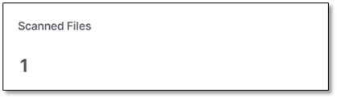<figcaption></figcaption></figure>

##### New Vulnerabilities

**New Vulnerabilities** widget presents the number of vulnerabilities with **new** status.

<figure>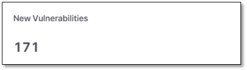<figcaption></figcaption></figure>

##### Total Vulnerabilities

**Total Vulnerabilities** widget presents the total number of vulnerabilities per severity - Critical, High, Medium, Low, Info.

<figure>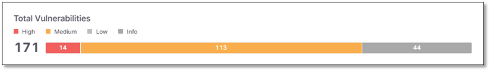<figcaption></figcaption></figure>

##### Results by State

**Results by State** widget presents the number of vulnerabilities per state (To Verify, Confirmed, Not exploitable, etc.).

<figure>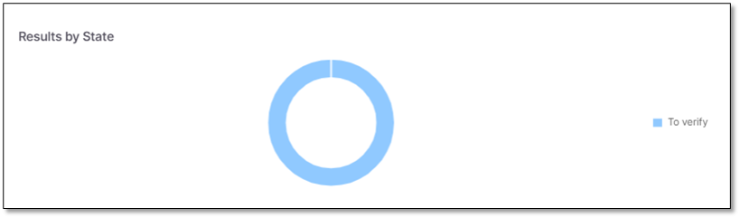<figcaption></figcaption></figure>

##### Results by Platform

**Results by Platform** widget presents the number of vulnerabilities per platform (Common, Dockerfile, Kubernetes, etc.).

<figure>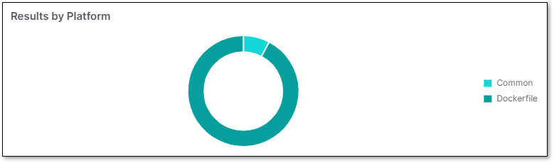<figcaption></figcaption></figure>

##### Results by Category

**Results by Category** widget presents the vulnerabilities distribution per Category (Insecure Configurations, Access Control, Resource Management, etc.).

<figure>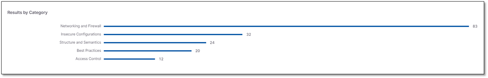<figcaption></figcaption></figure>

#### IaC Security Results

**IaC Security Scanner** screen provides the option to directly open **IaC Security results**.

To open IaC Security results, click on . It will redirects users to the IaC Security results view.

For additional information on IaC Security results, go to [IaC Security Results Viewer](../viewing-scan-results-in-the-results-viewers/iac-security-results-viewer.md).

### API Security Scanner

The **API Security Scanner** screen provides an overview of the last completed API security scan using API Security widgets.

<figure><figcaption></figcaption></figure>

#### API Security Widgets

##### Detected APIs

The number of detected APIs in the code. This scan detected **10** APIs in the code.

<figure><figcaption></figcaption></figure>

##### Sensitive Data APIs

The number of APIs with at least one sensitive data attribute. This scan detected sensitive data attributes in **9** out of the **10** detected APIs. Sensitive Data categories and parameters are listed in the table below.

<figure><figcaption></figcaption></figure>

| Category | Parameters |
|---|---|
| **Name** | firstname, surname, familyname, fullname, name |
| **Personal Data** | birthday, dob, dateofbirth, phone, mobile, email, socialsecurity, ssn, driverslicense |
| **Address** | address, zipcode |
| **Bank** | credit, cardnumber, account |
| **Secrets** | credentials, secret, auth, apikey, pass, pwd, password |

##### Undocumented APIs

Lists the number of undocumented API endpoints found in the code but not in the Swagger file after scanning both the code and the documentation.

In the illustrated example, API Security detected **Undocumented APIs** once.

##### Results by Vulnerabilities

A list of sensitive data attributes with an indicator on how often each of these sensitive data attributes was detected.

In the illustrated example, API Security detected **Parameter Tampering** twice and three more once each.

<figure><figcaption></figcaption></figure>

##### Results by Risk

The number of sensitive data attributes according to their risk.

In the illustrated example, API Security detected **5** vulnerabilities of which **2** were of high risk and **3** of medium risk.

<figure><figcaption></figcaption></figure>

#### Viewing Results

To view results, click **View Results**. The Risks table appears. It lists the risks and provides additional information detailed in the parameters below and described in [Viewing API Results](../viewing-scan-results-in-the-results-viewers/api-security-results-viewer.md).

<figure><figcaption></figcaption></figure>

| Parameter | Description |
|---|---|
| **Severity** | Indicates the risk severity as follows: • **Critical** • **High** • **Medium** • **Low** • **Info** |
| **Risk Name** | The name of the risk. |
| **Status** | Indicates the status of the risk as follows: - A newly detected vulnerability. - The vulnerability has been detected at least once before. |
| **Endpoint Path** | The end path of the resource URL. |
| **Method** | The operation that the endpoint performs on resources. |
| **Data Origin** | Indicates where the risk was detected, for example inside the **code**. |
| **Risk Discovered** | The date when the risk was detected. |
| **Doc** | Undocumented APIs present a risk because attackers may use them as an undetectable surveillance and reconnaissance channel. This column shows whether the endpoint is documented or not: • "**-**" appears when no documentation file was not scanned • **Yes**: The endpoint appears in the scanned document, and it is documented • **No**: The endpoint appears in the scanned document, but it is not documented |
| **AuthN** | Unauthenticated APIs present a risk because they may allow easy access to confidential information. This column shows whether the endpoint is authenticated or not. • "**-**" appears when no documentation file was not scanned • **Yes**: The endpoint appears in the scanned document, and it is authenticated • **No**: The endpoint appears in the scanned document, but it is not authenticated |

You can view the parameters of a *code* risk by clicking its row.

- Under **Parameters**, click . All sensitive data parameters in the code appear.

  <figure><figcaption></figcaption></figure>
- | Interface | Description |
  |---|---|
  |  | List of all sensitive parameters in the API with warnings. This section is identical to the list of sensitive data parameters. |
  |  | List of all parameters in the request to the API. The sensitive parameters are labeled . |
  |  | List of all parameters in the response by the API. The sensitive parameters are labeled . |

To view the details of a *documentation* risk, click its row and the vulnerability in the Swagger file will appear with an embedded description box.

<figure><figcaption></figcaption></figure>

### Container Security Scanner

The **Container Security** screen provides an overview of the last completed Container Security scan, displayed by Container Security widgets.

<figure>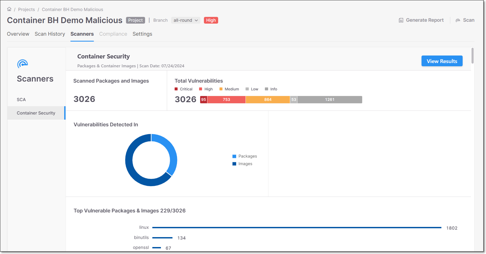<figcaption></figcaption></figure>

#### Container Security Widgets

##### Scanned Packages and Images

The **Scanned Packages and Images** widget displays the number of packages and images that were scanned in your project.

<figure>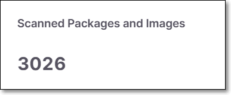<figcaption></figcaption></figure>

##### Total Vulnerabilities

The **Total Vulnerabilities** widget displays the number of vulnerabilities discovered in the scan broken down by severity.

<figure>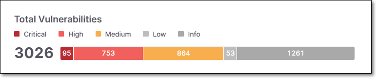<figcaption></figcaption></figure>

##### Vulnerabilities Detected In

The **Vulnerabilities Detected In** widget presents a pie chart with a breakdown of the vulnerabilities detected in Packages vs. Images.

<figure>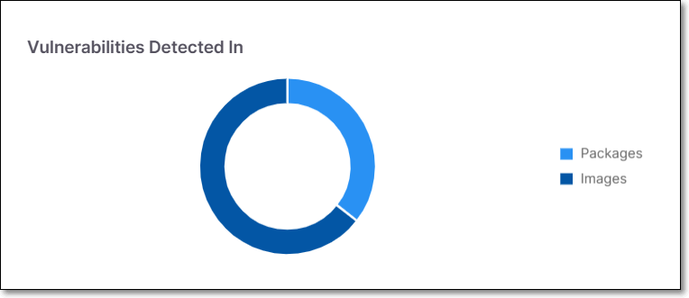<figcaption></figcaption></figure>

##### Top Vulnerable Packages & Images

The **Top Vulnerable Packages & Images** widget presents the number of vulnerabilities detected in the packages and images with the most vulnerabilities.

<figure>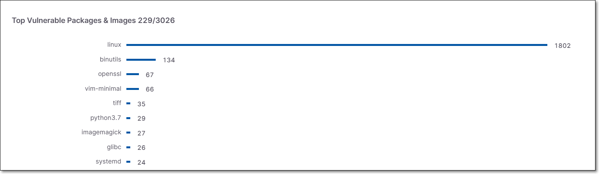<figcaption></figcaption></figure>

#### Container Security Results

The **Container Security** **Scanner** screen provides the option to open Container Security results.

To open Container Security results, click on . It will redirect users to the Container Security Results view.

For additional information on Container Security results, go to [Container Security Results Viewer](../viewing-scan-results-in-the-results-viewers/container-security-results-viewer.md).

## Compliance

<figure>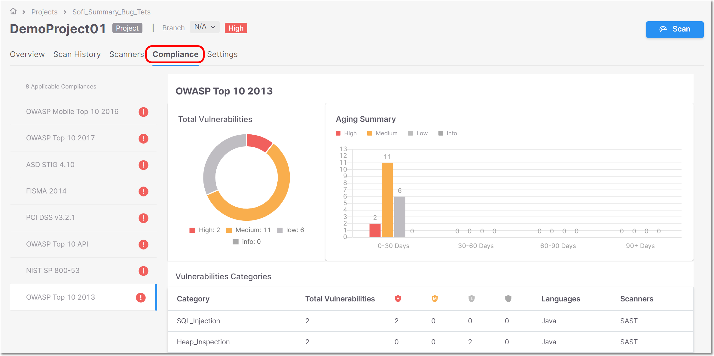<figcaption></figcaption></figure>

The **Compliance** tab shows details about applicable compliance standards for the Project. The **left side panel** shows a list of applicable compliance standards. Clicking on a standard shows info for that standard in the main display.


By default, results are shown for all supported compliance standards. It is possible to configure your account to show results only for specific compliance standards that are relevant for your organization. This can be set via the [Scan Configuration API](https://checkmarx.stoplight.io/docs/checkmarx-one-api-reference-guide/branches/main/cs61sszap44td-scan-configuration-service#compliance-filtering).


### List Pane

The left side pane shows a list of all standards that are applicable for this Project (i.e. all standards for which the relevant queries were run).

Next to each compliance standard is either a checkmark, indicating that the Project passed the requirements of that compliance standard, or an exclamation point, indicating that it failed.


The Project is considered to have passed a compliance standard if it does not have any Critical, High, Medium, or Low severity vulnerabilities.


<figure>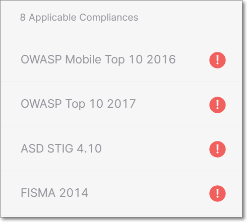<figcaption></figcaption></figure>

### Main Display

The **main display** show shows details about the vulnerabilities that were identified that do not comply with selected standard.

#### Total Vulnerabilities Widget

This widget shows the number of vulnerabilities that do not comply with this standard, broken down by severity level (Critical, High, Medium, Low, Info). The info is shown as color coded doughnut graph.

<figure>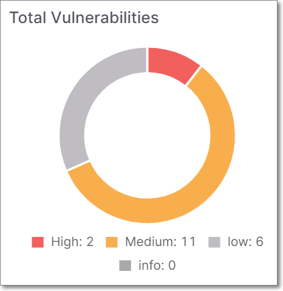<figcaption></figcaption></figure>

#### Aging Summary Widget

This widget shows a bar graph indicating the number of new vulnerabilities related to this compliance standard that were identified during various time periods. The data is broken down by severity level.


The data shown in this widget is for vulnerabilities that are present in the last scan of the selected branch of this Project.


<figure>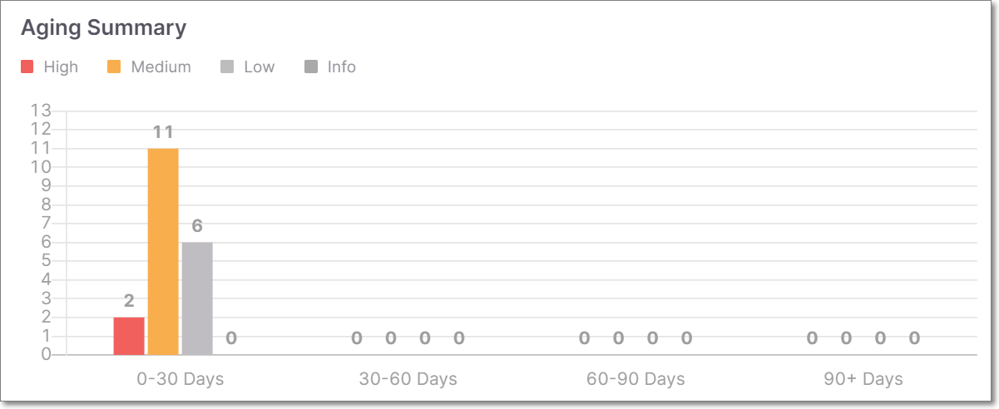<figcaption></figcaption></figure>

#### Vulnerabilities Categories Table

The bottom section shows a list of categories of vulnerabilities that were discovered in the Project. For each category, details are shown about the vulnerabilities discovered.

The following information is shown for each category:

| **Parameter** | **Description** | **Possible Values** |
|---|---|---|
| **Category** | The name of the vulnerability category | e.g. Heap_Inspection, Privacy_Violation, etc. |
| **Total Vulnerabilities** | The total number of vulnerabilities discovered in this category | A number |
| **Severity** | The number of vulnerabilities, distributed by severity: Critical, High, Medium, Low, Info | A number |
| **Languages** | The language(s) of the detected vulnerabilities | e.g. Java |
| **Engines** | The type of scan engine that discovered the vulnerability | SAST, SCA or KICS |
