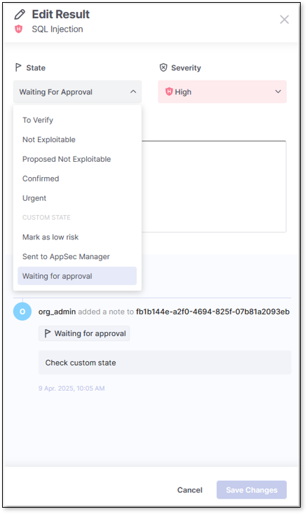
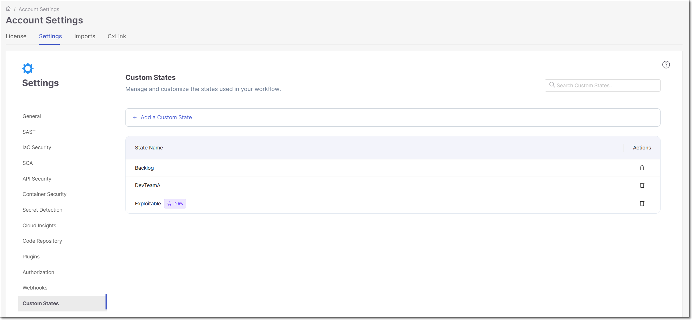
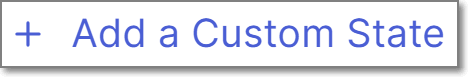

# Managing (Triaging) Vulnerabilities

## Overview

Checkmarx One tracks specific vulnerability instances throughout your SDLC. This means that after the initial scan of a Project, if an **identical** vulnerability is detected again in a subsequent scan of your Project it is automatically marked as a **Recurrent** vulnerability.


For SAST vulnerabilities, a recurrent vulnerability instance is defined as a vulnerability with the identical Source Node and Sink Node as well as the identical Attack Vector elements. If even minor changes were introduced to any of these elements (even though the nature of the threat is the same), it will be treated as a separate vulnerability instance.


Each vulnerability instance has a **Predicate** associated with it, which is comprised of the following attributes: ‘state’, ‘severity’ and ‘notes’. After reviewing the results of a scan, you have the ability to triage the results and modify these predicates accordingly. If a subsequent scan discovers a vulnerability with the **identical vulnerability instance**, its status will be marked as a **Recurrent**, and any changes that have been made to the predicate (state, severity and comments) are applied to the result in the new scan. For example, if you marked a vulnerability as **Urgent** and it was identified again in a subsequent scan, it will automatically be marked again as **Urgent**.


Changes that are made to the predicate of a vulnerability instance are applied only to that Project. So, if the identical vulnerability instance is present in a different Project, the edited predicate won’t be applied to that instance of the vulnerability.


## Changing the Result Predicate

The **Severity** and **State** can be changed and **Notes** can be added for results identified by any of the scanners.

The result predicate can be edited using the following methods:

- In the web application, on the results page
- API
- CLI
- IDE plugins

Changes are implemented across the entire platform, so that a change made via API or IDE plugin will be reflected in the web application, as well as the reverse.


Only users with the Checkmarx One role **update-result** (e.g. a risk-manager) are authorized to make changes to the predicate. Only users with the role **update-result-not-exploitable** (e.g. an admin) are authorized to mark a vulnerability as **Not Exploitable**.



Changes made to the result predicate (Severity, State, Notes) are saved as part of the project's metadata. Therefore, even if all scans are deleted from a project, the changes remain in effect and will be applied to future scans.


### Changing States

A vulnerability can have five possible States: **To Verify**, **Not Exploitable**, **Proposed Not Exploitable**, **Confirmed** or **Urgent**. All new vulnerabilities are initially marked as **To Verify**, meaning the risk from this vulnerability has not yet been verified. During the onboarding process (and subsequent result reviews) you should assign the correct State to each vulnerability.

- If you determine a vulnerability as a false positive, you should mark it as **Not Exploitable**. This will cause Checkmarx to stop showing this vulnerability in subsequent scans of this Project.

  
  Only mark a vulnerability as **Not Exploitable** if you are certain there is no potential risk from this item at any point in your product’s lifecycle. If it does not currently pose a risk but may cause a risk in the future, then it should not be marked as **Not Exploitable**.

  For example, it may not pose a risk at this point because you are not yet in production, but it will pose a risk in a production environment. Or, it may not pose a risk because you are currently running on a local server, but if in the future the app is deployed to the cloud, it will pose a risk. In these cases, do not mark the State as **Not Exploitable**; rather, you should just lower the severity level or add a comment indicating that it doesn’t currently require mitigation.
  

  
  Checkmarx does not consider adding validation steps a foolproof solution to AppSec vulnerabilities (because they leave the threatening input values in place, as opposed to sanitizers, which replace them). Therefore, we do not recommend marking a vulnerability as **Not Exploitable** based on a validation step.
  
- If you suspect that a vulnerability is a false positive but want to verify this further, then it should be marked as **Proposed Not Exploitable**.
- If you determine that a vulnerability does in fact pose a risk which should be addressed at some point in the development process, then it should be marked as **Confirmed**.
- If you determine that a vulnerability poses an acute risk which needs to be addressed immediately, then it should be marked as **Urgent**.

#### Custom States


This feature can only be activated for accounts that have Phase 1 of the new Access Management. Custom states is currently supported for risks identified by SAST, SCA, IaC Security and Container Security scanners. It is also supported for DAST.


Custom states allow more flexibility in triaging your scan results within your tenant account. This is especially relevant if you have CxSAST on-prem and are migrating to Checkmarx One or a tailored triage process that needs to integrate seamlessly with your existing workflows. Once created, custom states can be applied to risks identified in your projects in addition to the predefined states in Checkmarx One. Custom states can be created either via the web application (UI) as described [below](#adding-custom-states-via-the-ui), or by [REST API](https://checkmarx.stoplight.io/docs/checkmarx-one-api-reference-guide/branches/main/d8750s9vjksd3-custom-states-rest-api), and requires tenant admin permission. Once created, custom states can be applied to specific risks via the Checkmarx One web application (UI), CLI and plugins, see Managing (Triaging) Vulnerabilities.

When a custom state is created, the tenant admin who created it automatically receives the dynamic permission to edit its result. Specific users must be assigned permissions manually in **Access Management**. Deleting a custom state removes its permission, but existing results with the state will still display it.

When editing a result in the results viewers, the five predefined states will always appear at the top, separated by a divider from the custom states listed alphabetically. If the list exceeds 10 states, an auto-complete search field will appear for easier navigation.

<figure><figcaption></figcaption></figure>

In addition to being shown in all relevant places in the Checkmarx One web application (e.g., viewing and triaging risks), custom states are also supported in the context of:

- Analytics Dashboards
- Reports
- Feedback Apps
- CLI tool (from version 2.3.16 and above)
- IDE plugins (recent versions)
- Migration from CxSAST on-prem to Checkmarx One

##### Creating Custom States

Custom states can be created either via API or the UI.

To create custom states via API, see the documentation for [POST /custom-states](https://checkmarx.stoplight.io/docs/checkmarx-one-api-reference-guide/branches/main/6wrpjpge4wjyc-create-a-custom-state).


Creating a new custom state requires the permission `create-result-custom-state` and deleting a custom state requires the permission `delete-result-custom-state`.



After creating a new custom state, a new dynamic permission is created for allowing users to change results to that state. You need to assign that permission to each relevant user.


###### Adding Custom States via the UI

The **Custom States** **Settings** screen shows a list of all custom states that exist in your tenant, and enables you to add or delete custom states. Once a custom state is created in your account, it is available for use by all users accross your entire account.

This screen is accessed by navigating to **Settings > Global Settings** > **Custom States**.

<figure><figcaption></figcaption></figure>

**To create a new custom state:**

1. Click on the  link.
2. Name the new custom state, following these rules:

   - Allowed characters: English letters, `-`, `_`
   - Prohibited characters: `<`, `>`, `&`
   - Max 200 characters
   - Must be unique and not a predefined state
   - No leading/trailing spaces
3. After entering a name, click **Add**.

   The new custom state is now displayed in the list with a **New** icon next to the name.

###### Granting Access to Custom States

In order to assign a custom state to a result, the user must have both the general permission `update-result-custom-state` **and also** the specific permission for assigning that particular custom state. The specific permissions are generated automatically when a new custom state is created. The new permission follows the format `update-custom-state-<custom-state-name>`. For example if a new custom state is named "my custom state 1", the associated permission will be `update-custom-state-my-custom-state-1`.

To enable a user or group to assing a custom state:

1. Go to **Setting** > **Identity and Access Management**.
2. Open the **Groups** or **Users** tab, select the relevant group or user.
3. Click on **Edit**.
4. Under **Roles Mappings** > **CxOne roles**, search for the relevant permission and click **Add**.

#### Permissions

To change result states, a user needs to be assigned one of the following permissions:

- **update-result** - Update all the result states except **Not Exploitable** and **Proposed Not Exploitable**, update all severities, and add notes.
- **update-result-if-in-group** - Update all the result states except **Not Exploitable**, update all severities, and add notes, only if a user is a member of a project group.
- **update-result-not-exploitable** - Update the result state only to **Not Exploitable**.
- **update-result-not-exploitable-if-in-group** - Update the result state only to **Not Exploitable**. Users can also update all severities, and add notes, only when the vulnerability state is not exploitable, and only if a user is a member of a project group.
- **Update-result-states** - Update all the result states except for **Not Exploitable** and **Proposed Not Exploitable**.
- **Update-result-states-if-in-group** - Update all the result states except **Not Exploitable** and **Proposed Not Exploitable** only if a user is a member of a project group.
- **Update-result-all-states** - Update all the result states.
- **Update-result-state-not exploitable** - Update the result state only to **Not Exploitable**.
- **Update-result-state-not exploitable-if-in-group** - Update the result state to **Not Exploitable** only if the user is a member of a project group.
- **Update-result-state-propose-not-exploitable** - Update the result state only to **Proposed Not Exploitable**.
- **Update-result-state-propose-not-exploitable-if-in-group** - Update the result state only to **Proposed Not Exploitable**, and only if the user is a member of a project group.

### Changing Severity Levels

Another method for triaging results is to adjust the Severity level. Checkmarx automatically assigns a Severity level to each new vulnerability, based on our assessment of the risk that it poses. Possible Severity levels are Critical, High, Medium, Low and Info. If you feel that in your circumstances a particular vulnerability poses a greater or lesser risk, then you can adjust the Severity level accordingly. Just like for State changes, recurrent vulnerabilities will automatically be assigned the Severity level that you specified for this vulnerability.

#### Permissions

To change result severities, a user needs to be assigned one of the following permissions:

- **update-result**, **update-result-if-in-group** (for relevant group), **update-result-not-exploitable** , **update-result-not-exploitable-if-in-group** (for relevant group), **Update-result-severity**, or **Update-result-severity-if-in-group** (for relevant group).

### Adding Notes

If you would like to attach additional information to a vulnerability you can add it as a **note**. For example, this could be used to suggest mitigation strategies or to explain the rationale behind a change that you made to the state or severity. These notes will be available for future reference when viewing this scan. The notes will also be applied to this vulnerability in subsequent scans.

#### Permissions

To add notes, a user needs to be assigned one of the following permissions:

- **update-result**, **update-result-if-in-group** (for relevant group), **add-notes**.

## In this section

- [Triaging API Security Results](triaging-api-security-results.md)
- [Triaging Container Security Results](triaging-container-security-results.md)
- [Triaging DAST Vulnerabilities](triaging-dast-vulnerabilities.md)
- [Triaging IaC Security Results](triaging-iac-security-results.md)
- [Triaging SAST Results](triaging-sast-results/README.md)
- [Triaging SCA Results](triaging-sca-results.md)
- [Triaging SCS Results](triaging-scs-results.md)
- [Viewing and Triaging BYOR Results](viewing-and-triaging-byor-results.md)
- [AI Triage & Remediation](ai-triage-remediation.md)
