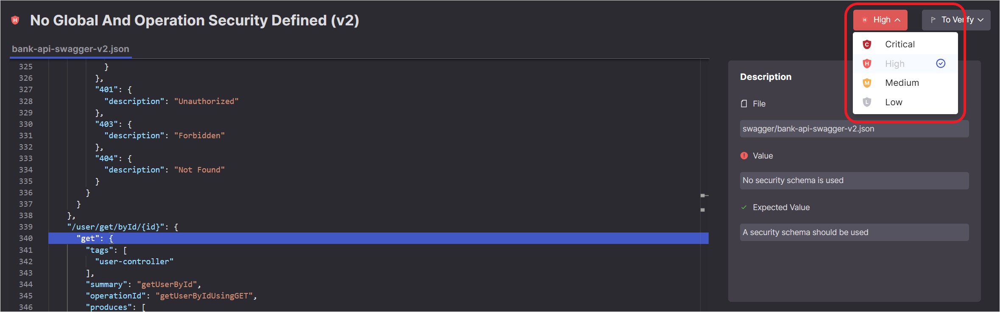

# Triaging API Security Results


The following permissions enable users to triage risks:

- update-result-state-not-exploitable (can change to this state only)
- update-result-state-propose-not-exploitable (can change to this state only)
- update-result-states (can change all states except not-exploitable; can’t change the severity)
- update-result-severity (can change only severities)

For additional details about triage permissions, see [here](README.md#changing-the-result-predicate).


Checkmarx One tracks vulnerability instances throughout your SDLC. Each instance has a predicate - comprising **State** and **Severity** - which you can adjust after reviewing scan results. For more info about triaging results in Checkmarx One, see [Managing (Triaging) Vulnerabilities](README.md).

You can adjust the predicate for a specific vulnerability while viewing that vulnerability on the Scan Results page.


Only users with the Checkmarx One role `update-result` (e.g., a risk-manager) are authorized to make changes to the predicate.

Marking a vulnerability as **Not Exploitable** requires the `update-result-not-exploitable` role (e.g., admin).


## Triaging a Vulnerability

**To change the result predicate:**

1. Navigate to the vulnerability that you would like to edit.
2. To adjust the severity, click on the **Severity** field, and select from the dropdown list the severity that you would like to assign. Options are: Critical High, Medium, and Low.

   
3. To adjust the state, click on the **State** field, and select from the dropdown list the state that you would like to assign. Options are: To Verify, Not Exploitable, Proposed Not Exploitable, Confirmed or Urgent.
