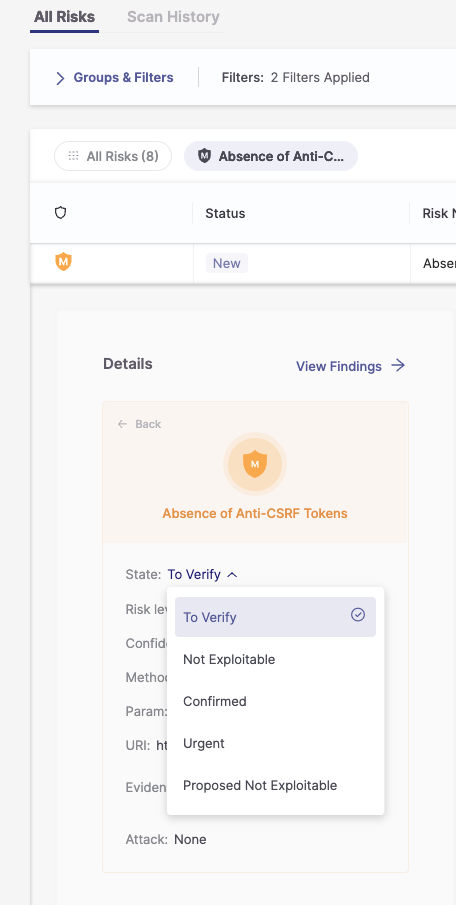
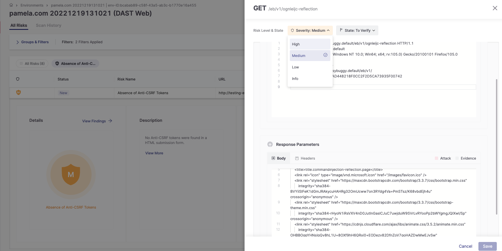
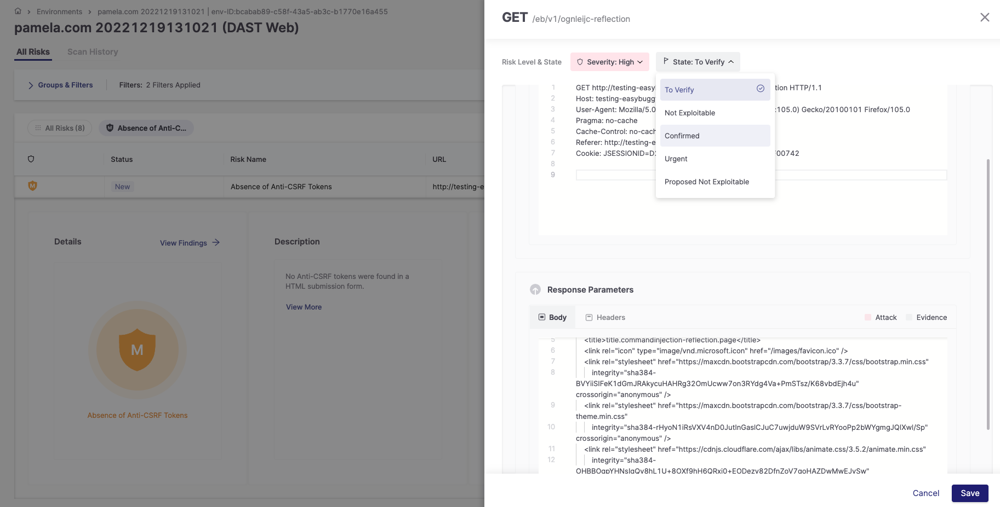
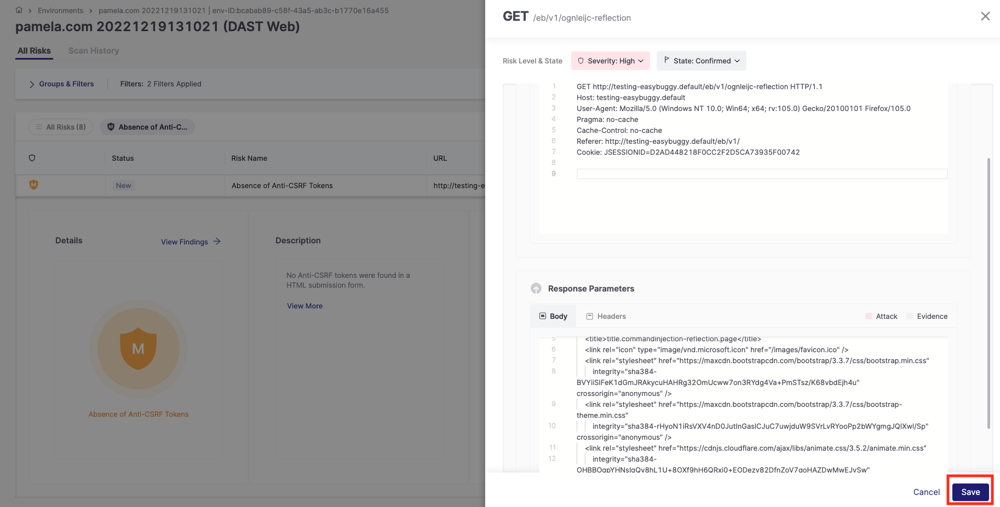
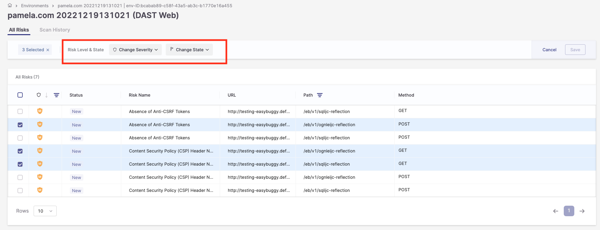
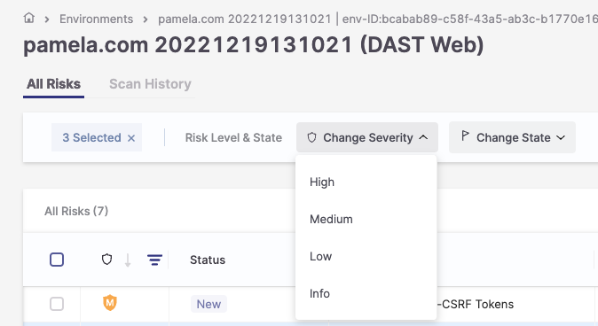
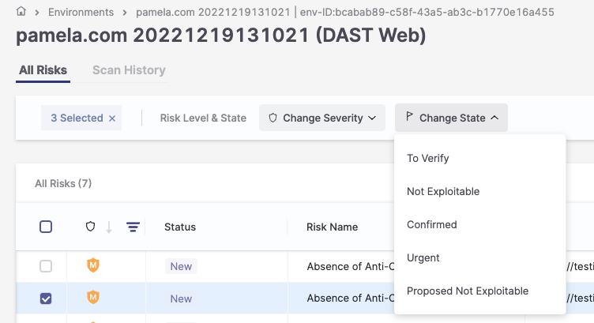

# Triaging DAST Vulnerabilities

Checkmarx One tracks specific risk instances throughout your software development life cycle (SDLC). Each risk instance has a **Predicate** associated with it, comprising the following attributes: **State**, **Severity**, and **Notes**. After reviewing the scan results, you can triage them and modify these predicates accordingly.

You can adjust the predicate for a specific risk while viewing that risk on the All Risks page.

When changing the Result State to **Not Exploitable** or **Proposed Not Exploitable**, a note is required to confirm the change. A change log at the bottom tracks all past changes for a single result. When multiple results are updated, the **Edit** title includes the number of selected results, and hovering over the **State** dropdown displays them.


You need **dast-update-result-not-exploitable**, **dast-update-result-state-propose-not-exploitable**, and **add-notes** permissions to use this feature.


### Triaging a Single Vulnerability

**To edit the result predicate:**

1. Open the vulnerability that you would like to edit.

2. Click on the severity icon (colored shield) next to the risk name to expand its details

3. To change the state, click on the **State** field, and select from the dropdown list one of the following states:

- To Verify
- Not Exploitable
- Confirmed
- Urgent
- Proposed Not Exploitable

  

4. To change the risk level, click on **View Findings**, and from the drop-down list select one of the following risk levels:

- Critical
- High
- Medium
- Low
- Info

<figure><figcaption></figcaption></figure>

There is also the possibility to change the State in this window.

5. To confirm the changes, click **Save** .

<figure><figcaption></figcaption></figure>

### Triaging Multiple Vulnerabilities (Bulk Action)

**To edit the result predicates for multiple vulnerabilities:**

1. In the All Risks table, select the checkbox next to the risks you want to change.

   A menu bar is displayed at the top of the table.

   
2. To adjust the severity, click **Change** **Severity**, and select one of the following severities from the drop-down list: Critical, High, Medium, Low, or Info.
3. 

   To adjust the state, click **Change** **State**, and select from the drop-down list one of the following states:

   To Verify, Not Exploitable, Confirmed, Urgent, or Proposed Not Exploitable.

   
