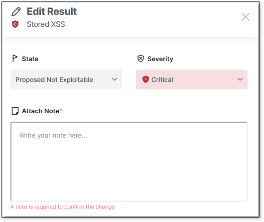
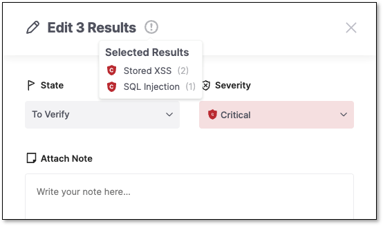
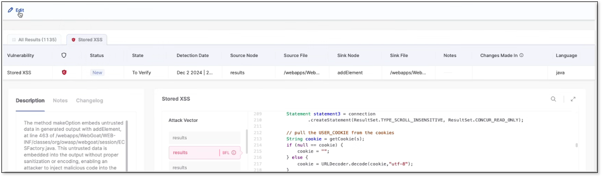
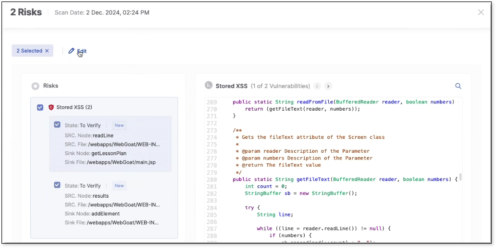
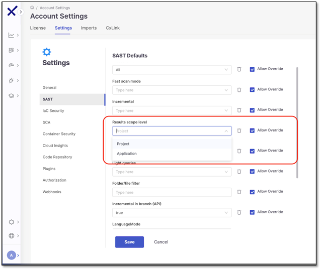

# Triaging SAST Results

After the scan is complete, you can further customize how the results are organized to align with your team's assessment. Triaging your results this way allows you to focus on and prioritize remediating urgent vulnerabilities.


Confirm your results table view before triaging. For a different, yet more precise, display, enable the **Attack Vector ID** in **Grouping Similar Results** under Account Settings. See [here](account-settings-for-grouping-similar-results.md) for more information.


## Triage Permissions

Ensure the following permissions are enabled to triage risks:

- update-result-state-not-exploitable (can change to this state only)
- update-result-state-propose-not-exploitable (can change to this state only)
- update-result-states (can change all states except not-exploitable; can’t change the severity)
- update-result-severity (can change only severities)

For additional details about triage permissions, see [here](../README.md#changing-the-result-predicate).

Each risk instance in your project is assigned a risk state. When a new risk is identified, its initial state is set to **To Verify**, meaning it hasn't been assessed by your AppSec team yet. The severity of the risk is primarily based on the CVSS score of the vulnerability. Your AppSec team can then update the risk state to one of the following options:

- **Not Exploitable** - Select this state if your team has determined that this risk doesn’t threaten your application (and isn’t expected to cause a risk at any time in the future).
- **Proposed Not Exploitable** - Select this state if your team has tentatively suggested that this risk doesn’t threaten your application.
- **Confirmed** - Select this state if your team has confirmed that this risk poses a threat and requires mitigation.
- **Urgent** - Select this state if your team has determined that this risk poses an imminent threat and requires urgent mitigation.


The states mentioned above are pre-configured for all Checkmarx One accounts. In addition, you can create custom states in your account. Once they are created, you can assign those custom states to results.

Custom states is currently supported for SAST, SCA, IaC Security and Container Security results. It is not yet available for all tenant accounts. For more info, see [Custom States](../README.md#custom-states).


When changing the Result State to **Not Exploitable** or **Proposed Not Exploitable**, a note is required to confirm the change. A change log at the bottom tracks all past changes for a single result. When multiple results are updated, the **Edit** title includes the number of selected results, and hovering over the **State** dropdown displays them.


You need **update-result-state-not-exploitable**, **update-result-state-propose-not-exploitable**, and **add-notes** permissions to use this feature.



Known limitation: this functionality is not enforced via plugins; it will be added later.


Users with permissions such as `Update-result-severity` or `Update-result-severity-if-in-group` can change the risk severity or score.

Based on your AppSec team's determination, the score can be adjusted to a score between 0.0 and 10.0 with the following severity breakdown:

- Critical - 9.0 to 10.0
- High - 7.0 to 8.9
- Medium - 4.0 to 6.9
- Low - 0.1 to 3.9
- Info - 0.0

There are three ways to triage the results:

- **From the Table View**: Select a result from the table to open a new job. Change the severity or state using the **Edit** dropdown and click **Save**.

  
- **Using Checkboxes**: Select one or more results by checking their boxes. Then, use the **Edit** dropdown above the table to change their severity or state and click **Save**.
- **Through the View Code Tab**: Select one or multiple results in the **View Code** tab, adjust the severity or state using the **Edit** dropdown, and click **Save**.

  

In **Account Settings** > **SAST**, the **Results scope level** configuration determines whether the triage of results affects the results on a project or application level. The default setting is project level. If you want the results to reflect across your entire application change the parameter here.

## Adding Notes

Use notes to document your work with a vulnerability or improve collaboration by sharing it with colleagues. Clicking **Add Note** opens the note panel, where you can view the highlighted risk, add a new note, or view previous notes. Make sure to click **Save Note** before exiting.

Hover over **Add Note**  to view the latest notes and the number of notes of a vulnerability. Notes are only available for one result at a time and are viewable by multiple users.

## In this section

- [Account Settings for Grouping Similar Results](account-settings-for-grouping-similar-results.md)
