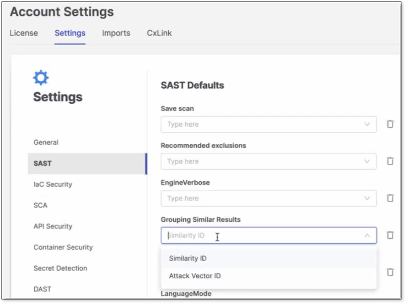

# Account Settings for Grouping Similar Results

It is recommended to define how your results are grouped before proceeding to triage them. In SAST > Account Settings, **Grouping Similar Results**, allows you to define how similar results are grouped. You can choose between two grouping methods: **Similarity ID** and **Attack Vector ID**. This setting is available at the tenant-level (Account Settings) only and cannot be configured at the project-level.

<figure><figcaption></figcaption></figure>

Similarity ID is the default option for SAST. This groups results by Similarity ID. For more information on Similarity ID see here.

Attack Vector ID is a more precise, flow-based grouping than Similarity ID. The Attack Vector ID ties each finding to its programming language, the specific vulnerability query, and the exact data‑flow (attack vector). This means any change to language, query, or flow produces a different Attack Vector ID. This is viewable on the table as two columns: **Attack Vector** and **Similar Results Count**.


The Similar Results count takes time to load and a warning will display when editing results while loading.



When you change this setting, previously run AI Triage is no longer applicable. Therefore, if you subsequently run AI Triage on the same result, AI Triage will run again and consume additional credits.


## Determining Similar Results

Similar results are comprised of two configurations in the Account Settings: **Grouping Similar Results** and **Results scope level**. The former defines what makes results similar to group them together (i.e Similarity ID or Attack Vector ID). The latter defines where to search for the similar results (project‑only or across the entire application).

The Total Similar Results count reflects how many other findings match the selected grouping mode within the configured scope, **excluding** the current result. When applying a change and updating results (e.g Severity, State), **all** results, including the current results, are updated.

## Limitations

- If Grouping Mode is set to Attack Vector ID, but results don't have an Attack Vector ID yet, then similar results cannot be computed, updates are not allowed, and you will see a message: *Please make sure you're using the latest scan that includes the Attack Vector Identifier. If none are available, run a new scan to enable Similar Attack Vector*. Attack Vector IDs may be missing if you are viewing an older scan that predates their inclusion, or if the most recent scan did not generate any Attack Vector IDs.
- If similar results already exist but have different States or Severity levels then results will not be automatically updated and a warning will appear. You can download a CSV containing all similar results for a finding (available from the results view table). You can also identify conflicting results and apply a new state to all results to enforce consistency.
- In some cases, triage changes (state and severity) may not save when findings share the same Similarity ID but have different Attack Vector IDs.
