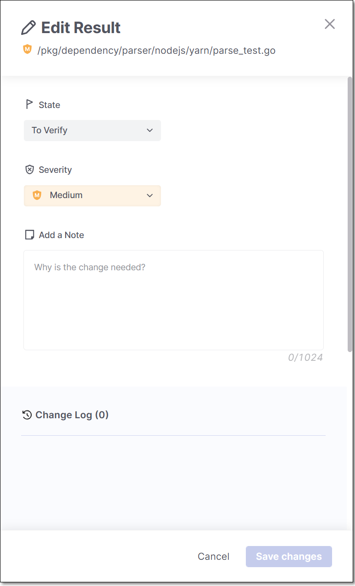
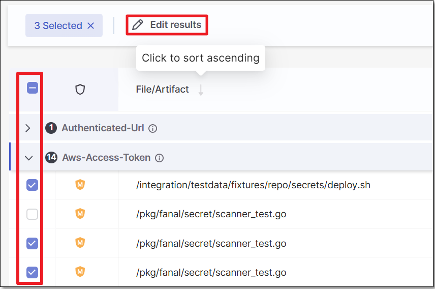
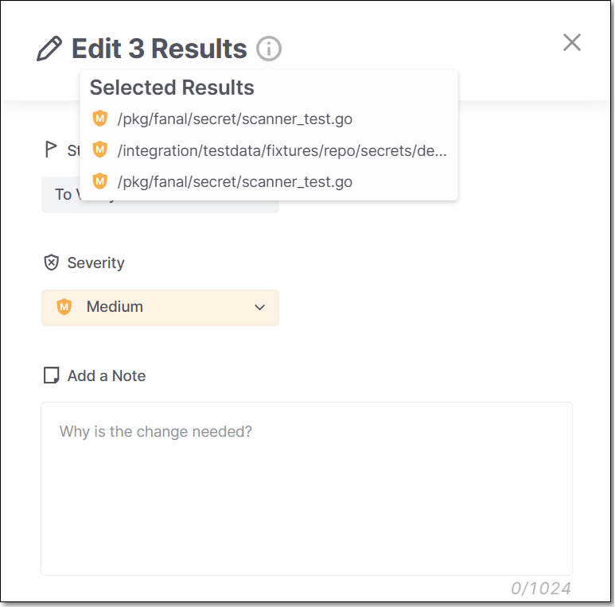

# Triaging SCS Results


The following permissions enable users to triage risks:

- update-result-state-not-exploitable (can change to this state only)
- update-result-state-propose-not-exploitable (can change to this state only)
- update-result-states (can change all states except not-exploitable; can’t change the severity)
- update-result-severity (can change only severities)

For additional details about triage permissions, see [here](README.md#changing-the-result-predicate).


## Triaging a Vulnerability

**To change the result predicate:**

1. Hover over a vulnerability and click on the **Edit** button.
2. In the side panel that opens, click on **State** or **Severity** and select the value you want to assign.

   <figure><figcaption></figcaption></figure>
3. You can add a note explaining the reasoning for the change. You can select different vulnerabilities within the same package and triage each of them.

## Bulk Action Triaging Results

You can triage multiple vulnerabilities with a single bulk action.

1. In the **Vulnerabilities** section, select the checkbox next to each vulnerability that you would like to include in the bulk action triage. Then, click on **Edit Results**.

   <figure><figcaption></figcaption></figure>

   All of the selected vulnerabilities are shown and you can click on each one to see the relevant details.
2. Make changes to the Severity and/or State. The changes are applied to all of the selected vulnerabilities.

   <figure><figcaption></figcaption></figure>
