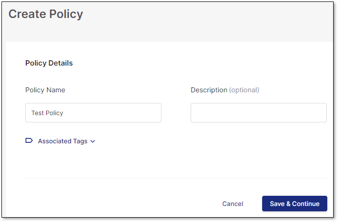
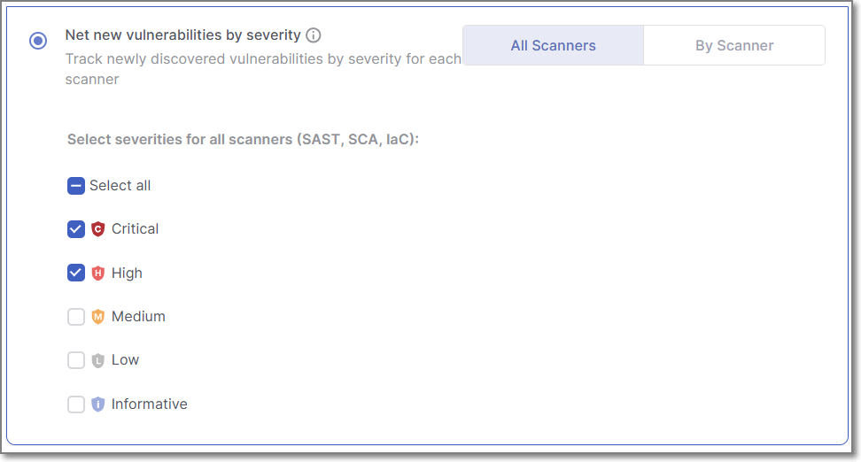
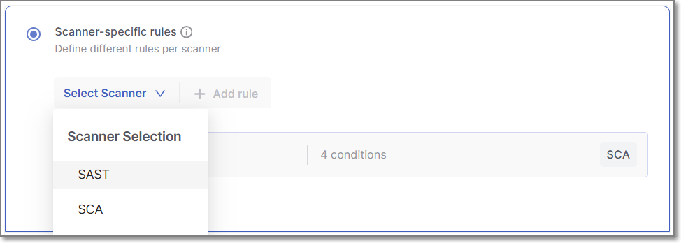
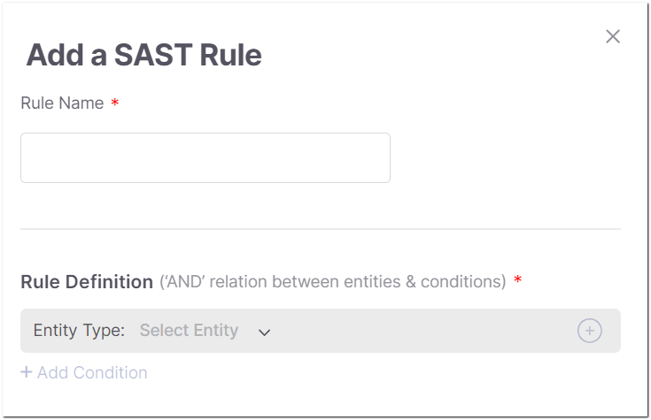
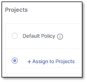
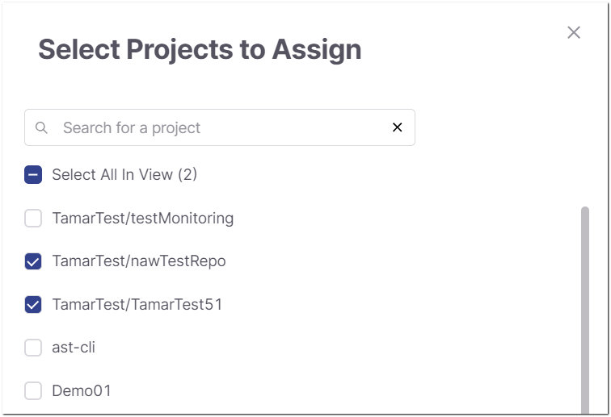

# Creating a Policy

## Overview

The policy creation flow involves naming the policy, setting up rules for the policy, and assigning projects to it. There are two types of policy rules, each functioning in fundamentally different ways:

- **Scanner-specific rules** - These rules are relevant for all types of projects, regardless of how the scans are triggered. These are specialized rules that can be configured for each specific scanner. You can add several "By Scanner" rules to a policy, and the policy is violated if **any** one of the rules is violated. See also [Scanner-specific Policy](#scanner-specific-policy).
- **Net new vulnerabilities by severity** - This rule is relevant only for Code Repository Integration projects. The rule is violated if a scan is triggered by a pull request and a "net new" vulnerability (i.e., a new vulnerability being introduced into the protected branch by this pull request) of the specified severity level is identified. This rule can be applied to all scanners equally or tailored individually for each scanner. See also [Net New Vulnerabilities by Severity Policy](#net-new-vulnerabilities-by-severity-policy).

The **Break the build upon violations** toggle enables you to set whether or not policy violations will cause the software build to break.

Upon policy violation, the violation is shown in the **Policy Management** > **Incidents** tab. In addition, for Code Repository Integration projects, the violation is included in the PR decoration. For SAST policies, the PR decoration includes the specific conditions that were violated as well as details about each vulnerability that caused the condition to be violated. For additional information, refer to Code Repository Integration Usage & Results

## Policy Types

When creating a policy, you can choose from different policy types to control how scan results are evaluated. Each policy type defines how and when rules are applied.

### Scanner-specific Policy

The Scanner-specific Policy can be applied to any type of project, regardless of how the scan is initiated (PR webhook, CLI, plugin, or pipeline).

When a scan completes:

1. The policy rules are applied to the results of the current branch only.
2. If any rule is violated and Break Build is enabled, the PR will be blocked or the pipeline will fail.

#### When to use this policy type

Use the **Scanner-specific Policy** when you want the policy to evaluate the current branch scan results, enforce rules for specific scanners, or combine multiple scanner-specific rules within a single policy.


For **SCA** policies, you can also enforce checks for Net New vulnerabilities by using the **Vulnerability status is** rule and selecting **Net New**. This provides the same pull request comparison as the **Net New Vulnerabilities by Severity** policy while allowing you to combine it with other **SCA** policy rules.


#### Limitations

For PR scans, this policy checks only the source branch results. No comparison is made with the target branch to identify new issues.

### Net New Vulnerabilities by Severity Policy

The **Net New Vulnerabilities by Severity** policy applies only to Code Repository Integration projects where scans are triggered by a Pull Request (PR).

When a PR is created from a source branch to a target branch:

1. A scan runs on the source branch.
2. When the scan completes, the results are compared with the most recent scan of the target branch.
3. Any findings present in the source branch but not in the target branch are identified as new vulnerabilities.
4. If **Break Build** is enabled for this policy, the PR will be blocked until those vulnerabilities are resolved.

#### When to use this policy type

Use the Net New Vulnerabilities by Severity policy when you want to block merges only for vulnerabilities that are new compared to the target branch.

#### Limitations

- Applies only to PR scans triggered through SCM integration webhooks.

## Create a Policy Procedure



1. In the main navigation, select **Resource Management > Policies**.
2. Click on **Create New Policy**.
3. In the **Policy Details** section, provide the following information:

   - **Policy Name** - Enter a name for the policy.
   - **Description** (optional) - Add a description.
   - **Associated Tags** (optional) - Click to expand the display, and then enter the desired tags for the policy.
4. Click **Save & Continue**

   <figure><figcaption></figcaption></figure>

   The screen expands to present the **Rules**, **Break the build upon violations**, and **Project** sections.
5. In the **Rules** section, configure rules for the policy - see [Rules section](#rules-section).
6. In the **Break the build upon violations** section, choose whether or not policy violations will break the build. You can also configure state-based exemption rules to exclude vulnerabilities of a particular state from the build-break enforcement. For more details, see [Break the Build Upon Violations Section](#break-the-build-upon-violations-section).
7. In the **Projects** section, configure the projects this policy is assigned to - see [Projects section](#projects-section)
8. Click **Create Policy**.

## Rules section

Set up a single rule for **all** scanners or set up one or more rules for **individual** scanners.

To break software builds for a scanned repository that violates the configured rules, toggle on the **Break the build upon violations** option. This option is available for both the **Net new vulnerabilities by severity** rule and for **Scanner-specific rules**.

- **Net new vulnerabilities by severity** - Configure a rule for net new vulnerabilities identified by the available scanners, and specify which vulnerability severity levels trigger a policy violation.
- **Scanner-specific rules** - Configure one or more rules for individual scanners.

  Policies rules can be configured for the following scanners:

  - SAST scanner - [SAST Policy Conditions](#sast-policy-conditions).
  - SCA scanner - SCA Policy Conditions.
  - IaC Security scanner - [IaC Security Policy Conditions](#iac-security-policy-conditions).
  - Container Security scanner - [Policy Management - Container Security Conditions](#container-security-policy-conditions)
  - AI Security scanner - [AI Security Policy Conditions](#ai-security-policy-conditions)

**To create a Net new vulnerabilities by severity rule:**

1. Select the **Net new vulnerabilities by severity** radio button.

   <figure><figcaption></figcaption></figure>
2. You can configure the rule in one of two ways:

   - Select the **All Scanners** tab to apply one rule for all scanners.
   - Select the **By Scanner** tab to apply define the rule differently for each scanner.
3. In either configuration, specify the severity level of the new vulnerability to which this rule applies: Critical, High, Medium, and/or Low. Select the checkbox next to each severity level for which a newly identified vulnerability is considered a policy violation.
4. If violation of this policy will break the build, turn on the **Break build** toggle.

**To create one or more Scanner specific rules:**

1. Select the **Scanner-specific rules** radio button.

   
   If a policy has multiple rules, if any **one** rule is violated, then the policy is considered violated (OR operator).
   
2. Click on **Select Scanner** to open the dropdown menu, and select the scanner for which you would like to add a rule.

   <figure><figcaption></figcaption></figure>
3. Click on **+ Add Rule**.

   The rule configuration panel opens on the right side of the screen.

   <figure><figcaption></figcaption></figure>
4. In the **Rule Name** field, enter a name for the rule.
5. Click **+ Add Condition** and configure the condition. Options for condition configuration differ according to the scanner for which the rule is being created. The configuration options for each scanner are described [below](#configuring-policy-conditions).

## Break the Build Upon Violations Section

As part of the policy configuration, you can turn on the Break Build toggle for each policy for which you want a violation to prevent the PR from being merged.

You can also apply state-based exemption rules, defining which vulnerability states are excluded from build-break enforcement. Findings that match an exemption rule are skipped during enforcement evaluation but remain fully visible and tracked.


The break build behavior will only be effective if you configure your SCM to block PRs when a Checkmarx One Break Build policy is violated. The procedure for setting up this configuration is different for each SCM - see [Policy Management - Break Build](policy-management---break-build.md).


1. Turn **ON** the toggle in the **Break the build upon violations** section:

   <figure><figcaption></figcaption></figure>
2. To exclude vulnerability states from break-build enforcement:

   1. Click **Select Scanner** and select the desired scanner from the dropdown menu.
   2. Click **+ Add Rule**.

      The **Add Exemption Rule** sidebar is opened.

      <figure><figcaption></figcaption></figure>
   3. Fill in a rule name and select the states which this exemption applies to.
   4. Click **Add**.

## Projects section

You can designate the policy you're creating as the default policy. This policy will then be applied to all scans of both new and existing projects. Alternatively, you can apply the policy to specific projects only.

To set the policy as the default policy, select the **Default Policy** checkbox. Note that only one default policy can be activated at a time.

To assign the policy to one or more specific projects:

1. Click **+ Assign to Projects**.

   The **Select Projects to Assign** panel opens on the right side of the screen.
2. Select the checkbox next to each project you would like to assign.

   It is possible to search for projects using the Search field. You can also select the **Select All in View** option to select all currently loaded projects.

   <figure><figcaption></figcaption></figure>
3. Click **Assign Projects**.
4. Click **Save Policy**.

   The policy is created and activated.

## Configuring Policy Conditions

Each **Scanner-specific** rule specifies one or more policy conditions that relate to a specific scanner. The options for defining conditions differ for each scanner. The following sections explain the options for configuring conditions for each type of scanner.

### SAST Policy Conditions

#### Overview

A SAST rule comprises one or more groups containing one or more conditions. A rule is considered violated (i.e., it will break the build) only if all groups are satisfied. Within each group, all conditions must apply to the same result for the group to be considered satisfied. Grouping allows for more granular control over rule evaluation, enabling you to define complex policies such as: "Break the build if there are more than 2 High severity vulnerabilities that are also older than 10 days."

Currently, only conditions that relate to vulnerabilities are supported for the SAST scanner.


- All conditions are placed in a single group by default when creating a new rule.
- You can manually create multiple groups to define more advanced logic.


The following table describes the elements used to create a SAST condition:

#### SAST Vulnerability Conditions

| Rule Subject | Options | Operator | Value |
|---|---|---|---|
| Severity | • Critical • High • Medium • Low • Info | > >= \<+ \< = | Integer The number of vulnerabilities by severity. |
| Result Status | • New • Recurrent | > >= \<= \< = | Integer The number of vulnerabilities by status. |
| Query Name | | In Contains | • Selecting **IN** as an operator opens a selection tree to select the queries, including their language and group (organized by severity level). • Selecting **Contains** allows for a free-text search. |
| Aging | | > >= \<= \< = | Age of the result since its first detection. |
| Categories | | In Contains | • Selecting **IN** opens a selection tree listing compliance standards with vulnerability types as sub-categories. To fulfill the condition, select at least one of each. • Selecting **Contains** allows for a free-text search. |

#### Grouping in Policy Management

You can create two kinds of groups: single and multiple.

Single groups must have all the conditions applied to the same result for the rule to be violated.

Example: Given a group with the following conditions:

- Severity: Critical > 0
- Aging: \< 10

The rule is violated if at least one result is Critical and less than 10 days old.

Multiple groups are evaluated independently. All groups must be satisfied for the rule to be violated.

Example: Given two groups with the following conditions:

Group 1:

- Severity: Critical > 0
- Aging: \< 10

Group 2:

- Status: New > 0

The rule is violated if at least one result is Critical and \< 10 days old (Group 1) **and** at least one result is New (Group 2).

**Use Case Scenarios**

| Scenario | Conditions Evaluation | Rule Outcome |
|---|---|---|
| Result 1: Severity = Low, Aging = 9 Result 2: Severity = Medium, Aging = 100 | Group 1: Aging \< 10 Group 2: Severity = Medium | Rule breaks |
| Result 1: Severity = Medium, Aging = 100 Result 2: Severity = Low, Aging = 100 | Group 1: Aging \< 10 Group 2: Severity = Medium | Rule does not break |
| Result 1: Severity = Medium, Aging = 9 Result 2: Severity = Medium, Aging = 100 | Group 1: Aging \< 10 Group 2: Severity = Medium | Rule breaks |


- The relationship between groups is always AND.
- The grouping mechanism only affects how conditions are evaluated, not their logical relationship.
- Only 1 severity can be added to each group.
- When using severity and status on the same group, both conditions will have the operator and value assigned in the first condition.


### SCA Policy Conditions

The following sections describe the various types of SCA policy conditions that can be configured.

#### Package Conditions

| **Type** | **Description** | **Values specified** |
|---|---|---|
| Is Used | The rule applies only to packages that are being used in the project.  Available only for projects that support the **Exploitable Path** feature.  | none |
| Is Outdated | The rule applies only to packages for which a more recent version is available. | none |
| Named | The rule applies only to packages with the specified name. | Full name of the package. |
| Name Contains | The rule applies only to packages that have the specified string in their name. | String that is contained in the package name. |
| Version is Higher than | The rule applies only to packages with a version higher than the specified version. | The minimum allowed version number. If the current version number is below this value, it will violate the policy. |
| Version is Lower than | The rule applies only to packages with a version lower than the specified version. | The maximum allowed version number. If the current version number is below this value, it will violate the policy. |
| Is not a Dev dependency | The rule only applies to packages that aren’t Dev dependencies. | none |
| Is not a Test dependency | The rule only applies to packages that aren’t Test dependencies. | none |
| Is Not a DEV or TEST Dependency | The rule only applies to packages that aren’t Test dependencies or Dev dependencies. | none |
| Is a Direct dependency | The rule only applies to Direct dependencies (not to Transitive dependencies). | none |
| Is Malicious | you can now create conditions based on specific types of malicious attacks (e.g., Typosquatting, Chainjacking etc.). You can also create conditions based on thresholds for the following package integrity metrics: Contributor Reputation, Reliability Score and Behavioral Integrity. | none |
| Is Not a Commercial License package | The rule only applies to packages for which the organization doesn't have a commercial license. | none |
| Contributor Reputation score greater or equal to | The rule only applies to packages whose Contributor Reputation score is greater than or equal to the number indicated. See [Preventing Malicious Software Attacks](../../../scanners/sca-scanner/preventing-malicious-software-attacks.md) | number from 0 - 10 |
| Reliability score greater or equal to | The rule only applies to packages whose Package Reliability score is greater than or equal to the number indicated. See [Preventing Malicious Software Attacks](../../../scanners/sca-scanner/preventing-malicious-software-attacks.md) | number from 0 - 10 |
| Behavioral Integrity score greater or equal to | The rule only applies to packages whose Behavioral Integrity score is greater than or equal to the number indicated. See [Preventing Malicious Software Attacks](../../../scanners/sca-scanner/preventing-malicious-software-attacks.md) | number from 0 - 10 |
| Outdated by # of major versions | The rule only applies to packages that are outdated by the specified number of major versions. | number |
| Outdated by # of minor versions | The rule only applies to packages that are outdated by the specified number of minor versions. | number |
| Number of days since publication is greater than | The rule only applies to packages for which the specified amount of time has elapsed since the package version that you are using was published. | number |

#### Vulnerability Conditions

| **Type** | **Description** | **Values specified** |
|---|---|---|
| has Exploitable Path | There is an Exploitable Path through which the vulnerable methods are actually used in your code. See Exploitable Path  This is only supported for Projects in which the Exploitable Path feature is activated.  | none |
| has a Remediation Recommendation | Checkmarx offers a remediation recommendation for eliminating the vulnerability from your Project. See Remediation Tasks Tab  This is only supported for Projects in which the Exploitable Path feature is activated.  | none |
| CVSS score is greater than or equal to | The CVSS score of the vulnerability is greater than or equal to the specified value.  The latest available CVSS version is used for this assessment.  | Specify the minimum CVSS score for this condition. |
| Severity level is | The vulnerability has the specified severity level. | Select one or more severity levels (Critical, High, Medium, Low, Info) for the vulnerabilities in this condition. |
| CWE Category is | The vulnerability has the specified CWE. | Specify the number of the CWE. |
| CVE ID is | The vulnerability has the specified CVE ID. | Specify a CVE ID, e.g., CVE-2019-2391. |
| number of Days Since Publication is greater than | The number of days since the vulnerability was published is greater than the specified value. | Specify the maximum allowed number of days. If the current number of days is above this value, it will violate the policy. |
| number of Days Since Detection is greater than | The number of days since the vulnerability was detected is greater than the specified value. | Specify the maximum allowed number of days. If the current number of days is above this value, it will violate the policy. |
| EPSS score is greater than or equal to | The EPSS score of the vulnerability is greater than or equal to the specified value. | Specify the minimum EPSS score for this condition. |
| EPSS percentile is greater than or equal to | The EPSS percentile of the vulnerability is greater than or equal to the specified value. | Specify the minimum EPSS percentile for this condition. |
| Vulnerability state is | The vulnerability has the specified state. | Select one or more states (To Verify, Proposed not Exploitable, Confirmed, Urgent) for the vulnerabilities in this condition. |
| Vulnerability status is | The vulnerability has the specified status. **New** indicates a vulnerability instance that has not been detected previously in the project. **Net New** indicates a vulnerability that is present in the source branch but not in the target branch of a pull request. | Select a status (**Net New**, **New** or **Recurrent**) for the vulnerabilities in this condition. |

#### Suspected Malware Risk Conditions

| **Type** | **Description** | **Values specified** |
|---|---|---|
| Severity level is | The rule only applies to a Suspected Malware risk with the specified severity level. | Select one or more severity levels (Critical, High, Medium, Low, Info) for the vulnerabilities in this condition. |
| Risk Type | The rule only applies to the specified malware risk types. See [Preventing Malicious Software Attacks](../../../scanners/sca-scanner/preventing-malicious-software-attacks.md) | Select one or more risk types from the dropdown list. |

#### License Conditions

| **Type** | **Description** | **Values specified** |
|---|---|---|
| Named | Specify one or more specific licenses for this condition. | Select one or more licenses from the dropdown list of licenses in your account. |
| License severity is | The Legal Risk has the specified severity level. | Select one or more severity levels (Critical, High, Medium, Low, Info) for this condition. |
| License state is | Indicates whether or not this license is the "effective" license for your organization's use of this package. | Select one or more states from the dropdown list (To verify, Effective, Not Effective) |
| License family is | Specify one or more license families for this condition | Select one or more license families from the dropdown list |
| License copyleft is | The package's copyleft license status | Select one or more copyleft license statuses (Full, Partial, No, Unknown) |

### IaC Security Policy Conditions

An IaC Security rule consists of one or more conditions. A rule is considered violated only if **all** conditions are fulfilled (AND operator). However, each condition is assessed independently so that not all conditions need to be fulfilled in relation to a single entity for the rule to be violated.

For example, if you set one condition for 3 or more **High** severity vulnerabilities, and another condition for 2 or more **New** vulnerabilities. If there are 5 **High** severity vulnerabilities that are all **Recurrent** and also 3 **New** vulnerabilities that are all **Low** severity, the rule will nonetheless be considered violated.

Currently, only conditions that relate to vulnerabilities are supported for the IaC Security scanner.

The following table describes the elements used to create an IaC Security condition.

#### IaC Security Vulnerability Conditions

| Rule Subject | Options | Operator | Value |
|---|---|---|---|
| Severity | • Critical • High • Medium • Low | > >= \<= \< = | Integer The number of vulnerabilities of the specified severity. |
| Result Status | • New • Recurrent | > >= \<= \< = | Integer The number of vulnerabilities in the specified status. |
| Aging | | > >= \<= \< = | Specify the age of the result, i.e., how long since the result was found for the first time (in days). |

### Container Security Policy Conditions

Container Security rules are comprised of Conditions and Condition Groups.

- **Condition** - A Condition is made up of a **Property**, a **Condition** and a **Value** that define which results fulfill this condition. For example, a condition with Property = "a Vulnerability", Condition = "Is" and Value = "Critical" will be fulfilled if at least one critical severity risk is identified in the scan.

  For some conditions, it is possible to specify multiple values. In this case, an OR operator is applied between values. For example, if "Critical" and "High" are both specified, then either a critical or high severity vulnerability will fulfill the condition.
- **Condition Group** - A Condition Group is a set of related conditions. All of the conditions in a single group must be fulfilled (an AND operator), and they must exist **in relation to the same instance** in order for the overall condition group to be considered fulfilled. So, in the previous example, if we would add a condition to the group with Property = "an Image Name", Condition = "Contains", and Value" = "production", then only a critical or high severity vulnerability in a "production" image would fulfill the group of conditions.

You can add multiple Condition Groups to a rule. In this case, all condition groups must be fulfilled (AND operator), but the conditions in each group **do not** need to apply to the same instance. So, in the previous example, if each condition was added as a **separate group**, then the rule would be violated if there was a critical or high severity vulnerability anywhere in the project, and it would also be violated if there was an image with a name containing "production" even if there were no risks in that image.

#### Image Conditions

| **Type** | Operators | **Values** | Multiple values |
|---|---|---|---|
| Image Name | is is not in not in contains does not contain starts with ends with | Free text |  |
| Image Tag | is is not in not in contains does not contain starts with ends with | Free text |  |

#### Package Conditions

| **Property** | Operators | **Values** | Multiple values |
|---|---|---|---|
| Name | is is not in not in contains does not contain starts with ends with | Free text |  |
| Version | is is not is greater than is less than is equal to | e.g, 1.2.3 |  |
| Is Malicious | is | True / False |  |

#### Vulnerability Conditions

| **Property** | Operators | **Values** | Multiple values |
|---|---|---|---|
| CVE ID | is is not in not in contains does not contain starts with ends with | Free text following CVE ID format, e.g., CVE-2019-2391. |  |
| Severity level | is is not in not in | Critical, High, Medium, Low, None |  |
| State | is is not in not in | To Verify Not Exploitable Proposed Not Exploitable Confirmed Urgent |  |

### AI Security Policy Conditions

An AI Security rule comprises one or more groups containing one or more conditions. A rule is considered violated (i.e., it will break the build) only if all groups are satisfied. Within each group, all conditions must apply to the same result for the group to be considered satisfied. Grouping allows for more granular control over rule evaluation, enabling you to define complex policies.

The following table describes the elements used to create an AI Security condition.

#### AI Security Conditions

| Property | Operator | Value |
|---|---|---|
| Asset Type | • Is • Is Not | • AI Model • MCP Server • AI Agent • AI SDK • AI Library • MCP Client |
| Asset Name | • Is • Contains • Starts With • Ends With • In • Not in | String The name of the asset. |
| Provider | • Is • Contains • Starts With • Ends With • In • Not in | String The name of the provider. |

## In this section

- [Policy Management - Break Build](policy-management---break-build.md)
