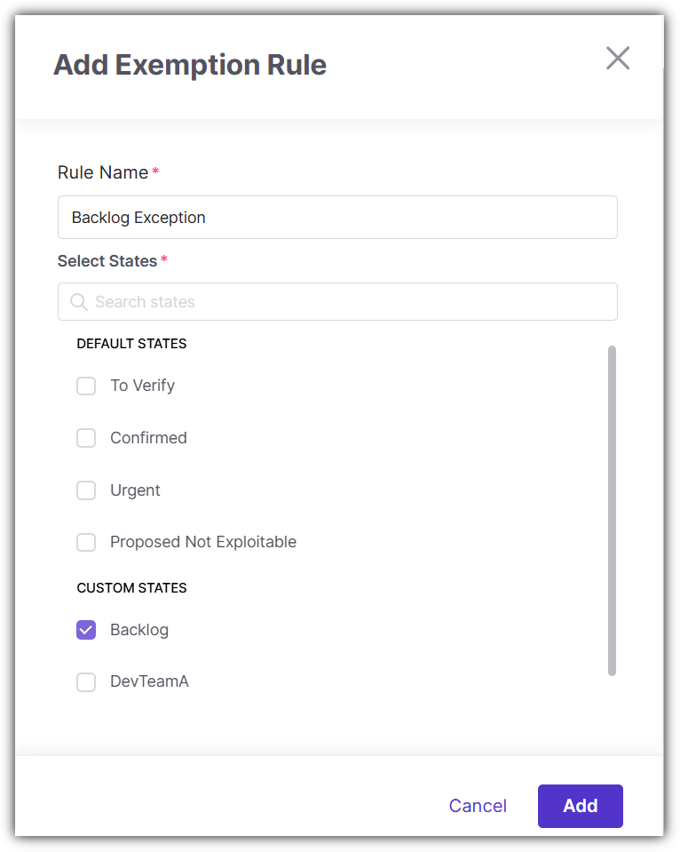
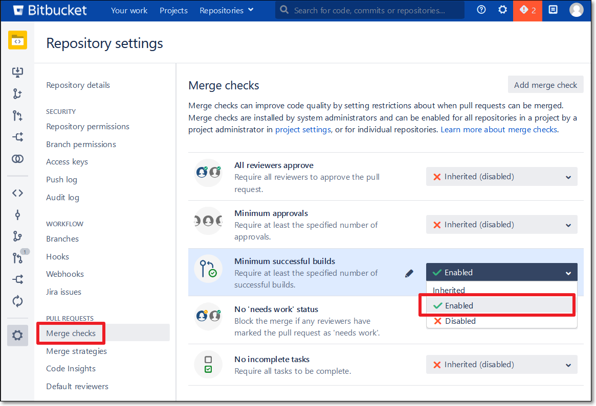
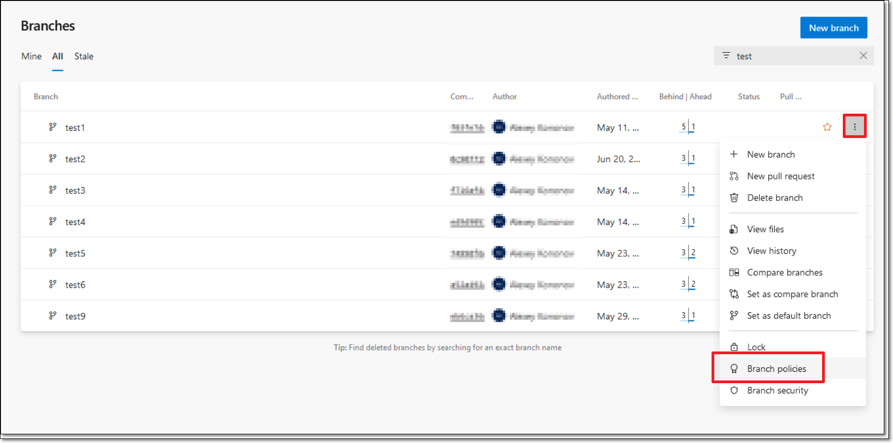
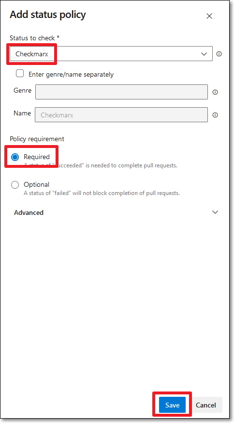

# Policy Management - Break Build

## Overview

As part of the policy configuration, you can turn on the Break Build toggle for each policy for which you want a violation to prevent the PR from being merged.

You can also apply state-based exemption rules, defining which vulnerability states are excluded from build-break enforcement. Findings that match an exemption rule are skipped during enforcement evaluation but remain fully visible and tracked.

The break build behavior will only be effective if you configure your SCM to block PRs when a Checkmarx One Break Build policy is violated. The procedure for setting up this configuration is different for each SCM, see below for details.

## Configuring a Policy Rule to Break Build

1. Create a policy, including creating one or more rules for the policy, as described in [Creating a Policy](README.md).
2. Turn **ON** the toggle in the **Break the build upon violations** section:

   <figure><figcaption></figcaption></figure>
3. To exclude vulnerability states from break-build enforcement:

   1. Click **Select Scanner** and select the desired scanner from the dropdown menu.
   2. Click **+ Add Rule**.

      The **Add Exemption Rule** sidebar is opened.

      <figure><figcaption></figcaption></figure>
   3. Fill in a rule name and select the states which this exemption applies to.
   4. Click **Add**.
4. Click on **Save Policy** at the top of the screen.

## Setting up Your SCM to Break Build

In order for the break build behavior to be effective you need to configure your SCM to block PRs when a Checkmarx One Break Build policy is violated. The procedure for setting up this configuration for each of the supported SCMs is described below.

GitHub (Managed Setup and Custom Setup)

1. For the repo that you want to protect, open the repo settings and go to **Code and automation** > **Branches** > **Branch protection rules**.
2. Create a rule (or edit an existing rule), specifying the **Branch name pattern** for the branches that you want to protect.
3. In the **Protect matching branches** section, select the checkbox for **Require status checks to pass before merging**.
4. In the **Status checks that are required** section, enter **Checkmarx**.

   <figure><figcaption></figcaption></figure>
5. **Save** your rule.

GitLab (Managed Setup and Custom Setup)

1. Open the project settings for the project that you would like to protect and go to **Merge requests**.
2. In the **Merge checks** section, select the checkbox for **All threads must be resolved**.

   <figure><figcaption></figcaption></figure>
3. Click on **Save changes**.

   Once this configuration is in place, when a Break Build policy violation occurs, Checkmarx will ensure that there is a thread with Unresolved status, which will prevent the merge from being allowed.


For the GitLab integration, it is possible for a user to manually override the **Break Build** by clicking on the **Resolve** button for the unresolved thread and then merging the code.


Bitbucket Managed Setup

The following procedure describes how to set up Break Build for a specific repo. Alternatively, you can take similar steps on the project level so that all repos in that project will have Break Build functionality.

#### Prerequisites

- Only supported for Bitbucket **Premium** plan

#### Procedure

1. Open the repo settings and go to **Workflow** > **Branch restrictions**.
2. Click on **Add a branch restriction**.
3. In the **Select branches** section, specify the branches that you want to protect.
4. Open the **Merge settings** tab.
5. In the **Merge checks** section, select the checkbox next to **Minimum number of successful builds for the last commit with no failed builds and no in progress builds**, and specify the number suitable for your workflow.
6. In the **Merge conditions** section, select the checkbox next to **Prevent a merge with unresolved merge checks**.

   <figure><figcaption></figcaption></figure>
7. Click **Save**.

Bitbucket Custom Setup

The following procedure describes how to set up Break Build for a specific repo. Alternatively, you can take similar steps on the project level so that all repos in that project will have Break Build functionality.


Procedures may differ slightly depending on the version of Bitbucket that you are using.


1. Open the repo settings and under **Pull requests** click on **Merge checks**.
2. Click on **Add a branch restriction**.
3. In the **Minimum successful builds** section, select **Enabled**, and specify the number suitable for your workflow.

   <figure><figcaption></figcaption></figure>
4. Click **Save**.

Azure DevOps (Managed Setup and Custom Setup)

1. Open the project that you would like to protect and go to **Repos** > **Branches**.
2. Click on more options next to the branch that you want to protect and select **Branch policies**.

   <figure><figcaption></figcaption></figure>
3. In the **Status Checks** section, click on the **+** button.

   <figure><figcaption></figcaption></figure>
4. In the **Add status policy** dialogue, for **Status to check**, enter **Checkmarx**.
5. For **Policy requirement**, select the radio button for **Required** .

   <figure><figcaption></figcaption></figure>
6. Click **Save**.

