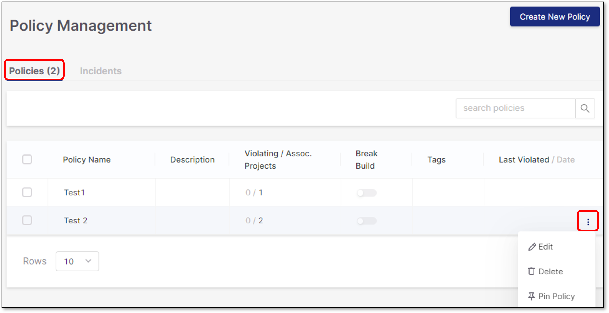

# Viewing Policies and Incidents

After a policy is created and saved, two tables are presented.

- **Policies** - Contains all the configured policies.

  When hovering on a policy, a three-dot icon appears on the right side.

  It is possible to perform the following actions for each policy:

  - **Edit** the policy
  - **Delete** the policy
  - **Pin** the policy to the top of the table.

    <figure><figcaption></figcaption></figure>
- **Incidents** - Shows all of the incidents in which policies were violated. An incident for **All** scanners policy will present the net new vulnerabilities rule with the configured severities which violated the policy. For **Individual** scanners policy, the following information will be presented in the table: Policy name, rule name, scan ID, project name, branch name, policy tags, scan date.

  
  Data Retention: Data is shown for the Incidents that occured in the previous 3 months. After 3 months the data is deleted from the system.
  
