# IaC Security Presets Management

Presets are sets of queries that you can select to improve the accuracy of the IaC Security scan results. Using presets, you can triage the main capabilities of the IaC Security scanner.

Preset management is a new way to control standard or predefined presets. It allows you to easily create your own presets to suit your needs.

Presets are ordered alphabetically and can be viewed or cloned.

There are 2 preset types:

- [Predefined Presets](#predefined-presets)
- [Custom Presets](#custom-presets)

## Predefined Presets

The Checkmarx One presets feature provides predefined presets by default for all Checkmarx One products. Currently, IaC doesn’t have predefined presets.

Predefined presets *cannot* be deleted and will always be presented in the table before the custom presets.

The Checkmarx IaC Security team handles the base presets and their descriptions, and all versions are aligned across all Checkmarx products.

## Custom Presets

Custom presets are presets that are manually created and configured by users.

These presets will be presented in the table after the predefined presets.

It is possible to create a preset using the following methods:

- Create a preset from scratch - See [here](https://docs.checkmarx.com/en/34965-131121-presets-management.html#UUID-0bed5b86-850b-3dc5-6d48-5a1fad1a92a5_section-idm4592064690569633374366638583).
- Clone and modify a preset—See [here](https://docs.checkmarx.com/en/34965-131121-presets-management.html#UUID-0bed5b86-850b-3dc5-6d48-5a1fad1a92a5_section-idm4560744127921633371858285706).

## Presets User Roles

To be able to manage presets in Checkmarx One, you must have at least one of the following user roles:

- **view-preset** - Users with this role can only view presets. If this role is not applied, you won't be able to see presets.
- **create-preset** - Users with this role can only create presets.
- **delete-preset** - Users with this role can only delete presets.
- **update-preset** - Users with this role can only update existing custom presets.

## Opening IaC Security Presets Management

To open IaC Security preset management, perform the following:

1. Log into Checkmarx One.
2. In the main menu, select **Resource Management > IaC Presets**.

   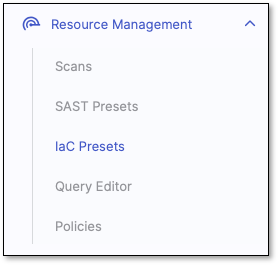

## Presets Columns

There are three columns on the IaC Preset Management page:

- **Preset Name**
- **Associated projects with overridden preset rule** - Indicates the number of projects that use this preset and have custom overrides applied to its query rules.

  For additional information, see [Project Rules](https://docs.checkmarx.com/en/34965-68538-configuring-projects.html#UUID-1a1413d4-5d19-ddc0-aa35-51ff05ef0ade_UUID-30683fb1-c0d6-36d0-50e0-39e7b8134076).
- **Description** - Preset description

You may change the number of presets presented per page by clicking the Rows dropdown at the bottom of the page. The default is **10 rows**, which can be changed to 20, 50, or 100.

## Viewing a Preset

Viewing a preset lets you see and understand which platforms and queries are included.

To view a preset, perform the following:

1. Hover over the required preset.
2. Click on the **View** option.

   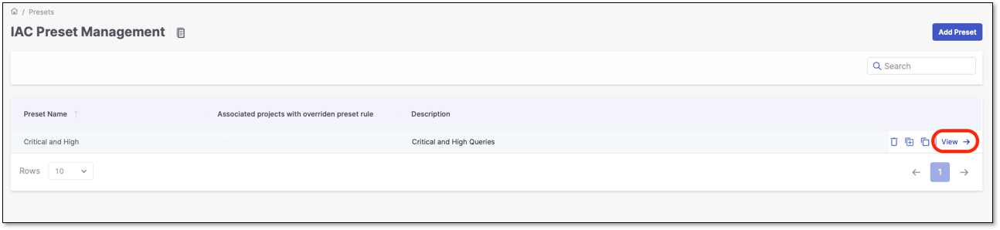

A panel containing the preset's information opens on the right side of the screen.

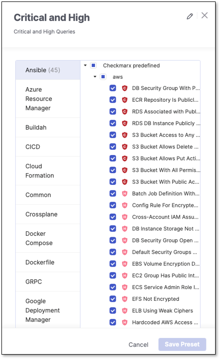

- The left column indicates the platform (Ansible, Azure Resource Manager, Buildah, etc.).
- The number next to the platform indicates how many queries are selected for this specific platform.

## Creating a Custom IaC Security Preset

To create a custom IaC Security preset, perform the following:

1. Click on **Add Preset**.

   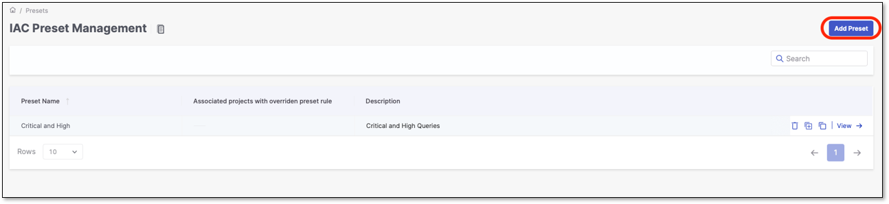
2. In the Add Preset dialog, enter the following information:
3. In the preset configuration dialog, perform the following:

   1. Select the relevant platforms/queries. In addition to the custom presets, all the predefined presets/queries are available.
   2. Click **Save preset**. The preset will be presented in the table after the predefined presets.

      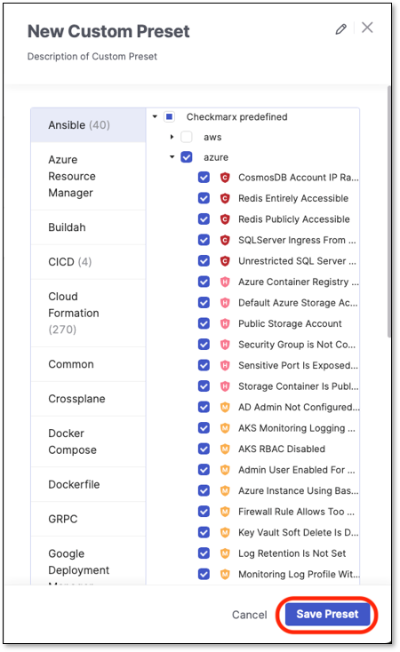

## Cloning an IaC Security Preset

The clone feature allows you to create a custom preset without creating the entire query set from scratch. You can simply clone the requested preset and modify it according to your needs.

It is possible to clone both predefined and custom presets.

To clone a preset, perform the following:

1. Hover over the required preset.
2. Click on the **Clone** option.

   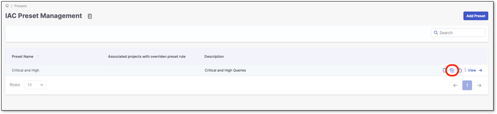
3. In the **Cloning preset** dialog, perform the following:

   - **Preset Name** - Give the preset a name. The preset name must be unique.
   - **Description** (Optional).
   - Click **Save Preset**.

     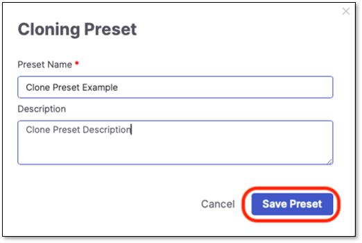
   - After the predefined presets, the preset will be saved and presented in the presets table.

## Deleting an IaC Security Preset

Predefined presets can't be deleted. The only presets that can be deleted are custom and cloned presets. They can be deleted only if no projects are associated with it.

For additional information, see [IaC Security Scanner Parameters](https://docs.checkmarx.com/en/34965-324306-iac-security-scanner-parameters.html).

To delete a preset, perform the following:

1. Hover over the required preset.
2. Click on the **Delete** option.

   
3. On the confirmation screen, click on **Delete Preset**.

   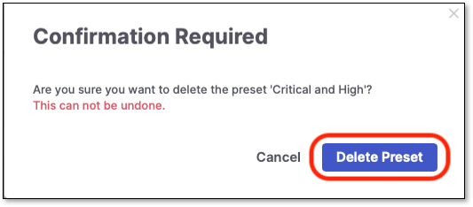

## Applying IaC Security Presets to Scans

Applying a preset to scans can be accomplished on two levels:

1. **Tenant** level - This configuration will apply to all the Tenant projects in addition to all the scans.

   For additional information, refer to [*IaC Security Scanner Parameters*](https://docs.checkmarx.com/en/34965-324306-iac-security-scanner-parameters.html).

   The defined preset will be presented with the  icon by its name
2. **Project** level - This configuration will apply to a specific project and its scans.

   For additional information, refer to [*IaC Security Scanner Parameters*](https://docs.checkmarx.com/en/34965-324306-iac-security-scanner-parameters.html).

## IaC Security Preset Usage Verification

To verify which preset was used in a scan, perform the following:

1. Click on  then **Project Settings** for a specific project.

   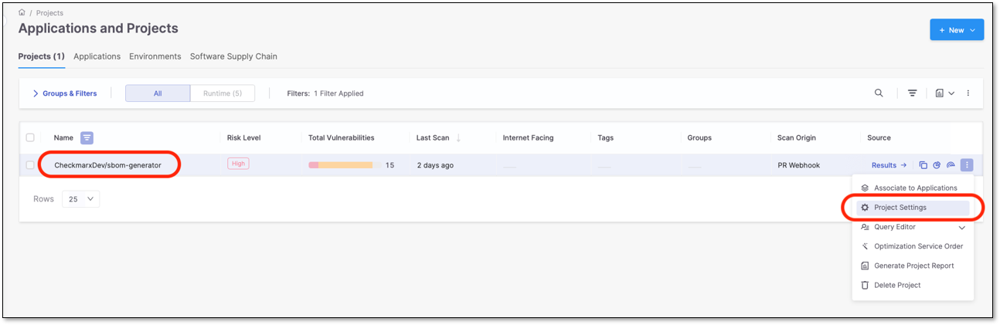
2. Click on the **Scan History** tab.

   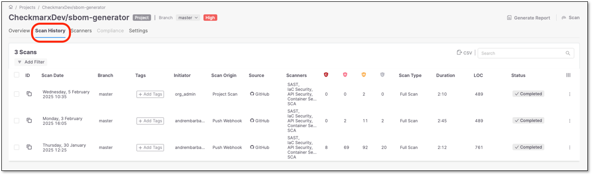
3. Click on the relevant scan in the table. A panel opens on the right side of the screen

   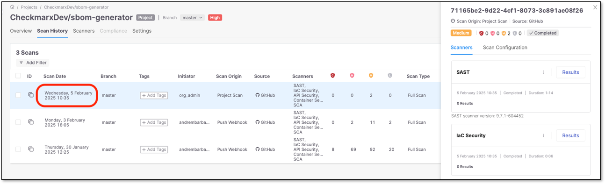
4. Click on the **Scan Configuration** tab.

   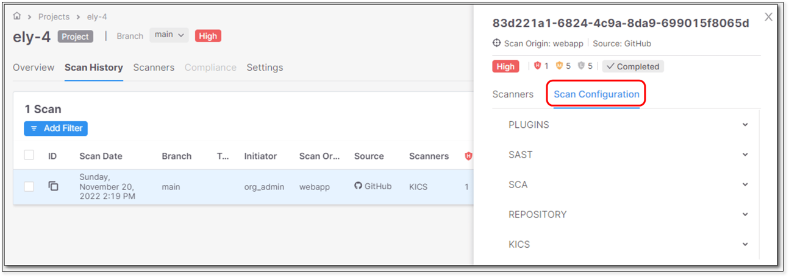
5. Expand the **IaC Security** option and verify the preset and configuration level used.

   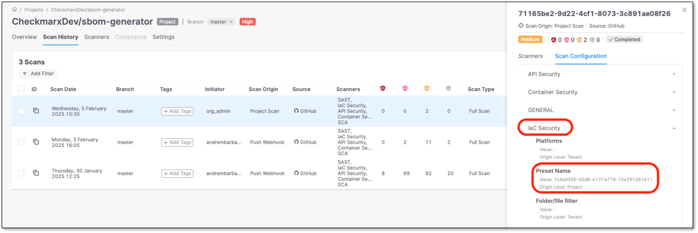
