# IaC Security Query Editor

## Overview

Checkmarx Audit complements Checkmarx IaC Security by enabling you to quickly and intuitively customize Iac Security's analysis queries or configure additional queries for:

- Security
- Application logic purposes.

Audit can be used to adapt IaC Security's basic security functionality to non-standard code. This helps eliminate false positives and ensure that all real vulnerabilities are identified. Audit can also expand IaC Security's functionality to include queries supporting specific QA or application logic needs.


The official common query (password and secrets) cannot be edited in the Query Browser.


## Accessing IaC Security Query Editor

### From the Project Panel

1. From the **Applications and Projects** list. Click anywhere in the project row. The project selection panel appears.
2. In the IaC Security section of the panel, hover over the .

   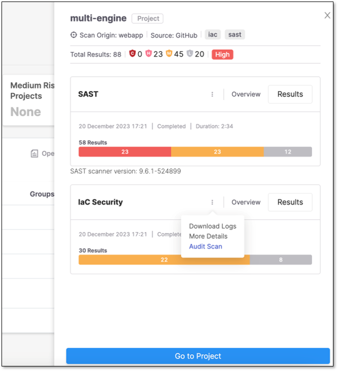
3. Click **Audit Scan** in the dropdown menu.
4. The Query Editor opens. After the Query Editor scans the project, it is ready to use.

## Viewing the Project Code

**To view the project code, perform the following:**

1. In the Project area, you can expand and scroll to see the packages contained in the project and the code snippets in the packages.
2. Click on the filename in the hierarchy to open its detail tab to see the code.

   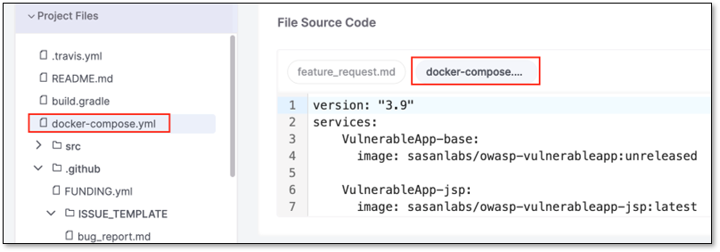

## Viewing the Query Code

**To view the query code, perform the following:**

1. You can open the list of instances on the **Queries** tab by expanding the **Query Browser**.

   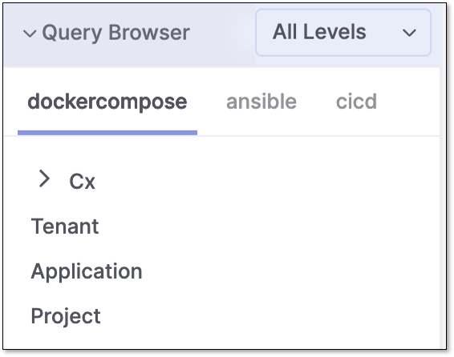
2. Scroll down to see the individual queries relevant to the project.
3. Click on the query name in the hierarchy to see the query source code in the details tab.

   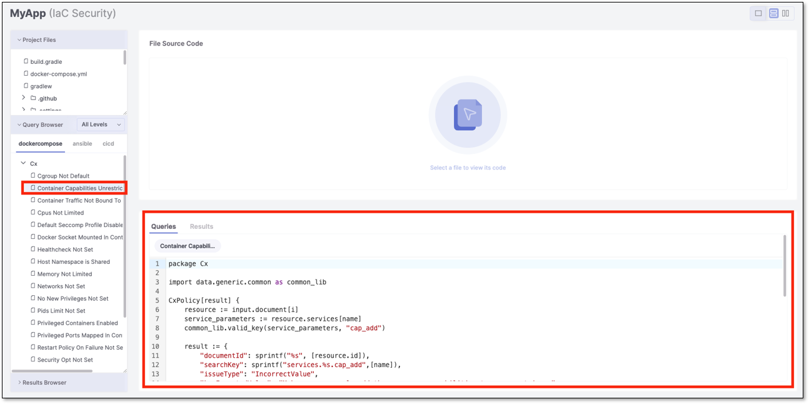

## Running a Query

When you first open the Audit page, the **Results** tab is blank. It will remain empty until you run a query that returns results with vulnerabilities in the project code.

**To run a query, perform the following:**

1. Select the **Queries** tab and the query from the hierarchy you want to run on the project, and click **Run Query**.

   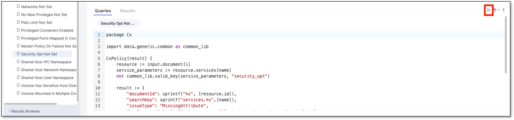
2. After the query completes, the Results tab is displayed in one of the following modes:

   - If no results are found, a **0** is displayed after the query's name, and the **No results found** message is shown in the first line of the Results sub-tab.

     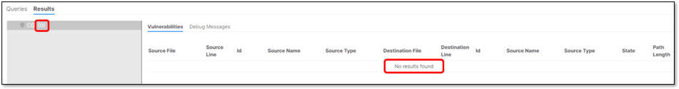
   - If results are found, the results are displayed under resizable columns.

     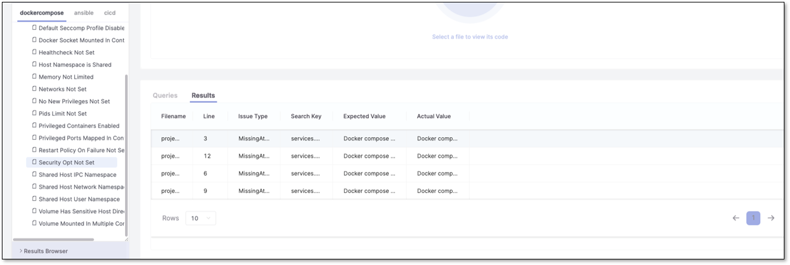

## Creating an Override Query

Checkmarx queries are not editable. They are listed under the Cx folder as shown below:

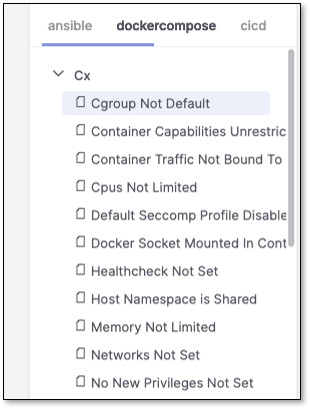

Instead, an option is available for creating override queries based on any Checkmarx queries, except for the Common queries. When you create an override query, its source code is copied from the selected Checkmarx query, which you can modify and apply to the tenant or project-level scans.

**To create an override query, perform the following:**

1. Click on the query in the **Queries** tab.
2. Right-click on the query source code, and from the pop-up menu, select the override scope, which can be either Tenant, Application (only available if a project is associated with an application), or Project.

   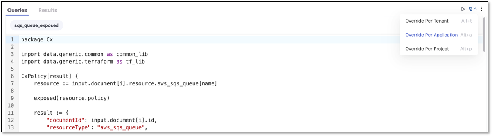
3. A new query is added to the tab panel, and the user can add the code.

   For example, a user is changing the **version** to **366**, as shown:

   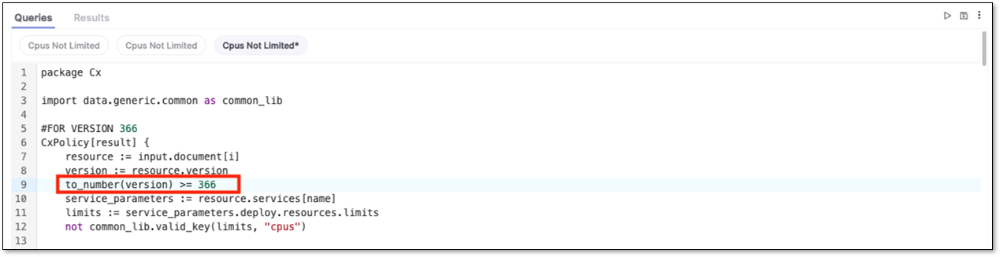

   The asterisk in front of the query name in the tab title indicates that the query has been changed but not saved.
4. Save the override queries by clicking .

   The left panel is updated with the new queries.

   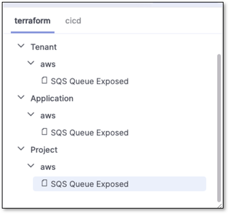
5. To check the effects of the changes, click **Run Query**.

   When the project is re-scanned, the modified query will be used.

## Creating a New Query

New queries can be created using the Query Editor.

**To create a new query, perform the following:**

1. Select the **Queries** tab.
2. Click .

   The **Add Query** form in the Properties panel opens at the right of the screen.

   
3. Fill out the information in the form.
4. Click **Save** to proceed. The information can be edited later by clicking **Edit** in the Properties panel.
5. Enter the new query code in the tab labeled with the name of the new query.
6. Test the new query and make changes if necessary.
7. Save the new query to add it to the Query list under the Platform specified in the Properties panel.

## Changing the Severity of a Custom Query

Following these steps, you can change the severity of a new and overridden query and view the updated severity flags in the query results after running a scan.

1. Open the desired query: Access the queries editor or the list of queries and locate the specific query you want to modify.
2. Open the query in the editor: Select the query you want to change and open it in the query editor. This allows you to view and modify the query details.
3. Click on **Edit** to access the properties of the query.

   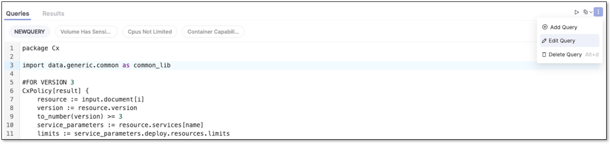
4. Click on the **Severity** dropdown and select the severity that accurately represents the query.

   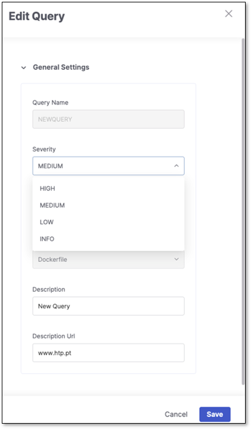
5. Save the modified query: After changing the Severity value, save the modified query to apply the changes.
6. Exit the Queries Editor: Once the query is saved, exit the queries editor by closing the editor window.
7. Run a regular IaC Security scan: Perform a normal IaC Security scan using the updated query configurations.
8. Check the query results: After the scan is completed, review the results to see the impact of the modified query. The findings of vulnerabilities identified by the query will be flagged with the updated severity level you assigned.
