# SAST Presets Management

Presets are sets of queries that a user can select in order to improve accuracy of scan results. By using presets, the user triages against the main capabilities that the SAST and IaC scanners provide. Preset management enables users to easily create their own presets according to their needs.

Presets are mandatory for the SAST scanner. In case that no preset is selected for a SAST scan, the default preset that will be used for the scan is **ASA Premium**.

Presets are currently supported only for the SAST and IaC Security scanners.

Presets are ordered alphabetically, and can be viewed or cloned.

There are 2 preset types:

- [Predefined Presets](#predefined-presets)
- [Custom Presets](#custom-presets)

## Opening Presets Management

To open preset management, perform the following:

1. Log in to Checkmarx One.
2. In the main menu, select **Resource Management > SAST Presets**.

## Presets User Roles

To be able to manage presets in Checkmarx One, the user must have at least one of the following user roles:

- **view-preset** - Users can only view presets. In case that this role is not applied, the user won't be able to see presets.
- **create-preset** - Users can only create presets.
- **delete-preset** - Users can only delete presets.
- **update-preset** - Users can only update existing presets (custom presets).

## Presets Columns

Presets columns present the following information:

- **Preset Name**
- **Associated projects with overridden preset rule** - Indicates the number of projects that use this preset and have custom overrides applied to its query rules.

  For additional information see [Project Rules](../managing-projects/configuring-projects.md#project-rules).
- **Description** - Preset description.

## Pagination

The presets screen contains an option to change the number of presets that are presented per page.

The default is **10 rows**, but it can be changed to 20 / 50 / 100 rows.

This is being done by clicking the **Rows** option and changing the number accordingly.

<figure>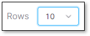<figcaption></figcaption></figure>

## Predefined Presets

Predefined presets are provided by design within the Checkmarx One presets feature.

Predefined presets *can't* be delete, and they will always be presented in the table before the custom presets.

The base presets and their descriptions are handled by Checkmarx SAST team, and all the versions are aligned across all Checkmarx products.

For additional information see Predefined Presets.

## Custom Presets

Custom presets are presets that are manually created and configured by users.

These presets will be presented in the table after the predefined presets.

It is possible to create a preset in the following methods:

- Create a preset from scratch - See [Creating a Custom Preset](#creating-a-custom-preset).
- Clone a preset and modify it - See [Cloning a Preset](#cloning-a-preset).

## Viewing a Preset

Viewing a preset provides an option to see and understand which languages and queries combine the preset.

To view a preset perform the following:

1. Hover over the required preset.
2. Click on the **View** option.

   <figure>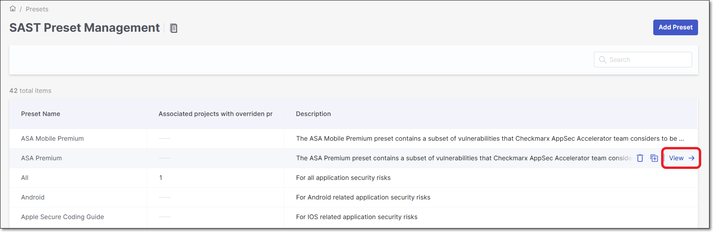<figcaption></figcaption></figure>

   A panel will be opened on the right screen side containing the preset's information.

   <figure>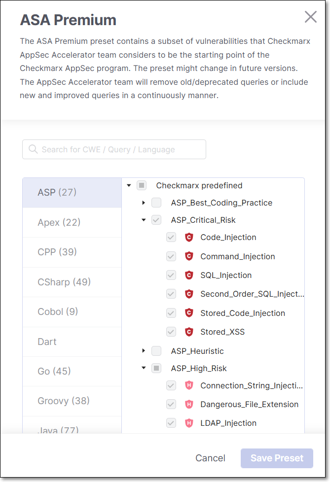<figcaption></figcaption></figure>


- The left column indicates the preset language (ASP, Apex, etc.).
- The number next to the language indicated how many queries this specific language contains.
- Clicking a query will open a separated browser tab with information about the query, including: **Risk, Cause, General Recommendations**, and **code examples**.

  <figure>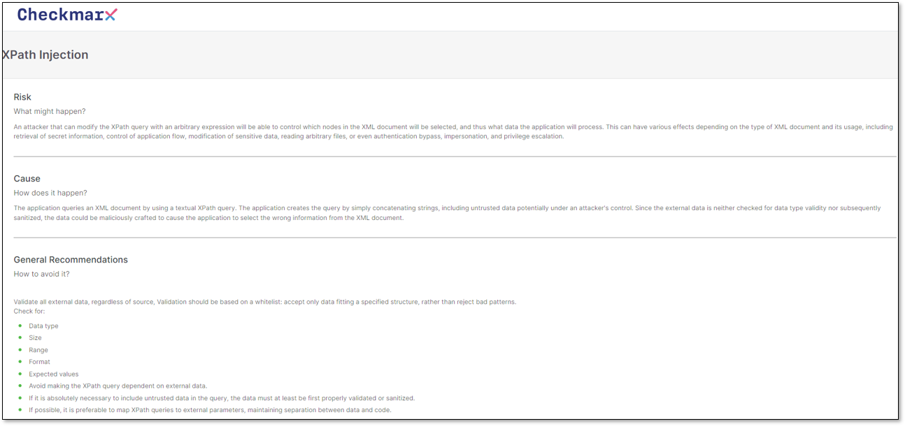<figcaption></figcaption></figure>


## Creating a Custom Preset

To create a custom preset, perform the following:

1. Click on **Add Preset**.

   <figure>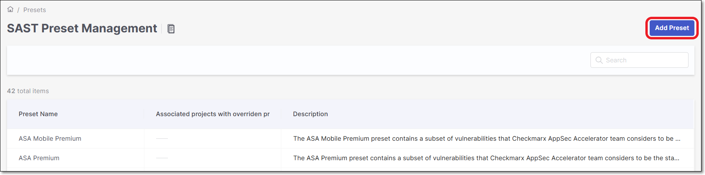<figcaption></figcaption></figure>
2. In the Add Preset dialog, perform the following:

   - **Preset Name** - Give the preset a name. The preset name must be unique.
   - **Description** (Optional).
   - Click **Next**.

     <figure>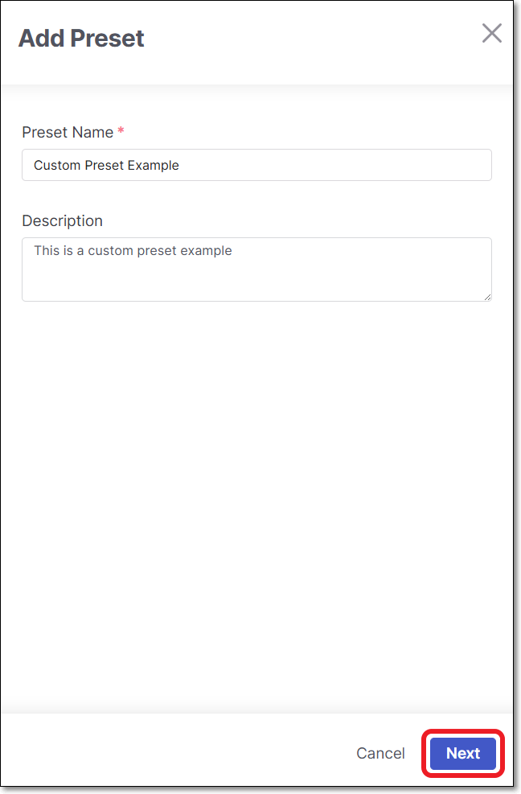<figcaption></figcaption></figure>
3. In the preset configuration dialog, perform the following:

   - Select the relevant languages / queries.

     
     - It is possible to search for a preset by **CWE / Language / Query** via search option.
     - All the predefined presets/queries are available, in addition to the custom presets.
     
   - Click **Save preset**.

     <figure>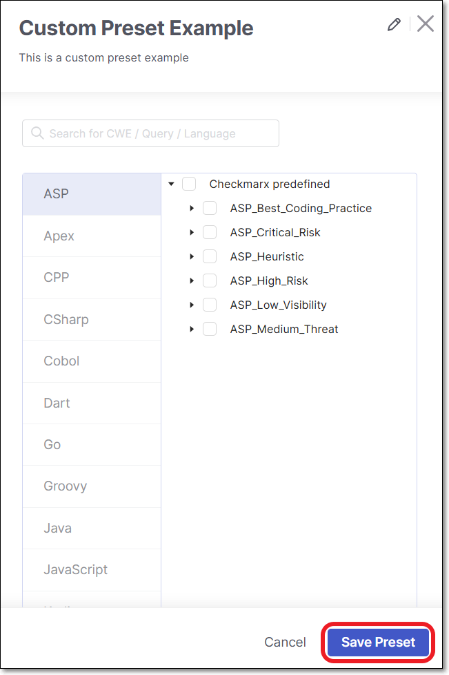<figcaption></figcaption></figure>

   The preset will be presented in the table after the predefined presets.

## Cloning a Preset

The clone feature is created in order to give the user the option to create a custom preset without the need to create the entire queries sets from scratch. The user can simply clone the requested preset and modify it according to his needs.

It is possible to clone both predefined and custom presets.

To clone a preset, perform the following:

1. Hover over the required preset.
2. Click on the **Clone** option.

   <figure>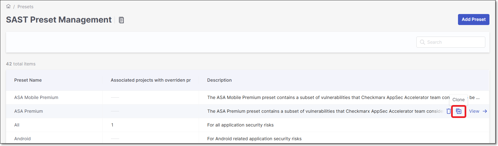<figcaption></figcaption></figure>
3. In the **Cloning preset** dialog perform the following:

   - **Preset Name** - Give the preset a name. The preset name must be unique.
   - **Description** (Optional).
   - Click **Save Preset**.

     <figure>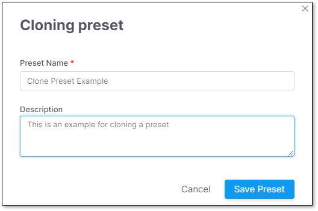<figcaption></figcaption></figure>

   The preset will be saved and presented in the presets table after the predefined presets.

## Deleting a Preset

Predefined presets can't be deleted. The only presets that can be deleted are custom and cloned presets. They can be deleted only if no projects are associated with the relevant preset.

For additional information see [Project Rules](../managing-projects/configuring-projects.md#project-rules).

To delete a preset, perform the following:

1. Hover over the required preset.
2. Click on the **Delete** option.

   <figure>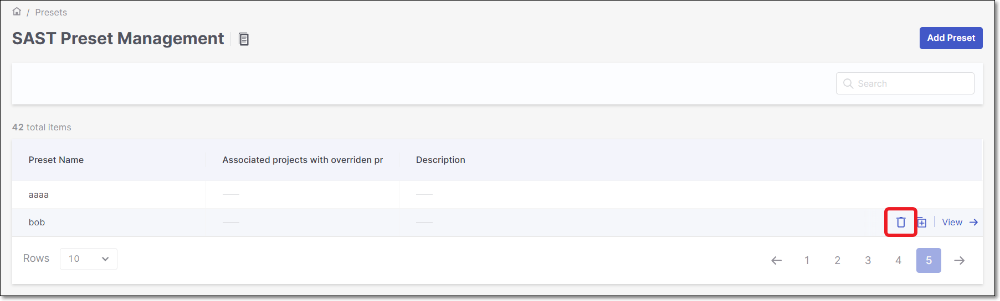<figcaption></figcaption></figure>
3. In the confirmation screen click on **Delete Preset**.

   <figure>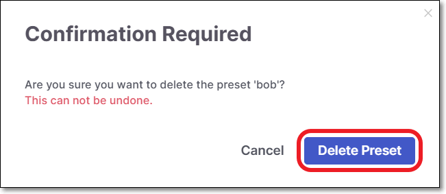<figcaption></figcaption></figure>

## Configuring a Preset for Scans

Configuring a preset for scans can be accomplished in 3 levels:

1. **Tenant** level - This configuration will apply on all the Tenant projects, in addition to all the scans.

   For additional information refer to [SAST Scanner Parameters](../managing-projects/configuring-projects.md#sast-scanner-parameters).
2. **Project** level - This configuration will apply on a specific project, in addition to its the scans.

   For additional information refer to [SAST Scanner Parameters](../managing-projects/configuring-projects.md#sast-scanner-parameters).
3. **Config as Code** - This configuration will apply a single scan.

   For additional information refer to [SAST Scanner Parameters](../managing-projects/configuring-projects.md#sast-scanner-parameters).

## Preset Usage Verification

To verify which preset was used in the last scan, perform the following:

1. Click on the **> Project Settings** for a specific project.

   <figure>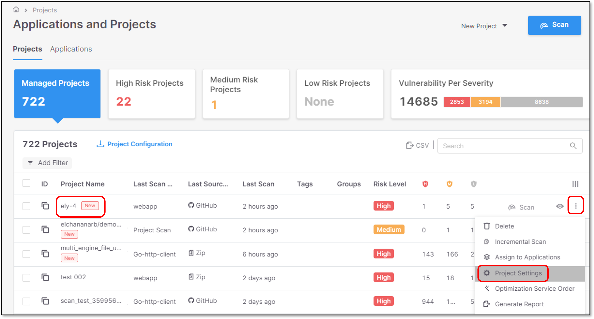<figcaption></figcaption></figure>
2. Click on **Scan History** tab.

   <figure>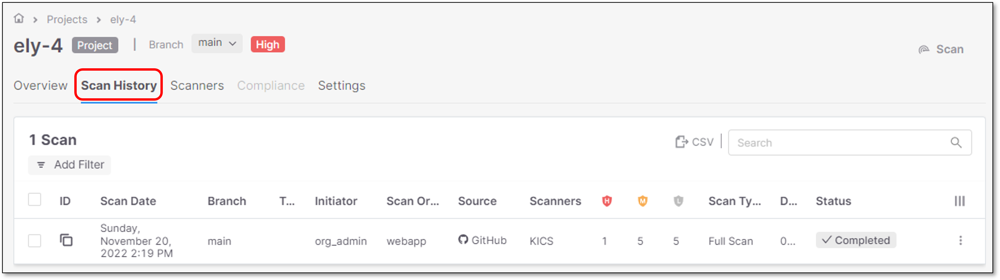<figcaption></figcaption></figure>
3. Click on the relevant scan in the table.

   <figure>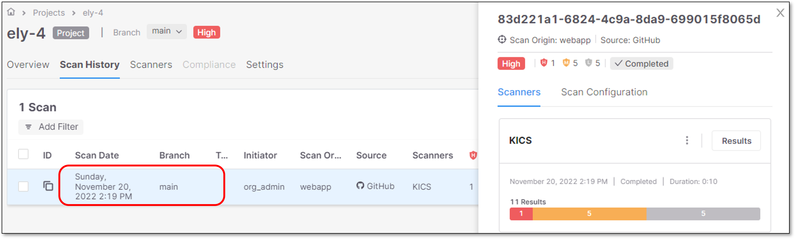<figcaption></figcaption></figure>

   A panel will be opened in the right screen side.
4. Click on **Scan Configuration** tab.

   <figure>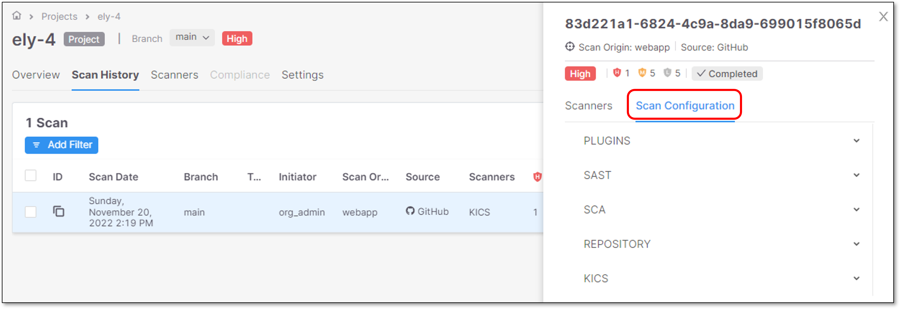<figcaption></figcaption></figure>
5. Expand the **SAST** option.
6. Verify the following:

   - Which preset was used.
   - Which configuration level it was used in.

     <figure>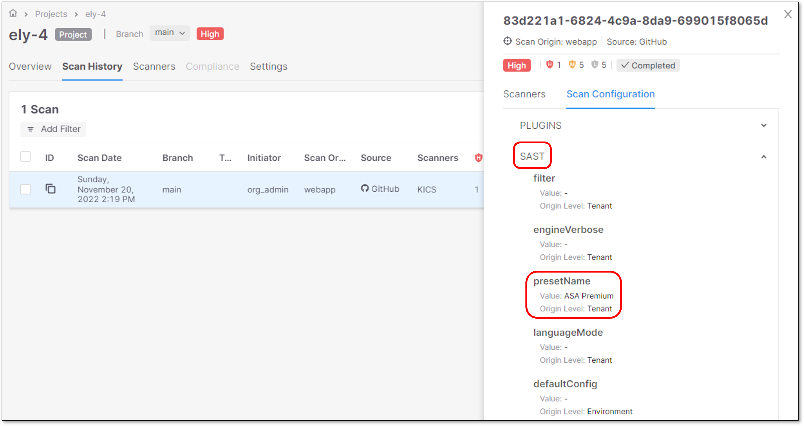<figcaption></figcaption></figure>
