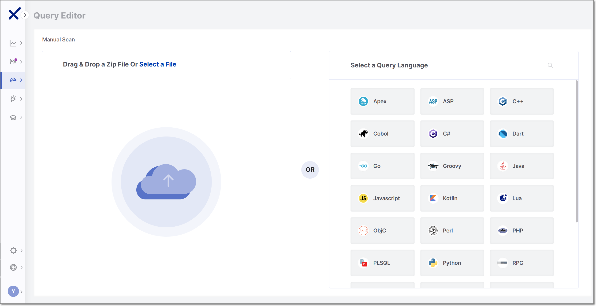
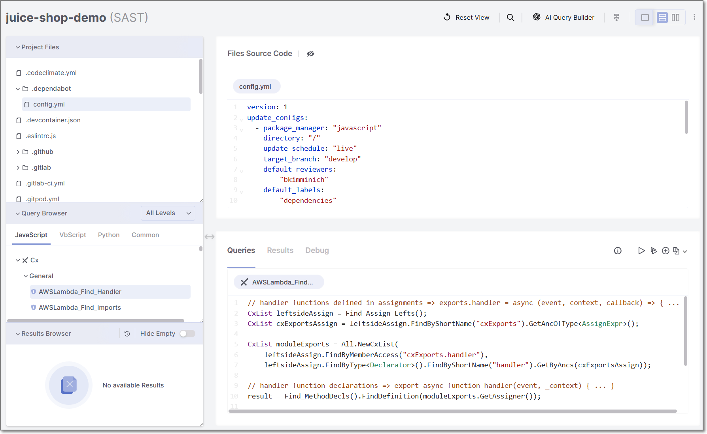
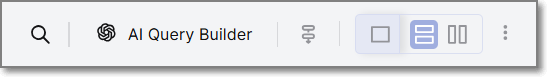
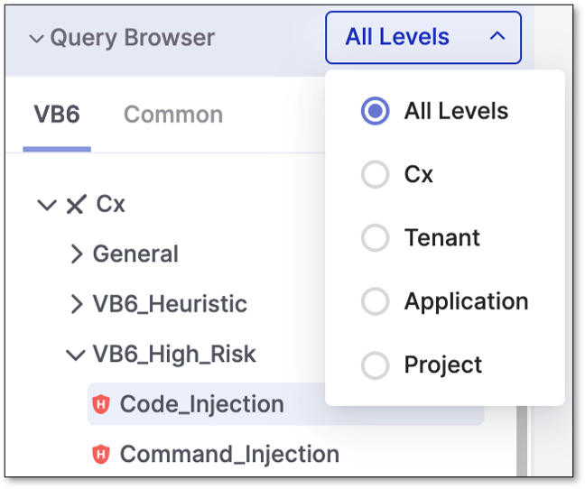
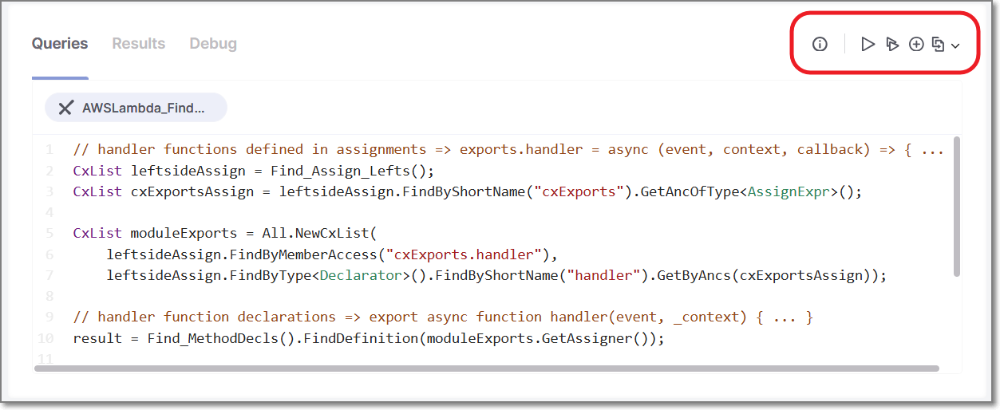
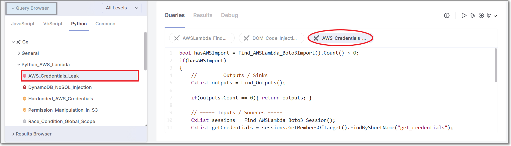
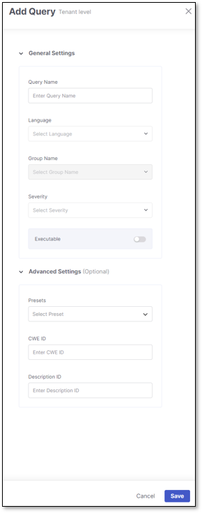
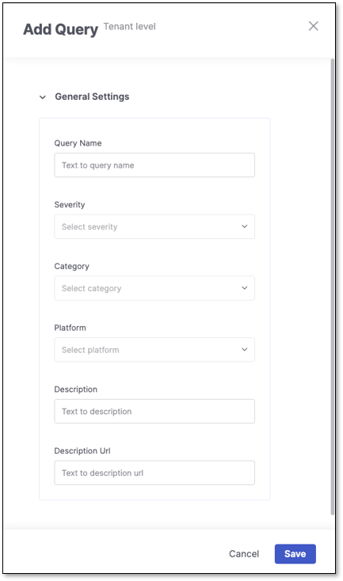
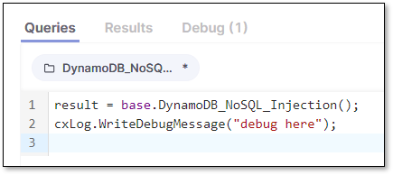
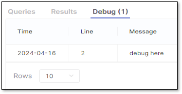

# SAST Query Editor

## Overview

Checkmarx Query Editor complements Checkmarx SAST by enabling you to easily customize SAST’s analysis queries or configure additional queries for security, quality assurance, and application logic purposes.

Query Editor can adapt SAST’s basic security functionality to non-standard code. It includes intuitive tools for adding code elements to various parts of queries and for locating relevant parts of existing queries and combining them to create your own. This helps eliminate false positives and ensures that all real vulnerabilities are identified. Use it to expand on SAST’s functionality and include queries supporting your specific QA or application logic needs.


There is a hard limit of 5 sessions of Query Editor that may run at a time and an idle session timeout of 60 minutes.



Common queries cannot be edited in the Query Browser.


## Accessing the Query Editor

The SAST Query Editor can be accessed in several ways.

### Accessing the Query Editor Independently

To open the Query Editor independently of a Checkmarx One project:

1. In the navigation panel, click **Resource Management** > **Query Editor**.

   <figure><figcaption></figcaption></figure>
2. Select one of the available options:

   - **Drag & Drop a Zip File Or Select a File**
   - **Select a Query Language** (Edit Mode)

#### ZIP Upload Mode

Uploading a ZIP file opens the Query Editor using the uploaded source code.

After the upload is complete, queries can be viewed, edited, and executed against the uploaded code.

#### Edit Mode

**Edit Mode** allows working with queries without uploading source code.

To begin, select a query language from the available list or use the search bar.

A new Query Editor session opens with sample source code for the selected language.

Only one language can be selected per session. You can switch do a different language by clicking the arrow next to the session language displayed at the top left of the editor. Switching languages begins a new session.

### Accessing the Query Editor from a Project

To open the Query Editor from a within a project:

1. Go to **Workspace** > **Projects.**
2. Hover over the desired project.
3. Click the vertical ellipsis (⋮).
4. Select **Query Editor**.

If the project uses more than one scanner that supports the Query Editor, the Query Editor entry includes an arrow. Select the SAST scanner from the available options.

The Query Editor opens using the associated project source code.

### Accessing the Query Editor from a Scan

To open the Query Editor from a specific scan:

1. Go to **Resource Management** > **Scans**.
2. Click anywhere in the row of the desired scan.

   The scan side panel is displayed.

   <figure><figcaption></figcaption></figure>
3. Click the vertical ellipsis (⋮) in the scanner card of the SAST scanner.
4. Select **Audit Scan**.

The Query Editor opens using the associated project source code.

## Query Levels and Overrides

Queries are organized into different levels.

Depending on how the Query Editor is accessed, different query levels may be available.

### Query Levels

The Query Editor supports the following query levels:

1. **Cx** – Default Checkmarx queries provided by the platform
2. **Tenant** – Queries that apply across the tenant
3. **Application** – Queries that apply to all projects associated with an application
4. **Project** – Queries that apply only to a specific project

**Cx** queries are read-only and cannot be edited directly.

### Override Queries

When you cannot find a query that suits your specific QA or application logic needs, customize your own using a native (out-of-the-box) Checkmarx query. These customized queries - **override queries** - use source code copied from the selected **Cx** query, which you can modify and apply to your **tenant**, **application**, or **project** level scans

Overriding a query at the tenant level will also override the query for all applications and projects in that tenant.

Overriding a query at the application level will also affect the projects in that specific application. This **Override per Application** option will be visible when the application does not include multi-application projects. To avoid confusion, in cases where the application includes a project associated with multiple applications, the **Override per Application** option will be disabled and hidden.

When you do not want to run and apply a certain query in a project, override it with an override query, which will run instead. This method is useful, especially for testing purposes. Project-level override queries can be used to override Cx, tenant and application-level queries.

To view the procedure for creating override queries, see [below](#creating-an-override-query).

#### Override Precedence

Generally, queries defined at a lower level take precedence over queries defined at a higher level.

For example:

- Project queries override Application queries
- Application queries override Tenant queries
- Tenant queries override Cx queries

#### Level Availability

Available query levels depend on how the Query Editor is opened.

##### Standalone Query Editor

When the SAST Query Editor is opened independently of a Checkmarx One project, the following levels are available:

- **Cx**
- **Tenant**

Application and Project levels are not available because the Query Editor is not associated with a project.

##### Project-Based Query Editor

When the Query Editor is opened from a project, additional levels may be available:

- **Application**
- **Project**

## Understanding the Query Editor Layout

The Query Editor is divided into navigation areas and workspace panels that allow you to browse source code, work with queries, and review query results.

<figure><figcaption></figcaption></figure>

### Query Editor Ribbon

Use the features on the ribbon at the top of the page to customize your use and view of the query editor. Hover over the icon to view its details before selecting.

<figure><figcaption></figcaption></figure>

From left to right:

- **Search**: Search for query names, project files and their source code, and scan results.
- **AI Query Builder**: Use the AI Query Builder to help design and write queries while elevating your Checkmarx query language proficiency.
- **Attack Vector**: Toggle the Attack Vector view for your vulnerabilities. This view is off by default.
- **View**: Toggle between Query Editor views. The default view is **Horizontal**.
- **Additional Options**: Download the scan logs as a .zip file for your project by clicking the vertical ellipsis (⋮), then **Download Logs**. These logs assist your support engineers in troubleshooting the scan in case of an error or failure.

### Navigation Areas

The left side of the Query Editor contains navigation areas used to browse project files, queries, and query results.

#### Project Files

In the **Project Files** area, view the packages contained in the project. Clicking a file opens a tab in the **File Source Code** window. Select multiple files to open multiple tabs and view their code.

#### Query Browser

The **Query Browser** displays the available queries organized by level and language.

<figure><figcaption></figcaption></figure>

**Cx** includes all default Checkmarx queries. **Tenant**, **Application** and **Project** levels are populated by new or override queries that were configured for that level.

Selecting a query opens it in a tab in the **Query Workspace** panel.

#### Results Browser

The Results Browser displays executed queries and their results.

You can hide queries that returned **(0)** results by enabling the **Hide Empty** toggle.

Selecting a query from the Results Browser loads its results in the **Results** tab of the Query Workspace panel.

### Workspace Panels

The workspace area displays the selected source code, queries, and query execution results.

The workspace area contains two panels:

- Files Source Code panel
- Query Workspace panel

#### Files Source Code Panel

The Files Source Code panel displays the contents of the selected source code file from the Project Files area.

Multiple files can be opened simultaneously in tabs within the panel.

#### Query Workspace Panel

The Query Workspace panel is a tabbed workspace used to view and work with queries and query execution output.

##### Query Actions Toolbar

The Query Actions toolbar contains actions performed on selected queries.

Under the **Queries** tab, while a query is selected and its code is viewable, use the ribbon at the end of the row to view the query info detail, run the query (or multiple queries), add another query, or override the query at the tenant, project, and, if applicable, application level. Hover over the icon in the ribbon to view its details before selecting. Note this ribbon is visible only after the project has been successfully scanned.

##### Queries Tab

The Queries tab displays the selected query source code.

Queries can be viewed and, when applicable, edited in this tab.

Multiple queries can be opened simultaneously in tabs within the Queries tab.

##### Results Tab

The Results tab displays the detailed findings for the query selected in the Results Browser. The Results tab is blank until you run a query that returns results with vulnerabilities in the project code.

##### Debug Tab

The SAST Query Editor includes a Debug tab that displays debug messages generated during query execution.

## Working with Queries

The Query Editor allows you to view, run, create, and modify queries against the associated source code.

### Viewing Query Code

Queries can be viewed from the **Query Browser**.

To view a query:

1. In the **Query Browser**, browse to the desired query.
2. Select the query.

The selected query opens in a tab in the Query Workspace panel, where its source code can be viewed.

<figure><figcaption></figcaption></figure>

Selecting additional queries opens additional tabs.

### Running Queries

Queries can be executed from the Query Actions toolbar.

#### Running a Single Query

To run a single query:

1. Select a query in the Query Browser or Query Workspace panel.
2. Click  **Run Query**.

#### Running Multiple Queries

To run multiple queries:

1. Click  **Run Multiple Queries** from the Query Actions toolbar.
2. Configure the queries to execute in the side panel.
3. Click **Run Queries**.

### Viewing Query Results

After query execution completes, executed queries appear in the Results Browser.

Selecting a query from the Results Browser loads its findings in the Results tab of the Query Workspace panel.

Queries that return no findings display a result count of 0.

### Creating a New Query

New queries can be created from the Query Actions toolbar.

To create a query:

1. Click  **Add Query**.
2. Complete the query properties form.

   <figure><figcaption></figcaption></figure>
3. Click **Save**.

   The new query is added to the Query Browser under the selected level and language.

   After the query is created, it opens in the Query Workspace panel with the default message: `Write your query here`
4. Enter the query logic.

   
   Unsaved query changes display an asterisk (\*) in the query tab title.
   
5. Click  **Save Query**.

### Creating an Override Query

Override queries can be created from the Queries Actions toolbar.

To create an override query:

1. Select an existing query from the **Query Browser**.
2. Click  **Create Override** and select the desired level.

   The new query is added to the Query Browser under the selected level, opened automatically in the Query Workspace panel, and prepopulated with the source code of the selected query.
3. Modify the query source code as needed.

   
   Unsaved query changes display an asterisk (\*) in the query tab title.
   
4. Click  **Save Query**.


When a query is renamed, all existing results will be lost, and new results will be replaced. All results in the subsequent scan will be **New** and **To Verify**. Once a query name is changed, a warning message will appear to confirm your choice. Reverting to a query's original name will bring back its existing results and predicate history.


### Changing Custom Query Severity

You can change the severity of new and override queries to align with organizational risk policies and reporting requirements.

To change the severity of a query:

1. Open the new or override query.
2. Click the vertical ellipsis (⋮) in the Query Actions Toolbar and select **Edit Query**
3. Select a new value from the **Severity** dropdown.

   <figure><figcaption></figcaption></figure>
4. Save the changes.

Severity changes are applied during normal scanner execution. After running a regular scan, findings generated by the modified query appear in the scan results with the updated severity level.

### Editing Query Properties

To edit query properties, click the vertical ellipsis (⋮) in the Query Actions Toolbar and select **Edit Query**

You can edit the following properties:

- Query name
- Severity
- Description ID
- Executable status
- CWE ID

### Debugging Your Query

To **Debug** your queries, create a query, or override an existing one and add `cxLog.WriteDebugMessage("debug here");` to the query. Run the query and see the debug message under the **Debug** tab.

## In this section

- [Query Editor API Compatibility](query-editor-api-compatibility.md)
- [AI Query Builder](ai-query-builder.md)
- [SAST Query Language APIs](sast-query-language-apis.md)
