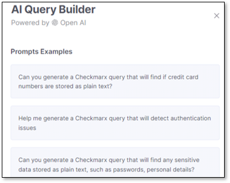
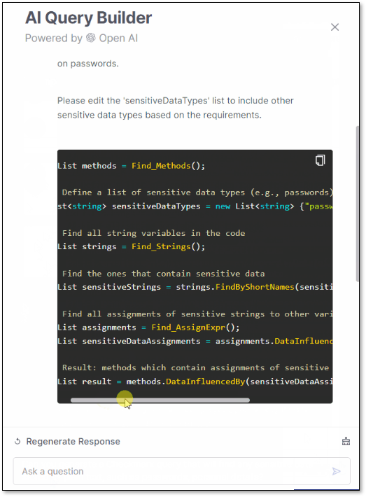
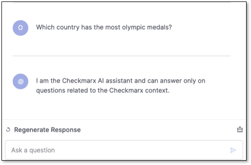
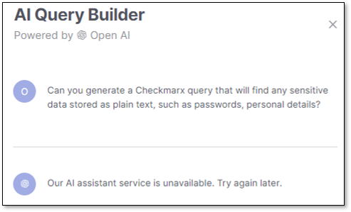

# AI Query Builder


**Checkmarx does not save or use any customer data sent to ChatGPT**.


The AI Query Builder uses ChatGPT to help you generate personalized queries based on CxQL. It is designed to make query customization more straightforward and more intuitive. A new button  appears on the Queries Editor page, allowing you to interact directly with ChatGPT through the interface. To get started, we will provide pre-defined example questions, guiding you on optimally utilizing this tool.

Additionally, you can request a more optimized response by clicking the **Regenerate** button, or clear the chat history by clicking

To ensure security and control, access to this feature will be limited to users with **Edit Query** permission. If you lack permission, the button will be inactive (grayed out). When code snippets are in the response box, you can easily copy the text using the right-click option or a dedicated copy button in the top-right corner.

If you ask an invalid question, a prompt will appear notifying you.

The number of allowed questions is capped at 100 per session. This limit is configurable, providing flexibility for different usage scenarios.

