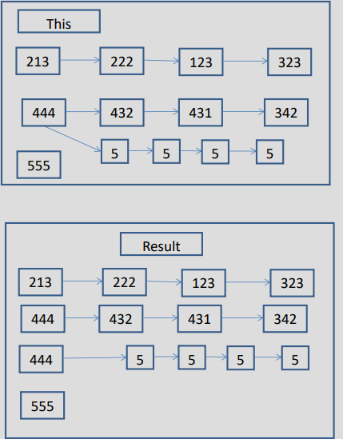
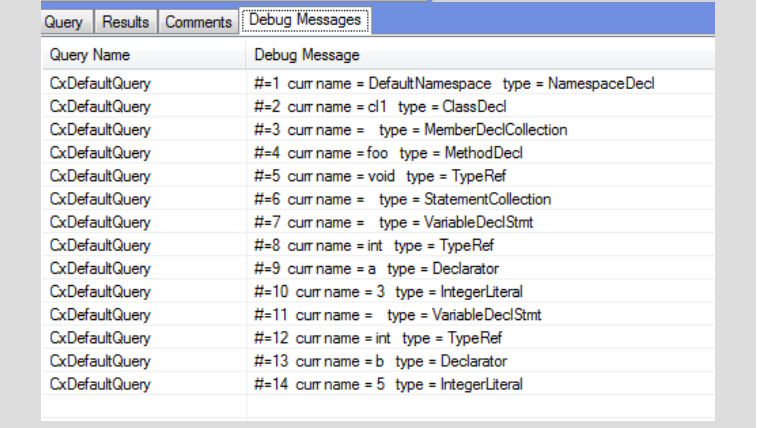

# SAST Query Language APIs

The following is a list of APIs in SAST to interact with its query language to find vulnerability patterns to improve the accuracy of your scans. If you are using Checkmarx SAST On-Prem, use these APIs in **Audit** . If you are using Checkmarx One, use them in **Query Editor**.

## Add

<details>

<summary>Add(Int32,IGraph)</summary>

**Add(Int32,IGraph)**

Adds to the current instance the given graph node, indexed by the given id.

**Syntax**

Expand source

```
public void Add(int a, IGraph b)
```

**Parameters**

- **a** Id of the node to be added to the graph node.
- **b** Graph node to be associated to the given Id.

**Exceptions**

- **ArgumentNullException** : Thrown when parameter is a null reference.

**Example**

This example demonstrates the CxList.Add(int, IGraph) method.

The input source code is:

Expand source

```
int b, a = 5;
if (a == 33)
b = 6;
```

The source code that uses CxList.Add method:

Expand source

```
CxList myList = All.FindByName(“a”);
CSharpGraph nodeGraph = All.FindByName(“b”).GetFirstGraph();
myList.Add(nodeGraph.NodeId, nodeGraph);
result = myList;
```

The resulting list will include the initial two “a”’s and the first b.

</details>

<details>

<summary>Add(CxList)</summary>

**Add(CxList)**

Add all the elements from the given CxList to the current instance.

**Syntax**

Expand source

```
public void Add(CxList a)
```

**Parameters**

- **a** The CxList to be added to the current CxList instance.

**Exceptions**

- **ArgumentNullException** : Thrown when parameter is a null reference.

**Example**

This example demonstrates the CxList.Add(CxList) method.

The input source code is:

Expand source

```
int b, a = 5;
if (a == 33)
b = 6;
```

The source code that uses CxList.Add method:

Expand source

```
CxList list_a = All.FindByName(“a”);
CxList list_b = All.FindByName(“b”);
list_a.Add(list_b);
result = list_a;
```

The resulting list will contain 4 elements.

</details>

<details>

<summary>Add(IEnumerable<CxList>)</summary>

**Add(IEnumerable<CxList>)**

Adds to the current instance all the elements from the given CxLists.

**Syntax**

Expand source

```
public void Add(IEnumerable<CxList> a)
```

**Parameters**

- **a** A list of CxLists.

**Exceptions**

- **ArgumentNullException** : Thrown when parameter is a null reference.

**Example**

This example demonstrates the CxList.Add(IEnumerable\<CxList>) method.

The input source code is:

Expand source

```
int b, a = 5;
if (a == 33)
b = 6;
```

The source code that uses CxList.Add method:

Expand source

```
CxList a = All.FindByName(“a”);
CxList b = All.FindByName(“b”);
CxList integers = All.FindByType(typeof(IntegerLiteral));
Result.AddRange(new List<CxList>(){a, b, integers});
```

The resulting list will include the two “a”’s, two “b”’s and the numbers 5, 33, 6.

</details>

<details>

<summary>Add(CxList[])</summary>

**Add(CxList[])**

Adds to the current instance all the elements from the given CxLists.

**Syntax**

Expand source

```
public void Add(params CxList[] lists)
```

**Parameters**

- **lists** An array of CxLists.

**Exceptions**

- **ArgumentNullException** : Thrown when parameter is a null reference.

**Example**

This example demonstrates the CxList.Add(params CxList\[\]) method.

The input source code is:

Expand source

```
int b, a = 5;
if (a == 33)
b = 6;
```

The source code that uses CxList.Add method:

Expand source

```
CxList a = All.FindByName(“a”);
CxList b = All.FindByName(“b”);
CxList integers = All.FindByType(typeof(IntegerLiteral));
Result.Add(a, b, integers);
```

The resulting list will include the two "a"'s, two "b"'s and the numbers 5, 33, 6.

**Version**

Supported from 9.1.0

</details>

<details>

<summary>Add(KeyValuePair<Int32,IGraph>)</summary>

**Add(KeyValuePair<Int32,IGraph>)**

Add the given pair to the current CxList instance.

**Syntax**

Expand source

```
public void Add((KeyValuePair<int, IGraph> dic)
```

**Parameters**

- **dic** Pair to be added to the current CxList instance.

**Exceptions**

- **ArgumentNullException** : Thrown when parameter is a null reference.

**Example**

This example demonstrates the CxList.Add(KeyValuePair\<int, IGraph>) method.

The input source code is:

Expand source

```
int b, a = 5;
if (a == 33)
b = 6;
```

The source code that uses CxList.Add method:

Expand source

```
CxList myList = All.FindByName(“a”);
foreach(KeyValuePair<int, IGraph> entry in All.FindByName(“b”))
{
    myList.Add(entry);
}
result = myList;
```

The resulting list will contain 4 elements.

</details>

## AddRange

<details>

<summary>AddRange(IEnumerable<CxList>)</summary>

**AddRange(IEnumerable<CxList>)**

Adds to the current instance all the elements from the given CxLists.

**Syntax**

Expand source

```
public void AddRange(IEnumerable<CxList> lists)
```

**Parameters**

- **lists** A list of CxLists.

**Exceptions**

- **ArgumentNullException** : Thrown when parameter is a null reference.

**Example**

This example demonstrates the CxList.AddRange(IEnumerable\<CxList>) method.

The input source code is:

Expand source

```
int b, a = 5;
if (a == 33)
b = 6;
```

The source code that uses CxList.AddRange method:

Expand source

```
CxList a = All.FindByName("a");
CxList b = All.FindByName("b");
CxList integers = All.FindByType(typeof(IntegerLiteral));
Result.AddRange(new List<CxList>(){a, b, integers});
```

The resulting list will include the two "a"'s, two "b"'s and the numbers 5, 33, 6.

**Version**

Supported from 9.1.0

</details>

## AddSupportForExpressionLanguageForFramework

<details>

<summary>AddSupportForExpressionLanguageForFramework(String)</summary>

**AddSupportForExpressionLanguageForFramework(String)**

add the support of a framework expression language

**Parameters**

- **frameworkName** the framework that we are mapping the marker to

</details>

## AttributesIgnoreCase

<details>

<summary>AttributesIgnoreCase(XDocument,String,Boolean)</summary>

**AttributesIgnoreCase(XDocument,String,Boolean)**

Gets the elements with the specified [System.Xml.Linq.XName](https://learn.microsoft.com/en-us/dotnet/api/System.Xml.Linq.XName).

**Parameters**

- **doc** The element.
- **name** The [System.String](https://learn.microsoft.com/en-us/dotnet/api/System.String) to match.
- **ignoreCase** If set to *true* case will be ignored whilst searching for the [System.Xml.Linq.XElement](https://learn.microsoft.com/en-us/dotnet/api/System.Xml.Linq.XElement).

**Returns:**

A [System.Xml.Linq.XElement](https://learn.microsoft.com/en-us/dotnet/api/System.Xml.Linq.XElement) that matches the specified [System.Xml.Linq.XName](https://learn.microsoft.com/en-us/dotnet/api/System.Xml.Linq.XName), or null.

</details>

## CalcPragmaKey

<details>

<summary>CalcPragmaKey()</summary>

**CalcPragmaKey()**

function to calculate pragma unique id

**Parameters**

- **nodeId** None

**Returns:**

None

</details>

## CallingMethodOfAny

<details>

<summary>CallingMethodOfAny(CxList)</summary>

**CallingMethodOfAny(CxList)**

Returns a CxList which is a subset of “this” instance and are methods or constructors declarations which matches the given CxList elements.

**Syntax**

Expand source

```
public CxList CallingMethodOfAny(CxList list)
```

**Parameters**

- **cxList** The list of elements containing the methods or constructors to look for their declaration.

**Exceptions**

- **ArgumentNullException** : Thrown when parameter is a null reference.

**Example**

This example demonstrates the CxList.CallingMethodOfAny(CxList) method.

The input source code is:

Expand source

```
void foo()
{
    int goo = 3;
    int boo = 5;
}
```

The source code that uses CxList.CallingMethodOfAny method:

Expand source

```
result = All.CallingMethodOfAny(All.FindByName ("oo"));
```

The result would consist of 1 item:

Expand source

```
foo (in void foo())
```

</details>

## Clear

<details>

<summary>Clear()</summary>

**Clear()**

Clears the information in “this” instance.

**Syntax**

Expand source

```
public bool Clear()
```

**Remarks**

This method removes all the information stored in the List.

**Example**

This example demonstrates the CxList.Clear() method.

Expand source

```
CxList MyList = All ;
MessageBox.Show(MyList.Count.ToString());
MyList.Clear();
MessageBox.Show(MyList.Count.ToString());
```

</details>

## ClearAdditionalNodes

<details>

<summary>ClearAdditionalNodes()</summary>

**ClearAdditionalNodes()**

Clears all the data allocated in the _GraphToNodeAdditional and _NodeToGraphAdditional data members for the current thread.

</details>

## ClearPaths

<details>

<summary>ClearPaths()</summary>

**ClearPaths()**

remove all flow

</details>

## ClearTopLevelQueryFlag

<details>

<summary>ClearTopLevelQueryFlag()</summary>

**ClearTopLevelQueryFlag()**

Call this method at the finally clause of every query.

</details>

## Clone

<details>

<summary>Clone(CancellationToken)</summary>

**Clone(CancellationToken)**

create duplicate of this

**Returns:**

None

</details>

<details>

<summary>Clone()</summary>

**Clone()**

Clone the current (this) CxList

**Syntax**

Expand source

```
public CxList Clone ()
```

**Returns:**

CxList containing a clone of the current (this) CxList

**Example**

The source code that uses CxList.Clone method:

Expand source

```
CxList A = All.FindByType(typeof(UnknownReference));
CxList B = A; //B points to same elements as A
CxList B = A.Clone(); //B has a copy (clone) of the elements in A
```

</details>

## Concatenate

<details>

<summary>Concatenate(CxList)</summary>

**Concatenate(CxList)**

Concatenates two nodes into a flow.

**Syntax**

Expand source

```
public CxList Concatenate (CxList list)
```

**Parameters**

- **list** A CxList containing one node only. This node will be concatenated to **this** instance.

**Returns:**

A flow that starts with **this** instance node, and ends with the **list** parameter node.

**Exceptions**

- **ArgumentNullException** : Thrown when parameter is a null reference.

**Remarks**

1. This function calls CxList.Concatenate(list, false).
2. If either this instance or list parameter contains more than one node or contains flows, the function return value is undefined.
3. This function is deprecated, use ConcatenatePath instead.

**Version**

Supported from v7.1.2

</details>

<details>

<summary>Concatenate(CxList,Boolean)</summary>

**Concatenate(CxList,Boolean)**

Concatenates two nodes into a flow.

**Syntax**

Expand source

```
public CxList Concatenate (CxList list, bool _testFlow)
```

**Parameters**

- **list** A CxList containing one node only. This node will be concatenated to this instance.
- **testFlow** If true, searches for a flow between this instance and list. Otherwise, connects the two nodes directly (more efficient).

**Returns:**

A flow that starts with this instance node, and ends with the list parameter node.

**Exceptions**

- **ArgumentNullException** : Thrown when parameter is a null reference.

**Remarks**

1. If either this instance or list parameter contains more than one node or contains flows, the function return value is undefined.
2. This function is deprecated, use ConcatenatePath instead.

**Example**

This example demonstrates the Concatenate(CxList, bool) method.

The input source code is:

Expand source

```
void main()
{
    int a = 1;
    int b = 2;
    int c = a + b;
    printf("%d", c);
}
```

The source code that uses CxList.Concatenate method:

Expand source

```
CxList one = All.FindByName("1");
CxList two = All.FindByName("2");
result = one.Concatenate(two, false);
```

The result would be:

Expand source

```
1 flow found:
[1] -> [2]
```

**Version**

Supported from 7.1.2

</details>

## ConcatenateAllPaths

<details>

<summary>ConcatenateAllPaths(CxList,Boolean)</summary>

**ConcatenateAllPaths(CxList,Boolean)**

Concatenates all flows in this instance to all flows in list.

**Syntax**

Expand source

```
public CxList ConcatenateAllPaths (CxList secondList, bool _testFlow)
```

**Parameters**

- **secondList** A CxList containing flows. These flow will be concatenated to the flows in **this** instance.
- **testFlow** If true, searches for a flow between **this** instance and **list**. Otherwise, connects the two flows directly (more efficient).

**Returns:**

A product of all flows in **this** instance with the ones in **list** parameter.

**Exceptions**

- **ArgumentNullException** : Thrown when parameter is a null reference.

**Remarks**

If **this** instance contains **n** flows in it and **list** contains **m** flows in it, the return set will contain **nxm** flows, where each flow from **this** instance will be concatenated to each flow from **list**.

**Example**

This example demonstrates the ConcatenateAllPaths(CxList, bool) method.

The input source code is:

Expand source

```
void main()
{
    int a = 1;
    int b = 2;
}
```

The source code that uses CxList.ConcatenateAllPaths method:

Expand source

```
CxList one = All.FindByName("1");
CxList a = All.FindByShortName("a").FindByType(typeof(Declarator));
CxList flow1 = a.InfluencedBy(one); // [1] -> [a]
CxList two = All.FindByName("2");
CxList b = All.FindByShortName("b").FindByType(typeof(Declarator));
CxList flow2 = b.InfluencedBy(two); // [2] -> [b]
CxList flow = flow1 + flow2;
result = flow.ConcatenateAllPaths(flow, false);
```

The result would be:

Expand source

```
4 flow found:
[1] -> [a] -> [1] -> [a]
[1] -> [a] -> [2] -> [b]
[2] -> [b] -> [1] -> [a]
[2] -> [b] -> [2] -> [b]
```

**Version**

Supported from 7.1.2

</details>

<details>

<summary>ConcatenateAllPaths(CxList)</summary>

**ConcatenateAllPaths(CxList)**

Concatenates all flows in this instance to all flows in **list**.

**Syntax**

Expand source

```
public CxList ConcatenateAllPaths (CxList secondList)
```

**Parameters**

- **secondList** A CxList containing flows. These flow will be concatenated to the flows in **this** instance.

**Returns:**

A product of all flows in **this** instance with the ones in **list** parameter.

**Exceptions**

- **ArgumentNullException** : Thrown when parameter is a null reference.

**Remarks**

1. This function calls CxList.ConcatenateAllPaths(list, true).
2. If this instance contains n flows in it and list contains m flows in it, the return set will contain nxm flows, where each flow from this instance will be concatenated to each flow from list.

**Version**

Supported from 7.1.2

</details>

## ConcatenateAllSources

<details>

<summary>ConcatenateAllSources(CxList,Boolean)</summary>

**ConcatenateAllSources(CxList,Boolean)**

Concatenates the node in **list** to each node in **this** instance. Concatenation is node-to-node (doesn't support connecting flows).

**Syntax**

Expand source

```
public CxList ConcatenateAllSources (CxList list, bool _testFlow)
```

**Parameters**

- **list** A CxList. It will be concatenated to each node in this instance.
- **testFlow** If this parameter true -> test possible flow , otherwise connect directly.

**Returns:**

Flows that starts with **this** instance nodes, and end with the **list** parameter node.

**Exceptions**

- **ArgumentNullException** : Thrown when parameter is a null reference.

**Remarks**

1. If the **list** parameter contains more than one node or contains flows or **this** instance contains flows, the function return value is undefined.
2. The number of the returned items is same as the number of items in **this** instance.
3. This function calls the Concatenate function for each item in **this** instance with **list** as parameter.

**Example**

This example demonstrates the ConcatenateAllSources(CxList, bool) method.

The input source code is:

Expand source

```
void main()
{
    int a = 1;
    int b = 2;
}
```

The source code that uses CxList.ConcatenateAllSources method:

Expand source

```
CxList a = All.FindByShortName("a").FindByType(typeof(Declarator));
CxList b = All.FindByShortName("b").FindByType(typeof(Declarator));
CxList main = All.FindByShortName("main");
CxList list = a + b;
result = list.ConcatenateAllSources(list, false);
```

The result would be:

Expand source

```
2 flow found:
[a] -> [main]
[b] -> [main]
```

**Version**

Supported from 7.1.2

</details>

<details>

<summary>ConcatenateAllSources(CxList)</summary>

**ConcatenateAllSources(CxList)**

Concatenates the node in **list** to each node in **this** instance. Concatenation is node-to-node (doesn't support connecting flows).

Note: Currently is identical to calling ConcatenateAllSources with testFlow = false

**Syntax**

Expand source

```
public CxList ConcatenateAllSources (CxList list)
```

**Parameters**

- **list** A CxList. It will be concatenated to each node in this instance.

**Returns:**

Flows that starts with **this** instance nodes, and end with the **list** parameter node.

**Exceptions**

- **ArgumentNullException** : Thrown when parameter is a null reference.

**Remarks**

1. If the **list** parameter contains more than one node or contains flows or **this** instance contains flows, the function return value is undefined.
2. The number of the returned items is same as the number of items in **this** instance.
3. This function calls the Concatenate function for each item in **this** instance with **list** as parameter.

**Example**

This example demonstrates the ConcatenateAllSources(CxList) method.

The input source code is:

Expand source

```
void main()
{
    int a = 1;
    int b = 2;
}
```

The source code that uses CxList.ConcatenateAllSources method:

Expand source

```
CxList a = All.FindByShortName("a").FindByType(typeof(Declarator));
CxList b = All.FindByShortName("b").FindByType(typeof(Declarator));
CxList main = All.FindByShortName("main");
CxList list = a + b;
result = list.ConcatenateAllSources(list);
```

The result would be:

Expand source

```
2 flow found:
[a] -> [main]
[b] -> [main]
```

**Version**

Supported from 7.1.2

</details>

## ConcatenateAllTargets

<details>

<summary>ConcatenateAllTargets(CxList,Boolean)</summary>

**ConcatenateAllTargets(CxList,Boolean)**

Concatenates each node in **list** to the node in **this** instance. Concatenation is node-to-node (doesn't support connecting flows).

**Syntax**

Expand source

```
public CxList ConcatenateAllTargets (CxList list, bool testFlow)
```

**Parameters**

- **list** A CxList. It will be concatenated to each node in this instance.
- **testFlow** If this parameter true -> test possible flow , otherwise connect directly.

**Returns:**

Flows that starts with **this** instance nodes, and end with the **list** parameter node.

**Exceptions**

- **ArgumentNullException** : Thrown when parameter is a null reference.

**Remarks**

1. If the **this** instance contains more than one node or contains flows or **list** contains flows, the function return value is undefined.

2. The number of the returned items is same as the number of items in **list**.

3. This function calls the Concatenate function for **this** instance with each item in **list** as parameter.

**Example**

This example demonstrate the ConcatenateAllTargets(CxList, bool) method.

The input source code is:

Expand source

```
void main()
{
    int a = 1;
    int b = 2;
}
```

The source code that uses CxList.ConcatenateAllTargets method:

Expand source

```
CxList a = All.FindByShortName("a").FindByType(typeof(Declarator));
CxList b = All.FindByShortName("b").FindByType(typeof(Declarator));
CxList main = All.FindByShortName("main");
CxList list = a + b;
result = list.ConcatenateAllTargets(list, false);
```

The result would be:

Expand source

```
2 flow found:
[main] -> [a]
[main] -> [b]
```

**Version**

Supported from 7.1.2

</details>

<details>

<summary>ConcatenateAllTargets(CxList)</summary>

**ConcatenateAllTargets(CxList)**

Concatenates each node in **list** to the node in **this** instance. Concatenation is node-to-node (doesn't support connecting flows).

Note: Currently is identical to calling ConcatenateAllTargets with testFlow = false

**Syntax**

Expand source

```
public CxList ConcatenateAllTargets (CxList list)
```

**Parameters**

- **list** A CxList. It will be concatenated to each node in this instance.

**Returns:**

Flows that starts with **this** instance nodes, and end with the **list** parameter node.

**Exceptions**

- **ArgumentNullException** : Thrown when parameter is a null reference.

**Remarks**

1. If the **this** instance contains more than one node or contains flows or **list** contains flows, the function return value is undefined.
2. The number of the returned items is same as the number of items in **list**.
3. This function calls the Concatenate function for **this** instance with each item in **list** as parameter.

**Example**

This example demonstrates the ConcatenateAllTargets(CxList) method.

The input source code is:

Expand source

```
void main()
{
    int a = 1;
    int b = 2;
}
```

The source code that uses CxList.ConcatenateAllTargets method:

Expand source

```
CxList a = All.FindByShortName("a").FindByType(typeof(Declarator));
CxList b = All.FindByShortName("b").FindByType(typeof(Declarator));
CxList main = All.FindByShortName("main");
CxList list = a + b;
result = list.ConcatenateAllTargets(list);
```

The result would be:

Expand source

```
2 flow found:
[main] -> [a]
[main] -> [b]
```

**Version**

Supported from 7.1.2

</details>

## ConcatenatePath

<details>

<summary>ConcatenatePath(CxList,Boolean)</summary>

**ConcatenatePath(CxList,Boolean)**

Concatenates two flows into one connected flow.

**Syntax**

Expand source

```
public CxList ConcatenatePath (CxList secondList, bool _testFlow)
```

**Parameters**

- **secondList** A CxList containing one flow only. This flow will be concatenated to **this** instance.
- **testFlow** If true, searches for a flow between **this** instance and **list**. Otherwise, connects the two flows directly (more efficient).

**Returns:**

A flow that starts with **this** instance flow, and ends with the **list** parameter flow.

**Exceptions**

- **ArgumentNullException** : Thrown when parameter is a null reference.

**Remarks**

Both **this** instance and **list** have to contain only one flow (or one node as a private case), otherwise return value is undefined.

**Example**

This example demonstrates the ConcatenatePath(CxList, bool) method.

The input source code is:

Expand source

```
void main()
{
    int a = 1;
    int b = 2;
}
```

The source code that uses CxList.ConcatenatePath method:

Expand source

```
CxList one = All.FindByName("1");
CxList a = All.FindByShortName("a").FindByType(typeof(Declarator)); //Declarator
is a new type defined in cXQL
CxList flow1 = a.InfluencedBy(one); // [1] -> [a]
CxList two = All.FindByName("2");
CxList b = All.FindByShortName("b").FindByType(typeof(Declarator));
CxList flow2 = b.InfluencedBy(two); // [2] -> [b]
result = flow2.ConcatenatePath(flow1, false);
```

The result would be:

Expand source

```
1 flow found:
[2] -> [b] -> [1] -> [a]
```

**Version**

Supported from 7.1.2

</details>

<details>

<summary>ConcatenatePath(CxList)</summary>

**ConcatenatePath(CxList)**

Concatenates two flows into one connected flow.

**Syntax**

Expand source

```
public CxList ConcatenatePath (CxList secondList)
```

**Parameters**

- **secondList** A CxList containing one flow only. This flow will be concatenated to **this** instance.

**Returns:**

A flow that starts with **this** instance flow, and ends with the **list** parameter flow.

**Exceptions**

- **ArgumentNullException** : Thrown when parameter is a null reference.

**Remarks**

1. This function calls CxList.ConcatenatePath(list, true).
2. Both this instance and list have to contain only one flow (or one node as a private case), otherwise return value is undefined.

**Version**

Supported from 7.1.2

</details>

## Contained

<details>

<summary>Contained(CxList,GetStartEndNodesType)</summary>

**Contained(CxList,GetStartEndNodesType)**

Returns a subset of “this” instance whose elements are contained in the given list, filtered according to the given nodes type.

**Syntax**

Expand source

```
public CxList Contained (CxList pathList, GetStartEndNodesType requestedType)
```

**Parameters**

- **pathList** The list where the method looks for the requested node type.
- **requestedType** An enum matching the relevant GetStartEndNodes types, which are: EndNodesOnly, StartNodesOnly, StartAndEndNodes, AllNodes and AllButNotStartAndEnd.

**Returns:**

A subset of “this” instance with elements from the requested nodes type.

**Exceptions**

- **ArgumentNullException** : Thrown when parameter is a null reference.

**Remarks**

The return value may be empty (Count = 0).

**Example**

This example demonstrates the CxList.Contained(CxList, GetStartEndNodesType) method.

The input source code is:

Expand source

```
void foo()
{
    int b = 2, a = 5, c;
    if (a > b)
        b = 3;
    c = b;
}
```

The source code that uses CxList.Contained method:

Expand source

```
result = All.FindByShortName("b").Contained(All.InfluencedBy(All.FindById(50)), GetStartEndNodesType.AllNodes);
//Id 50 is "3" in "b = 3;"
```

The result would consist of 2 items:

Expand source

```
b (from b = 3;)
b (from c = b;)
```

The source code that uses CxList.Contained method:

Expand source

```
result = All.FindByShortName("a").Contained(All.InfluencedBy(All.FindById(50)), GetStartEndNodesType.EndNodesOnly);
// Id 50 is "3" in "b = 3;"
```

The result would consist of 0 items.

**Version**

Supported from 7.1.2

</details>

## Contains

<details>

<summary>Contains(Int32)</summary>

**Contains(Int32)**

return true if input parameter is root of at least one graph.

**Parameters**

- **key** None

**Returns:**

None

</details>

## ControlInfluencedBy

<details>

<summary>ControlInfluencedBy(CxList,InfluenceAlgorithmCalculation)</summary>

**ControlInfluencedBy(CxList,InfluenceAlgorithmCalculation)**

Returns a ICxListProvider which is a subset of this instance and its elements are control influenced by the specified ICxListProvider.

**Parameters**

- **list** ICxListProvider control-influencing on this instance.
- **currAlg** Influence algorithm to use. An enum matching the relevant options which are: OldAlgorithm, NewAlgorithm

**Returns:**

A subset of this instance control influenced by the specified ICxListProvider.

</details>

<details>

<summary>ControlInfluencedBy(CxList)</summary>

**ControlInfluencedBy(CxList)**

Returns a ICxListProvider which is a subset of this instance and its elements are control influenced by the specified ICxListProvider.

**Parameters**

- **list** ICxListProvider control-influencing on this instance.

**Returns:**

A subset of this instance control influenced by the specified ICxListProvider.

</details>

## ControlInfluencedByAndNotSanitized

<details>

<summary>ControlInfluencedByAndNotSanitized(CxList,CxList,InfluenceAlgorithmCalculation)</summary>

**ControlInfluencedByAndNotSanitized(CxList,CxList,InfluenceAlgorithmCalculation)**

Returns a ICxListProvider which is a subset of this instance and its elements are control influenced by the specified ICxListProvider and not sanitized by the specified ICxListProvider.

**Parameters**

- **red** ICxListProvider control-influencing on this instance.
- **green** ICxListProvider of sanitizations.
- **currAlg** Influence algorithm to use. An enum matching the relevant options which are: OldAlgorithm, NewAlgorithm

**Returns:**

A subset of this instance control influenced by the specified ICxListProvider and not sanitized.

</details>

<details>

<summary>ControlInfluencedByAndNotSanitized(CxList,CxList)</summary>

**ControlInfluencedByAndNotSanitized(CxList,CxList)**

Returns a ICxListProvider which is a subset of this instance and its elements are control influenced by the specified ICxListProvider and not sanitized by the specified ICxListProvider.

**Parameters**

- **red** ICxListProvider control-influencing on this instance.
- **green** ICxListProvider of sanitizations.

**Returns:**

A subset of this instance control influenced by the specified ICxListProvider and not sanitized.

</details>

## ControlInfluencingOn

<details>

<summary>ControlInfluencingOn(CxList,InfluenceAlgorithmCalculation)</summary>

**ControlInfluencingOn(CxList,InfluenceAlgorithmCalculation)**

Returns a ICxListProvider which is a subset of this instance and its elements are control influencing on the specified ICxListProvider.

**Parameters**

- **list** ICxListProvider control-influenced by this instance.
- **currAlg** Influence algorithm to use. An enum matching the relevant options which are: OldAlgorithm, NewAlgorithm

**Returns:**

A subset of this instance control influencing on the specified ICxListProvider.

</details>

<details>

<summary>ControlInfluencingOn(CxList)</summary>

**ControlInfluencingOn(CxList)**

Returns a ICxListProvider which is a subset of this instance and its elements are control influencing on the specified ICxListProvider.

**Parameters**

- **list** ICxListProvider control-influenced by this instance.

**Returns:**

A subset of this instance control influencing on the specified ICxListProvider.

</details>

## ControlInfluencingOnAndNotSanitized

<details>

<summary>ControlInfluencingOnAndNotSanitized(CxList,CxList)</summary>

**ControlInfluencingOnAndNotSanitized(CxList,CxList)**

Returns a ICxListProvider which is a subset of this instance and its elements are control influenced by the specified ICxListProvider and not sanitized by the specified ICxListProvider.

**Parameters**

- **red** ICxListProvider control-influenced by this instance.
- **green** ICxListProvider of sanitization.

**Returns:**

A subset of this instance control influencing on the specified ICxListProvider and not sanitized.

</details>

## Count

<details>

<summary>Count()</summary>

**Count()**

return number of paths in current node

</details>

<details>

<summary>Count()</summary>

**Count()**

return number of paths

</details>

## CreateXmlNode

<details>

<summary>CreateXmlNode(XPathNavigator,CxXmlDoc,Int32,Boolean,Int32)</summary>

**CreateXmlNode(XPathNavigator,CxXmlDoc,Int32,Boolean,Int32)**

Return a CxList composed by CxXmlNode.

**Syntax**

Expand source

```
public CxList CreateXmlNodes(XPathNavigator input, CxXmlDoc xmlDoc, int language,
bool save, int depth = 1)
```

**Parameters**

- **input** Provides a cursor model for navigating XML data.
- **xmlDoc** Document where the node will be created.
- **language** Id of the language.
- **save** Sprecifies if the node should be saved.
- **depth** Deapth of search. Default value is 1.

**Returns:**

Return a CxList with CxXmlNodes for the given XPath.

**Remarks**

Save option set to true is deprecated since 9.4.0.

**Example**

None

Expand source

```
// create an XPathDocument object
XPathDocument xmlPathDoc = new XPathDocument(xmlFileName);
// create a navigator for the xpath doc
XPathNavigator xNav = xmlPathDoc.CreateNavigator();
result = cxXPath.CreateXmlNodes(xNav, xmlDoc, 1, false, 1);
// Returns a CxList of nodes in a given CxXmlDoc.
```

**Version**

Supported from 8.6.0

</details>

## CxListImpl

<details>

<summary>CxListImpl()</summary>

**CxListImpl()**

This partial class is a container for methods related to MemberAccess operations.

</details>

## CxSelectDomProperty

<details>

<summary>CxSelectDomProperty<T>(Func<T,IGraph>)</summary>

**CxSelectDomProperty<T>(Func<T,IGraph>)**

Returns a new CxList that includes selected property that exists in DOM type \<T> and define by lambda. We can achieve the same effect by using another (old) interface.

**Syntax**

Expand source

```
public CxList CxSelectDomProperty<T>(Func<T,IGraph> lambda) where T:CSharpGraph
```

**Typeparameters**

- **T** Dom object type that this method get property from it

**Parameters**

- **lambda** Method that define require DOM property.

**Returns:**

New list of requested properties.

**Exceptions**

- **ArgumentNullException** : Thrown when parameter is a null reference.

**Remarks**

The return value may be empty (Count = 0).

**Example**

These examples demonstrate using of CxList.CxSelectDomProperty(Func\<T, IGraph>) method.

Get all TrueStatements of type IfStmt and Statements of IterationStmt:

Expand source

```
CxList False = Find_Always_False();
var cond = False.GetFathers();
var falseOfIf = cond.CxSelectDomProperty<IfStmt>(x => x.TrueStatements);
var falseOfIteration = cond.CxSelectDomProperty<IterationStmt>(x => x.Statements);
var falseBlock = falseOfIf + falseOfIteration;
```

Get some data based on "Left" property of AssignExpr:

Expand source

```
CxList curNodes = assignsExpr.CxSelectDomProperty<AssignExpr>(x =>x.Left);
left.Add(All.GetByAncs(curNodes));
```

**Version**

Supported from v9.2.0

</details>

## CxSelectElementValues

<details>

<summary>CxSelectElementValues<TDomObject,TOutput>(Func<TDomObject,TOutput>)</summary>

**CxSelectElementValues<TDomObject,TOutput>(Func<TDomObject,TOutput>)**

Returns list of requires property values of dom object of \<TDomObject> and return list of \<TOutput>. For more details see example.Main purpose of this method is hide internal CxList structure(data).

**Syntax**

Expand source

```
public List<TOutput> CxSelectElementValues<TDomObject,TOutput> (Func<TDomObject,TOutput> lambda) where TDomObject:CSharpGraph
```

**Typeparameters**

- **TDomObject**

- **TOutput**

**Parameters**

- **lambda** Method that define property to extract from require dom object.

**Returns:**

New List of all required values.

**Exceptions**

- **ArgumentNullException** : Thrown when parameter is a null reference.

**Remarks**

The return value may be empty (Count = 0).

**Example**

This example demonstrates using of CxList.CxSelectElementValues(Func\<TDomObject,TOutput>) method.

Compare parameter name of two methods (implementation and declaration) If name of parameters are different add to result method declaration and method implementation

(query “R16_04_Different_Identifiers_In_Function_Definition_And_Prototype” CPP Misra):

Expand source

```
var curListNames = curParams.CxSelectElementValues<ParamDecl, string>(x => x.Name);
var compListNames = compParams.CxSelectElementValues<ParamDecl, string>(x => x.Name);
for (int i = 0; i<curListNames.Count; i++)
{
    if (String.Compare(curListNames[i], compListNames[i]) != 0)
    {
        result.Add(curMethodDecl + compMethodDecl);
        break;
    }
}
```

**Version**

Supported from v9.2.0

</details>

## CxSelectElements

<details>

<summary>CxSelectElements<T>(Func<T,IGraph>,Int32)</summary>

**CxSelectElements<T>(Func<T,IGraph>,Int32)**

Returns a new CxList of all required elements of input CxList. Main purpose of interface is hide internal DOM and CxList structures.

**Syntax**

Expand source

```
public CxList CxSelectElements<T>(Func<T,IGraph> lambda, int option) where T:CSharpGraph
```

**Typeparameters**

- **T** Dom object type that this method get property from it

**Parameters**

- **lambda** Method that define require DOM property.
- **option** If option is -1 → iterate on all possible elements.

  If option is 0 → return only first element.

**Returns:**

New list of requested properties.

**Exceptions**

- **ArgumentNullException** : Thrown when parameter is a null reference.

**Remarks**

The return value may be empty (Count = 0).

**Example**

These examples demonstrate using of CxList.CxSelectElements(Func\<T, IGraph>, int) method.

Get first element of Indices of input CxList (query "Value_Shadowing" C# medium):

Expand source

```
CxList variables = All.FindByType(typeof(IndexerRef));
CxList problematic = variables.FindByTypes(new string[]
{"Request","HttpRequest"});
result = problematic.CxSelectElements<IndexerRef>(x=>x.Indices,0);
```

query Find_Array_Indexes (GO, general):

Expand source

```
CxList arraysOrSlices = Find_IndexerRefs();
result = arraysOrSlices.CxSelectElements<IndexerRef>(x=>x.Indices);
```

**Version**

Supported from v9.2.0

</details>

## DataInfluencedBy

<details>

<summary>DataInfluencedBy(CxList,InfluenceAlgorithmCalculation)</summary>

**DataInfluencedBy(CxList,InfluenceAlgorithmCalculation)**

Returns a CxList which is a subset of this instance and its elements are data influenced by the CxList specified in the first parameter using the influence algorithm specified in the second parameter.

**Syntax**

Expand source

```
public CxList DataInfluencedBy(CxList influencing, InfluenceAlgorithmCalculation algorithm)
```

**Parameters**

- **list** CxList data-influencing on “this” instance.
- **currAlg** An enum matching the relevant InfluenceAlgorithmCalculation options which are: OldAlgorithm , NewAlgorithm.

**Returns:**

A subset of “this” instance data influenced by the specified CxList.

**Exceptions**

- **ArgumentNullException** : Thrown when parameter is a null reference.

**Remarks**

The return value may be empty (Count = 0).

**Example**

This example demonstrates the CxList.DataInfluencedBy(CxList, InfluenceAlgorithmCalculation) method.

The input source code is:

Expand source

```
int b, a = 5;
if (a > 3)
b = a;
```

The source code that uses CxList.DataInfluencedBy method:

Expand source

```
CxList five = All.FindByName("5");
result = All.DataInfluencedBy(five);
```

The result would be:

Expand source

```
6 items found:
a (in a = 5),
a (in a > 3),
> (in a > 3),
a (in b = a),
= (in b = a),
b (in b = a)
```

</details>

<details>

<summary>DataInfluencedBy(CxList)</summary>

**DataInfluencedBy(CxList)**

Returns a CxList which is a subset of “this” instance and its elements are data influenced by the CxList specified in parameter.

This call is equivalent to the following calls and it is recommended to use the short call format by default:

- DataInfluencedBy(list, InfluenceAlgorithmCalculation.OldAlgorithm)

**Syntax**

Expand source

```
public CxList DataInfluencedBy(CxList influencing)
```

**Parameters**

- **list** CxList data-influencing on “this” instance.

**Returns:**

A subset of “this” instance data influenced by the specified CxList.

**Exceptions**

- **ArgumentNullException** : Thrown when parameter is a null reference.

**Remarks**

The return value may be empty (Count = 0).

**Example**

This example demonstrates the CxList.DataInfluencedBy(CxList) method.

The input source code is:

Expand source

```
int b, a = 5;
if (a > 3)
b = a;
```

The source code that uses CxList.DataInfluencedBy method:

Expand source

```
CxList five = All.FindByName("5");
result = All.DataInfluencedBy(five);
```

The result would be:

Expand source

```
6 items found:
a (in a = 5),
a (in a > 3),
> (in a > 3),
a (in b = a),
= (in b = a),
b (in b = a)
```

</details>

## DataInfluencingOn

<details>

<summary>DataInfluencingOn(CxList,InfluenceAlgorithmCalculation)</summary>

**DataInfluencingOn(CxList,InfluenceAlgorithmCalculation)**

Returns a CxList which is a subset of “this” instance and its elements are data influencing on the CxList specified in the first parameter using the influence algorithm specified in the second parameter.

**Syntax**

Expand source

```
public CxList DataInfluencingOn(CxList influenced, InfluenceAlgorithmCalculation algorithm)
```

**Parameters**

- **list** CxList data-influenced by “this” instance.
- **currAlg** An enum matching the relevant InfluenceAlgorithmCalculation options which are: OldAlgorithm , NewAlgorithm.

**Returns:**

A subset of “this” instance data influencing on the specified CxList.

**Exceptions**

- **ArgumentNullException** : Thrown when parameter is a null reference.

**Remarks**

The return value may be empty (Count = 0).

**Example**

This example demonstrate the CxList.DataInfluencingOn(CxList, CxList.InfluenceAlgorithmCalculation) method.

The input source code is:

Expand source

```
int b, a = 5;
if (a > 3)
b = a;
```

The source code that uses CxList.DataInfluencingOn method:

Expand source

```
CxList b = All.FindByName("*.b");
result = All.DataInfluencingOn(b);
```

The result would be:

Expand source

```
3 items found:
a (in b = a),
a (in a = 5),
5 (in a = 5)
```

</details>

<details>

<summary>DataInfluencingOn(CxList)</summary>

**DataInfluencingOn(CxList)**

Returns a CxList which is a subset of “this” instance and its elements are data influencing on the CxList specified in parameter.

This call is equivalent to the following calls and it is recommended to use the short call format by default:

- DataInfluencingOn(list, InfluenceAlgorithmCalculation.OldAlgorithm)

**Syntax**

Expand source

```
public CxList DataInfluencingOn(CxList influenced)
```

**Parameters**

- **list** CxList data-influenced by “this” instance.

**Returns:**

A subset of “this” instance data influencing on the specified CxList.

**Exceptions**

- **ArgumentNullException** : Thrown when parameter is a null reference.

**Remarks**

The return value may be empty (Count = 0).

**Example**

This example demonstrate the CxList.DataInfluencingOn(CxList, InfluenceAlgorithmCalculation) method.

The input source code is:

Expand source

```
int b, a = 5;
if (a > 3)
b = a;
```

The source code that uses CxList.DataInfluencingOn method:

Expand source

```
CxList b = All.FindByName("*.b");
result = All.DataInfluencingOn(b, CxList.InfluenceAlgorithmCalculation.NewAlgorithm);
```

The result would be:

Expand source

```
3 items found:
a (in b = a),
a (in a = 5),
5 (in a = 5)
```

</details>

## DefinitionNotNullOrEmpty

<details>

<summary>DefinitionNotNullOrEmpty(IDefinition)</summary>

**DefinitionNotNullOrEmpty(IDefinition)**

Checks if a given definition is not null or empty

**Parameters**

- **graphDefinition** None

**Returns:**

None

</details>

## DoNotSearchInComments

<details>

<summary>DoNotSearchInComments(String,String,CancellationToken)</summary>

**DoNotSearchInComments(String,String,CancellationToken)**

Replaces comments of specific languages with spaces, distinguishing between the language comment types.

**Parameters**

- **curFile** The name of the file to process
- **fileStr** The contents of the file

**Returns:**

The contents of the file with comments replaced with white spaces

</details>

## ElementsIgnoreCase

<details>

<summary>ElementsIgnoreCase(XDocument,XName,Boolean)</summary>

**ElementsIgnoreCase(XDocument,XName,Boolean)**

Gets the elements with the specified [System.Xml.Linq.XName](https://learn.microsoft.com/en-us/dotnet/api/System.Xml.Linq.XName).

**Parameters**

- **element** The element.
- **name** The [System.Xml.Linq.XName](https://learn.microsoft.com/en-us/dotnet/api/System.Xml.Linq.XName) to match.
- **ignoreCase** If set to *true* case will be ignored whilst searching for the [System.Xml.Linq.XElement](https://learn.microsoft.com/en-us/dotnet/api/System.Xml.Linq.XElement).

**Returns:**

A [System.Xml.Linq.XElement](https://learn.microsoft.com/en-us/dotnet/api/System.Xml.Linq.XElement) that matches the specified [System.Xml.Linq.XName](https://learn.microsoft.com/en-us/dotnet/api/System.Xml.Linq.XName), or null.

</details>

## ExtractFromSOQL

<details>

<summary>ExtractFromSOQL(String)</summary>

**ExtractFromSOQL(String)**

Extracts the parameters of the given keyword from a SOQL statement into a list.

**Syntax**

Expand source

```
public List<string> ExtractFromSOQL(string keyword)
```

**Parameters**

- **keyword** The SOQL keyword to extract.

**Returns:**

A list with the parameters of the keyword.

**Example**

This example demonstrates the CxList.ExtractFromSOQL() method.

The input source code is:

Expand source

```
int b = 0;
String a = "select* from table where x=" + b;
List <String> result = All.ExtractFromSOQL("select");
```

The source code that uses CxList.ExtractFromSOQL() method:

Expand source

```
result = All.CallingMethodOfAny(All.FindByName ("oo"));
```

The result would consist of 1 item:

Expand source

```
["*"]
```

</details>

<details>

<summary>ExtractFromSOQL()</summary>

**ExtractFromSOQL()**

Extracts the parameters of a SOQL statement into a dictionary.

**Syntax**

Expand source

```
public Dictionary<String, List<String>> ExtractFromSOQL()
```

**Returns:**

A dictionary with keys that match SOQL keywords and their relevant parameters.

**Example**

This example demonstrates the CxList.ExtractFromSOQL() method.

The input source code is:

Expand source

```
int b = 0;
String a = "select* from table where x=" + b;
Dictionary <String, List<String>> result = All.ExtractFromSOQL();
```

The source code that uses CxList.ExtractFromSOQL() method:

Expand source

```
result = All.CallingMethodOfAny(All.FindByName ("oo"));
```

The result would consist of 3 results:

Expand source

```
{ "select" : "*",
 "from" : "table",
 "where" : "x=" }
```

</details>

## FillGraphsList

<details>

<summary>FillGraphsList(CSharpGraph)</summary>

**FillGraphsList(CSharpGraph)**

Fill graphs from one root element.

**Syntax**

Expand source

```
public void FillGraphsList (CSharpGraph graphRoots)
```

**Parameters**

- **graphRoot** CSharpGraph instance to be filled with Graphs.

**Returns:**

None.

**Exceptions**

- **ArgumentNullException** : parameter is a null reference

**Example**

This example demonstrates the CxList. FillGraphsList () method.

With any Input source code, the method can be called after a Query.

Expand source

```
first=All.GetFirstGraph();
FillGraphsList(first);
```

At this point, the first is filled with the Graphs.

</details>

## Filter

<details>

<summary>Filter(Func<DOMProperties,Boolean>)</summary>

**Filter(Func<DOMProperties,Boolean>)**

This method implements a new filter. It returns subset of “this”. It is very similar to “Where” of LINQ.

**Syntax**

Expand source

```
public CxList Filter(Func<DOMProperties, bool> condition);
```

**Parameters**

- **condition** Lambda method that define filter condition.

**Returns:**

A subset of "this" instance, with elements that fulfilled lambda condition in the given CxList.

**Exceptions**

- **ArgumentNullException** : Thrown when parameter is a null reference.

**Remarks**

The return value may be empty (Count = 0).

**Example**

These examples demonstrate using of CxList.Filter(Func\<DOMProperties, bool>) method.

Get all Dom object with short name less than 50 characters:

Expand source

```
result = tempResult.Filter(x => x.ShortName.Length < 50);
```

This example demonstrates using of the CxList.Filter() and GetDOMPropertiesOfFirst methods.

Expand source

```
CxList sanitizers = All.NewCxList();
// Get all the elements that appear only after the position (line) of the header
foreach(CxList header in good_content_header_methods)
{
    int HeaderLineNumber = header.GetDOMPropertiesOfFirst().Line;
    CxList methods_after_header = possible_sanitizers.GetByAncs(header.GetFathers().GetFathers());
    sanitizers.Add(methods_after_header.Filter(x => x.Line >= HeaderLineNumber));
}
```

**Version**

Supported from v9.2.0

</details>

## FilterByDomProperty

<details>

<summary>FilterByDomProperty<T>(Func<T,Boolean>)</summary>

**FilterByDomProperty<T>(Func<T,Boolean>)**

Returns a CxList which is a subset of “this” instance, with elements that match input lambda method.

**Syntax**

Expand source

```
public CxList FilterByDomProperty<T>(Func<T, bool> condition) where T: CSharpGraph;
```

**Typeparameters**

- **T** Node element type

**Parameters**

- **condition** Lambda method that define/implement require condition.

**Returns:**

A subset of “this” instance, with elements that fulfilled lambda condition in the given CxList.

**Exceptions**

- **ArgumentNullException** : Thrown when parameter is a null reference.

**Remarks**

The return value may be empty (Count = 0).

**Example**

This example demonstrates using of CxList.FilterByDomProperty\<(Func\<T, bool>) method.

Get all AssignExpr with operator equal to AdditionAssign:

Expand source

```
CxList assignAdd = assignments.
FilterByDomProperty<AssignExpr>(x =>x.Operator == AssignOperator.AdditionAssign);
```

**Version**

Supported from v9.2.0

</details>

## FilterPlugins

<details>

<summary>FilterPlugins()</summary>

**FilterPlugins()**

Returns a CxList which is a subset of “this” instance, with elements that are objects from CxEngine Plugins removed.

**Syntax**

Expand source

```
public CxList FilterPlugins(void);
```

**Returns:**

A subset of "this" instance, with elements that are declared in the CxEngine plugins removed.

**Remarks**

The return value may be empty (Count = 0).

**Example**

These examples demonstrate using of CxList.FilterPlugins() method.

Consider processing C code

Expand source

```
Void main(void)
{
    Void* ptr = malloc(sizeof(int));
    return 0;
}
```

The source code that uses CxList.FilterPlugins method:

Expand source

```
CxList mallocDef = All.FindByType<MethodDecl>().FindByName("malloc");
// this list contains one node, the definition of malloc in stdlib.h
CxList localMallocDef = mallocDef.FilterPlugin();
// this list would be empty
```

**Version**

Supported from v9.5.1

</details>

## FindAllMembers

<details>

<summary>FindAllMembers(CxList)</summary>

**FindAllMembers(CxList)**

Returns a ICxListProvider which is a subset of this instance, with elements that are members of the declarations in the specified ICxListProvider.

**Parameters**

- **declarationsList** List of declarations from which the members we want to find

**Returns:**

A subset of this instance, with elements that are members of declarationsList.

</details>

<details>

<summary>FindAllMembers(CxList,CxList,CancellationToken)</summary>

**FindAllMembers(CxList,CxList,CancellationToken)**

Returns a CxList which is a subset of this instance, with elements that are members of the declarations in the specified CxList.

**Parameters**

- **targetList** List were the members will be found
- **declarationsList** List of declarations from which the members we want to find

**Returns:**

None

</details>

## FindAllReferences

<details>

<summary>FindAllReferences(CxList,CxList)</summary>

**FindAllReferences(CxList,CxList)**

Returns a CxList which is a subset of “this” instance, with elements that are references of the given CxList, excluding elements in the second CxList.

**Syntax**

Expand source

```
public CxList FindAllReferences(CxList ids, CxList exclude)
```

**Parameters**

- **ids** The CxList whose references are to be found.
- **exclude** The CxList whose elements will be ignored and excluded.

**Returns:**

A subset of “this” instance, with elements that are references of the given CxList.

**Exceptions**

- **ArgumentNullException** : parameter is a null reference

**Remarks**

The return value may be empty (Count = 0).

**Example**

This example demonstrates the CxList.FindAllReferences() method.

The input source code is:

Expand source

```
int b, a = 5;
if (a > 3)
    b = a;
```

The source code that uses CxList.FindAllReferences method:

Expand source

```
result = All.FindAllReferences(All.FindById(36), All.FindById(30)); //a in (a = 5), b in (int b)
```

The result would consist of 3 items:

Expand source

```
a (in a = 5)
a (in a > 5)
a (in b = a)
```

</details>

<details>

<summary>FindAllReferences(CxList)</summary>

**FindAllReferences(CxList)**

Returns a CxList which is a subset of “this” instance, with elements that are references of the given CxList.

**Syntax**

Expand source

```
public abstract CxList FindAllReferences(CxList Ids)
```

**Parameters**

- **ids** The CxList whose references are to be found.

**Returns:**

A subset of “this” instance, with elements that are references of the given CxList.

**Remarks**

The return value may be empty (Count = 0).

**Example**

This example demonstrates the CxList.FindAllReferences() method.

The input source code is:

Expand source

```
int b, a = 5;
if (a > 3)
    b = a;
```

The source code that uses CxList.FindAllReferences method:

Expand source

```
result = All.FindAllReferences(All.FindById(36)); //a in (a = 5)
```

The result would consist of 3 items;

Expand source

```
a (in a = 5),
a (in a > 5),
a (in b = a)
```

</details>

<details>

<summary>FindAllReferences(CxList,Boolean)</summary>

**FindAllReferences(CxList,Boolean)**

Returns a ICxListProvider which is a subset of this instance, with elements that are references of the specified ICxListProvider.

**Parameters**

- **ids** Id of the object whose references to be found.
- **useOld** Whether or not to use the old, less efficient algorithm. Used for comparing performance purposes only.

**Returns:**

A subset of this instance, with elements that are references of the specified ICxListProvider.

</details>

## FindByAbstractValue

<details>

<summary>FindByAbstractValue(Func<IAbstractValue,Boolean>)</summary>

**FindByAbstractValue(Func<IAbstractValue,Boolean>)**

Returns a CxList which is a subset of this instance whose elements have an abstract value that fulfills the criterion.

**Syntax**

Expand source

```
public CxList FindByAbstractValue (Func<IAbstractValue, bool> criterion)
```

**Parameters**

- **criterion** Lambda method that can filter required items from this CxList according to their abstract value. This function have one parameter of type IAbstractValue and returns bool.

**Returns:**

A subset of this instance whose elements have match the requested criterion.

**Example**

These examples demonstrate the CxList.FindByAbstractValue(Func\<IAbstractValue, bool>) method.

Find all DOM elements whose abstract value is an integer inside the interval 0,10:

Expand source

```
IAbstractValue intervalZeroToTen = new IntegerIntervalAbstractValue(0,10);
CxList res = All.FindByAbstractValue(abstractValue =>
abstractValue.IncludedIn(intervalZeroToTen, true));
```

Find all DOM elements for which the integer 0 in inside their abstract value:

Expand source

```
IAbstractValue zero = new IntegerIntervalAbstractValue(0);
CxList res = All.FindByAbstractValue(abstractValue =>
zero.IncludedIn(abstractValue));
```

Find all DOM elements whose abstract value has a given type:

Expand source

```
CxList res = All.FindByAbstractValue(abstractValue => abstractValue is StringAbstractValue);
```

The input source code is:

Expand source

```
int counter = 0;
int x = counter + 5;
string str = "a";
string secondStr = str + "b";
```

The source code that uses CxList.FindByAbstractValue method:

Expand source

```
CxList a = All. FindByAbstractValue(abstractValue =>
abstractValue is IntegerIntervalAbstractValue);
CxList b = All.FindByAbstractValue(abstractValue =>
abstractValue is StringAbstractValue);
result = a;
// result now holds 0, '+', 'counter' and 5 in
int counter = 0;
int x = counter + 5;
result = b;
// result now holds "a", '+', 'str' and "b" in
string str = "a";
string secondStr = str + "b";
```

The input source code is:

Expand source

```
var y;
int counter = 0;
int x = counter + 5;
y();
```

The source code that uses CxList.FindByAbstractValue method:

Expand source

```
IAbstractValue zeroAbsValue = new IntegerIntervalAbstractValue(0);
result = All. FindByAbstractValue(abstractValue =>
zeroAbsValue.IncludedIn(abstractValue));
/* result now holds 0 and 'counter' in
int x = counter + 5;
And also contains y in: (because y has AnyAbstractValue which includes 0)
y();
*/
result = All. FindIncludedAbstractValue(abstractValue =>
zeroAbsValue.IncludedIn(abstractValue,true));
// result now holds 0 and 'counter' in
int x = counter + 5;
// it does not contain y because we asked for strictTypeMatch
```

The input source code is:

Expand source

```
int counter = 0;
int x = counter + 5;
function foo() { } // void method
foo();
```

The source code that uses CxList.FindByAbstractValue method:

Expand source

```
IAbstractValue zeroToFiveAbsValue = new IntegerIntervalAbstractValue(0,5);
result = All.FindIncludedInAbstractValue(abstractValue =>
abstractValue.IncludedIn(zeroToFiveAbsValue));
/* result now holds 0, 5, 'counter' and the sum (counter + 5) in
int counter = 0;
int x = counter + 5;
And also contains foo in:
foo(); // because y has AnyAbstractValue which includes [0,5]
*/
result = All.FindIncludedInAbstractValue(abstractValue =>
abstractValue.IncludedIn(zeroToFiveAbsValue, true));
// result now holds 0, 5, 'counter' and the sum of (counter + 5) in
int x = counter + 5;
// it does not contain foo because we asked for strictTypeMatch
```

**Version**

Supported from version 8.6.0

</details>

## FindByAbstractValues

<details>

<summary>FindByAbstractValues(CxList)</summary>

**FindByAbstractValues(CxList)**

Returns a CxList which is a subset of this instance whose elements have an abstract value equal to the abstract value of one element in the sources CxList.

**Syntax**

Expand source

```
public CxList FindByAbstractValues(CxList sources)
```

**Parameters**

- **sources** A CxList.

**Returns:**

A subset of this instance whose elements have an abstract value equal to the abstract value of one element in the sources CxList.

**Example**

These examples demonstrate the CxList.FindByAbstractValue(CxList) method.

The input source code is:

Expand source

```
string str = "a";
string secondStr = str + "b";
```

The source code that uses CxList.FindByAbstractValues method:

Expand source

```
result = All.FindByAbstractValues(All.FindByType(typeof(StringLiteral)));
// result now holds "a", 'str' and "b" in
string str = "a";
string secondStr = str + "b";
```

**Version**

Supported from version 8.4.2

</details>

## FindByAssignmentSide

<details>

<summary>FindByAssignmentSide(AssignmentSide)</summary>

**FindByAssignmentSide(AssignmentSide)**

Returns a ICxListProvider which is a subset of this instance and its elements are being on the specified side of an assignment expression.

**Parameters**

- **side** side of the assignment expression.

**Returns:**

A subset of this instance on the specified side of an assignment expression.

</details>

## FindByCustomAttribute

<details>

<summary>FindByCustomAttribute(String)</summary>

**FindByCustomAttribute(String)**

Returns a ICxListProvider which is a subset of this instance and its elements are custom attributes of the specified name.

**Parameters**

- **name** The attribute name.

**Returns:**

A subset of this instance with custom attributes of the specified name.

</details>

## FindByExactMemberAccess

<details>

<summary>FindByExactMemberAccess(String)</summary>

**FindByExactMemberAccess(String)**

Returns a ICxListProvider which is a subset of this instance and its elements are the ones which their specified member is accessed.

**Syntax**

Expand source

```
public CxList FindByExactMemberAccess(string Name)
```

**Parameters**

- **name** Contains both the name of the type and the name of the accessed member in the qualified notation (eg. "CheckBoxList.SelectedValue").

**Returns:**

A subset of “this” instance where its elements are the ones which their given member is accessed.

**Exceptions**

- **ArgumentNullException** : Thrown when parameter is a null reference.

**Remarks**

The return value may be empty (Count = 0).

**Example**

These examples demonstrate CxList.FindByExactMemberAccess(string) method.

The input source code is:

Expand source

```
MyClass a;
int b;
a.DataMember = 3;
b = a.Method();
```

The source code that uses CxList.FindByExactMemberAccess method:

Expand source

```
result = All.FindByExactMemberAccess("MyClass.DataMember");
```

Notice that the result would consist of 1 item:

Expand source

```
a.DataMember (in a.DataMember = 3)
```

Expand source

```
result = All.FindByExactMemberAccess("Class.DataMember");
```

The result would consist of 0 items, because "Class" is not equal to "MyClass".

**Version**

Supported from 8.2.0

</details>

<details>

<summary>FindByExactMemberAccess(String,Boolean)</summary>

**FindByExactMemberAccess(String,Boolean)**

Receives a qualified notation string (e.g. "T.M") where T is a type name and M is a member name.

Returns a CxList which is a subset of "this" instance containing the elements with name equal to M and belong to a type whose name equals T.This search allows both case-sensitive and non case-sensitive searches.

**Syntax**

Expand source

```
public CxList FindByExactMemberAccess(string Name, bool caseSensitive)
```

**Parameters**

- **name** Contains both the name of the type and the name of the accessed member in qualified notation (eg. "CheckBoxList.SelectedValue").
- **caseSensitive** Boolean which indicates to the search to be (or not) case sensitive.

**Returns:**

A subset of “this” instance where its elements are the ones which their specified member is accessed.

**Exceptions**

- **ArgumentNullException** : Thrown when parameter is a null reference.

**Remarks**

The return value may be empty (Count = 0).

**Example**

These examples demonstrate the CxList.FindByExactMemberAccess(string, bool) method.

The input source code is:

Expand source

```
MyClass a;
int b;
a.DataMember = 3;
b = a.Method();
```

The source code that uses CxList.FindByExactMemberAccess method:

Expand source

```
result = All.FindByExactMemberAccess("MyClass.dataMember", true);
```

Notice that the result would consist of 0 items because the search is case-sensitive.

Expand source

```
result = All.FindByExactMemberAccess("MyClass.dataMember", false);
```

The result would consist of 1 item:

Expand source

```
a.DataMember (in a.DataMember = 3)
```

Expand source

```
result = All.FindByExactMemberAccess("Class.dataMember", false);
```

The result would consist of 0 items, because “Class” is not equals to “MyClass”.

**Version**

Supported from 8.2.0

</details>

<details>

<summary>FindByExactMemberAccess(String,String)</summary>

**FindByExactMemberAccess(String,String)**

Returns a CxList which is a subset of “this” instance containing the elements with name equal to the string in second parameter belong to a type whose name equals the string in the first parameter.This is a case-sensitive search by parameters.

For a non case-sensitive search, use the FindByExactMemberAccess Method(string, string, bool) instead.

**Syntax**

Expand source

```
public CxList FindByExactMemberAccess(string TargetTypeName, string MemberName)
```

**Parameters**

- **targetTypeName** Contains the name of the accessed type (eg. "CheckBoxList").
- **memberName** Contains the name of the accessed member (eg. "SelectedValue").

**Returns:**

A subset of “this” instance where its elements are the ones which their specified member is accessed.

**Exceptions**

- **ArgumentNullException** : Thrown when parameter is a null reference.

**Remarks**

The return value may be empty (Count = 0).

**Example**

These examples demonstrate the CxList.FindByExactMemberAccess(string, string) method.

The input source code is:

Expand source

```
MyClass a;
int b;
a.DataMember = 3;
b = a.Method();
```

The source code that uses CxList.FindByExactMemberAccess method:

Expand source

```
result = All.FindByExactMemberAccess("MyClass", "DataMember");
```

Notice that the result would consist of 1 item:

Expand source

```
a.DataMember (in a.DataMember = 3)
```

Expand source

```
result = All.FindByExactMemberAccess("Class", "DataMember");
```

The result would consist of 0 items, because "Class" is not equals to "MyClass".

**Version**

Supported from 8.2.0

</details>

<details>

<summary>FindByExactMemberAccess(String,String,Boolean)</summary>

**FindByExactMemberAccess(String,String,Boolean)**

Returns a CxList which is a subset of “this” instance containing the elements with name equal to the string in second parameter and belong to a type whose name **equals** the string in the first parameter.This search allows both case-sensitive and non case-sensitive searches by both parameters.

**Syntax**

Expand source

```
public CxList FindByExactMemberAccess(string TargetTypeName, string MemberName, bool CaseSensitive)
```

**Parameters**

- **targetTypeName** Contains the name of the accessed type (eg. "CheckBoxList").
- **memberName** Contains the name of the accessed member (eg. "SelectedValue").
- **caseSensitive** Boolean which indicates to the search to be (or not) case sensitive.

**Returns:**

A subset of “this” instance where its elements are the ones which their specified member is accessed.

**Exceptions**

- **ArgumentNullException** : Thrown when parameter is a null reference.

**Remarks**

The return value may be empty (Count = 0).

**Example**

These examples demonstrate the CxList.FindByExactMemberAccess(string, string, bool) method.

The input source code is:

Expand source

```
MyClass a;
int b;
a.DataMember = 3;
b = a.Method();
```

The source code that uses CxList.FindByExactMemberAccess method:

Expand source

```
result = All.FindByExactMemberAccess("MyClass", "dataMember", true);
```

Notice that the result would consist of 0 item because it is a case-sensitive search.

Expand source

```
result = All.FindByExactMemberAccess("MyClass", "dataMember", false);
```

The result would consist of 1 item:

Expand source

```
a.DataMember (in a.DataMember = 3)
```

Expand source

```
result = All.FindByExactMemberAccess("Class", "dataMember", false);
```

The result would consist of 0 items, because "Class" is not equals to "MyClass".

**Version**

Supported from 8.2.0

</details>

## FindByExactMemberAccesses

<details>

<summary>FindByExactMemberAccesses(String[],String[],Boolean)</summary>

**FindByExactMemberAccesses(String[],String[],Boolean)**

Returns a CxList which is a subset of "this" instance with nodes that are part of a member/target pair (typical example: target.member) and have a direct member in the CxList parameter "members". Returns a CxList which is a subset of this instance and its elements are the ones which their specified members and targets are accessed. It only works if all the Members are mutual for all the Targets (Types) e.g. myClass1.method1(); myClass1.method2(); myClass2.method1(); myClass2.method2();

**Parameters**

- **targets** Contains the name of the accessed target types
- **members** Contains the name of the accessed members
- **caseSensitive** None

**Returns:**

A subset of this instance and its elements are the ones which their specified members and targets are accessed

</details>

<details>

<summary>FindByExactMemberAccesses(String,String[],Boolean)</summary>

**FindByExactMemberAccesses(String,String[],Boolean)**

Returns a CxList which is a subset of this instance and its elements are the ones which their specified members and a single target accessed. It only works if all the Members are mutual for all the Targets (Types) e.g. myClass1.method1(); myClass1.method2(); myClass1.method3();

**Parameters**

- **target** Contains the name of the accessed target
- **members** Contains the name of the accessed members
- **caseSensitive** None

**Returns:**

A subset of this instance and its elements are the ones which their specified members and a single target accessed

</details>

<details>

<summary>FindByExactMemberAccesses(String[],Boolean)</summary>

**FindByExactMemberAccesses(String[],Boolean)**

Returns a CxListImpl which is a subset of this instance and its elements are MemberAccesses specified on the parameter \<paramref name="names">\</paramref>.

**Parameters**

- **names** A list of strings that contain both the name of the type and the name of the accessed member in qualified notation (eg. "CheckBoxList.SelectedValue"). Prefix and suffix wild card \* are permitted.
- **caseSensitive** Boolean which indicates to the search to be (or not) case sensitive.

**Returns:**

A subset of this instance where its elements are the ones which their specified member is accessed.

</details>

## FindByExtendedType

<details>

<summary>FindByExtendedType(String)</summary>

**FindByExtendedType(String)**

Returns a CxList which is a subset of "this" instance and the type of its elements match the type specified as parameter.

**Syntax**

Expand source

```
public CxList FindByExtendedType (string extendedType)
```

**Parameters**

- **extendedType** The extended type of the objects to be found. Prefix and postfix wildcard \* are supported.

**Returns:**

A subset of "this" instance and its elements are those with type specified by the parameter.

**Exceptions**

- **ArgumentException** : parameter is a null reference

**Remarks**

The return may be empty (Count = 0).

**Example**

This example demonstrates the CxList.FindByExtendedType() method.

The input source code is:

Expand source

```
MyClass a;
MyClassExtended b;
int c;
a.DataMember = 3;
c = a.Method();
```

The source code that uses CxList.FindByExtendedType method:

Expand source

```
result = All.FindByExtendedType("MyClass*");
```

The result would consists of 4 items:

Expand source

```
a (in MyClass a)
b (in MyClassExtended b)
a (in a.DataMember = 3)
a (in c = a.Method())
```

</details>

## FindByFathers

<details>

<summary>FindByFathers(CxList)</summary>

**FindByFathers(CxList)**

Returns a ICxListProvider which is a subset of this instance and its elements are those that their CxDOM are in the specified ICxListProvider

**Parameters**

- **fathers** CxDOM Fathers.

**Returns:**

A subset of this instance and its elements are those that their CxDOM-Fathers are in the specified ICxListProvider.

</details>

## FindByFieldAttributes

<details>

<summary>FindByFieldAttributes(Modifiers)</summary>

**FindByFieldAttributes(Modifiers)**

Returns a ICxListProvider which is a subset of this instance and its elements are modified by the modifier (private, external, etc).

**Parameters**

- **attributes** Attribute of the fields to be found.

**Returns:**

A subset of this instance and its elements are those with attribute attrib.

</details>

## FindByFileId

<details>

<summary>FindByFileId(Int32)</summary>

**FindByFileId(Int32)**

Returns a ICxListProvider which is a subset of this instance and its elements are in a given source code file.

**Parameters**

- **fileId** Id of the file

**Returns:**

A subset of this instance in a given file name.

</details>

## FindByFileName

<details>

<summary>FindByFileName(String)</summary>

**FindByFileName(String)**

Returns a ICxListProvider which is a subset of this instance and its elements are in a given source code file.

**Parameters**

- **fileName** String of the file name.

**Returns:**

A subset of this instance in a given file name.

</details>

## FindByFileNames

<details>

<summary>FindByFileNames(String[])</summary>

**FindByFileNames(String[])**

Returns a CxList, which is a subset of “this” instance and its elements are in a given array of source code files.

**Syntax**

Expand source

```
public CxList FindByFileNames(params string[] FileNames)
```

**Parameters**

- **fileNames** Parameters with file names.

**Returns:**

A subset of "this” instance with elements from a given list of file names.

**Exceptions**

- **ArgumentNullException** : Thrown when parameter is a null reference.

**Remarks**

The return value may be empty (Count = 0).

**Example**

This example demonstrates the CxList.FindByFileNames(string\[\]) method.

Expand source

```
//file myCode1.cs
class Cl1
{
    void foo()
    {
        int i;
    }
}
//file myCode2.cs
class Cl2
{
    void bar()
    {
        int i;
    }
}
```

The source code that uses CxList.FindByFileNames method:

Expand source

```
result = All.FindByFileNames("*myCode1.cs", "*myCode2.cs");
```

The result would consist of 10 items:

Expand source

```
Cl1
void,
foo,
int,
i,
Cl2
void,
 bar,
int,
i
```

**Version**

Supported from 9.4

</details>

## FindByFiles

<details>

<summary>FindByFiles(CxList)</summary>

**FindByFiles(CxList)**

Returns a subset of 'this' instance, where its DOM objects are on the same file(s) as the DOM objects in the 'source' CxList.

**Syntax**

Expand source

```
public CxList FindByFiles(CxList source)
```

**Parameters**

- **source** A CxList that have DOM objects in the required files.

**Returns:**

Returns Return a subset of 'this' instance, where its DOM objects are on the same file(s) as the DOM objects in the 'source' CxList.

**Exceptions**

- **ArgumentNullException** : Thrown when parameter is a null reference.

**Example**

This example demonstrates the CxList.FindByFiles(CxList) method.

Expand source

```
CxList a = All.FindByFileName("*method.js*");
CxList b = All.FindByFileName("*method.json");
result = a.FindByFiles(b);
// Return a subset of 'a' where the objects are of the same file as the objects of b.
```

**Version**

Supported from 8.4.0

</details>

## FindById

<details>

<summary>FindById(Int32)</summary>

**FindById(Int32)**

Finds all objects with the specified id. This method is mainly used to find all the uses of a code element (e.g. variable, class).

**Syntax**

Expand source

```
public CxList FindById (int id)
```

**Parameters**

- **nodeId** id number to be found.

**Returns:**

A subset of "this" instance and its elements that have the specified id number.

**Exceptions**

- **ArgumentNullException** : parameter is a null reference

**Remarks**

The return value may be empty(Count = 0).

**Example**

This example demonstrates the CxList.FindById() method.

The input source code is:

Expand source

```
a = 3;
b = 4;
if (a == 4)
    b = a - 1;
```

The source code that uses CxList.FindById method:

Expand source

```
result = All.FindById(60);
```

The result would be -

Expand source

```
1 item found:
    b ( in b = a - 1)
```

</details>

<details>

<summary>FindById(Int32[])</summary>

**FindById(Int32[])**

Finds an object with the specified ids.

**Parameters**

- **nodeIds** Passes as parameters directly the id numbers.

**Returns:**

A subset of this instance with the specified id numbers.

</details>

## FindByInitialization

<details>

<summary>FindByInitialization(CxList)</summary>

**FindByInitialization(CxList)**

Returns a CxList which is a subset of “this” instance and contains elements initialized by the given CxList.

**Syntax**

Expand source

```
public CxList FindByInitialization(CxList InitializersList)
```

**Parameters**

- **initializationList** A CxList with initializers to search in “this” instance.

**Returns:**

A subset of “this” instance containing declarators initialized by the specified CxList.

**Exceptions**

- **ArgumentNullException** : Thrown when parameter is a null reference.

**Remarks**

The return value may be empty (Count = 0).

**Example**

This example demonstrate the CxList.FindByInitialization(CxList) method.

The input source code is:

Expand source

```
int b = 5;
```

The source code that uses CxList.FindByInitialization method:

Expand source

```
CxList declarators = All.FindByType(typeof(Declarator));
result= declarators.FindByInitialization(All);
```

The result would consist of 1 item:

Expand source

```
b
```

**Version**

Supported from v1.8.1

</details>

## FindByLanguage

<details>

<summary>FindByLanguage(String)</summary>

**FindByLanguage(String)**

Returns a CxList which is a subset of “this” instance whose elements are from the given language.

**Syntax**

Expand source

```
public CxList FindByLanguage (string languageName)
```

**Parameters**

- **languageName** Language name to search.

**Returns:**

A subset of “this” instance whose elements are from the given language.

**Exceptions**

- **ArgumentNullException** : Thrown when parameter is a null reference.

**Remarks**

The return value may be empty (Count = 0).

**Example**

This example demonstrates the CxList.FindByLanguage(CxList) method.

The input source code is:

Expand source

```
//file myCode.cs
class myCode
{
}
//file MyCode.java
class MyCode
{
}
```

The source code that uses CxList.FindByLanguage method:

Expand source

```
result = All.FindByLanguage ("Java");
```

The result would consist of 1 item:

Expand source

```
myCode (class MyCode)
```

</details>

## FindByMemberAccess

<details>

<summary>FindByMemberAccess(String,Boolean,StringComparison)</summary>

**FindByMemberAccess(String,Boolean,StringComparison)**

Receives a qualified notation string (e.g. “T.M”) where T is a type name and M is a member name.

Returns a CxList which is a subset of “this” instance containing the elements with name equal to M and belong to a type whose name **ends with T**.This search allows both case-sensitive and non case-sensitive searches.

For a search by **exact** target type name, use **FindByExactMemberAccess(string)** instead.

**Syntax**

Expand source

```
public CxList FindByMemberAccess(string Name, bool CaseSensitive = true)
```

**Parameters**

- **name** Contains both the name of the type and the name of the accessed member in qualified notation (eg. "CheckBoxList.SelectedValue"). Prefix and suffix wild card\* are permitted.
- **caseSensitive** Boolean which indicates to the search to be (or not) case sensitive.
- **targetComparisonType** StringComparison approach

**Returns:**

A subset of “this” instance where its elements are the ones which their specified member is accessed.

**Exceptions**

- **ArgumentNullException** : Thrown when parameter is a null reference.

**Remarks**

The return value may be empty (Count = 0).

**Example**

These examples demonstrate the CxList.FindByMemberAccess(string, bool) method.

The input source code is:

Expand source

```
MyClass a;
int b;
a.DataMember = 3;
b = a.Method();
```

The source code that uses CxList.FindByMemberAccess method:

Expand source

```
result = All.FindByMemberAccess("MyClass.dataMember", true);
```

Notice that the result would consist of 0 items because the search is case-sensitive.

Expand source

```
result = All.FindByMemberAccess("Class.dataMember", false);
```

Notice that the result would consist of 1 item:

Expand source

```
a.DataMember (in a.DataMember = 3)
```

This is so, because MyClass ends with Class.

Expand source

```
result = All.FindByMemberAccess("MyClass.met*", true);
```

Notice that the result would consist of 0 items because the search is case-sensitive.

Expand source

```
result = All.FindByMemberAccess("Class.dataMember", false);
```

Notice that the result would consist of 1 item:

Expand source

```
a.Method(in b = a.Method())
```

**Version**

Supported from 1.8.1

</details>

<details>

<summary>FindByMemberAccess(String,String,Boolean,StringComparison)</summary>

**FindByMemberAccess(String,String,Boolean,StringComparison)**

Returns a CxList which is a subset of “this” instance containing the elements with name equal to the string in the second parameter and belong to a type whose name ends with the string in the first parameter. This is a case-sensitive search by both parameters.

**Syntax**

Expand source

```
public CxList FindByMemberAccess(string TargetTypeName, string MemberName, bool CaseSensitive = true)
```

**Parameters**

- **targetTypeName** Contains the name of the accessed type (eg. "CheckBoxList").
- **memberName** Contains the name of the accessed member (eg. "SelectedValue").
- **caseSensitive** Boolean which indicates to the search to be (or not) case sensitive.
- **targetComparisonType** StringComparison approach

**Returns:**

A subset of “this” instance where its elements are the ones which their specified member is accessed.

**Exceptions**

- **ArgumentNullException** : Thrown when parameter is a null reference.

**Remarks**

The return value may be empty (Count = 0).

**Example**

These examples demonstrate the CxList.FindByMemberAccess(string, string, bool) method.

The input source code is:

Expand source

```
MyClass a;
int b;
a.DataMember = 3;
b = a.Method();
```

The source code that uses CxList.FindByMemberAccess method:

Expand source

```
result = All.FindByMemberAccess("MyClass", "dataMember", true);
```

Notice that the result would consist of 0 items because the search is case-sensitive.

Expand source

```
result = All.FindByMemberAccess("MyClass", "dataMember", false);
```

The result would consist of 1 item:

Expand source

```
a.DataMember (in a.DataMember = 3)
```

This is so, because MyClass ends with Class.

Expand source

```
result = All.FindByMemberAccess("MyClass", "met*", true);
```

Notice that the result would consist of 0 items because the search is case-sensitive.

Expand source

```
result = All.FindByMemberAccess("MyClass", "met*", false);
```

the result would consist of 1 item:

Expand source

```
a.Method(in b = a.Method())
```

</details>

## FindByMemberAccesses

<details>

<summary>FindByMemberAccesses(String[],Boolean,StringComparison)</summary>

**FindByMemberAccesses(String[],Boolean,StringComparison)**

Receives an array of qualified notation strings (e.g. “T.M”) where T is a type name and M is a member name.

Returns a CxList which is a subset of “this” instance containing the elements with name equal to M and belong to a type whose name ends with T, for any strings in the array. This search allows both case-sensitive and non case-sensitive searches.

**Syntax**

Expand source

```
public CxList FindByMemberAccesses(string [] Names, bool CaseSensitive = true)
```

**Parameters**

- **names** An array of strings where each contains both the name of the type and the name of the accessed member in qualified notation (eg. "CheckBoxList.SelectedValue"). Prefix and suffix wild card\* are permitted.
- **caseSensitive** Boolean which indicates to the search to be (or not) case sensitive. This Boolean is true by default.
- **targetComparisonType** StringComparison approach

**Returns:**

A subset of “this” instance where its elements are the ones which their specified members are accessed.

**Exceptions**

- **ArgumentNullException** : Thrown when parameter is a null reference.

**Remarks**

The return value may be empty (Count = 0).

**Example**

These examples demonstrate the CxList.FindByMemberAccesses(string, bool) method.

The input source code is:

Expand source

```
MyClass a;
int b;
a.DataMember = 3;
b = a.Method();
```

The source code that uses CxList.FindByMemberAccesses method:

Expand source

```
string []memberAccesses = new string[]{“Class.dataMember”, “MyClass.Met*”}
result = All.FindByMemberAccesses(memberAccesses, true);
```

Notice that the result would consist of 1 item because the search is case-sensitive:

Expand source

```
a.Method()
```

Expand source

```
result = All.FindByMemberAccesses(memberAccesses);
```

The result would consist of 2 items:

Expand source

```
a.DataMember
a.Method
```

This is so, because MyClass ends with Class.

**Version**

Supported from 8.2.0

</details>

<details>

<summary>FindByMemberAccesses(String[],String[],Boolean,StringComparison)</summary>

**FindByMemberAccesses(String[],String[],Boolean,StringComparison)**

Receives a qualified notation string (e.g. “T.M”) where T is a type name and M is a member name.

Returns a CxList which is a subset of “this” instance containing the elements with name equal to M and belong to a type whose name **equals** T.This is a case sensitive search.

For a non case-sensitive search, use the **FindByExactMemberAccess (string, bool)** instead. Returns a CxList which is a subset of this instance and its elements are the ones which their specified members and targets are accessed. It only works if all the Members are mutual for all the Targets (Types) e.g. myClass1.method1(); myClass1.method2(); myClass2.method1(); myClass2.method2();

**Parameters**

- **targets** Contains the name of the accessed target types
- **members** Contains the name of the accessed members
- **caseSensitive** Whether to perform case-sensitive search (defaults to true)
- **targetComparisonType** StringComparison approach (defaults to StringComparison.OrdinalIgnoreCase)

**Returns:**

A subset of this instance and its elements are the ones which their specified members and targets are accessed

</details>

<details>

<summary>FindByMemberAccesses(String,String[],Boolean,StringComparison)</summary>

**FindByMemberAccesses(String,String[],Boolean,StringComparison)**

Returns a CxList which is a subset of this instance and its elements are the ones which their specified members and a single target accessed. It only works if all the Members are mutual for all the Targets (Types) e.g. myClass1.method1(); myClass1.method2(); myClass1.method3();

**Parameters**

- **target** Contains the name of the accessed target
- **members** Contains the name of the accessed members
- **caseSensitive** Whether to perform case-sensitive search (defaults to true)
- **targetComparisonType** StringComparison approach (defaults to StringComparison.OrdinalIgnoreCase)

**Returns:**

A subset of this instance and its elements are the ones which their specified members and a single target accessed

</details>

## FindByMethodReturnType

<details>

<summary>FindByMethodReturnType(String)</summary>

**FindByMethodReturnType(String)**

Returns a CxList which is a subset of “this” instance and its elements are method declarators of a given return type.

**Syntax**

Expand source

```
public CxList FindByMethodReturnType(string type)
```

**Parameters**

- **type** The return type name string.

**Returns:**

A subset of “this” instance with method declarators of a given return type.

**Exceptions**

- **ArgumentNullException** : Thrown when parameter is a null reference.

**Remarks**

1. If the **this** instance contains more than one node or contains flows or **list** contains flows, the function return value is undefined.

2. The number of the returned items is same as the number of items in **list**.

3. This function calls the Concatenate function for **this** instance with each item in **list** as parameter.

**Example**

This example demonstrate the CxList.FindByMethodReturnType(string) method.

The input source code is:

Expand source

```
MyType foo() {
    ...
}
```

The source code that uses CxList.FindByMethodReturnType method:

Expand source

```
result = All.FindByMethodReturnType("MyType");
```

The result would consist of 1 item:

Expand source

```
foo
```

</details>

## FindByName

<details>

<summary>FindByName(String,Int32,Int32)</summary>

**FindByName(String,Int32,Int32)**

Returns a CxList which is a subset of “this” instance and its elements are the ones which their name is the given parameter(optionally with wildcards) and is not shorter than minLength and not longer than maxLength.

**Syntax**

Expand source

```
public CxList FindByName(string nodeName, int minLength, int maxLength)
```

**Parameters**

- **nodeName** Contains the name of the objects. Prefix and postfix wildcard \* are supported.
- **minLength** Minimum length of the searched strings.
- **maxLength** Maximum length of the searched strings.

**Returns:**

A subset of “this” instance and its elements are the ones which their name is the given parameter, according to the given length interval.

**Exceptions**

- **ArgumentNullException** : Thrown when parameter is a null reference.

**Remarks**

The return value may be empty (Count = 0).

**Example**

This example demonstrate the CxList.FindByName(string, int, int) method.

The input source code is:

Expand source

```
MyClass a;
int b;
a.DataMember = 3;
b = a.Method();
```

The source code that uses CxList.FindByName method:

Expand source

```
result = All.FindByName("*Me*", 3, 7);
```

The result would consist of 1 item:

Expand source

```
Method (in b = a.Method())
```

**Version**

Supported from v2.0.5

</details>

<details>

<summary>FindByName(CxList)</summary>

**FindByName(CxList)**

Returns a CxList which is a subset of “this” instance and its elements are the ones which their names are equal to the given list.

**Syntax**

Expand source

```
public CxList FindByName(CxList nodesList)
```

**Parameters**

- **nodesList** The list of nodes containing the names to be found.

**Returns:**

A subset of “this” instance and its elements are the ones which the name is contained in the given list.

**Exceptions**

- **ArgumentNullException** : Thrown when parameter is a null reference.

**Remarks**

The return value may be empty (Count = 0).

**Example**

This example demonstrate the CxList.FindByName(CxList) method.

The input source code is:

Expand source

```
MyClass a;
int b;
a.DataMember = 3;
b = a.Method();
```

The source code that uses CxList.FindByName method:

Expand source

```
result = All.FindByName(All.FindByType(typeof(MemberAccess)));
```

The result would consist of 3 items:

Expand source

```
a (in MyClass a)
a (in a.DataMember = 3)
a (in b = a.Method())
```

</details>

<details>

<summary>FindByName(CxList,Boolean)</summary>

**FindByName(CxList,Boolean)**

Returns a CxList which is a subset of “this” instance and its elements are the ones which their names are equal to the list given.

**Syntax**

Expand source

```
public CxList FindByName(CxList nodesList, bool CaseSensitive)
```

**Parameters**

- **nodesList** The list of nodes containing the names to be found.
- **caseSensitive** Boolean which indicates to the search to be (or not) case sensitive.

**Returns:**

A subset of “this” instance and its elements are the ones which their name is contained in the given list, according to the specified case sensitivity comparison criteria.

**Exceptions**

- **ArgumentNullException** : Thrown when parameter is a null reference.

**Remarks**

The return value may be empty (Count = 0).

**Example**

This example demonstrate the CxList.FindByName(CxList, bool) method.

The input source code is:

Expand source

```
MyClass A;
int a;
A.DataMember = 3;
a = A.Method();
```

The source code that uses CxList.FindByName method:

Expand source

```
result = All.FindByName(All.FindByType(typeof(MemberAccess)), false));
```

The result would consist of 5 items:

Expand source

```
A (in MyClass A)
a (in int a)
A (in A.DataMember = 3)
a (in a = A.Method())
A (in a = A.Method())
```

</details>

<details>

<summary>FindByName(String)</summary>

**FindByName(String)**

Returns a CxList which is a subset of “this” instance and its elements are the ones which their name is the given parameter.

**Syntax**

Expand source

```
public CxList FindByName(string name)
```

**Parameters**

- **nodeName** The name of the objects to look for. Prefix and postfix wildcard \* are supported.

**Returns:**

A subset of “this” instance and its elements are the ones which their name is the given parameter.

**Exceptions**

- **ArgumentNullException** : Thrown when parameter is a null reference.

**Remarks**

1. If the **this** instance contains more than one node or contains flows or **list** contains flows, the function return value is undefined.

2. The number of the returned items is same as the number of items in **list**.

3. This function calls the Concatenate function for **this** instance with each item in **list** as parameter.

**Example**

This example demonstrate the CxList.FindByName(string) method.

The input source code is:

Expand source

```
MyClass a;
int b;
a.DataMember = 3;
b = a.Method();
```

The source code that uses CxList.FindByName method:

Expand source

```
result = All.FindByName("*Member*");
```

The result would consist of 1 item:

Expand source

```
a.DataMember (in a.DataMember = 3)
```

</details>

<details>

<summary>FindByName(String,Boolean)</summary>

**FindByName(String,Boolean)**

Returns a CxList which is a subset of “this” instance and its elements are the ones which their name is the given parameter, according to the specified comparison criteria.

**Syntax**

Expand source

```
public CxList FindByName(string name, bool CaseSensitive)
```

**Parameters**

- **nodeName** Contains the name of the objects. Prefix and postfix wildcard \* are supported.
- **caseSensitive** Boolean which indicates to the search to be (or not) case sensitive.

**Returns:**

A subset of “this” instance and its elements are the ones which their name is the given parameter, according to the given comparison criteria.The caseSensitive boolean value defines the ability to search using case sensitive or case insensitive comparison.

**Exceptions**

- **ArgumentNullException** : Thrown when parameter is a null reference.

**Remarks**

The return value may be empty (Count = 0).

**Example**

This example demonstrate the CxList.FindByName(string, bool) method.

The input source code is:

Expand source

```
MyClass a;
int b;
a.DataMember = 3;
b = a.Method();
```

The source code that uses CxList.FindByName method:

Expand source

```
result = All.FindByName("*member*", true);
```

The result would consist of 0 items.

Expand source

```
result = All.FindByName("*member*", false);
```

The result would consist of 1 item:

Expand source

```
a.DataMember (in a.DataMember = 3)
```

**Version**

Supported from v1.8.1

</details>

<details>

<summary>FindByName(String,StringComparison)</summary>

**FindByName(String,StringComparison)**

Returns a CxList which is a subset of “this” instance and its elements are the ones which their name is the given parameter. The comparison method specified in parameter is used for matching.

**Syntax**

Expand source

```
public CxList FindByName(string name, StringComparison comparisonType)
```

**Parameters**

- **nodeName** The name of the objects to look for. Prefix and postfix wildcard \* are supported.
- **comparisonType** StringComparison type to be used in name comparison. One of the following values: *CurrentCulture*, *CurrentCultureIgnoreCase*, *InvariantCulture*, *InvariantCultureIgnoreCase*, *Ordinal*, *OrdinalIgnoreCase*

**Returns:**

A subset of “this” instance and its elements are the ones which their name is the given parameter.

**Exceptions**

- **ArgumentNullException** : Thrown when parameter is a null reference.

**Remarks**

The return value may be empty (Count = 0).

**Example**

This example demonstrate the CxList.FindByName(string, StringComparison) method.

The input source code is:

Expand source

```
MyClass a;
int b;
a.DataMember = 3;
b = a.Method();
```

The source code that uses CxList.FindByName method:

Expand source

```
result = All.FindByName("*member*", StringComparison.OrdinalIgnoreCase));
```

The result would consist of 1 item:

Expand source

```
DataMember (in a.DataMember = 3)
```

**Version**

Supported from v1.8.1

</details>

## FindByNames

<details>

<summary>FindByNames(String[])</summary>

**FindByNames(String[])**

Returns a CxList which is a subset of “this” instance and its elements are the ones which their names are equal to the list given.

**Syntax**

Expand source

```
public CxList FindByNames(params String[] nodeNames)
```

**Parameters**

- **nodeNames** A list of strings containing the names to be found.

**Returns:**

A subset of “this” instance and its elements are the ones which their name is contained in the given list, according to the specified case sensitivity comparison criteria. CaseSensitive is by default is true.

**Exceptions**

- **ArgumentNullException** : Thrown when parameter is a null reference.

**Remarks**

The return value may be empty (Count = 0).

**Example**

This example demonstrate the CxList.FindByNames(params String\[\]) method.

The input source code is:

Expand source

```
MyClass A;
int a;
A.DataMember = 3;
a = A.Method();
```

The source code that uses CxList.FindByNames method:

Expand source

```
result = All.FindByNames("*MEMBER","A.Method");
```

The result would consist of 3 items:

Expand source

```
A (in A.DataMember = 3)
a (in a = A.Method())
A (in a = A.Method())
```

**Version**

Supported from v9.4.0

</details>

<details>

<summary>FindByNames(String[],Boolean)</summary>

**FindByNames(String[],Boolean)**

Returns a CxList which is a subset of “this” instance and its elements are the ones which their names are equal to the list given.

**Syntax**

Expand source

```
public CxList FindByNames(String[] nodeNames, bool CaseSensitive = true)
```

**Parameters**

- **nodeNames** A list of strings containing the names to be found.
- **caseSensitive** Boolean which indicates to the search to be (or not) case sensitive.

**Returns:**

A subset of “this” instance and its elements are the ones which their name is contained in the given list, according to the specified case sensitivity comparison criteria.

**Exceptions**

- **ArgumentNullException** : Thrown when parameter is a null reference.

**Remarks**

The return value may be empty (Count = 0).

**Example**

This example demonstrate the CxList.FindByNames(String\[\], bool) method.

The input source code is:

Expand source

```
MyClass A;
int a;
A.DataMember = 3;
a = A.Method();
```

The source code that uses CxList.FindByNames method:

Expand source

```
string[] str = new string[2] {"*MEMBER","A.Method"};
result = All.FindByNames(str);
```

The result would consist of 3 items:

Expand source

```
A (in A.DataMember = 3)
a (in a = A.Method())
A (in a = A.Method())
```

**Version**

Supported from v9.4.0

</details>

<details>

<summary>FindByNames(String[],StringComparison)</summary>

**FindByNames(String[],StringComparison)**

Returns a CxList which is a subset of “this” instance and its elements are the ones which their names are equal to the list given.

**Parameters**

- **nodeNames** A list of strings containing the names to be found.
- **stringComparison** The StringComparison type to compare strings.

**Returns:**

A subset of “this” instance and its elements are the ones which their name is contained in the given list, according to the specified comparison method.

**Exceptions**

- **ArgumentNullException** : Thrown when parameter is a null reference.

**Remarks**

The return value may be empty (Count = 0).

</details>

## FindByNumberOfParameters

<details>

<summary>FindByNumberOfParameters(Int32)</summary>

**FindByNumberOfParameters(Int32)**

Returns a CxList which is a subset of "this" instance and its elements are nodes (method declarations, constructor, etc) with the number of parameters given.

**Syntax**

Expand source

```
public CxList FindByNumberOfParameters (int numParams)
```

**Parameters**

- **numParams** int with the number of parameters.

**Returns:**

A subset of this instance with nodes (method declarations, constructor, etc) that has the number of parameters given.

**Exceptions**

- **ArgumentNullException** : parameter is a null reference

**Remarks**

The return value may be empty (Count = 0).

**Example**

This example demonstrates the CxList.FindByNumberOfParameters() method.

The input source code is:

Expand source

```
foo("myVar");
```

The source code that uses CxList.FindByNumberOfParameters method:

Expand source

```
CxList var = All.FindByShortName("myVar");
result = All.FindByNumberOfParameters(1);
```

the result would consist of 1 item:

foo

**Version**

Supported from v9.4

</details>

## FindByParameterName

<details>

<summary>FindByParameterName(String)</summary>

**FindByParameterName(String)**

Returns a CxList which is a subset of "this", containing only MethodInvokeExpr DOM node where their arguments are labeled according to the given value.

**Syntax**

Expand source

```
public CxList FindByParameterName (string paramName)
```

**Parameters**

- **paramName** String containing the name of the parameter belonging to the resultant methods.

**Returns:**

A subset of "this" instance where its elements are MethodInvokeExpr and ObjectCreateExpr and these contain arguments labelled according to 'paramName'.

**Exceptions**

- **ArgumentNullException** : parameter is a null reference

**Returns:**

The return value may be empty (Count = 0).

**Example**

This example demonstrates the CxList. FindByParameterName(string) method.

The input source code is:

Expand source

```
class NamedExample
{
    static void Main(string [] args)
    {
        PrintOrderDetails(sellerName:"Gift Shop",31,productName:"Red Mug");
    }
}
```

The source code that uses CxList.FindByParameterName method:

Expand source

```
result = All.FindByParameterName("sellerName");
```

The resul would consist in 1 item:

Expand source

```
PrintOrderDetails
```

</details>

<details>

<summary>FindByParameterName(String,Int32)</summary>

**FindByParameterName(String,Int32)**

Returns a CxList which is a subset of "this", containing only MethodInvokeExpr DOM node where their arguments on a given position are labeled according to the given value.

**Syntax**

Expand source

```
public CxList FindByParameterName (string paramName, int paramPosition)
```

**Parameters**

- **paramName** String containing the name of the parameter belonging to the resultant methods.
- **paramPosition** Zero based index indicating the position of argument named 'paramName'.

**Returns:**

A subset of "this" instance where its elements are MethodInvokeExpr and ObjectCreateExpr and these contain arguments labelled according to 'paramName' in the indicated position by 'paramPosition'.

**Exceptions**

- **ArgumentNullException** : parameter is a null reference

**Remarks**

The return value may be empty (Count = 0).

**Example**

This example demonstrates the CxList. FindByParameterName(string, int) method.

The input source code is;

Expand source

```
class NamedExample
{
    static void Main(string [] args)
    {
        PrintOrderDetails(sellerName:"Gift Shop",31,productName:"Red Mug");
    }
}
```

The source code that uses CxList.FindByParameterName method:

Expand source

```
result = All.FindByParameterName ("sellerName", 1);
```

Would have no results because there's no argument named "sellerName" on the first position of the method call.

However,

Expand source

```
result = All.FindByParameterName ("productName", 1);
```

Would result in 1 item:

Expand source

```
PrintOrderDetails
```

Because there's an argument on the second position(zero based) called "productName"

</details>

## FindByParameterValue

<details>

<summary>FindByParameterValue(Int32,String,BinaryOperator,Boolean)</summary>

**FindByParameterValue(Int32,String,BinaryOperator,Boolean)**

Returns a ICxListProvider which is a subset of this instance and its parameters values are as specified.

**Parameters**

- **paramNo** Zero-based index of the parameter.
- **paramValue** The value of the parameter.
- **opr** One of the following values: BinaryOperator.IdentityEquality, BinaryOperator.IdentityInequality.
- **useAbstractValue** Boolean which indicates to use the string abstract value.

**Returns:**

Returns a ICxListProvider which is a subset of this instance and its parameters values are as specified.

</details>

<details>

<summary>FindByParameterValue(Int32,Int32,BinaryOperator)</summary>

**FindByParameterValue(Int32,Int32,BinaryOperator)**

Returns a CxList which is a subset of “this” instance and its elements are methods whose parameters values (referred by their index) are equal(or not).

**Syntax**

Expand source

```
public CxList FindByParameterValue(int paramNo1, int paramNo2, BinaryOperator opr)
```

**Parameters**

- **paramNo1** Zero-based index of the parameter.
- **paramNo2** Zero-based index of the parameter.
- **opr** One of the followings: BinaryOperator.IdentityEquality, BinaryOperator.IdentityInequality.

**Returns:**

A subset of “this” instance whose parameter values are equal or not equal (depending on the operator chosen).

**Exceptions**

- **ArgumentNullException** : parameter is a null reference

**Remarks**

The return value may be empty (Count = 0).

**Example**

This example demonstrates the CxList.GetParameters() method.

The input source code is:

Expand source

```
foo(1, i, 1);
```

The source code that uses CxList.FindByParameterValue method:

Expand source

```
CxList methods = All.FindByType(typeof(MethodInvokeExpr));
result = All.FindByParameterValue(0, 2, BinaryOperator.IdentityEquality);
```

the result would consist of 1 item:

Expand source

```
foo (first parameter value is equal to the third one)
```

</details>

## FindByParameters

<details>

<summary>FindByParameters(CxList)</summary>

**FindByParameters(CxList)**

Returns a CxList which is a subset of “this” instance and its elements are methods of the given CxList with the specified parameters.

**Syntax**

Expand source

```
public CxList FindByParameters (CxList paramList)
```

**Parameters**

- **paramList** CxList of method parameters.

**Returns:**

A subset of "this" instance with methods whose parameters are given in the list.

**Exceptions**

- **ArgumentNullException** : parameter is a null reference

**Remarks**

The return value may be empty (Count = 0).

**Example**

This example demonstrates the CxList.FindByParameters() method.

The input source code is:

Expand source

```
foo("myVar");
```

The source code that uses CxList.FindByParameters method:

Expand source

```
CxList var = All.FindByShortName("myVar");
result = All.FindByParameters(var);
```

The result would consist of 1 item:

Expand source

```
foo
```

</details>

## FindByPointerType

<details>

<summary>FindByPointerType(String,Int32,Boolean)</summary>

**FindByPointerType(String,Int32,Boolean)**

Returns a CxList which is a subset of “this” instance and its elements are of the type pointer of the specified type of code element.

Expand source

```
 public CxList FindByPointerType(string type, int maxDepth, bool caseSensitive)
```

**Parameters**

- **type** type of the parameter
- **maxLevels** Zero-based maximum depth to look for. Default value is 0 meaning that it will look all the PointerTypeRef levels until it finds a TypeRef
- **caseSensitive** Default value is true

**Returns:**

A subset of "this" instance and its elements are of the type pointer of the specified type of code element.

**Exceptions**

- **ArgumentNullException** : type is a null reference

**Remarks**

The return value may be empty (Count = 0).

**Example**

This example demonstrates the CxList.FindByPointerType method.

The input source code is:

Expand source

```
var i *int
```

The source code that uses CxList.FindByPointerType method:

Expand source

```
result = All.FindByPointerType(“int”);
```

the result would consist of 2 items:

Expand source

```
*int – pointer
i – Declarator
```

**Version**

Supported from v8.5.0

</details>

<details>

<summary>FindByPointerType(String,Boolean)</summary>

**FindByPointerType(String,Boolean)**

Returns a CxList which is a subset of “this” instance and its elements are of the type pointer of the specified type of code element

**Syntax**

Expand source

```
public CxList FindByPointerType(string type, bool caseSensitive)
```

**Parameters**

- **type** type of the parameter
- **caseSensitive** Default value is true

**Returns:**

A subset of "this" instance and its elements are of the type pointer of the specified type of code element.

**Exceptions**

- **ArgumentNullException** : type is a null reference

**Remarks**

The return value may be empty (Count = 0).

**Example**

This example demonstrates the CxList.FindByPointerType method.

The input source code is:

Expand source

```
var i *int
```

The source code that uses CxList.FindByPointerType method:

Expand source

```
result = All.FindByPointerType("int");
```

the result would consist of 2 items:

Expand source

```
*int - pointer
I - Declarator
```

**Version**

Supported from v8.5.0

</details>

## FindByPointerTypes

<details>

<summary>FindByPointerTypes(String[],Boolean)</summary>

**FindByPointerTypes(String[],Boolean)**

Returns a CxList which is a subset of "this" instance and its elements are of the type pointer of the specified types of code element

**Syntax**

Expand source

```
public CxList FindByPointerType(string[] type, bool caseSensitive)
```

**Parameters**

- **types** types of the parameter
- **caseSensitive** Default value is true

**Returns:**

A subset of "this" instance and its elements are of the type pointer of the specified types of code element.

**Exceptions**

- **ArgumentNullException** : type is a null reference

**Remarks**

The return value may be empty (Count = 0).

**Example**

This example demonstrates the CxList.FindByPointerType method.

The input source code is:

Expand source

```
var i * int
```

The source code that uses CxList.FindByPointerType method:

Expand source

```
result = All.FindByPointerTypes(new string[]{"int","string"});
```

the result would consist of 2 items:

Expand source

```
*int - pointer
i - Declarator
```

**Version**

Supported from v8.5.0

</details>

<details>

<summary>FindByPointerTypes(String[],Int32,Boolean)</summary>

**FindByPointerTypes(String[],Int32,Boolean)**

Returns a CxList which is a subset of "this" instance and its elements are of the type pointer of the specified types of code element

**Syntax**

Expand source

```
public CxList FindByPointerTypes(string[] type, int maxLevels, bool caseSensitive)
```

**Parameters**

- **type** types of the parameter
- **maxLevels** Zero-based maximum depth to look for. Default value is 0 meaning that it will look all the PointerTypeRef levels until it finds a TypeRef
- **caseSensitive** Default value is true

**Returns:**

A subset of “this” instance and its elements are of the type pointer of the specified types of code element.

**Exceptions**

- **ArgumentNullException** : type is a null reference

**Remarks**

The return value may be empty (Count = 0).

**Example**

This example demonstrates the CxList.FindByPointerTypes method.

The input source code is:

Expand source

```
var i *int
```

The source code that uses CxList.FindByPointerTypes method:

Expand source

```
result = All.FindByPointerTypes(new string[]{"int","string"});
```

the result would consist of 2 items:

Expand source

```
*int - pointer
i - Declarator
```

**Version**

Supported from v8.5.0

</details>

## FindByPosition

<details>

<summary>FindByPosition(String,Int32)</summary>

**FindByPosition(String,Int32)**

Returns a CxList which is a subset of "this" instance and its elements are located in the given file and line number.

**Syntax**

Expand source

```
public CxList FindByPosition(string file, int line)
```

**Parameters**

- **file** File name in the source code.
- **line** Line number in the source code.

**Returns:**

A subset of "this" instance which is located in the given file and line.

**Exceptions**

- **ArgumentNullException** : parameter is a null reference

**Remarks**

The return value may be empty (Count = 0).

**Example**

This example demonstrates the CxList.FindByPosition() method.

The input source code is (file name "MyCode.java"):

Expand source

```
MyClass a;
int b;
a.DataMember = 5;
b = a.Method();
```

The source code that uses CxList.FindByPosition method:

Expand source

```
result = All.FindByPosition (“MyCode.java”, 3);
```

the result would consist of 1 item:

Expand source

```
5 (in a.DataMember = 5)
```

</details>

<details>

<summary>FindByPosition(String,Int32,Int32)</summary>

**FindByPosition(String,Int32,Int32)**

Returns a CxList which is a subset of “this” instance and its elements are located in the given file, line and column.

**Syntax**

Expand source

```
public CxList FindByPosition(string file, int line, int col)
```

**Parameters**

- **file** File name in the source code.
- **line** Line number in the source code.
- **col** Column number in the source code.

**Returns:**

A subset of "this" instance which is located in the specified file, line and column.

**Exceptions**

- **ArgumentNullException** : parameter is a null reference

**Remarks**

The return value may be empty (Count = 0).

**Example**

This example demonstrates the CxList.FindByPosition() method.file name "MyCode.java"

The input source code is:

Expand source

```
MyClass a;
int b;
a.DataMember = 5;
b = a.Method();
```

Expand source

```
result = All.FindByPosition (“MyCode.java”, 3, 16);
```

the result would be -

Expand source

```
1 item found:
    5 (in a.DataMember = 5)
```

</details>

<details>

<summary>FindByPosition(Int32)</summary>

**FindByPosition(Int32)**

Returns a CxList which is a subset of "this" instance and its elements are in the given line number.

**Syntax**

Expand source

```
public CxList FindByPosition(int line)
```

**Parameters**

- **line** The line number.

**Returns:**

A subset of "this" instance with elements from the given line.

**Exceptions**

- **ArgumentNullException** : parameter is a null reference

**Remarks**

The return value may be empty (Count = 0).

**Example**

This example demonstrates the CxList. FindByPosition() method.

The input source code is:

Expand source

```
int b, a = 5;
if (a > 3)
    b = 6;
```

The source code that uses CxList.FindByPosition method:

Expand source

```
result = All.FindByPosition(2);
```

the result would consist of 4 items:

if

a,

>,

3

</details>

<details>

<summary>FindByPosition(Int32,Int32)</summary>

**FindByPosition(Int32,Int32)**

Returns a CxList which is a subset of “this” instance and its elements are located in the given line and column number.

**Syntax**

Expand source

```
public CxList FindByPosition(int line, int col)
```

**Parameters**

- **line** Line number in the source code.
- **col** Column number in the source code.

**Returns:**

A subset of "this" instance with elements from the specified line and column.

**Exceptions**

- **ArgumentNullException** : parameter is a null reference

**Remarks**

The return value may be empty (Count = 0).

**Example**

This example demonstrates the CxList.FindByPosition() method.

The input source code is:

Expand source

```
MyClass a;
int b;
a.DataMember = 3;
b = a.Method();
```

The source code that uses CxList.FindByPosition method:

Expand source

```
result = All.FindByPosition (3, 16);
```

the result would consist of 1 item:

Expand source

```
3 (in a.DataMember = 3)
```

</details>

<details>

<summary>FindByPosition(Int32,Int32,Int32)</summary>

**FindByPosition(Int32,Int32,Int32)**

Returns a CxList which is a subset of “this” instance and its elements are in the given line/column and with the given length.

**Syntax**

Expand source

```
public CxList FindByPosition(int line, int col, int length)
```

**Parameters**

- **line** The line number.
- **col** The column number.
- **length** The element length.

**Returns:**

A subset of "this" instance with elements from the specified line, column and with the given length.

**Exceptions**

- **ArgumentNullException** : parameter is a null reference

**Remarks**

The return value may be empty (Count = 0).

**Example**

This example demonstrates the CxList. FindByPosition() method.

The input source code is:

Expand source

```
int b, a = 5;
if (a==33)
    b = 6;
```

The source code that uses CxList.FindByPosition method:

Expand source

```
result = All.FindByPosition(2, 5, 1);
```

the result would consist of 1 item:

Expand source

```
a
```

</details>

## FindByPositions

<details>

<summary>FindByPositions(SortedList,Int32,Boolean)</summary>

**FindByPositions(SortedList,Int32,Boolean)**

Finds the elements of "this" instance at positions given in the pragmas list.

**Syntax**

Expand source

```
public CxList FindByPositions(SortedList pragmas, int extendMatch, bool oneOnly)
```

**Parameters**

- **pragmas** A sorted list containing the pragmas to match.
- **extendMatch** Defines the closeness of the matching results: 0 => ExactMatch: find exact match 1 => FindInLine: extend search to objects in closest position within same line 2 => FindClosestMatch: extend match to closest position within the same file
- **oneOnly** If true, it returns one result per position.

**Returns:**

The elements from "this" instance that are at the required positions.

**Exceptions**

- **ArgumentNullException** : First parameter is a null reference

**Remarks**

The return value may be empty (Count = 0).

**Example**

This example demonstrates the CxList.FindByPositions() method.

The input source code is:

Expand source

```
int b, a = 5;
if (a == 33)
    b = 6;
```

The source code that uses CxList.FindByPositions method:

Expand source

```
CxList list = All.FindByShortName("b");
SortedList sorted = new SortedList(new PragmaComparer());
foreach (KeyValuePair<int, IGraph> dic in list.data)
{
    sorted.Add(dic.Value.LinePragma, null);
}
result = All.FindByPositions(sorted, 1, true);
```

the result would consist of 2 items:

Expand source

```
b (in int b)
b (in b = 6)
```

</details>

<details>

<summary>FindByPositions(CxList,CxPositionProximity,Boolean)</summary>

**FindByPositions(CxList,CxPositionProximity,Boolean)**

Finds the elements of "this" instance at positions given in the list using the proximity given in parameter.

**Parameters**

- **positions** A list containing the pragmas to match.
- **extendMatchEnum** Defines the closeness of the matching results. One of the following values: ExactMatch: find exact match FindInLine: extend search to objects in closest position within same line FindClosestMatch: extend match to closest position within the same file
- **oneOnly** If true, it returns one result per position.

**Returns:**

The elements of "this" instance that are at the given positions.

**Exceptions**

- **ArgumentNullException** : First parameter is a null reference

**Remarks**

The return value may be empty (Count = 0).

**Example**

This example demonstrates the CxList. FindByPositions() method.

The input source code is:

Expand source

```
int b, a = 5;
if (a == 33)
    b = 6;
```

The source code that uses CxList.FindByPositions method:

Expand source

```
CxList list = All.FindByName(“b”);
result = All.FindByPositions(list, CxPositionProximity.FindInLine, false);
```

The result would be all the elements in the 5 lines closer to lines that appear variable b:

Expand source

```
2 items found
    b (in int b)
    b (in b = 6)
```

</details>

<details>

<summary>FindByPositions(SortedList<LinePragma,Object>,CxPositionProximity,Boolean)</summary>

**FindByPositions(SortedList<LinePragma,Object>,CxPositionProximity,Boolean)**

Finds the elements of “this” instance at positions given in the pragmas list using the proximity from the parameter.

**Syntax**

Expand source

```
public CxList FindByPositions(SortedList<LinePragma,object> pragmas, CxPositionProximity extendMatch, bool oneOnly)
```

**Parameters**

- **pragmas** A list containing the pragmas to match.
- **extendMatchEnum** Defines the closeness of the matching results. One of the following values: ExactMatch: find exact match FindInLine: extend search to objects in closest position within same line FindClosestMatch: extend match to closest position within the same file
- **oneOnly** If true, it returns one result per position.

**Returns:**

The elements from the current instance that are at the required positions.

**Exceptions**

- **ArgumentNullException** : parameter is a null reference

**Remarks**

The return value may be empty (Count = 0).

**Example**

This example demonstrates the CxList. FindByPositions() method.

The input source code is:

Expand source

```
int b, a = 5;
if (a == 33)
    b = 6;
```

The source code that uses CxList.FindByPositions method:

Expand source

```
CxList list = All.FindByName(“b”);
SortedList<LinePragma, object> sorted = new SortedList<LinePragma, object>(new DataCollections.PragmaComparer());
foreach (KeyValuePair<int, IGraph> dic in list.data)
{
    sorted.Add(dic.Value.LinePragma, null);
}
result = All.FindByPositions(sorted, CxList.CxPositionProximity.FindInLine, true);
```

The result would consist of 2 items:

Expand source

```
b (in int b)
b (in b = 6)
```

</details>

<details>

<summary>FindByPositions(SortedList<LinePragma,Object>,CxPositionProximity,Boolean,Int32)</summary>

**FindByPositions(SortedList<LinePragma,Object>,CxPositionProximity,Boolean,Int32)**

Finds the elements of “this” instance at positions given in the pragmas list using the proximity given in parameter.

**Parameters**

- **pragmas** A list containing the pragmas to match.
- **extendMatchEnum** Defines the closeness of the matching results. One of the following values: ExactMatch: find exact match FindInLine: extend search to objects in closest position within same line FindClosestMatch: extend match to closest position within the same file
- **oneOnly** If true, it returns one result per position.
- **farLines** Acceptable line distance to look for (the default setting is 5).

**Returns:**

The elements from "this" instance that are at the given positions.

**Exceptions**

- **ArgumentNullException** : parameter is a null reference

**Remarks**

The return value may be empty (Count = 0).

**Example**

This example demonstrates the CxList. FindByPositions() method.

The input source code is:

Expand source

```
int b, a = 5;
if (a == 33)
    b = 6;
```

The source code that uses CxList.FindByPositions method:

Expand source

```
CxList list = All.FindByName(“b”);
SortedList<LinePragma, object> sorted = new SortedList<LinePragma, object>(new DataCollections.PragmaComparer());
foreach (KeyValuePair<int, IGraph> dic in list.data)
{
    sorted.Add(dic.Value.LinePragma, null);
}
result = All.FindByPositions(sorted, CxList.CxPositionProximity.FindInLine, true, 5);
```

The result would consist of 2 items:

Expand source

```
b (in int b)
b (in b = 6)
```

</details>

<details>

<summary>FindByPositions(KeyValuePair<Int32,String>>)</summary>

**FindByPositions(KeyValuePair<Int32,String>>)**

Finds the elements of "this" instance at lines of files given in parameter.

**Syntax**

Expand source

```
public CxList FindByPositions(List<KeyValuePair<int, string>> lines)
```

**Parameters**

- **lines** A list of pairs line/filename to search the elements.

**Returns:**

The subset of elements from “this” instance that are in the files given at the lines requested.

**Exceptions**

- **ArgumentNullException** : parameter is a null reference

**Remarks**

The return value may be empty (Count = 0).

**Example**

This example demonstrates the CxList. FindByPositions() method.

The input source code is (file name is “MyCode.cs”:

Expand source

```
int b, a = 5;
if (a == 33)
    b = 6;
```

The source code that uses CxList.FindByPositions method:

Expand source

```
KeyValuePair<int,string> position = new KeyValuePair<int, string>(3,”path\\MyCode.cs”);
List<KeyValuePair<int, string>> list = new List<KeyValuePair<int, string>>();
list.Add(position);
result = All.FindByPositions(list);
```

The result would consist of 3 items:

Expand source

```
b
=
6
```

</details>

## FindByRegex

<details>

<summary>FindByRegex(String,CxRegexOptions,RegexOptions,CxList,Int32,CancellationToken)</summary>

**FindByRegex(String,CxRegexOptions,RegexOptions,CxList,Int32,CancellationToken)**

return DOM objects by searching the source file with regex

**Parameters**

- **expression** the regex search string
- **cxOptions** an enum matching the relevant CxRegexOptions which are: SearchInComments, DoNotSearchInStringLiterals, AllowOverlaps and SearchOnlyInComments
- **regularOptions** options to add to the regular expression (case sensitivity, etc.)
- **extendedResults** is filled with the strings of the matches
- **farLines** The line distance to look for matches in comments (the default is 5).

**Returns:**

None

</details>

<details>

<summary>FindByRegex(String)</summary>

**FindByRegex(String)**

Returns a CxList which is a subset of this instance and its elements match the specified regular expression string. This call is equivalent to the following calls and it is recommended to use the short call format by default:

- FindByRegex(expression, null)
- FindByRegex(expression, CxRegexOptions.None)
- FindByRegex(expression, CxRegexOptions.None, RegexOptions.None)
- FindByRegex(expression, CxRegexOptions.None, RegexOptions.None, null)
- FindByRegex(expression, CxRegexOptions.None, RegexOptions.None, null, 5)
- FindByRegex(expression, false, true, false)
- FindByRegex(expression, false, true, false, null)
- FindByRegex(expression, CxRegexOptions.None, null)

**Syntax**

Expand source

```
public CxList FindByRegex(string expression)
```

**Parameters**

- **expression** Regular expression string.

**Returns:**

A subset of this instance matches the given regular expression.

**Exceptions**

- **ArgumentNullException** : parameter is a null reference

**Remarks**

The return value may be empty (Count = 0)

**Example**

The following code example shows how you can use the FindByRegex method.

This example demonstrates the CxList.FindByRegex() method.

The input source code is:

Expand source

```
int a = 5;
if (a > 3)
    foo(a);
```

The source code that uses CxList.FindByRegex method:

Expand source

```
result = All.FindByRegex(@"(\s)?foo\(");
```

The result would be -

Expand source

```
1 item found:
    foo
```

**Version**

Supported from: CxAudit v1.8.1

</details>

<details>

<summary>FindByRegex(String,Boolean,Boolean,Boolean)</summary>

**FindByRegex(String,Boolean,Boolean,Boolean)**

Returns a CxList which is a subset of this instance and its elements match the specified regular expression string, according to specified flag parameters. This call is equivalent to the following calls and it is highly recommended to use the enum instead of the confusing flags:

- FindByRegex(expression, searchInComments, searchInStringLiterals, recursive, null)

  The 3 flags are translated to CxRegexOptions enum in the following way(bitmask supported) :
- (false, false, false) => CxRegexOptions.DoNotSearchInStringLiterals
- (false, false, true) => CxRegexOptions.DoNotSearchInStringLiterals | CxRegexOptions.AllowOverlaps
- (false, true, false) => CxRegexOptions.None
- (false, true, true) => CxRegexOptions.AllowOverlaps
- (true, false, false) => CxRegexOptions.SearchInComments | CxRegexOptions.DoNotSearchInStringLiterals
- (true, false, true) => CxRegexOptions.SearchInComments | CxRegexOptions.DoNotSearchInStringLiterals | CxRegexOptions.AllowOverlaps
- (true, true, false) => CxRegexOptions.SearchInComments
- (true, true, true) => CxRegexOptions.SearchInComments | CxRegexOptions.AllowOverlaps

  After translating the flags to CxRegexOptions enum this call is equivalent to the following calls:
- FindByRegex(expression, cxRegexOptions)
- FindByRegex(expression, cxRegexOptions, RegexOptions.None)
- FindByRegex(expression, cxRegexOptions, RegexOptions.None, null)
- FindByRegex(expression, cxRegexOptions, RegexOptions.None, null, 5)
- FindByRegex(expression, cxRegexOptions, null)

**Syntax**

Expand source

```
public CxList FindByRegex(string expression , bool searchInComments, bool searchInStringLiterals, bool recursive)
```

**Parameters**

- **expression** Regular expression string.
- **searchInComments** Positive if searching inside comments is desired.
- **searchInStringLiterals** Positive if searching inside comments is desired.
- **recursive** Positive if searching inside comments is desired.

**Returns:**

A subset of this instance matches the given regular expression according to the additional parameters.

**Remarks**

The return value may be empty (Count = 0).

**Example**

The following code example shows how you can use the FindByRegex method.

This example demonstrates the CxList.FindByRegex() method.

The input source code is:

Expand source

```
int a = 5;
if (a > 3)
    foo(a);
```

The source code that uses CxList.FindByRegex method:

Expand source

```
result = All.FindByRegex(@"(\s)?foo\(", false, true, false);
```

The result would be -

Expand source

```
1 item found:
    foo
```

**Version**

Supported from v1.8.1

</details>

<details>

<summary>FindByRegex(String,CxRegexOptions)</summary>

**FindByRegex(String,CxRegexOptions)**

Returns a CxList which is a subset of this instance and its elements match the specified regular expression string, according to specified Checkmarx Regex Options defined in the second parameter.

This call is equivalent to the following calls and it is recommended to use the short call format by default:

- FindByRegex(expression, cxRegexOptions, RegexOptions.None)
- FindByRegex(expression, cxRegexOptions, RegexOptions.None, null)
- FindByRegex(expression, cxRegexOptions, RegexOptions.None, null, 5)
- FindByRegex(expression, cxRegexOptions, null)

**Syntax**

Expand source

```
public CxList FindByRegex(string expression , CxRegexOptions cxOptions)
```

**Parameters**

- **expression** Regular expression string.
- **cxOptions** An enum matching the relevant CxRegexOptions which are: None, SearchInComments, DoNotSearchInStringLiterals, AllowOverlaps and SearchOnlyInComments

**Returns:**

A subset of this instance matches the given regular expression according to the additional parameters.

**Exceptions**

- **ArgumentNullException** : Expression parameter is a null reference

**Remarks**

The return value may be empty (Count = 0).

**Example**

The following code example shows how you can use the FindByRegex method.

This example demonstrates the CxList.FindByRegex() method.

The input source code is:

Expand source

```
int a = 5;
if (a > 3)
    foo(a);
```

The source code that uses CxList.FindByRegex method:

Expand source

```
result = All.FindByRegex(@"(\s)?foo\(", CxList.CxRegexOptions.None);
```

The result would be -

Expand source

```
1 item found:
    foo
```

**Version**

Supported from v1.8.1

</details>

<details>

<summary>FindByRegex(String,CxRegexOptions,RegexOptions)</summary>

**FindByRegex(String,CxRegexOptions,RegexOptions)**

Returns a CxList which is a subset of this instance and its elements match the specified regular expression string, according to specified Regex Options defined in the parameters(Checkmarx regex options and standard regex options).

This call is equivalent to the following calls and it is recommended to use the short call format by default:

- FindByRegex(expression, cxRegexOptions, regexOptions, null)
- FindByRegex(expression, cxRegexOptions, regexOptions, null, 5)

**Syntax**

Expand source

```
public CxList FindByRegex(string expression , CxRegexOptions cxOptions, RegexOptions regularOptions)
```

**Parameters**

- **expression** Regular expression string.
- **cxOptions** An enum matching the relevant CxRegexOptions which are: None, SearchInComments, DoNotSearchInStringLiterals, AllowOverlaps and SearchOnlyInComments
- **regularOptions** Options to add to the regular expression (case sensitivity, etc.) In addition to the user-defined regular-expression-options in this arguments, the algorithm also uses the following regex-options by default: RegexOptions.Multiline, RegexOptions.Singleline.

**Returns:**

A subset of this instance matches the given regular expression according to the additional parameters.

**Exceptions**

- **ArgumentNullException** : Expression parameter is a null reference

**Remarks**

The return value may be empty (Count = 0).

**Example**

The following code example shows how you can use the FindByRegex method.

This example demonstrates the CxList.FindByRegex() method.

The input source code is:

Expand source

```
int a = 5;
if (a > 3)
    foo(a)
```

The source code that uses CxList.FindByRegex method:

Expand source

```
result = All.FindByRegex(@"(\s)?foo\(", CxList.CxRegexOptions.None, System.Text.RegularExpressions.RegexOptions.None);
```

The result would be -

Expand source

```
1 item found:
    foo
```

**Version**

Supported from v1.8.1

</details>

<details>

<summary>FindByRegex(String,CxList)</summary>

**FindByRegex(String,CxList)**

Returns a CxList which is a subset of this instance and its elements match the specified regular expression string, and fill the extended results parameter with the strings of the matches.

This query search source files with regex, and return the closest same line DOM object to the matches. If no such object exists, returns the closest object in a successive line.

Search does not include searching inside comments and string literals, and regex matches are not allowed to overlap. The matching strings are returned in the extendedResults parameter.

This call is equivalent to the following calls:

- FindByRegex(expression, CxRegexOptions.None, RegexOptions.None, cxList)
- FindByRegex(expression, CxRegexOptions.None, RegexOptions.None, cxList, 5)
- FindByRegex(expression, false, true, false, cxList)
- Using the Boolean flags option is not recommended, use the enums instead.
- FindByRegex(expression, CxRegexOptions.None, cxList)

**Syntax**

Expand source

```
public CxList FindByRegex(string expression , CxList extendedResults)
```

**Parameters**

- **expression** Regular expression string.
- **extendedResults** extendedResults parameter is filled with the strings of the matches.

**Returns:**

A subset of this instance matches the given regular expression according to the additional parameters.

**Exceptions**

- **ArgumentNullException** : Expression parameter is a null reference

**Remarks**

The return value may be empty (Count = 0).

**Example**

The following code example shows how you can use the FindByRegex method.

This example demonstrates the CxList.FindByRegex() method.

The input source code is:

Expand source

```
int a = 5;
if (a > 3)
    foo(a);
```

The source code that uses CxList.FindByRegex method:

Expand source

```
result = All.FindByRegex(@"(\s)?foo\(", All.NewCxList());
```

The result would be -

Expand source

```
1 item found
    foo
```

**Version**

Supported from v1.8.1

</details>

<details>

<summary>FindByRegex(String,Boolean,Boolean,Boolean,CxList)</summary>

**FindByRegex(String,Boolean,Boolean,Boolean,CxList)**

Returns a CxList which is a subset of this instance and its elements match the specified regular expression string, according to specified flag parameters and fill the extended results parameter with the strings of the matches: The 3 flags are translated to CxRegexOptions enum in the following way (bitmask supported):

- (false, false, false) => CxRegexOptions.DoNotSearchInStringLiterals
- (false, false, true) => CxRegexOptions.DoNotSearchInStringLiterals | CxRegexOptions.AllowOverlaps
- (false, true, false) => CxRegexOptions.None
- (false, true, true) => CxRegexOptions.AllowOverlaps
- (true, false, false) => CxRegexOptions.SearchInComments | CxRegexOptions.DoNotSearchInStringLiterals
- (true, false, true) => CxRegexOptions.SearchInComments | CxRegexOptions.DoNotSearchInStringLiterals | CxRegexOptions.AllowOverlaps
- (true, true, false) => CxRegexOptions.SearchInComments
- (true, true, true) => CxRegexOptions.SearchInComments | CxRegexOptions.AllowOverlaps

  After translating the flags to CxRegexOptions enum this call is equivalent to the following calls: (It is highly recommended to use the enum instead of the confusing flags)
- FindByRegex(expression, cxRegexOptions, RegexOptions.None, cxList)
- FindByRegex(expression, cxRegexOptions, RegexOptions.None, cxList, 5)
- FindByRegex(expression, cxRegexOptions, cxList)

**Syntax**

Expand source

```
public CxList FindByRegex(string expression , bool searchInComments, bool searchInStringLiterals, bool recursive, CxList extendedResults)
```

**Parameters**

- **expression** Regular expression string.
- **searchInComments** Positive if searching inside comments is desired.
- **searchInStringLiterals** Positive if searching inside string literals is desired.
- **recursive** Positive if searching inside string literals is desired.
- **extendedResults** Positive if searching inside string literals is desired.

**Returns:**

A subset of this instance matches the given regular expression according to the additional parameters.

**Exceptions**

- **ArgumentNullException** : Expression parameter is a null reference

**Remarks**

The return value may be empty (Count = 0).

**Example**

The following code example shows how you can use the FindByRegex method.

This example demonstrates the CxList.FindByRegex() method.

The input source code is:

Expand source

```
int a = 5;
if (a > 3)
    foo(a);
```

The source code that uses CxList.FindByRegex method:

Expand source

```
result = All.FindByRegex(@"(\s)?foo\(", false, true, false, All.NewCxList());
```

The result would be -

Expand source

```
1 item found
    foo
```

**Version**

Supported from v1.8.1

</details>

<details>

<summary>FindByRegex(String,CxRegexOptions,CxList)</summary>

**FindByRegex(String,CxRegexOptions,CxList)**

Returns a CxList which is a subset of this instance and its elements match the specified regular expression string, according to specified Checkmarx Regex Options defined in the second parameter, and also fill the extended results parameter with the strings of the matches.

This call is equivalent to the following calls and it is recommended to use the short call format by default:

- FindByRegex(expression, cxRegexOptions, RegexOptions.None, cxList)
- FindByRegex(expression, cxRegexOptions, RegexOptions.None, cxList, 5)

**Syntax**

Expand source

```
public CxList FindByRegex(string expression , CxRegexOptions cxOptions, CxList extendedResults)
```

**Parameters**

- **expression** Regular expression string.
- **cxOptions** An enum matching the relevant CxRegexOptions which are: None, SearchInComments, DoNotSearchInStringLiterals, AllowOverlaps and SearchOnlyInComments
- **extendedResults** extendedResults parameter is filled with the strings of the matches.

**Returns:**

A subset of this instance matches the given regular expression according to the additional parameters.

**Exceptions**

- **ArgumentNullException** : Expression parameter is a null reference

**Remarks**

The return value may be empty (Count = 0).

**Example**

The following code example shows how you can use the FindByRegex method.

This example demonstrates the CxList.FindByRegex() method.

The input source code is:

Expand source

```
int a = 5;
if (a > 3)
    foo(a);
```

The source code that uses CxList.FindByRegex method:

Expand source

```
result = All.FindByRegex(@"(\s)?foo\(", CxList.CxRegexOptions.None,
All.NewCxList());
```

The result item would be -

Expand source

```
1 item found:
    foo
```

**Version**

Supported from v1.8.1

</details>

<details>

<summary>FindByRegex(String,CxRegexOptions,RegexOptions,CxList)</summary>

**FindByRegex(String,CxRegexOptions,RegexOptions,CxList)**

Returns a CxList which is a subset of this instance and its elements match the specified regular expression string, according to specified Regex Options defined in the parameters(Checkmarx regex options and standard regex options), and also fill the extended results parameter with the strings of the matches. This call is equivalent to the following call and it is recommended to use the short call format by default: FindByRegex(expression, cxRegexOptions, regexOptions, cxList, 5)

**Syntax**

Expand source

```
public CxList FindByRegex(string expression , CxRegexOptions cxOptions, RegexOptions regularOptions, CxList extendedResults)
```

**Parameters**

- **expression** Regular expression string.
- **cxOptions** An enum matching the relevant CxRegexOptions which are: None, SearchInComments, DoNotSearchInStringLiterals, AllowOverlaps and SearchOnlyInComments
- **regularOptions** Options to add to the regular expression (case sensitivity, etc.) In addition to the user-defined regular-expression-options in this arguments, the algorithm also uses the following regex-options by default: RegexOptions.Multiline, RegexOptions.Singleline.
- **extendedResults** extendedResults parameter is filled with the strings of the matches.

**Returns:**

A subset of this instance matches the given regular expression according to the additional parameters.

**Exceptions**

- **ArgumentNullException** : Expression parameter is a null reference

**Remarks**

The return value may be empty (Count = 0).

**Example**

The following code example shows how you can use the FindByRegex method.

This example demonstrates the CxList.FindByRegex() method.

The input source code is:

Expand source

```
int a = 5;
if (a > 3)
    foo(a);
```

The source code that uses CxList.FindByRegex method:

Expand source

```
result = All.FindByRegex(@"(\s)?foo\(", CxList.CxRegexOptions.None,
System.Text.RegularExpressions.RegexOptions.None, All.NewCxList());
```

The result would be -

Expand source

```
1 item found:
    foo
```

**Version**

Supported from v1.8.1

</details>

<details>

<summary>FindByRegex(String,CxRegexOptions,RegexOptions,CxList,Int32)</summary>

**FindByRegex(String,CxRegexOptions,RegexOptions,CxList,Int32)**

return DOM objects by searching the source file with regex

**Parameters**

- **expression** the regex search string
- **cxOptions** an enum matching the relevant CxRegexOptions which are: SearchInComments, DoNotSearchInStringLiterals, AllowOverlaps and SearchOnlyInComments
- **regularOptions** options to add to the regular expression (case sensitivity, etc.)
- **extendedResults** is filled with the strings of the matches
- **farLines** The line distance to look for matches in comments (the default is 5).

**Returns:**

None

</details>

## FindByRegexExt

<details>

<summary>FindByRegexExt(CancellationToken,String,RegExExt,CxRegexOptions,RegexOptions)</summary>

**FindByRegexExt(CancellationToken,String,RegExExt,CxRegexOptions,RegexOptions)**

Find in files by regular expression regardless of DOM and language

**Parameters**

- **expression** Regular expression pattern
- **regFileFilter** Mask of the files to search
- **cxOptions** Search in comments
- **regularOptions** Options for regular expression

**Returns:**

None

</details>

<details>

<summary>FindByRegexExt(String)</summary>

**FindByRegexExt(String)**

Find by regular expression in all files of the project regardless of DOM and language.

**Syntax**

Expand source

```
public CxList FindByRegexExt(string pattern)
```

**Parameters**

- **expression** Regular expression pattern.

**Returns:**

A list of matches for given regular expression in all project files.

**Exceptions**

- **ArgumentNullException** : Thrown when parameter is a null reference.

**Remarks**

The results are not related to DOM so they can't be compared to DOM objects returned by other functions. Results can't be used as parameters to other queries. The return value may be empty (Count = 0).

**Example**

This example demonstrate the CxList.FindByRegexExt(string) method.

The input source code is:

Expand source

```
int a = 5;
if (a > 3)
    foo(a);
else
    FOO(a);
// foo(a)
/* foo */
```

The source code that uses CxList.FindByRegexExt method:

Expand source

```
result = All.FindByRegexExt(@"(\s)?foo");
```

The result would consist of 3 items:

Expand source

```
foo
// foo
/* foo
```

**Version**

Supported from version 7.1.8 and 7.1.6HF5

</details>

<details>

<summary>FindByRegexExt(String,String)</summary>

**FindByRegexExt(String,String)**

Find by regular expression in all files of the project regardless of DOM and language.

**Syntax**

Expand source

```
public CxList FindByRegexExt(string expression, string fileMask)
```

**Parameters**

- **expression** Regular expression pattern.
- **fileMask** File mask for search. Control characters "\*" and "?" are supported.

  For example: "**.**" looks in all files and "\*.aspx" looks in aspx files.

**Returns:**

A list of matches for given regular expression in all project files.

**Exceptions**

- **ArgumentNullException** : Thrown when parameter is a null reference.

**Remarks**

The results are not related to DOM so they can't be compared to DOM objects returned by other functions. Results can't be used as parameters to other queries. The return value may be empty (Count = 0).

**Example**

This example demonstrate the CxList.FindByRegexExt(string, string) method.

The input source code is:

Expand source

```
int a = 5;
if (a > 3)
    foo(a);
else
FOO(a);
// foo(a)
/* foo */
```

The source code that uses CxList.FindByRegexExt method:

Expand source

```
result = All.FindByRegexExt(@"(\s)?foo", “*.cs”);
```

The search would be only on \*.cs files and the result would consist of 3 items:

Expand source

```
foo
// foo
/* foo
```

**Version**

Supported from version 7.1.8 and 7.1.6HF5

</details>

<details>

<summary>FindByRegexExt(String,String,CxRegexOptions)</summary>

**FindByRegexExt(String,String,CxRegexOptions)**

Find by regular expression in all files of the project regardless of DOM and language.

**Syntax**

Expand source

```
public CxList FindByRegexExt(string expression, string fileMask, CxRegexOptions cxOptions)
```

**Parameters**

- **expression** Regular expression pattern.
- **fileMask** File mask for search. Control characters "\*" and "?" are supported.

  For example: "**.**" looks in all files and "\*.aspx" looks in aspx files.
- **cxOptions** An enum matching the relevant CxRegexOptions which are: None , SearchInComments , DoNotSearchInStringLiterals , AllowOverlaps and SearchOnlyInComments.

**Returns:**

A list of matches for given regular expression in cho

**Exceptions**

- **ArgumentNullException** : Thrown when parameter is a null reference.

**Remarks**

The results are not related to DOM so they can't be compared to DOM objects returned by other functions. Results can't be used as parameters to other queries. The return value may be empty (Count = 0). Default values relevant only from version 7.1.8.

**Example**

This example demonstrate the CxList.FindByRegexExt(string, string, CxRegexOptions) method.

The input source code is:

Expand source

```
int a = 5;
if (a > 3)
    foo(a);
else
    FOO(a);
// foo(a)
/* foo */
```

The source code that uses CxList.FindByRegexExt method:

Expand source

```
result = All.FindByRegexExt(@"(\s)?foo", "*.*", RegexOptions.IgnoreCase);
```

The search would be only on \*.cs files and the result would consist of 2 items:

Expand source

```
foo
FOO
```

**Version**

Supported from version 7.1.8 and 7.1.6HF5

</details>

<details>

<summary>FindByRegexExt(String,String,Boolean)</summary>

**FindByRegexExt(String,String,Boolean)**

Find by regular expression in all files of the project regardless of DOM and language.

**Syntax**

Expand source

```
public CxList FindByRegexExt(string expression, string fileMask, bool searchInComments)
```

**Parameters**

- **expression** Regular expression pattern.
- **fileMask** File mask for search. Control characters "\*" and "?" are supported.

  For example: "**.**" looks in all files and "\*.aspx" looks in aspx files.
- **searchInComments** Allow or not search in comments.

**Returns:**

A list of matches for given regular expression in chosen project files including or excluding results in comments.

**Exceptions**

- **ArgumentNullException** : Thrown when parameter is a null reference.

**Remarks**

The results are not related to DOM so they can't be compared to DOM objects returned by other functions. Results can't be used as parameters to other queries. The return value may be empty (Count = 0). Default values relevant only from version 7.1.8.

**Example**

This example demonstrate the CxList.FindByRegexExt(string, string, bool) method.

The input source code is:

Expand source

```
int a = 5;
if (a > 3)
    foo(a);
else
    FOO(a);
// foo(a)
/* foo */
```

The source code that uses CxList.FindByRegexExt method:

Expand source

```
result = All.FindByRegexExt(@"(\s)?foo","*.cs",false);
```

The result would consist of 3 items:

Expand source

```
foo
// foo
/* foo
```

**Version**

Supported from version 7.1.8 and 7.1.6HF5

</details>

<details>

<summary>FindByRegexExt(String,String,CxRegexOptions,RegexOptions)</summary>

**FindByRegexExt(String,String,CxRegexOptions,RegexOptions)**

Find by regular expression in all files of the project regardless of DOM and language.

**Syntax**

Expand source

```
public CxList FindByRegexExt(string expression, string fileMask = "*.*", CxList.CxRegexOptions cxOptions = CxList.CxRegexOptions.None,
RegexOptions regularOptions = RegexOptions.None)
```

**Parameters**

- **expression** Regular expression pattern
- **fileMask** Mask of the files to search
- **cxOptions** Checkmarx regex options
- **regularOptions** Options for regular expression

**Returns:**

A list of matches for given regular expression in chosen project files including or excluding results in comments with regex build with specified options.

**Exceptions**

- **ArgumentNullException** : Thrown when parameter is a null reference.

**Remarks**

The results are not related to DOM so they can't be compared to DOM objects returned by other functions. Results can't be used as parameters to other queries. The return value may be empty (Count = 0). Default values relevant only from version 7.1.8.

**Example**

This example demonstrate the CxList.FindByRegexExt(string, string, CxRegexOptions, RegexOptions) method.

The input source code is:

Expand source

```
int a = 5;
if (a > 3)
    foo(a);
else
    FOO(a);
// foo(a)
/* foo */
```

The source code that uses CxList.FindByRegexExt method:

Expand source

```
result = All.FindByRegexExt(@"(\s)?foo", "*.*", CxRegexOptions.None, RegexOptions.IgnoreCase);
```

All files in the source code would be searched and the result would consist of 2 items:

Expand source

```
foo
FOO
```

**Version**

Supported from version 7.1.8 and 7.1.6HF5

**Returns:**

None

</details>

<details>

<summary>FindByRegexExt(String,String,Boolean,RegexOptions)</summary>

**FindByRegexExt(String,String,Boolean,RegexOptions)**

Find by regular expression in all files of the project regardless of DOM and language.

**Syntax**

Expand source

```
public CxList FindByRegexExt(string expression, string fileMask = "*.*", bool searchInComments = true, RegexOptions regularOptions = RegexOptions.None)
```

**Parameters**

- **expression** Regular expression pattern.
- **fileMask** Default value: "**.**".

  File mask for search. Control characters "\*" and "?" are supported.

  For example: "**.**" looks in all files and "\*.aspx" looks in aspx files.
- **searchInComments** Default value: true.

  Allow or not search in comments.
- **regularOptions** Default value: RegexOptions.None.

  Options for regular expression build from first parameter.

**Returns:**

A list of matches for given regular expression in chosen project files including or excluding results in comments with regex build with specified options.

**Exceptions**

- **ArgumentNullException** : Thrown when parameter is a null reference.

**Remarks**

The results are not related to DOM so they can't be compared to DOM objects returned by other functions. Results can't be used as parameters to other queries. The return value may be empty (Count = 0). Default values relevant only from version 7.1.8.

**Example**

This example demonstrate the CxList.FindByRegexExt(string, string, bool, RegexOptions) method.

The input source code is:

Expand source

```
int a = 5;
if (a > 3)
    foo(a);
else
    FOO(a);
// foo(a)
/* foo */
```

The source code that uses CxList.FindByRegexExt method:

Expand source

```
result = All.FindByRegexExt(@"(\s)?foo","*.*","*.json",false,RegexOptions.IgnoreCase);
```

All files in the source code would be searched except the \*.json files and the result would consist of 2 items:

Expand source

```
foo
FOO
```

**Version**

Supported from version 7.1.8 and 7.1.6HF5

</details>

<details>

<summary>FindByRegexExt(String,String,Boolean,CxRegexOptions,RegexOptions)</summary>

**FindByRegexExt(String,String,Boolean,CxRegexOptions,RegexOptions)**

Find by regular expression in all files of the project regardless of DOM and language.

**Syntax**

Expand source

```
public CxList FindByRegexExt(string expression, string fileMask = "*.*", bool searchInComments = true,
CxList.CxRegexOptions cxOptions = CxList.CxRegexOptions.None, RegexOptions regularOptions = RegexOptions.None)
```

**Parameters**

- **expression** Regular expression pattern.
- **fileMask** Default value: "**.**".

  File mask for search. Control characters "\*" and "?" are supported.

  For example: "**.**" looks in all files and "\*.aspx" looks in aspx files.
- **searchInComments** Default value: true.

  Allow or not search in comments.
- **cxOptions** An enum matching the relevant CxRegexOptions which are: None , SearchInComments , DoNotSearchInStringLiterals , AllowOverlaps and SearchOnlyInComments.
- **regularOptions** Default value: RegexOptions.None.

  Options for regular expression build from first parameter.

**Returns:**

A list of matches for given regular expression in chosen project files including or excluding results in comments with regex build with specified options.

**Exceptions**

- **ArgumentNullException** : Thrown when parameter is a null reference.

**Remarks**

The results are not related to DOM so they can't be compared to DOM objects returned by other functions. Results can't be used as parameters to other queries. The return value may be empty (Count = 0). Default values relevant only from version 7.1.8.

**Example**

This example demonstrate the CxList.FindByRegexExt(string, string, bool, CxRegexOptions, RegexOptions) method.

The input source code is:

Expand source

```
int a = 5;
if (a > 3)
    foo(a);
else
    FOO(a);
// foo(a)
/* foo */
```

The source code that uses CxList.FindByRegexExt method:

Expand source

```
result = All.FindByRegexExt(@"(\s)?foo","*.*",false, CxRegexOptions.None, RegexOptions.IgnoreCase);
```

All files in the source code would be searched and the result would consist of 2 items:

Expand source

```
foo
FOO
```

**Version**

Supported from version 7.1.8 and 7.1.6HF5

</details>

<details>

<summary>FindByRegexExt(String,List<String>,Boolean,CxRegexOptions,RegexOptions)</summary>

**FindByRegexExt(String,List<String>,Boolean,CxRegexOptions,RegexOptions)**

Find by regular expression in all files of the project regardless of DOM and language.

**Syntax**

Expand source

```
public CxList FindByRegexExt(string expression, List<string> fileMaskList, bool searchInComments = true,
CxList.CxRegexOptions cxOptions = CxList.CxRegexOptions.None, RegexOptions regularOptions = RegexOptions.None)
```

**Parameters**

- **expression** Regular expression pattern.
- **fileMaskList** List of File masks for search. Control characters "\*" and "?" are supported.

  For example: "**.**" looks in all files and "\*.aspx" looks in aspx files.
- **searchInComments** Default value: true.

  Allow or not search in comments.
- **cxOptions** An enum matching the relevant CxRegexOptions which are: None , SearchInComments , DoNotSearchInStringLiterals , AllowOverlaps and SearchOnlyInComments.
- **regularOptions** Default value: RegexOptions.None.

  Options for regular expression build from first parameter.

**Returns:**

A list of matches for given regular expression in chosen project files including or excluding results in comments with regex build with specified options.

**Exceptions**

- **ArgumentNullException** : Thrown when parameter is a null reference.

**Remarks**

The results are not related to DOM so they can't be compared to DOM objects returned by other functions. Results can't be used as parameters to other queries. The return value may be empty (Count = 0). Default values relevant only from version 7.1.8.

**Example**

This example demonstrate the CxList.FindByRegexExt(string, List\<string>, bool, CxRegexOptions, RegexOptions) method.

The input source code is:

Expand source

```
int a = 5;
if (a > 3)
    foo(a);
else
    FOO(a);
// foo(a)
/* foo */
```

The source code that uses CxList.FindByRegexExt method:

Expand source

```
result = All.FindByRegexExt(@"(\s)?foo", new List<string>{"*.cs", "*.js"}, false, CxRegexOptions.None, RegexOptions.IgnoreCase);
```

Files in the source code with .cs and .js extensions would be included in the search and the result would consist of 2 items:

Expand source

```
foo
FOO
```

**Version**

Supported from version 8.0.0

</details>

<details>

<summary>FindByRegexExt(String,String,String)</summary>

**FindByRegexExt(String,String,String)**

Find by regular expression in all files of the project regardless of DOM and language.

**Syntax**

Expand source

```
public CxList FindByRegexExt(string expression, string fileMask, string fileExclMask)
```

**Parameters**

- **expression** Regular expression pattern.
- **fileMask** File mask for search. Control characters "\*" and "?" are supported.

  For example: "**.**" looks in all files and "\*.aspx" looks in aspx files.
- **fileExclMask** File mask for excluding files with the specified extensions from the search. Control characters "\*" and "?" are supported.

  For example: If "**.**" is used as the value for fileMask, "\*.json" can be used for fileExclMask to exclude all the JSON files from the search.

**Returns:**

A list of matches for given regular expression in all project files.

**Exceptions**

- **ArgumentNullException** : Thrown when parameter is a null reference.

**Remarks**

The results are not related to DOM so they can't be compared to DOM objects returned by other functions. Results can't be used as parameters to other queries. The return value may be empty (Count = 0).

**Example**

This example demonstrate the CxList.FindByRegexExt(string, string, string) method.

The input source code is:

Expand source

```
int a = 5;
if (a > 3)
    foo(a);
else
    FOO(a);
// foo(a)
/* foo */
```

The source code that uses CxList.FindByRegexExt method:

Expand source

```
result = All.FindByRegexExt(@"(\s)?foo", ”*.*”, “*.json”);
```

All files in the source code would be searched except the \*.json files and the result would consist of 3 items:

Expand source

```
foo
// foo
/* foo
```

**Version**

Supported from version 9.4.5

</details>

<details>

<summary>FindByRegexExt(String,String,String,CxRegexOptions)</summary>

**FindByRegexExt(String,String,String,CxRegexOptions)**

Find by regular expression in all files of the project regardless of DOM and language.

**Syntax**

Expand source

```
public CxList FindByRegexExt(string expression, string fileMask, string fileExclMask, CxRegexOptions cxOptions)
```

**Parameters**

- **expression** Regular expression pattern.
- **fileMask** File mask for search. Control characters "\*" and "?" are supported.

  For example: "**.**" looks in all files and "\*.aspx" looks in aspx files.
- **fileExclMask** File mask for excluding files with the specified extensions from the search. Control characters "\*" and "?" are supported.

  For example: If "**.**" is used as the value for fileMask, "\*.json" can be used for fileExclMask to exclude all the JSON files from the search.
- **cxOptions** An enum matching the relevant CxRegexOptions which are: None , SearchInComments , DoNotSearchInStringLiterals , AllowOverlaps and SearchOnlyInComments.

**Returns:**

A list of matches for given regular expression in chosen project files including or excluding results in comments with regex build with specified options.

**Exceptions**

- **ArgumentNullException** : Thrown when parameter is a null reference.

**Remarks**

The results are not related to DOM so they can't be compared to DOM objects returned by other functions. Results can't be used as parameters to other queries. The return value may be empty (Count = 0). Default values relevant only from version 9.4.5.

**Example**

This example demonstrate the CxList.FindByRegexExt(string, string, string, CxRegexOptions) method.

The input source code is:

Expand source

```
int a = 5;
if (a > 3)
    foo(a);
else
    FOO(a);
// foo(a)
/* foo */
```

The source code that uses CxList.FindByRegexExt method:

Expand source

```
result = All.FindByRegexExt(@"(\s)?foo", ”*.*”, “*.json”, RegexOptions.IgnoreCase));
```

All files in the source code would be searched except the \*.json files and the result would consist of 2 items:

Expand source

```
foo
FOO
```

**Version**

Supported from version 9.4.5

</details>

<details>

<summary>FindByRegexExt(String,String,String,Boolean)</summary>

**FindByRegexExt(String,String,String,Boolean)**

Find by regular expression in all files of the project regardless of DOM and language.

**Syntax**

Expand source

```
public CxList FindByRegexExt(string expression, string fileMask, string fileExclMask, bool searchInComments)
```

**Parameters**

- **expression** Regular expression pattern.
- **fileMask** File mask for search. Control characters "\*" and "?" are supported.

  For example: "**.**" looks in all files and "\*.aspx" looks in aspx files.
- **fileExclMask** File mask for excluding files with the specified extensions from the search. Control characters "\*" and "?" are supported.
- **searchInComments** Allow or not search in comments.

**Returns:**

A list of matches for given regular expression in chosen project files including or excluding results in comments.

**Exceptions**

- **ArgumentNullException** : Thrown when parameter is a null reference.

**Remarks**

The results are not related to DOM so they can't be compared to DOM objects returned by other functions. Results can't be used as parameters to other queries. The return value may be empty (Count = 0). Default values relevant only from version 9.4.5.

**Example**

This example demonstrate the CxList.FindByRegexExt(string, string, string, bool) method.

The input source code is:

Expand source

```
int a = 5;
if (a > 3)
    foo(a);
else
    FOO(a);
// foo(a)
/* foo */
```

The source code that uses CxList.FindByRegexExt method:

Expand source

```
result = All.FindByRegexExt(@"(\s)?foo","*.*","*.json",false);
```

All files in the source code would be searched except the \*.json files and the result would consist of 1 item:

Expand source

```
foo
```

**Version**

Supported from version 9.4.5

</details>

<details>

<summary>FindByRegexExt(String,String,String,CxRegexOptions,RegexOptions)</summary>

**FindByRegexExt(String,String,String,CxRegexOptions,RegexOptions)**

Find by regular expression in all files of the project regardless of DOM and language.

**Syntax**

Expand source

```
public CxList FindByRegexExt(string expression, string fileMask = "*.*", string fileExclMask = "",
CxRegexOptions cxOptions = CxRegexOptions.None, RegexOptions regularOptions = RegexOptions.None)
```

**Parameters**

- **expression** Regular expression pattern.
- **fileMask** Default value: "**.**".

  File mask for search. Control characters "\*" and "?" are supported.

  For example: "**.**" looks in all files and "\*.aspx" looks in aspx files.
- **fileExclMask** File mask for excluding files with the specified extensions from the search. Control characters "\*" and "?" are supported.
- **cxOptions** An enum matching the relevant CxRegexOptions which are: None , SearchInComments , DoNotSearchInStringLiterals , AllowOverlaps and SearchOnlyInComments.
- **regularOptions** Default value: RegexOptions.None.

  Options for regular expression build from first parameter.

**Returns:**

A list of matches for given regular expression in chosen project files including or excluding results in comments with regex build with specified options.

**Exceptions**

- **ArgumentNullException** : Thrown when parameter is a null reference.

**Remarks**

The results are not related to DOM so they can't be compared to DOM objects returned by other functions. Results can't be used as parameters to other queries. The return value may be empty (Count = 0). Default values relevant only from version 9.4.5.

**Example**

This example demonstrate the CxList.FindByRegexExt(string, string, string, CxRegexOptions, RegexOptions) method.

The input source code is:

Expand source

```
int a = 5;
if (a > 3)
    foo(a);
else
    FOO(a);
// foo(a)
/* foo */
```

The source code that uses CxList.FindByRegexExt method:

Expand source

```
result = All.FindByRegexExt(@"(\s)?foo","*.*","*.json",CxRegexOptions.None,RegexOptions.IgnoreCase);
```

All files in the source code would be searched except the \*.json files and the result would consist of 2 items:

Expand source

```
foo
FOO
```

**Version**

Supported from version 9.4.5

**Returns:**

None

</details>

<details>

<summary>FindByRegexExt(String,String,String,Boolean,RegexOptions)</summary>

**FindByRegexExt(String,String,String,Boolean,RegexOptions)**

Find by regular expression in all files of the project regardless of DOM and language.

**Syntax**

Expand source

```
public CxList FindByRegexExt(string expression, string fileMask = "*.*", string fileExclMask = "", bool searchInComments = true,
RegexOptions regularOptions = RegexOptions.None)
```

**Parameters**

- **expression** Regular expression pattern.
- **fileMask** File mask for search. Control characters "\*" and "?" are supported.

  For example: "**.**" looks in all files and "\*.aspx" looks in aspx files.
- **fileExclMask** File mask for excluding files with the specified extensions from the search. Control characters "\*" and "?" are supported.
- **searchInComments** Default value: true.

  Allow or not search in comments.
- **regularOptions** Default value: RegexOptions.None.

  Options for regular expression build from first parameter.

**Returns:**

A list of matches for given regular expression in chosen project files including or excluding results in comments with regex build with specified options.

**Exceptions**

- **ArgumentNullException** : Thrown when parameter is a null reference.

**Remarks**

The results are not related to DOM so they can't be compared to DOM objects returned by other functions. Results can't be used as parameters to other queries. The return value may be empty (Count = 0). Default values relevant only from version 9.4.5.

**Example**

This example demonstrate the CxList.FindByRegexExt(string, string, string, bool, RegexOptions) method.

The input source code is:

Expand source

```
int a = 5;
if (a > 3)
    foo(a);
else
    FOO(a);
// foo(a)
/* foo */
```

The source code that uses CxList.FindByRegexExt method:

Expand source

```
result = All.FindByRegexExt(@"(\s)?foo","*.*","*.json",false,RegexOptions.IgnoreCase);
```

All files in the source code would be searched except the \*.json files and the result would consist of 2 items:

Expand source

```
foo
FOO
```

**Version**

Supported from version 9.4.5

</details>

<details>

<summary>FindByRegexExt(String,String,String,Boolean,CxRegexOptions,RegexOptions)</summary>

**FindByRegexExt(String,String,String,Boolean,CxRegexOptions,RegexOptions)**

Find by regular expression in all files of the project regardless of DOM and language.

**Syntax**

Expand source

```
public CxList FindByRegexExt(string expression, string fileMask = "*.*", string fileExclMask = "", bool searchInComments = true,
CxRegexOptions cxOptions = CxRegexOptions.None, RegexOptions regularOptions = RegexOptions.None)
```

**Parameters**

- **expression** Regular expression pattern.
- **fileMask** File mask for search. Control characters "\*" and "?" are supported.

  For example: "**.**" looks in all files and "\*.aspx" looks in aspx files.
- **fileExclMask** File mask for excluding files with the specified extensions from the search. Control characters "\*" and "?" are supported.
- **searchInComments** Default value: true.

  Allow or not search in comments.
- **cxOptions** An enum matching the relevant CxRegexOptions which are: None , SearchInComments , DoNotSearchInStringLiterals , AllowOverlaps and SearchOnlyInComments.
- **regularOptions** Default value: RegexOptions.None.

  Options for regular expression build from first parameter.

**Returns:**

A list of matches for given regular expression in chosen project files including or excluding results in comments with regex build with specified options.

**Exceptions**

- **ArgumentNullException** : Thrown when parameter is a null reference.

**Remarks**

The results are not related to DOM so they can't be compared to DOM objects returned by other functions. Results can't be used as parameters to other queries. The return value may be empty (Count = 0). Default values relevant only from version 9.4.5.

**Example**

This example demonstrate the CxList.FindByRegexExt(string, string, string, bool, CxRegexOptions, RegexOptions) method.

The input source code is:

Expand source

```
int a = 5;
if (a > 3)
    foo(a);
else
    FOO(a);
// foo(a)
/* foo */
```

The source code that uses CxList.FindByRegexExt method:

Expand source

```
result = All.FindByRegexExt(@"(\s)?foo","*.*","*.json",false,CxRegexOptions.None,RegexOptions.IgnoreCase);
```

All files in the source code would be searched except the \*.json files and the result would consist of 2 items:

Expand source

```
foo
FOO
```

**Version**

Supported from version 9.4.5

</details>

<details>

<summary>FindByRegexExt(String,List<String>,List<String>,Boolean,CxRegexOptions,RegexOptions)</summary>

**FindByRegexExt(String,List<String>,List<String>,Boolean,CxRegexOptions,RegexOptions)**

Find by regular expression in all files of the project regardless of DOM and language.

**Syntax**

Expand source

```
public CxList FindByRegexExt(string expression, List<string> fileMaskList, List<string> fileExclMaskList, bool searchInComments = true,
CxRegexOptions cxOptions = CxRegexOptions.None, RegexOptions regularOptions = RegexOptions.None)
```

**Parameters**

- **expression** Regular expression pattern.
- **fileMaskList** List of File masks for search. Control characters "\*" and "?" are supported.

  For example: "**.**" looks in all files and "\*.aspx" looks in aspx files.
- **fileExclMaskList** List of File masks for excluding files with the specified extensions from the search. Control characters "\*" and "?" are supported.
- **searchInComments** Default value: true.

  Allow or not search in comments.
- **cxOptions** An enum matching the relevant CxRegexOptions which are: None , SearchInComments , DoNotSearchInStringLiterals , AllowOverlaps and SearchOnlyInComments.
- **regularOptions** Default value: RegexOptions.None.

  Options for regular expression build from first parameter.

**Returns:**

A list of matches for given regular expression in chosen project files including or excluding results in comments with regex build with specified options.

**Exceptions**

- **ArgumentNullException** : Thrown when parameter is a null reference.

**Remarks**

The results are not related to DOM so they can't be compared to DOM objects returned by other functions. Results can't be used as parameters to other queries. The return value may be empty (Count = 0). Default values relevant only from version 9.4.5.

**Example**

This example demonstrate the CxList.FindByRegexExt(string, List\<string>, List\<string>, bool, CxRegexOptions, RegexOptions) method.

The input source code is:

Expand source

```
int a = 5;
if (a > 3)
    foo(a);
else
    FOO(a);
// foo(a)
/* foo */
```

The source code that uses CxList.FindByRegexExt method:

Expand source

```
result = All.FindByRegexExt(@"(\s)?foo", new List<string>{"*.cs", "*.js*"}, new List<string>{"*.json"}, false,
CxRegexOptions.None, RegexOptions.IgnoreCase);
```

Files in the source code with .cs and .js\* extensions would be included in the search, except the \*.json files and the result would consist of 2 items:

Expand source

```
foo
FOO
```

**Version**

Supported from version 9.4.5

</details>

## FindByRegexSecondOrder

<details>

<summary>FindByRegexSecondOrder(String,CxList)</summary>

**FindByRegexSecondOrder(String,CxList)**

Filters a CxList of Comments DOM objects according to a check of whether a Comment object contain a match to the provided regex expression, and returns closest DOM object to those that pass the filter. Used in C\\C++ MISRA Preset queries in order to validate comments style.

**Syntax**

Expand source

```
public CxList FindByRegexSecondOrder(string expression , CxList extendedResults)
```

**Parameters**

- **expression** Regular expression search string.
- **inputList** The comments CxList that's should be filtered.

**Returns:**

A subset of this instance matches the given regular expression according to the additional parameters.

**Exceptions**

- **ArgumentNullException** : Expression parameter is a null reference

**Example**

The following code example shows how you can use the FindByRegexSecondOrder method

This example demonstrates the CxList.FindByRegexSecondOrder() method.

The input source code is taken from MISRA Code_Commented_Out query:

Expand source

```
/* Function comment is compliant. * /
void mc2_0202(void )
{
    use_int32(0); // Comment Not Compliant
}
```

The source code that uses CxList.FindByRegexSecondOrder method:

Expand source

```
// Find all comments ending with } or ;
CxList extendedResult = All.NewCxList();
// All /* */ comments
CxList res = All.FindByRegex(@"/\*.*?\*/", true, false, false, extendedResult);
// Search results for } or ; at end of comment
result = All.FindByRegexSecondOrder(@"[;{}]\s*\*/", extendedResult);
```

The result will be the commented out function which is found out by this regex

**Version**

Supported from v1.8.1

</details>

## FindByReturnType

<details>

<summary>FindByReturnType(String,Boolean)</summary>

**FindByReturnType(String,Boolean)**

Returns a CxList which is a subset of this instance and its elements are of the specified type.

**Syntax**

Expand source

```
public CxList FindByReturnType(String type, bool stripPointerAndRefFromReturnType = true)
```

**Parameters**

- **type** The type of the objects to be found.
- **stripPointerAndRefFromReturnType** true – the result will include methods that return Type\* as well as methods that return Type.

**Returns:**

A subset of this instance and its elements are of the specified return type.

**Exceptions**

- **ArgumentNullException** : Thrown when parameter is a null reference.

**Remarks**

The return value may be empty (Count = 0).

**Example**

This example demonstrate the CxList.FindByReturnType(string, bool) method.

The input source code is:

Expand source

```
public class a
{
    int bla()
    {
        int b, a = 5;
        if (a == 33)
            b = 6;
        return b;
    }
}
```

The source code that uses CxList.FindByReturnType method:

Expand source

```
result = All.FindByReturnType ("int");
```

The result would consist of 1 item:

Expand source

```
bla() (in int bla())
```

**Version**

Supported from v1.8.1

</details>

## FindByReturnTypes

<details>

<summary>FindByReturnTypes(String[])</summary>

**FindByReturnTypes(String[])**

Returns a CxList which is a subset of this instance and its elements are of the specified list of types.

**Syntax**

Expand source

```
public CxList FindByReturnType(params string[] Types)
```

**Parameters**

- **types** The types of the objects to be found

**Returns:**

A subset of this instance and its elements are of the specified return type.

**Exceptions**

- **ArgumentNullException** : parameter is a null reference

**Remarks**

The return value may be empty (Count = 0).

**Example**

The following code example shows how you can use the FindByReturnTypes method.

This example demonstrates the CxList.FindByReturnTypes() method.

The input source code is:

Expand source

```
public class a
{
    int bla()
    {
        int b, a = 5;
        if (a == 33)
            b = 6;
        return b;
    }
    boolean test()
    {
        return true;
    }
}
```

The source code that uses CxList.FindByReturnTypes method:

Expand source

```
String[] types = new String[]{"int", "boolean"};
result = All.FindByReturnTypes(types);
```

The result would be -

Expand source

```
2 items found:
    bla() (in int bla())
    test() (in boolean test())
```

**Version**

Supported from v9.4.0

</details>

<details>

<summary>FindByReturnTypes(String[],Boolean)</summary>

**FindByReturnTypes(String[],Boolean)**

Returns a CxList which is a subset of this instance and its elements are of the specified list of types.

**Syntax**

Expand source

```
public CxList FindByReturnType(String[] Types, bool stripPointerTypeRefFromReturnType = true)
```

**Parameters**

- **types** The types of the objects to be found
- **stripPointerTypeRefFromReturnType** true – the result will include methods that return Type\* as well as methods that return Type

**Returns:**

A subset of this instance and its elements are of the specified return type.

**Exceptions**

- **ArgumentNullException** : parameter is a null reference

**Remarks**

parameter is a null reference

**Example**

The following code example shows how you can use the FindByReturnTypes method.

This example demonstrates the CxList.FindByReturnTypes() method.

The input source code is:

Expand source

```
public class a
{
    int bla()
    {
        int b, a = 5;
        if (a == 33)
            b = 6;
        return b;
    }
    boolean test()
    {
        return true;
    }
}
```

The source code that uses CxList.FindByReturnTypes method:

Expand source

```
String[] types = new String[]{"int", "boolean"};
result = All.FindByReturnTypes(types);
```

The result would be -

Expand source

```
2 items found:
    bla() (in int bla())
    test() (in boolean test())
```

**Version**

Supported from v9.4.0

</details>

## FindByShortName

<details>

<summary>FindByShortName(CxList)</summary>

**FindByShortName(CxList)**

Returns a CxList which is a subset of this instance and its elements are the ones which their short name is the specified string.

**Syntax**

Expand source

```
public CxList FindByShortName(CxList nodesList)
```

**Parameters**

- **nodesList** The short names of the objects to look for. Prefix and postfix wildcard \* are supported.

**Returns:**

Returns a CxList which is a subset of this instance and its elements are the ones which their short name is the specified string.

**Exceptions**

- **ArgumentNullException** : Thrown when parameter is a null reference.

**Remarks**

The return value may be empty (Count = 0).

**Example**

This example demonstrate the CxList.FindByShortName(CxList) method.

The input source code is:

Expand source

```
class Program
{
    static void Main(string[] args)
    {
        Customer c = new customer();
    }
}
class Customer { }
class User { }
```

The source code that uses CxList.FindByShortName method:

Expand source

```
CxList classes = All.FindByType(typeof(ClassDecl));
CxList types = All.FindByType(typeof(TypeRef));
CxList classesWithInstances = classes - classes.FindByShortName(types);
```

The result would consist of 3 items.

Expand source

```
Customer ( in class Customer{})
Program(in class Program)
User ( in class User{})
```

**Version**

Supported from v1.8.1

</details>

<details>

<summary>FindByShortName(CxList,Boolean)</summary>

**FindByShortName(CxList,Boolean)**

Returns a CxList which is a subset of this instance and its elements are the ones which their short name is the specified string, according to the specified comparison criteria.

**Syntax**

Expand source

```
public CxList FindByShortName(CxList nodesList, bool CaseSensitive)
```

**Parameters**

- **nodesList** The short names of the objects to look for. Prefix and postfix wildcard \* are supported.
- **caseSensitive** Boolean which indicates to the search to be (or not) case sensitive.

**Returns:**

A subset of this instance and its elements are the ones which their short name is the specified string, according to the specified comparison criteria.Where the caseSensitive value can be true for case sensitive and false for case insensitive.

**Exceptions**

- **ArgumentNullException** : Thrown when parameter is a null reference.

**Remarks**

The return value may be empty (Count = 0).

**Example**

This example demonstrate the CxList.FindByShortName(CxList, bool) method.

The input source code is:

Expand source

```
class Program
{
    static void Main(string[] args)
    {
        Customer c = new customer();
    }
}
class Customer { }
class User { }
```

The source code that uses CxList.FindByShortName method:

Expand source

```
CxList classes = All.FindByType(typeof(ClassDecl));
CxList types = All.FindByType(typeof(TypeRef));
CxList classesWithInstances = classes - classes.FindByShortName(types, true);
```

The result would consist of 3 items.

Expand source

```
Customer ( in class Customer{})
Program(in class Program)
User ( in class User{})
```

Expand source

```
CxList classes = All.FindByType(typeof(ClassDecl));
CxList types = All.FindByType(typeof(TypeRef));
CxList classesWithInstances = classes - classes.FindByShortName(types, false);
```

The result would consist of 2 items:

Expand source

```
Program(in class Program)
User ( in class User{})
```

**Version**

Supported from v1.8.1

</details>

<details>

<summary>FindByShortName(String)</summary>

**FindByShortName(String)**

Returns a CxList which is a subset of this instance and its elements are the ones which their short name is the specified string.

**Syntax**

Expand source

```
public CxList FindByShortName(string nodeName)
```

**Parameters**

- **nodeName** The short name of the objects to look for. Prefix and postfix wildcard \* are supported.

**Returns:**

A subset of this instance and its elements are the ones which their name is the specified string.

**Exceptions**

- **ArgumentNullException** : Thrown when parameter is a null reference.

**Remarks**

The return value may be empty (Count = 0).

**Example**

This example demonstrate the CxList.FindByShortName(string) method.

The input source code is:

Expand source

```
MyClass a;
int b;
a.DataMember = 3;
b = a.Method();
```

The source code that uses CxList.FindByShortName method:

Expand source

```
result = All.FindByShortName("Method");
```

The result would consist of 1 item:

Expand source

```
Method ( in b = a.Method() )
```

**Version**

Supported from v1.8.1

</details>

<details>

<summary>FindByShortName(String,Boolean)</summary>

**FindByShortName(String,Boolean)**

Returns a CxList which is a subset of this instance and its elements are the ones which their short name is the specified string, according to the specified comparison criteria.

**Syntax**

Expand source

```
public CxList FindByShortName(string nodeName, bool CaseSensitive)
```

**Parameters**

- **nodeName** The short name of the objects to look for. Prefix and postfix wildcard \* are supported.
- **caseSensitive** Boolean which indicates to the search to be (or not) case sensitive.

**Returns:**

A subset of this instance and its elements are the ones which their short name is the specified string, according to the specified comparison criteria.Where the caseSensitive value can be true for case sensitive and false for case insensitive.

**Exceptions**

- **ArgumentNullException** : Thrown when parameter is a null reference.

**Remarks**

The return value may be empty (Count = 0).

**Example**

This example demonstrate the CxList.FindByShortName(string, bool) method.

The input source code is:

Expand source

```
MyClass a;
int b;
a.DataMember = 3;
b = a.Method();
```

The source code that uses CxList.FindByShortName method:

Expand source

```
result = All.FindByShortName("method", true);
```

The result would consist of 0 items.

Another example of this method:

Expand source

```
result = All.FindByShortName("method", false);
```

The result would consist of 1 item:

Expand source

```
a.Method (in b = a.Method() )
```

**Version**

Supported from v1.8.1

</details>

## FindByShortNames

<details>

<summary>FindByShortNames(List<String>)</summary>

**FindByShortNames(List<String>)**

Returns a CxList which is a subset of this instance and its elements are the ones which their short name is the specified list of strings.

**Syntax**

Expand source

```
public CxList FindByShortNames(List<string> nodeNames)
```

**Parameters**

- **nodeNames** The short names of the objects to look for. Prefix and postfix wildcard \* are supported.

**Returns:**

A subset of this instance and its elements are the ones which their name listed in specified list of strings.

**Exceptions**

- **ArgumentNullException** : Thrown when parameter is a null reference.

**Remarks**

The return value may be empty (Count = 0). Works efficient if wildcard not present.

**Example**

This example demonstrate the CxList.FindByShortNames(List\<string>) method.

The input source code is:

Expand source

```
MyClass a;
int b;
a.DataMember = 3;
b = a.Method();
c = a.Method1();
```

The source code that uses CxList.FindByShortNames method:

Expand source

```
result = All.FindByShortNames(new List<string> {"Method",”Method1”});
```

The result would consist of 2 items.

Expand source

```
Method ( in b = a.Method() )
Method1(in c = a.Method1())
```

**Version**

Supported from v7.1.8

</details>

<details>

<summary>FindByShortNames(String[])</summary>

**FindByShortNames(String[])**

Returns a CxList which is a subset of this instance and its elements are the ones which their short name is the specified array of strings.

**Syntax**

Expand source

```
public CxList FindByShortNames(string[] nodeNames)
```

**Parameters**

- **nodeNames** The short names of the objects to look for. Prefix and postfix wildcard \* are supported.

**Returns:**

A subset of this instance and its elements are the ones which their name listed in specified array of strings.

**Exceptions**

- **ArgumentNullException** : Thrown when parameter is a null reference.

**Remarks**

The return value may be empty (Count = 0). Works efficient if wildcard not present.

**Example**

This example demonstrate the CxList.FindByShortNames(string\[\]) method.

The input source code is:

Expand source

```
MyClass a;
int b;
a.DataMember = 3;
b = a.Method();
c = a.Method1();
```

The source code that uses CxList.FindByShortNames method:

Expand source

```
result = All.FindByShortNames(new string[] {"Method",”Method1”});
```

The result would consist of 2 items.

Expand source

```
Method ( in b = a.Method() )
Method1(in c = a.Method1())
```

**Version**

Supported from v7.1.8

</details>

<details>

<summary>FindByShortNames(List<String>,Boolean)</summary>

**FindByShortNames(List<String>,Boolean)**

Returns a CxList which is a subset of this instance and its elements are the ones which their short name is the specified string, according to the specified comparison criteria.

**Syntax**

Expand source

```
public CxList FindByShortNames(List<string> nodeNames, bool caseSensitive)
```

**Parameters**

- **nodeNames** The short names of the objects. Prefix and postfix wildcard \* are supported.
- **caseSensitive** Boolean which indicates to the search to be (or not) case sensitive.

**Returns:**

A subset of this instance and its elements are the ones which their short name is the specified string, according to the specified comparison criteria.Where the caseSensitive value can be true for case sensitive and false for case insensitive.

**Exceptions**

- **ArgumentNullException** : Thrown when parameter is a null reference.

**Remarks**

The return value may be empty (Count = 0). Works efficient if wildcard not present.

**Example**

This example demonstrate the CxList.FindByShortNames(List\<string>, bool) method.

The input source code is:

Expand source

```
MyClass a;
int b;
a.DataMember = 3;
b = a.Method();
c = a.Method1();
```

The source code that uses CxList.FindByShortNames method:

Expand source

```
result = All.FindByShortNames(new List<string> {"method",”Method1”}, true);
```

The result would consist of 1 item:

Expand source

```
c = a.method1();
```

Another example of this method:

Expand source

```
result = All.FindByShortNames(new List<string> {"method",”Method1”}, false);
```

The result would consist of 2 items:

Expand source

```
a.Method (in b = a.Method() )
a.method1 (in c = a.method1() )
```

**Version**

Supported from v7.1.8

</details>

<details>

<summary>FindByShortNames(String[],Boolean)</summary>

**FindByShortNames(String[],Boolean)**

Returns a CxList which is a subset of this instance and its elements are the ones which their short name is the specified string, according to the specified comparison criteria.

**Syntax**

Expand source

```
public CxList FindByShortNames(string[] nodeNames, bool CaseSensitive)
```

**Parameters**

- **nodeNames** Contains the short name of the objects. Prefix and postfix wildcard \* are supported.
- **caseSensitive** Boolean which indicates to the search to be (or not) case sensitive.

**Returns:**

A subset of this instance and its elements are the ones which their short name is the specified string, according to the specified comparison criteria.Where the caseSensitive value can be true for case sensitive and false for case insensitive.

**Exceptions**

- **ArgumentNullException** : Thrown when parameter is a null reference.

**Remarks**

The return value may be empty (Count = 0). Works efficient if wildcard not present.

**Example**

This example demonstrate the CxList.FindByShortNames(string\[\], bool) method.

The input source code is:

Expand source

```
MyClass a;
int b;
a.DataMember = 3;
b = a.Method();
c = a.Method1();
```

The source code that uses CxList.FindByShortNames method:

Expand source

```
result = All.FindByShortNames(new string[] {"method",”Method1”}, true);
```

The result would consist of 1 item:

Expand source

```
c = a.method1();
```

Another example of this method:

Expand source

```
result = All.FindByShortNames(new string[] {"method",”Method1”}, false);
```

The result would consist of 2 items:

Expand source

```
a.Method (in b = a.Method() )
a.method1 (in c = a.method1() )
```

**Version**

Supported from v7.1.8

</details>

## FindByType

<details>

<summary>FindByType(Type)</summary>

**FindByType(Type)**

Returns a CxList which is a subset of this instance and its elements are of the specified type of code element.

**Syntax**

Expand source

```
public CxList FindByType(Type type)
```

**Parameters**

- **type** The type of the objects to be found.

**Returns:**

A subset of this instance and its elements are of the specified type of code element.

**Exceptions**

- **ArgumentNullException** : Thrown when parameter is a null reference.

**Remarks**

The return value may be empty (Count = 0).

**Example**

This example demonstrate the CxList.FindByType(Type) method.

The input source code is:

Expand source

```
MyClass a;
int b;
a.DataMember = 3;
b = a.Method();
```

The source code that uses CxList.FindByType method:

Expand source

```
result = All.FindByType (typeof(MemberAccess));
```

The result would consist of 2 items:

Expand source

```
a.DataMember (in a.DataMember = 3)
a.Method (in b = a.Method())
```

**Version**

Supported from v1.8.1

</details>

<details>

<summary>FindByType<T></summary>

**FindByType<T>**

Returns a CxList which is a subset of this instance and its elements are of the given type of code element.

**Syntax**

Expand source

```
public CxList FindByType<T>()
```

**Typeparameters**

- **T**

**Returns:**

A subset of this instance and its elements are of the given type of code element.

**Exceptions**

- **ArgumentNullException** : Thrown when parameter is a null reference.

**Remarks**

The return value may be empty (Count = 0).

**Example**

This example demonstrate the CxList.FindByType\<T>() method.

The input source code is:

Expand source

```
MyClass a;
int b;
a.DataMember = 3;
b = a.Method();
```

The source code that uses CxList.FindByType method:

Expand source

```
result = All.FindByType<MemberAccess>();
```

The result would consist of 2 items:

Expand source

```
a.DataMember (in a.DataMember = 3)
a.Method (in b = a.Method())
```

**Version**

Supported from v9.4

</details>

<details>

<summary>FindByType(String)</summary>

**FindByType(String)**

Returns a CxList which is a subset of this instance and its elements are of the specified type.

**Syntax**

Expand source

```
public CxList FindByType(string type)
```

**Parameters**

- **type** The type of the objects to be found.

**Returns:**

A subset of this instance and its elements are of the specified type.

**Exceptions**

- **ArgumentNullException** : Thrown when parameter is a null reference.

**Remarks**

The return value may be empty (Count = 0).

**Example**

This example demonstrate the CxList.FindByType(string) method.

The input source code is:

Expand source

```
MyClass a;
int b;
a.DataMember = 3;
b = a.Method();
```

The source code that uses CxList.FindByType method:

Expand source

```
result = All.FindByType ("MyClass");
```

The result would consist of 3 items:

Expand source

```
a (in MyClass a)
a (in a.DataMember = 3)
a (in b = a.Method())
```

**Version**

Supported from v1.8.1

</details>

<details>

<summary>FindByType(String,Boolean)</summary>

**FindByType(String,Boolean)**

Returns a CxList which is a subset of this instance and its elements are of the specified type.

**Syntax**

Expand source

```
public CxList FindByType(string type, bool CaseSensitive)
```

**Parameters**

- **type** The type of the objects to be found.
- **caseSensitive** Ignore case true/false.

**Returns:**

A subset of this instance and its elements are of the specified type.

**Exceptions**

- **ArgumentNullException** : Thrown when parameter is a null reference.

**Remarks**

The return value may be empty (Count = 0).

**Example**

This example demonstrate the CxList.FindByType(string, bool) method.

The input source code is:

Expand source

```
MyClass a;
int b;
a.DataMember = 3;
b = a.Method();
```

The source code that uses CxList.FindByType method:

Expand source

```
result = All.FindByType ("MyClass", true);
```

The result would consist of 3 items:

Expand source

```
a (in MyClass a)
a (in a.DataMember = 3)
a (in b = a.Method())
```

**Version**

Supported from v1.8.1

</details>

<details>

<summary>FindByType(CxList)</summary>

**FindByType(CxList)**

The method returns ICxListProvider of elements that has a type delivered in first parameter

**Parameters**

- **types** Type of parameters that method will look for

**Returns:**

None

</details>

## FindByTypeModifiers

<details>

<summary>FindByTypeModifiers(TypeSignednessModifiers,TypeSizeModifiers)</summary>

**FindByTypeModifiers(TypeSignednessModifiers,TypeSizeModifiers)**

Returns a CxList which is a subset of this instance and its elements are of the specified type modifiers of code element.

**Syntax**

Expand source

```
public CxList FindByTypeModifiers(TypeSignednessModifiers typeSignedness, TypeSizeModifiers TypeSize)
```

**Parameters**

- **typeSignedness** The type of the objects to be found. It can receive the following alternative values: TypeSignednessModifiers.Unknown, TypeSignednessModifiers.Signed, TypeSignednessModifiers.Unsigned.
- **typeSize** The type of the objects to be found. It can receive the following alternative values: TypeSizeModifiers.Default, TypeSizeModifiers.Short, TypeSizeModifiers.Long, TypeSizeModifiers.LongLong.

**Returns:**

A subset of this instance which elements type contains both modifiers provided.

**Exceptions**

- **ArgumentNullException** : Thrown when parameter is a null reference.

**Remarks**

The return value may be empty (Count = 0).

**Example**

This example demonstrate the CxList.FindByTypeModifiers(TypeSignednessModifiers, TypeSizeModifiers) method.

The input source code is:

Expand source

```
unsigned long int a;
int b;
b = a++;
```

The source code that uses CxList.FindByTypeModifiers method:

Expand source

```
result = All.FindByTypeModifiers (TypeSignednessModifiers.Unsigned, TypeSizeModifiers.Long);
```

The result would consist of 3 items:

Expand source

```
int (in unsigned long int a)
a(in unsigned long int a)
a(in b = a++)
```

**Version**

Supported from v8.8.0

</details>

<details>

<summary>FindByTypeModifiers(TypeSignednessModifiers)</summary>

**FindByTypeModifiers(TypeSignednessModifiers)**

Returns a CxList which is a subset of this instance and its elements are of the specified type modifiers of code element.

**Syntax**

Expand source

```
public CxList FindByTypeModifiers(TypeSignednessModifiers typeSignedness)
```

**Parameters**

- **typeSignedness** The type of the objects to be found. It can receive the following alternative values: TypeSignednessModifiers.Unknown, TypeSignednessModifiers.Signed, TypeSignednessModifiers.Unsigned.

**Returns:**

A subset of this instance which elements type contains the modifier provided.

**Exceptions**

- **ArgumentNullException** : Thrown when parameter is a null reference.

**Remarks**

The return value may be empty (Count = 0).

**Example**

This example demonstrate the CxList.FindByTypeModifiers(TypeSignednessModifiers) method.

The input source code is:

Expand source

```
unsigned long int a;
int b;
b = a++;
```

The source code that uses CxList.FindByTypeModifiers method:

Expand source

```
result = All.FindByTypeModifiers (TypeSignednessModifiers.Unsigned);
```

The result would consist of 3 items:

Expand source

```
int (in unsigned long int a)
a(in unsigned long int a)
a(in b = a++)
```

**Version**

Supported from v8.8.0

</details>

<details>

<summary>FindByTypeModifiers(TypeSizeModifiers)</summary>

**FindByTypeModifiers(TypeSizeModifiers)**

Returns a CxList which is a subset of this instance and its elements are of the specified type modifiers of code element.

**Syntax**

Expand source

```
public CxList FindByTypeModifiers(TypeSizeModifiers typeSize)
```

**Parameters**

- **typeSize** The type of the objects to be found. It can receive the following alternative values: TypeSizeModifiers.Default, TypeSizeModifiers.Short, TypeSizeModifiers.Long, TypeSizeModifiers.LongLong.

**Returns:**

A subset of this instance which elements type contains the modifier provided.

**Exceptions**

- **ArgumentNullException** : Thrown when parameter is a null reference.

**Remarks**

The return value may be empty (Count = 0).

**Example**

This example demonstrate the CxList.FindByTypeModifiers(TypeSizeModifiers) method.

The input source code is:

Expand source

```
unsigned long int a;
int b;
b = a++;
```

The source code that uses CxList.FindByTypeModifiers method:

Expand source

```
result = All.FindByTypeModifiers (TypeSizeModifiers.Long);
```

The result would consist of 3 items:

Expand source

```
int (in unsigned long int a)
a(in unsigned long int a)
a(in b = a++)
```

**Version**

Supported from v8.8.0

</details>

## FindByTypeSignednessAndSizeModifiers

<details>

<summary>FindByTypeSignednessAndSizeModifiers(CxList,CancellationToken,Nullable<TypeSignednessModifiers>,Nullable<TypeSizeModifiers>)</summary>

**FindByTypeSignednessAndSizeModifiers(CxList,CancellationToken,Nullable<TypeSignednessModifiers>,Nullable<TypeSizeModifiers>)**

Returns a CxList which is a subset of "this" instance and its elements are the ones which their type modifier signedness and size is the specified parameters.

**Parameters**

- **typeSignedness** Attribute of the type signedness to be found (this parameter can be null).
- **typeSize** Attribute of the type size to be found (this parameter can be null).

**Returns:**

A subset of this instance and its elements are the ones which their type modifier signedness and size is the specified in the parameters, according to the specified comparison criteria.

</details>

## FindByTypes

<details>

<summary>FindByTypes(Type[])</summary>

**FindByTypes(Type[])**

Returns a CxList which is a subset of this instance and its elements are of the specified list of types.

**Syntax**

Expand source

```
public CxList FindByTypes(params Type[])
```

**Parameters**

- **types** The list of types of the objects to be found.

**Returns:**

A subset of this instance and its elements are of the specified list of types.

**Exceptions**

- **ArgumentNullException** : Thrown when parameter is a null reference.

**Remarks**

The return value may be empty (Count = 0).

**Example**

This example demonstrate the CxList.FindByTypes(Type\[\]) method.

The input source code is:

Expand source

```
MyClass a;
a.DataMember = 3;
```

The source code that uses CxList.FindByTypes method:

Expand source

```
result = All.FindByTypes(typeof(MemberAccess), typeof(AssignExpr));
```

The result would consist of 2 items:

Expand source

```
a.DataMember (in a.DataMember = 3) // MemberAccess
= (in a.DataMember = 3) // AssignExpr
```

**Version**

Supported from v1.8.1

</details>

<details>

<summary>FindByTypes(String[])</summary>

**FindByTypes(String[])**

Returns a CxList which is a subset of this instance and its elements are of the specified types.

**Syntax**

Expand source

```
public CxList FindByTypes(params string[] types)
```

**Parameters**

- **types** The types of the objects to be found.

**Returns:**

A subset of this instance and its elements are of the specified types.

**Exceptions**

- **ArgumentNullException** : Thrown when parameter is a null reference.

**Remarks**

The return value may be empty (Count = 0).

**Example**

This example demonstrate the CxList.FindByTypes(string\[\]) method.

The input source code is:

Expand source

```
MyClass a;
int b;
a.DataMember = 3;
b = a.Method();
```

The source code that uses CxList.FindByTypes method:

Expand source

```
String[] arr = new String[]{"MyClass","int"};
result = All.FindByTypes(arr);
```

The result would consist of 6 items:

Expand source

```
a (in MyClass a)
a (in a.DataMember = 3)
a (in b = a.Method())
b (in int b)
b (in b = a.Method())
MyClass (in MyClass a)
```

**Version**

Supported from v1.8.1

</details>

<details>

<summary>FindByTypes(String[],Boolean)</summary>

**FindByTypes(String[],Boolean)**

Returns a CxList which is a subset of this instance and its elements are of the specified types.

**Syntax**

Expand source

```
public CxList FindByTypes(params string[] types, bool CaseSensitive)
```

**Parameters**

- **types** The types of the objects to be found.
- **caseSensitive** Ignore case true/false.

**Returns:**

A subset of this instance and its elements are of the specified types.

**Exceptions**

- **ArgumentNullException** : Thrown when parameter is a null reference.

**Remarks**

The return value may be empty (Count = 0).

**Example**

This example demonstrate the CxList.FindByTypes(string\[\], bool) method.

The input source code is:

Expand source

```
MyClass a;
int b;
a.DataMember = 3;
b = a.Method();
```

The source code that uses CxList.FindByTypes method:

Expand source

```
String[] arr = new String[]{"MyClass","int"};
result = All.FindByTypes(arr, false);
```

The result would consist of 6 items:

Expand source

```
a (in MyClass a)
a (in a.DataMember = 3)
a (in b = a.Method())
b (in int b)
b (in b = a.Method())
MyClass (in MyClass a)
```

**Version**

Supported from v7.1.8

</details>

## FindChildPropertiesByJsonPath

<details>

<summary>FindChildPropertiesByJsonPath(String,Int32,String)</summary>

**FindChildPropertiesByJsonPath(String,Int32,String)**

Returns a CxList with CxJsonProperty elements following the values defined by the parameters.

**Syntax**

Expand source

```
public CxList FindChildPropertiesByJsonPath(string filesFilter, int language,
string path)
```

**Parameters**

- **filesFilter** File extension pattern to be used as filter.
- **language** Id of the language.
- **path** The path in the Json file based on the JsonPath expression.

**Returns:**

Returns a CxList with CxJsonProperty elements.

**Example**

None

Expand source

```
{
    "proxies": {
        "rootspath": {
            "httpProxy": "http://10.0.50.1:3128"
        },
        "mypath": "http://10.0.50.1:8080"
    }
}
```

The source code that uses FindChildPropertiesByJsonPath method:

Expand source

```
CxList res = cxJson.FindChildPropertiesByJsonPath ("*.json", 2, "$.proxies");
// Result now holds the rootpath and the mypath value (http://10.0.50.1:8080)
```

**Version**

Supported from 9.2.0

</details>

## FindCountByRegex

<details>

<summary>FindCountByRegex(String)</summary>

**FindCountByRegex(String)**

Not used

**Parameters**

- **expression** None

**Returns:**

None

</details>

## FindCustomAttributeParameterByKey

<details>

<summary>FindCustomAttributeParameterByKey(String,String)</summary>

**FindCustomAttributeParameterByKey(String,String)**

Returns a ICxListProvider that contains the parameter of the custom attribute and specified key.

**Parameters**

- **name** The attribute name.
- **keyName** the parameter key

**Returns:**

A ICxListProvider that contains the parameter of the custom attribute and corresponding parameter key of the specified name.

</details>

## FindCustomAttributeParameters

<details>

<summary>FindCustomAttributeParameters(String)</summary>

**FindCustomAttributeParameters(String)**

Returns a ICxListProvider that contains the parameters of the custom attribute.

**Parameters**

- **name** The attribute name.

**Returns:**

A ICxListProvider that contains the parameters of the custom attribute of the specified name.

</details>

## FindDefinition

<details>

<summary>FindDefinition(CxList)</summary>

**FindDefinition(CxList)**

Returns a CxList which is a subset of "this" instance, with elements that are the definition locations of the first element in the given CxList.

**Syntax**

Expand source

```
public CxList FindDefinition(CxList Ids)
```

**Parameters**

- **ids** Items whose definition to be found.

**Returns:**

A subset of "this" instance, with elements that are the definition locations of the first element in the specified CxList.

**Exceptions**

- **ArgumentNullException** : parameter is a null reference

**Remarks**

The return value may be empty (Count = 0).

**Example**

This example demonstrates the CxList.FindDefinition() method.

The input source code is:

Expand source

```
int b, a = 5;
if (a > 3)
    b = a;
```

The source code that uses CxList.FindDefinition method:

Expand source

```
result = All.FindDefinition(All.FindByName("*b*"));
```

The result would consist of 1 item:

Expand source

```
b (in int b, a = 5)
```

**Version**

Supported from v1.8.1

</details>

## FindDefinitionTypeRef

<details>

<summary>FindDefinitionTypeRef<T>(CSharpGraph)</summary>

**FindDefinitionTypeRef<T>(CSharpGraph)**

Find the TypeRef for any reference received Can be used for TypeRef or PointerTypeRef

**Typeparameters**

- **T** Type of members to find definition type

**Parameters**

- **graphValue** The reference value to be searched the definition type

**Returns:**

The Typeref object which is set at the definition of the given graph, or null if none is available

</details>

## FindDefinition_old

<details>

<summary>FindDefinition_old(CxList)</summary>

**FindDefinition_old(CxList)**

Returns a ICxListProvider which is a subset of this instance, with elements that are the definition locations of the first element in the specified ICxListProvider.

**Parameters**

- **ids** Items whose definition to be found.

**Returns:**

A subset of this instance, with elements that are the definition locations of the first element in the specified ICxListProvider.

</details>

## FindDescendantsOfType

<details>

<summary>FindDescendantsOfType<T>(CxList)</summary>

**FindDescendantsOfType<T>(CxList)**

Returns a CxList which contains the direct descendants of a given instance members, filter by type.

**Syntax**

Expand source

```
public CxList FindDescendantsOfType<T>(CxList ancs)
```

**Typeparameters**

- **T** the type to cast the DOM object to (must inherit from CSharpGraph)

**Parameters**

- **ancs** The Ancestors whose descendants are to be returned.

**Returns:**

Return a CxList with the direct descendants of a given instance members, filter by type.

**Exceptions**

- **ArgumentNullException** : parameter is a null reference

**Remarks**

The return value may be empty (Count = 0).

**Example**

This example demonstrates the CxList.InheritsFrom() method.

The input source code is:

Expand source

```
class BClass
{
    Int field1;
    Float field2;
}
```

The source code that uses CxList.FindDescendantsOfType method:

Expand source

```
classList = Find_ClassDecl();
result = All.FindDescendants<FieldDecl>(classList);
```

The result would consist of 2 items:

Expand source

```
field1, field2
```

**Version**

Supported from v9.4

</details>

<details>

<summary>FindDescendantsOfType(CxList,Type)</summary>

**FindDescendantsOfType(CxList,Type)**

Returns a CxList which contains the direct descendants of a given instance members, filter by type.

**Syntax**

Expand source

```
public CxList FindDescendantsOfType<T>(CxList ancs, Type type)
```

**Parameters**

- **ancs** The Ancestors whose descendants are to be returned.
- **type** the type of the DOM object

**Returns:**

Return a CxList with the direct descendants of a given instance members, filter by type.

**Exceptions**

- **ArgumentNullException** : parameter is a null reference

**Remarks**

The return value may be empty (Count = 0).

**Example**

This example demonstrates the CxList.InheritsFrom() method.

The input source code is:

Expand source

```
class BClass
{
    Int field1;
    Float field2;
}
```

The source code that uses CxList.FindDescendantsOfType method:

Expand source

```
classList = Find_ClassDecl();
result = All.FindDescendants(classList, typeof(FieldDecl));
```

The result would consist of 2 items:

Expand source

```
field1, field2
```

**Version**

Supported from v9.4

</details>

## FindInScope

<details>

<summary>FindInScope(CxList,CxList)</summary>

**FindInScope(CxList,CxList)**

Returns a CxList which is a subset of “this” instance with the elements inside the scopes defined by the start nodes CxList and the end nodes CxList.

**Syntax**

Expand source

```
public CxList FindInScope(CxList StartNodes, CxList EndNodes)
```

**Parameters**

- **startNodes** The nodes that define the start of the scope.
- **endNodes** The nodes that define the start of the scope.

**Returns:**

All nodes found inside the given scope.

**Example**

This example demonstrates the CxList.FindInScope(CxList StartNodes, CxList EndNodes) method.

The input source code is:

Expand source

```
@{ Html.BeginForm(); } //Defines the start of the scope
@Html.AntiForgeryToken();
@{ Html.EndForm(); } //Defines the end of the scope
```

The source code that uses CxList.FindInScope method:

Expand source

```
CxList BeginFormMethods = All.FindByShortName("BeginForm");
CxList EndFormMethods = All.FindByShortName("EndForm");
result = All.FindInScope(BeginFormMethods, EndFormMethods);
```

The result would consist of 1 item:

Expand source

```
AntiForgeryToken(@Html.AntiForgeryToken();)
```

The purpose of the query is to find anything that is contained inside a specific scope.

**Version**

Supported from 8.5.0

</details>

## FindInitialization

<details>

<summary>FindInitialization(CxList)</summary>

**FindInitialization(CxList)**

Returns a CxList which is a subset of “this” instance and the elements are the initialization values of the elements from the given CxList.

**Syntax**

Expand source

```
public CxList FindInitialization(CxList declarators)
```

**Parameters**

- **declaratorList** A CxList of declarators.

**Returns:**

A subset of “this” instance whose elements are the initialization values of the given CxList elements.

**Exceptions**

- **ArgumentNullException** : parameter is a null reference

**Remarks**

The return value may be empty (Count = 0).

**Example**

This example demonstrates the CxList.FindInitialization() method.

The input source code is:

Expand source

```
int b = 5;
```

Expand source

```
CxList declarators = All.FindByType(typeof(Declarator));
result = All.FindInitialization(declarators);
```

The result would consist of 1 item:

Expand source

```
5
```

**Version**

Supported from v1.8.1

</details>

## FindJsonPropertyByName

<details>

<summary>FindJsonPropertyByName(String,Int32,String,Boolean,Boolean)</summary>

**FindJsonPropertyByName(String,Int32,String,Boolean,Boolean)**

Returns a CxList with CxJsonProperty elements following the values defined by the parameters.

**Syntax**

Expand source

```
public CxList FindJsonPropertyByName (string filesFilter, int language, string
name, bool usesRegex = false, bool ignoreCase = false)
```

**Parameters**

- **filesFilter** File extension pattern to be used as filter.
- **language** Id of the language.
- **name** The name of the property.
- **usesRegex** Specifies whether the search should use regex. This field is not required and its default value is false
- **ignoreCase** Specifies whether the search should be case sensitive. This field is not required and its default value is false.

**Returns:**

Returns a CxList with CxJsonProperty elements

**Example**

None

Expand source

```
{
    "proxies": {
        "default": {
            "httpProxy": "http://10.0.50.1:3128",
            "httpsProxy": "http://10.0.50.1:3128"
        }
    }
}
```

The source code that uses FindJsonPropertyByName method:

Expand source

```
result=cxJson.FindJsonPropertyByName("config.json", 8, "proxy$", true, true);
// Result now holds two CxJsonProperty.
```

**Version**

Supported from 9.2.0

</details>

## FindJsonPropertyByNameAndValue

<details>

<summary>FindJsonPropertyByNameAndValue(String,Int32,String,String,Boolean,Boolean)</summary>

**FindJsonPropertyByNameAndValue(String,Int32,String,String,Boolean,Boolean)**

Returns a CxList with CxJsonProperty elements following the values defined by the parameters.

**Syntax**

Expand source

```
public CxList FindJsonPropertyByNameAndValue (string filesFilter, int language, string name, string value, bool usesRegex = false, bool ignoreCase = false)
```

**Parameters**

- **filesFilter** File extension pattern to be used as filter.
- **language** Id of the language.
- **name** The name of the property.
- **value** The value of the property.
- **usesRegex** Specifies whether the search should use regex. This field is not required and its default value is false.
- **ignoreCase** Specifies whether the search should be case sensitive. This field is not required and its default value is false.

**Returns:**

Returns a CxList with CxJsonProperty elements

**Example**

None

Expand source

```
{
    "proxies": {
        "default": {
            "httpProxy": "http://10.0.50.1:3128",
            "httpsProxy": "http://10.0.50.1:3128"
        }
    }
}
```

The source code that uses FindJsonPropertyByNameAndValue method:

Expand source

```
result=cxJson.FindJsonPropertyByNameAndValue("*.json", 8, "^https", “^http:”,
true, false);
// Result now holds one CxJsonProperty
```

**Version**

Supported from 9.2.0

</details>

## FindJsonPropertyByValue

<details>

<summary>FindJsonPropertyByValue(String,Int32,String,Boolean,Boolean)</summary>

**FindJsonPropertyByValue(String,Int32,String,Boolean,Boolean)**

Returns a CxList with CxJsonProperty elements following the values defined by the parameters.

**Syntax**

Expand source

```
public CxList FindJsonPropertyByValue (string filesFilter, int language, string
value, bool usesRegex = false, bool ignoreCase = false)
```

**Parameters**

- **filesFilter** File extension pattern to be used as filter.
- **language** Id of the language.
- **value** The value of the property.
- **usesRegex** Specifies whether the search should use regex. This field is not required and its default value is false.
- **ignoreCase** Specifies whether the search should be case sensitive. This field is not required and its default value is false.

**Returns:**

Returns a CxList with CxJsonProperty elements

**Example**

None

Expand source

```
{
    "proxies": {
        "default": {
            "httpProxy": "http://10.0.50.1:3128",
            "httpsProxy": "http://10.0.50.1:3128"
        }
    }
}
```

The source code that uses FindJsonPropertyByValue method:

Expand source

```
result=cxJson.FindJsonPropertyByValue("*.json", 8, "^http", true, false);
// Result now holds two CxJsonProperty
```

**Version**

Supported from 9.2.0

</details>

## FindParameterByName

<details>

<summary>FindParameterByName(String,Boolean)</summary>

**FindParameterByName(String,Boolean)**

Returns a CxList which is a subset of “this” instance and its elements are parameters of the given CxList with the specified parameters.

**Syntax**

Expand source

```
public CxList FindParameterByName (string paramName)
```

**Parameters**

- **paramName** String containing the name of the parameter.
- **caseSensitive** Bool with case Sensitive option

**Returns:**

A subset of "this" instance where its elements are Params and these contains arguments labelled according to 'paramName'.

**Exceptions**

- **ArgumentNullException** : parameter is a null reference

**Remarks**

The return may be empty (Count = 0)

**Example**

This example demonstrates the CxList.FindParameterByName() method.

The input source code is:

Expand source

```
foo(param1:"myVar");
```

The source code that uses CxList.FindParameterByName method:

Expand source

```
result = All. FindParameterByName(“param1”);
```

The result would consist of 1 item.

Expand source

```
param1
```

**Version**

Supported from v9.2.0

</details>

## FindParsingIssues

<details>

<summary>FindParsingIssues()</summary>

**FindParsingIssues()**

Returns parsing errors

**Returns:**

None

</details>

## FindRegexMatches

<details>

<summary>FindRegexMatches(CxList)</summary>

**FindRegexMatches(CxList)**

Return a subset of 'this' instance which objects are of type Comment, and are equivalent to objects of type Comment in the comments CxList.

**Syntax**

Expand source

```
public CxList FindRegexMatches(CxList comments)
```

**Parameters**

- **comments** A CxList of Comment type objects to find matches against the Comment objects in 'this'

**Returns:**

Return a subset of 'this' instance which objects are of type Comment, and are equivalent to objects of type Comment in the comments CxList.

**Exceptions**

- **ArgumentNullException** : Thrown when parameter is a null reference.

**Example**

This example demonstrate the CxList.FindRegexMatches(CxList) method.

Expand source

```
// Each time a FindByRegexExt or FindByRegex generate Comment type objects, they are get a different NodeId, even if the represent the same string in the project code.
CxList a = All.FindByRegexExt("http://");
a.Add(All.FindByRegexExt("https://"));
CxList b = All.FindByRegexExt("http://"); // The strings that starts with http:// in 'a', now exist in 'b' but with a different NodeId number.
Result = a.FindRegexMatches(b);
// Return a subset of 'b' where the objects returned are equivalent to other objects in 'a'.
```

**Version**

Supported from version 8.4.0

</details>

## FindSQLInjections

<details>

<summary>FindSQLInjections(CxList,CxList,CxList)</summary>

**FindSQLInjections(CxList,CxList,CxList)**

Returns flow for SQL Injection from input to db that is not sanitized

**Syntax**

Expand source

```
public CxList FindSQLInjections (CxList inputs, CxList db, CxList sanitize)
```

**Parameters**

- **inputs** CxList containing input elements
- **db** CxList containing output elements (eg. database)
- **sanitize** CxList containing sanitizing elements (cast to integer etc)

**Returns:**

CxList containing flow of SQL injection from input to output which is not flowing through a sanitizer

**Remarks**

Actually uses inputs.InfluencingOnAndNotSanitized(db, sanitize)

**Example**

The source code that uses CxList.FindSQLInjections method:

Expand source

```
// Find the inputs for the SQL injection
CxList inputs = All.FindByShortName("ReadLine");
//Find the entrance to the Database command
CxList dbIn = All.GetParameters(All.FindByShortName("SqlCommand"));
//Find a potential sanitizer
CxList integerSanitizers = Find_Integers();
//Find sql injections using previous results
result = All.FindSQLInjections(inputs, dbIn, integerSanitizers);
```

</details>

## FindSubList

<details>

<summary>FindSubList(Int32,Boolean)</summary>

**FindSubList(Int32,Boolean)**

Returns a CxList which is a subset of “this”. The following interface provides the ability to extract N elements from the CxList. **The main purpose of this interface is NOT use with member “data” of CxList.**

**Syntax**

Expand source

```
public CxList FindSubList(int count, bool fromStart)
```

**Parameters**

- **count** Number of nodes to extract.
- **fromStart** If the parameter value is true it means get elements from start of the list If the parameter value is false it means get elements from end of the list

**Returns:**

Requested count elements.

**Example**

Example 1: Get last element and add it to result

Expand source

```
// Current Implementation
CSharpGraph secondParam = secondParameterOfSetHeader.data.GetByIndex(secondParameterOfSetHeader.Count-1) as CSharpGraph;
result.Add(secondParam.NodeId, secondParam);
// New Implementation
result.Add(secondParameterOfSetHeader.FindSubList (1,false));
```

Example 2: Get first and second element. Assume that all elements are BinaryExpr.

Expand source

```
// Current Implementation
// currently not supporting logical conditions with more than two sons
if (curSons.Count >= 2)
{
    continue;
}
BinaryExpr firstOp = curSons.data.GetByIndex(0) as BinaryExpr;
BinaryExpr secondOp = curSons.data.GetByIndex(1) as BinaryExpr;
// New Implementation
// currently not supporting logical conditions with more than two sons
if (curSons.Count >= 2)
{
    continue;
}
// get first 2 elements of the list
CxList secondOpTemp = curSons.FindSubList(2, true));
// get first one
BinaryExpr firstOp = secondOpTemp.FindSubList(1, true)).TryGetCSharpGraph<BinaryExpr>();
// get last one (second of original list)
BinaryExpr secondOp = secondOpTemp.FindSubList(1, false)).TryGetCSharpGraph<BinaryExpr>();
```

**Version**

Supported from 9.2.0

</details>

## FindXSS

<details>

<summary>FindXSS(CxList,CxList,CxList)</summary>

**FindXSS(CxList,CxList,CxList)**

Returns flow for XSS from input to output that is not sanitized

**Syntax**

Expand source

```
public abstract CxList FindXSS(CxList inputs, CxList outputs, CxList sanitize)
```

**Parameters**

- **inputs** CxList containing input elements
- **outputs** CxList containing output elements for xss.
- **sanitize** CxList containing sanitizing elements (cast to integer etc)

**Returns:**

CxList containing flow of XSS from input to output which is not flowing through a sanitizer

**Remarks**

Actually uses inputs.InfluencingOnAndNotSanitized(db, sanitize) The source code that uses CxList.FindXSS method:

**Example**

CxList inputs = All.FindByShortName("request");

CxList outputs = All.FindByShortName("output");

CxList sanitize = All.FindByShortName("escape");

result = All.FindXSS(inputs, outputs, sanitize);

</details>

## FindXmlAttributesByName

<details>

<summary>FindXmlAttributesByName(String,Int32,String,Boolean)</summary>

**FindXmlAttributesByName(String,Int32,String,Boolean)**

Returns a CxList with CxXmlNode elements that contain attributes with the same name defined in the parameters

**Syntax**

Expand source

```
public CxList FindXmlAttributesByName(string xmlFilterFiles, int language, string
attributeName, bool ignoreCase = false )
```

**Parameters**

- **xmlFilterFiles** File extension pattern to be used as filter.
- **language** Id of the language.
- **attributeName** The name of the attribute.
- **ignoreCase** Specifies if the search should be case sensitive. This field is not required and its default value is false.

**Returns:**

Return a CxList with CxXmlNode elements.

**Example**

The input source code is:

Expand source

```
<div id="error-section"></div>
```

Expand source

```
The source code that uses FindXmlAttributesByName method:
result = cxXPath. FindXmlAttributesByName("*.app", 8, "id", true);
```

**Version**

Supported from 8.6.0

</details>

## FindXmlAttributesByNameAndValue

<details>

<summary>FindXmlAttributesByNameAndValue(String,Int32,String,String,Boolean,Boolean)</summary>

**FindXmlAttributesByNameAndValue(String,Int32,String,String,Boolean,Boolean)**

Returns a CxList with CxXmlNode elements that contain attributes with the same name and value defined in the parameters.

**Syntax**

Expand source

```
public CxList FindXmlAttributesByNameAndValue(string xmlFilterFiles, int
language, string attributeName, string attributeValue, bool usesRegex = false,
bool ignoreCase = false)
```

**Parameters**

- **xmlFilterFiles** File extension pattern to be used as filter.
- **language** Id of the language.
- **attributeName** The name of the attribute.
- **attributeValue** The value of the attribute.
- **usesRegex** Specifies if the search should use regex.
- **ignoreCase** Specifies if the search should be case sensitive. This field is not required and its default value is false.

**Returns:**

Return a CxList with CxXmlNode elements.

**Example**

The input source code is:

Expand source

```
<div id="error-section"></div>
```

The source code that uses FindXmlAttributesByNameAndValue method:

Expand source

```
result = cxXPath.FindXmlAttributesByNameAndValue("*.app", 8, "id", "error-section", false, true);
// Result now holds the entire tag block
```

**Version**

Supported from 8.6.0

</details>

## FindXmlAttributesByValue

<details>

<summary>FindXmlAttributesByValue(String,Int32,String,Boolean)</summary>

**FindXmlAttributesByValue(String,Int32,String,Boolean)**

Returns a CxList with CxXmlNode elements that contain attributes with the same value defined in the parameters.

**Syntax**

Expand source

```
public CxList FindXmlAttributesByValue(string xmlFilterFiles, int language,
string attributeValue, bool usesRegex = false)
```

**Parameters**

- **xmlFilterFiles** File extension pattern to be used as filter.
- **language** Id of the language.
- **attributeValue** The value of the attribute.
- **usesRegex** Specifies if the search should use regex.

**Returns:**

Return a CxList with CxXmlNode elements.

**Example**

The input source code is:

Expand source

```
<div id="error-section"></div>
```

The source code that uses FindXmlAttributesByValue method:

Expand source

```
result = cxXPath.FindXmlAttributesByValue("*.app",8,"error-section", false);
// Result now holds the entire tag block
```

</details>

## FindXmlNodesByLocalName

<details>

<summary>FindXmlNodesByLocalName(String,Int32,String,Boolean,String,String,Boolean,Boolean)</summary>

**FindXmlNodesByLocalName(String,Int32,String,Boolean,String,String,Boolean,Boolean)**

Returns a CxList with CxXmlNode elements that contain the same local name defined in the parameters.

**Syntax**

Expand source

```
public CxList FindXmlNodesByLocalName(string xmlFilterFiles, int language, string
nodeName, bool includeAttributes = false, string attributeName = ””, string
attributeValue = ””, bool usesRegex = false, bool ignoreCase = false)
```

**Parameters**

- **xmlFilterFiles** File extension pattern to be used as filter.
- **language** Id of the language.
- **nodeName** The name of the node.
- **includeAttributes** Specifies whether the search includes the attributes. This field is not required and its default value is false.
- **attributeName** The name of the attribute. This field is not required.
- **attributeValue** The value of the attribute. This field is not required.
- **usesRegex** Specifies if the search should use regex. This field is not required and its default value is false.
- **ignoreCase** Specifies if the search should be case sensitive. This field is not required and its default value is false.

**Returns:**

Return a CxList with CxXmlNode elements.

**Example**

The input source code is:

Expand source

```
<a href="{!obj.href}">click me</a>
```

The source code that uses FindXmlNodesByLocalName method:

Expand source

```
result = cxXPath. FindXmlNodesByLocalName("*.cmp", 8, "a", true, "href",
"[{][!][^}]+[}]", true, true);
// Result now holds the entire tag block
```

**Version**

Supported from 8.6.0

</details>

## FindXmlNodesByLocalNameAndValue

<details>

<summary>FindXmlNodesByLocalNameAndValue(String,Int32,String,String,Boolean,Boolean)</summary>

**FindXmlNodesByLocalNameAndValue(String,Int32,String,String,Boolean,Boolean)**

Returns a CxList with CxXmlNode elements that contain the same local name and value defined in the parameters.

**Syntax**

Expand source

```
public CxList FindXmlNodesByLocalNameAndValue(string xmlFilterFiles, int
language, string nodeName, string nodeValue, bool usesRegexForNodeValue = false,
bool ignoreCase = false)
```

**Parameters**

- **xmlFilterFiles** File extension pattern to be used as filter.
- **language** Id of the language.
- **nodeName** The name of the node.
- **nodeValue** The value of the node.
- **usesRegexForNodeValue** Specifies if the search should use regex for the node value. This field is not required and its default value is false.
- **ignoreCase** Specifies if the search should be case sensitive. This field is not required and its default value is false

**Returns:**

Returns a CxList with CxXmlNode elements.

**Example**

The input source code is:

Expand source

```
<a href="{!obj.href}">click me</a>
```

The source code that uses FindXmlNodesByLocalNameAndValue method:

Expand source

```
result = cxXPath. FindXmlNodesByLocalNameAndValue("*.cmp", 8, "a", “click me”,
true, "href", "[{][!][^}]+[}]", true, true);
```

**Version**

Supported from 8.6.0

</details>

## FindXmlNodesByQualifiedName

<details>

<summary>FindXmlNodesByQualifiedName(String,Int32,String,String,Boolean,String,String,Boolean,Boolean)</summary>

**FindXmlNodesByQualifiedName(String,Int32,String,String,Boolean,String,String,Boolean,Boolean)**

Return a CxList with CxXmlNode elements following the values defined by the parameters.

**Syntax**

Expand source

```
public CxList FindXmlNodesByQualifiedName(string xmlFilterFiles, int language,
string prefix, string nodeName, bool includeAttributes, string attributeName “”,
string attributeValue = “”, bool usesRegex = false, bool ignoreCase = false)
```

**Parameters**

- **xmlFilterFiles** File extension pattern to be used as filter.
- **language** Id of the language.
- **prefix** The name of the prefix.
- **nodeName** The name of the node.
- **includeAttributes** Specifies if the search should include attributes. This field is not required and its default value is false.
- **attributeName** The name of the attribute. This field is not required.
- **attributeValue** The value of the attribute. This field is not required.
- **usesRegex** Specifies if the search should use regex. This field is not required and its default value is false.
- **ignoreCase** Specifies if the search should be case sensitive. This field is not required and its default value is false.

**Returns:**

Return a CxList with CxXmlNode elements.

**Example**

The input source code is:

Expand source

```
<aura:attribute name="href" type="String" default="null"/>
```

The source code that uses FindXmlNodesByQualifiedName method:

Expand source

```
result = cxXPath.FindXmlNodesByQualifiedName("*Test.app",8, "aura", "type");
// Result now holds the entire tag block
```

**Version**

Supported from 8.6.0

</details>

## FindXmlNodesByQualifiedNameAndValue

<details>

<summary>FindXmlNodesByQualifiedNameAndValue(String,Int32,String,String,String,Boolean,Boolean)</summary>

**FindXmlNodesByQualifiedNameAndValue(String,Int32,String,String,String,Boolean,Boolean)**

Returns a CxList with CxXmlNode elements that contain the same name and value defined in the parameters.

**Parameters**

- **xmlFilterFiles** File extension pattern to be used as filter.
- **language** Id of the language.
- **prefix** The name of the prefix
- **nodeName** The name of the node.
- **nodeValue** The value of the node.
- **usesRegexForNodeValue** Specifies if the search should use regex for the node value. This field is not required and its default value is false.
- **ignoreCase** Specifies if the search should be case sensitive. This field is not required and its default value is false.

**Returns:**

Return a CxList with CxXmlNode elements.

**Example**

The input source code is:

Expand source

```
<aura:attribute name="href" type="String" default="null">
    {!userManager.isAuthorized}
<aura:attribute/>
```

The source code that uses FindXmlNodesByQualifiedNameAndValue method:

Expand source

```
result = cxXPath. FindXmlNodesByQualifiedNameAndValue("*Test.app", 8, "aura",
"attribute", “userManager.isAuthorized”);
// Result now holds the entire tag block
```

</details>

## FindYamlNodesByKey

<details>

<summary>FindYamlNodesByKey(String,Int32,String,Boolean,Boolean)</summary>

**FindYamlNodesByKey(String,Int32,String,Boolean,Boolean)**

Returns a CxList with CxYamlNode elements following the key defined in the parameters.

**Syntax**

Expand source

```
public CxList FindYamlNodesByKey(string filesFilter, int language, string key,
bool usesRegex = false, bool ignoreCase = false)
```

**Parameters**

- **filesFilter** File extension pattern to be used as filter.
- **language** Id of the language.
- **key** The key of the property.
- **usesRegex** Specifies whether the search should use regex. This field is not required and its default value is false
- **ignoreCase** Specifies whether the search should be case sensitive. This field is not required and its default value is false.

**Returns:**

Returns a CxList with CxYamlNode elements

**Example**

None

Expand source

```
spring:
 application:
   name: "myapp"
 config:
   import: "optional:file:./dev.properties"
 additionalProperty1: "smtp.host: smtp.example.com"
 additionalProperty2: "api.key: your-api-key-here"
```

The source code that uses FindYamlNodesByKey method:

Expand source

```
result=cxYaml.FindYamlNodesByKey("config.yaml", 2, "^additional", true, true);
// Result now holds two CxYamlNode.
```

**Version**

Supported from 9.6.2

</details>

## FindYamlNodesByKeyAndValue

<details>

<summary>FindYamlNodesByKeyAndValue(String,Int32,String,String,Boolean,Boolean)</summary>

**FindYamlNodesByKeyAndValue(String,Int32,String,String,Boolean,Boolean)**

Returns a CxList with CxYamlNode elements following the key adn value defined in the parameters.

**Syntax**

Expand source

```
public CxList FindYamlNodesByKeyAndValue(string filesFilter, int language, string key,
string value, bool usesRegex = false, bool ignoreCase = false)
```

**Parameters**

- **filesFilter** File extension pattern to be used as filter.
- **language** Id of the language.
- **key** The key of the property.
- **value** The value of the property.
- **usesRegex** Specifies whether the search should use regex. This field is not required and its default value is false
- **ignoreCase** Specifies whether the search should be case sensitive. This field is not required and its default value is false.

**Returns:**

Returns a CxList with CxYamlNode elements

**Example**

None

Expand source

```
spring:
 application:
   name: "myapp"
 config:
   import: "optional:file:./dev.properties"
 additionalProperty1: "smtp.host: smtp.example.com"
 additionalProperty2: "api.key: your-api-key-here"
```

The source code that uses FindYamlNodesByKeyAndValue method:

Expand source

```
result=cxYaml.FindYamlNodesByKeyAndValue("config.yaml", 2, "name", "myapp");
// Result now holds one CxYamlNode.
```

**Version**

Supported from 9.6.2

</details>

## FindYamlNodesByValue

<details>

<summary>FindYamlNodesByValue(String,Int32,String,Boolean,Boolean)</summary>

**FindYamlNodesByValue(String,Int32,String,Boolean,Boolean)**

Returns a CxList with CxYamlNode elements following the value defined in the parameters.

**Syntax**

Expand source

```
public CxList FindYamlNodesByValue(string filesFilter, int language, string value,
bool usesRegex = false, bool ignoreCase = false)
```

**Parameters**

- **filesFilter** File extension pattern to be used as filter.
- **language** Id of the language.
- **value** The value of the property.
- **usesRegex** Specifies whether the search should use regex. This field is not required and its default value is false
- **ignoreCase** Specifies whether the search should be case sensitive. This field is not required and its default value is false.

**Returns:**

Returns a CxList with CxYamlNode elements

**Example**

None

Expand source

```
spring:
 application:
   name: "myapp"
 config:
   import: "optional:file:./dev.properties"
 additionalProperty1: "smtp.host: smtp.example.com"
 additionalProperty2: "api.key: your-api-key-here"
```

The source code that uses FindYamlNodesByValue method:

Expand source

```
result=cxYaml.FindYamlNodesByValue("config.yaml", 2, "myapp");
// Result now holds one CxYamlNode.
```

**Version**

Supported from 9.6.2

</details>

## GetAllExpressionDescendents

<details>

<summary>GetAllExpressionDescendents(CxList,Int32)</summary>

**GetAllExpressionDescendents(CxList,Int32)**

Returns a CxList which is all descendants of the descendentExpressionGroup.

**Syntax**

Expand source

```
public CxList GetAllExpressionDescendents(CxList descendentExpressionGroup, int
language)
```

**Parameters**

- **descendentExpressionGroup** The Ancestors whose descendants are to be returned
- **language** Id of the language.

**Returns:**

Returns all elements that descends any of the elements in the descendentExpressionGroup parameter

**Example**

The input source code is:

Expand source

```
<iframe src="{!'https:' + v.frameSrc}">iframe</iframe>
```

Expand source

```
CxList attr=cxXPath.FindAllAttributesThatHoldExpressions("*.cmp", 8, "Lightning");
CxList expr = cxXPath.GetExpressionsByAttributes(attr);
result=cxXPath.GetAllExpressionDescendents(expr,8);
// Will return 4 results (binaryExpr, StringLiteral, MemberAccess, UnknownReference).
```

**Version**

Supported from 8.9.0

</details>

## GetAllFlow

<details>

<summary>GetAllFlow(CancellationToken)</summary>

**GetAllFlow(CancellationToken)**

get all paths of current node

**Returns:**

None

</details>

## GetAllInternalPath

<details>

<summary>GetAllInternalPath(PathData,CancellationToken)</summary>

**GetAllInternalPath(PathData,CancellationToken)**

get all paths in internal representation. each path can appears only once. key of those paths shouldn't be an object with an empty name (like =)

**Parameters**

- **pathData** The path data.

**Returns:**

None

</details>

## GetAllVertexes

<details>

<summary>GetAllVertexes(Boolean,CxExtendedHashtable<Int32,IGraph>,IDictionary<Int32,IGraph>,CancellationToken)</summary>

**GetAllVertexes(Boolean,CxExtendedHashtable<Int32,IGraph>,IDictionary<Int32,IGraph>,CancellationToken)**

Get list of all vertexes in DOM units according input parameters. last parameter use to convert from DFG to DOM coordinate.

**Returns:**

None

</details>

## GetAncOfType

<details>

<summary>GetAncOfType(Type)</summary>

**GetAncOfType(Type)**

Returns a CxList with all the elements that are CxDOM first ancestor of the calling CxList and which are of type t.First ancestor means that it searches upward in the CxDOM graph until the first ancestor matching the condition (type t), and NOT that it searches only for fathers.

**Syntax**

Expand source

```
public CxList GetAncOfType(Type t)
```

**Parameters**

- **type** The type of DOM object the methods looks for

**Returns:**

Returns a CxList with all the CxDOM elements of type t, which are first ancestor, of some element in the calling CxList.

**Exceptions**

- **ArgumentNullException** : parameter is a null reference

**Remarks**

The return value may be empty (Count = 0). This command does not return a subset of the CxList, but a subset of All.

**Example**

The following code example shows how you can use the GetAncOfType method.

This example demonstrates the CxList.GetAncOfType() method.

The input source code is:

Expand source

```
if (a>b)
{
    c = 100;
}
else
{
    if (a<100)
    {
        d = 200;
    }
}
```

The source code that uses CxList.GetAncOfType method:

Expand source

```
result = All.FindByName("d"). GetAncOfType(typeof(IfStmt));
```

The result would be -

Expand source

```
1 item found
if (in if(a<100))
```

**Version**

Supported from v2.0.5

</details>

<details>

<summary>GetAncOfType(Type[])</summary>

**GetAncOfType(Type[])**

Returns a CxList with all the elements that are CxDOM first ancestor of the calling CxList and which are of type "T". First ancestor means that it searches upward in the CxDOM graph until the first ancestor matching the generic type "T", and NOT that it searches only for fathers. Gets the first ancestors found of Type1 or Type2 or ... (etc) of the giving generic types

**Parameters**

- **types** The giving CxList generic types to search.

**Returns:**

Returns the first ancestors of the giving CxList generic types.

</details>

<details>

<summary>GetAncOfType<T></summary>

**GetAncOfType<T>**

Get the ancestors of the giving generic type.

**Syntax**

Expand source

```
public CxList GetAncOfType<T>()
```

**Typeparameters**

- **T** The type to cast the DOM object to (must inherit from CSharpGraph)

**Returns:**

Returns a CxList with all the CxDOM elements of type “T”, which are first ancestor, of some element in the calling CxList.

**Remarks**

The return value may be empty (Count = 0). This command does not return a subset of the CxList, but a subset of All.

**Example**

This example demonstrates the CxList.GetAncOfType\<CSharpGraph>() method.

The input source code is:

Expand source

```
if (a>b)
{
    c = 100;
}
else
{
    if(a<100)
    {
        d = 200;
    }
}
```

The source code that uses CxList.GetAncOfType method:

Expand source

```
result = All.FindByName("d").GetAncOfType<IfStmt>();
```

The result would be -

Expand source

```
1 item found:
if (in if(a<100))
```

**Version**

Supported from v9.4.0

</details>

## GetArrayOfNodeIds

<details>

<summary>GetArrayOfNodeIds()</summary>

**GetArrayOfNodeIds()**

Returns an ArrayList which is a set of all elements IDs All this CxList.

**Syntax**

Expand source

```
public ArrayList GetArrayOfNodeIds()
```

**Returns:**

ArrayList which is a set of all elements IDs All this CxList.

**Exceptions**

- **ArgumentNullException** : parameter is a null reference

**Example**

The following code example shows how you can use the FindByReturnType method.

This example demonstrates the CxList.GetArrayOfNodeIds() method.

The input source code is:

Expand source

```
public class a
{
    void foo()
    {
        MyClass a;
        int b;
        a.DataMember = 3;
        b = a.Method();
    }
}
```

The source code that uses CxList.GetArrayOfNodeIds method:

Expand source

```
CxList ls = All;
foreach(int NodeId in ls.GetArrayOfNodeIds())
{
    if(NodeId !=1)
    {
        result = All.FindById(NodeId);
    }
}
```

**Version**

Supported from : v1.8.1

</details>

## GetAssignee

<details>

<summary>GetAssignee()</summary>

**GetAssignee()**

For each 'a=b' statement, for every 'b' in 'this', find it's 'a'

**Returns:**

None

</details>

<details>

<summary>GetAssignee(CxList)</summary>

**GetAssignee(CxList)**

For each DOM object in 'this' which is on the right side of an assignment, return the left side of the assignment, which are in the others CxList.

**Syntax**

Expand source

```
public CxList GetAssignee(CxList others = null)
```

**Parameters**

- **others** CxList containing the left side of the assignment. If null – treat it as if it was All.

**Returns:**

For each DOM object in 'this' which is on the right side of an assignment, return the left side of the assignment, which are in the others CxList.

**Example**

This example demonstrates the CxList.GetAssignee(CxList) method.

The input source code is:

Expand source

```
int a = 0;
int b = a;
b = 2;
int c = b > 1 ? 3 : a;
```

The source code that uses CxList.GetAssignee method:

Expand source

```
CxList a = All.FindByShortName("a");
CxList b = All.FindByShortName("b");
CxList c = All.FindByShortName("c");
result = a.GetAssignee();
// result now holds 'b' in int b = a; and c in int c = b > 1 ? 3 : a;
result = a.GetAssignee(b);
// result now holds 'b' in int b = a;
```

**Version**

Supported from version 8.4.0

</details>

<details>

<summary>GetAssignee(CxList,Int32)</summary>

**GetAssignee(CxList,Int32)**

For each DOM object in 'this' which is on the right side of an assignment, return the left side of the assignment, which are in the others CxList, or the corresponding node that is the assigneeNo given on the left side of the assignment.

**Syntax**

Expand source

```
public CxList GetAssignee(CxList others = null, int assigneeNo = -1)
```

**Parameters**

- **others** CxList containing the left side of the assignment. If null – treat it as if it was All.
- **assigneeNo** int corresponding to the index of the assignees on the left – if -1 treat as All.

**Returns:**

For each DOM object in 'this' which is on the right side of an assignment, return the left side of the assignment, which are in the others CxList, or the corresponding node that is the assigneeNo given on the left side of the assignment.

**Example**

This examples demonstrate the CxList.GetAssignee(CxList, int) method.

The input source code is:

Expand source

```
int a = 0;
int b = a;
b = 2;
int c = b > 1 ? 3 : a;
d,e := something();
```

The source code that uses CxList.GetAssignee method:

Expand source

```
CxList a = All.FindByShortName("a");
CxList b = All.FindByShortName("b");
CxList c = All.FindByShortName("c");
result = a.GetAssignee();
// result now holds 'b' in int b = a; and c in int c = b > 1 ? 3 : a;
result = a.GetAssignee(b);
// result now holds 'b' in int b = a;
CxList d = All.FindByShortName("something");
result = d.GetAssignee(0);
// result now holds 'd' in d,e := something();
result = d.GetAssignee(1);
// result now holds 'b' in d,e := something();
result = d.GetAssignee(-1);
// result now holds ‘d’ and 'e' in d,e := something();
result = d.GetAssignee(2);
// result now is empty in d,e := something();
```

**Version**

Supported from version 9.4.0

</details>

<details>

<summary>GetAssignee(Int32)</summary>

**GetAssignee(Int32)**

For each DOM object in 'this' which is on the right side of an assignment, return the corresponding node that is the assigneeNo given on the left side of the assignment.

**Syntax**

Expand source

```
public CxList GetAssignee(int assigneeNo)
```

**Parameters**

- **assigneeNo** int corresponding to the index of the assignees on the left – if -1 treat as All.

**Returns:**

For each DOM object in 'this' which is on the right side of an assignment, return the corresponding node that is the assigneeNo given on the left side of the assignment.

**Example**

This example demonstrate the CxList.GetAssignee(int) method.

The input source code is:

Expand source

```
a,b := something();
```

The source code that uses CxList.GetAssignee method:

Expand source

```
CxList a = All.FindByShortName("something");
result = a.GetAssignee(0);
// result now holds 'a' in a,b := something();
result = a.GetAssignee(1);
// result now holds 'b' in a,b := something();
result = a.GetAssignee(-1);
// result now holds ‘a’ and 'b' in a,b := something();
result = a.GetAssignee(2);
// result now is empty in a,b := something();
```

**Version**

Supported from version 9.4.0

</details>

## GetAssigner

<details>

<summary>GetAssigner()</summary>

**GetAssigner()**

For each 'a=b' statement, for every 'a' in 'this', find it's 'b'

**Returns:**

None

</details>

<details>

<summary>GetAssigner(CxList)</summary>

**GetAssigner(CxList)**

For each DOM object in 'this' which is on the left side of an assignment, return the right side of the assignment, which are in the others CxList.

**Syntax**

Expand source

```
public CxList GetAssigner(CxList others = null)
```

**Parameters**

- **others** CxList containing the right side of the assignment. If null – treat it as if it was All.

**Returns:**

For each DOM object in 'this' which is on the left side of an assignment, return the right side of the assignment, which are in the others CxList.

**Example**

This example demonstrates the CxList.GetAssigner(CxList) method.

The input source code is:

Expand source

```
int a = 0;
int b = a;
b = 2;
int c = b > 1 ? 3 : a;
```

The source code that uses CxList.GetAssigner method:

Expand source

```
CxList a = All.FindByShortName("a");
CxList b = All.FindByShortName("b");
CxList c = All.FindByShortName("c");
result = b.GetAssigner();
// result now holds 'a' in int b = a; and 2 in b = 2;
result = c.GetAssigner();
// result now holds 3 and 'a' in int c = b > 1 ? 3 : a;
result = c.GetAssigner(a);
// result now holds 'a' in int c = b > 1 ? 3 : a;
```

**Version**

Supported from version 8.4.0

</details>

## GetAttributeByExpression

<details>

<summary>GetAttributeByExpression(CxList)</summary>

**GetAttributeByExpression(CxList)**

returns a set of attribute keys for the expressions that set as their values

**Parameters**

- **expressions** the expressions to link from

**Returns:**

a CxList that contains all CxXMLNodes that represent the attribute keys that are linked to the expressions as value

</details>

## GetBackwardDepthCountFlowEdge

<details>

<summary>GetBackwardDepthCountFlowEdge()</summary>

**GetBackwardDepthCountFlowEdge()**

This query helps investigate results that are missing due to the flow extending beyond the edge of our 'Depth Count'. The query returns the flow to nodes where future flow is cut off due to depth count (that is, the last reachable node). Hopefully, this will clearly show the 'edge' of the depth count.

</details>

## GetBlocksOfIfStatements

<details>

<summary>GetBlocksOfIfStatements(Boolean)</summary>

**GetBlocksOfIfStatements(Boolean)**

Returns a CxList with all the true/false blocks of the if statements inside the calling CxList according the provided boolean parameter.The true block of an if statement is the block which is ran if the condition is verified, whereas the false block is the else block(if it exists).

**Syntax**

Expand source

```
public CxList GetBlocksOfIfStatements(Boolean block)
```

**Parameters**

- **block** A Boolean describing weather you want to retrieve the true or false blocks of the if statements inside the calling CxList.

**Returns:**

Returns a CxList containing all the true/false blocks of the if statements contained in the calling CxList.

**Exceptions**

- **ArgumentNullException** : parameter is a null reference

**Remarks**

The return value may be empty (Count = 0). This command does not return a subset of the CxList, but a subset of All.

**Example**

This example demonstrates the CxList.GetBlocksOfIfStatements(block) method.

The input source code is:

Expand source

```
int a = 5;
if ( a > 3)
{
    a = 4;
}
else if (a > 2)
{
    a = 2;
}
else
{
    a = 8;
}
```

The source code that uses CxList.GetBlocksOfIfStatements method:

Expand source

```
result = All.GetBlocksOfIfStatements(true);
```

The result would consist of 2 items: the braces after if(a>3) (true block of

the if), and the braces after the else if (true block of the if).

Expand source

```
result = All.GetBlocksOfIfStatements(false);
```

This query ran on the same sample code would return the if(a>2) (false block of

the else in else if), and the braces after the else.

**Version**

Supported from v8.5.0

</details>

## GetBlocksOfIterationStatements

<details>

<summary>GetBlocksOfIterationStatements()</summary>

**GetBlocksOfIterationStatements()**

Returns a CxList with the blocks of all the iterations contained in the calling CxList.

**Syntax**

Expand source

```
public CxList GetBranchesOfTernaryExpression(Boolean branch)
```

**Returns:**

Returns a CxList containing all the blocks of the iterations in the calling CxList.

**Remarks**

The return value may be empty (Count = 0). This command does not return a subset of the CxList, but a subset of All.

**Example**

The following code example shows how you can use the GetBlocksOfIterationStatements method.

This example demonstrates the CxList.GetBlocksOfIterationStatements() method.

The input source code is:

Expand source

```
while (condition)
{
    a = 1;
}
for (int i = 0; i<10; i++)
{
    // code
}
```

The source code that uses CxList.GetBlocksOfIterationStatements method:

Expand source

```
result = All.GetBlocksOfIterationStatements();
```

The result would consist of 2 item: the 2 opening braces in the code.

**Version**

Supported from v8.5.0

</details>

## GetBranchesOfTernaryExpressions

<details>

<summary>GetBranchesOfTernaryExpressions(Boolean)</summary>

**GetBranchesOfTernaryExpressions(Boolean)**

Returns a CxList with all the true/false branches of the ternary expressions inside the calling CxList according the provided boolean parameter.The true branch of a ternary expression is the value given if the condition is true, whereas the false block is the value given if the condition is false.

**Syntax**

Expand source

```
public CxList GetBranchesOfTernaryExpression(Boolean branch)
```

**Parameters**

- **branch** A boolean describing weather you want to retrieve the true or false branches of the ternary expressions inside the calling CxList.

**Returns:**

Returns a CxList containing all the true/false branches of the ternary expressions in the calling CxList.

**Exceptions**

- **ArgumentNullException** : parameter is a null reference

**Remarks**

The return value may be empty (Count = 0). This command does not return a subset of the CxList, but a subset of All.

**Example**

The following code example shows how you can use the GetBranchesOfTernaryExpressions method.

This example demonstrates the CxList.GetBranchesOfTernaryExpressions(branch) method.

The input source code is:

Expand source

```
int a = someCondition ? 1:0;
```

The source code that uses CxList.GetBranchesOfTernaryExpressions method:

Expand source

```
result = All.GetBranchesOfTernaryExpressions(true);
```

The result would consist of 1 item: the number 1.

Expand source

```
result = All.GetBranchesOfTernaryExpressions(false);
```

The result would consist of 1 item: the number 0.

**Version**

Supported from v8.5.0

</details>

## GetByAncs

<details>

<summary>GetByAncs(CxList)</summary>

**GetByAncs(CxList)**

Returns all elements in this instance that is a CxDOM descendant of an element of the parameter.

**Syntax**

Expand source

```
public CxList GetByAncs(CxList ancs)
```

**Parameters**

- **ancs** The Ancestors whose descendants are to be returned

**Returns:**

Returns all elements in this instance that descends any of the elements in the parameter

**Example**

The following code example shows how you can use the GetByAncs method.

This example demonstrates the CxList.GetByAncs() method.

The input source code is:

Expand source

```
public notMuch (boolean tf)
{
    boolean localBoolean = tf;
}
```

The source code that uses CxList.GetByAncs method:

Expand source

```
result = All.GetByAncs(All.FindByName("notMuch"));
```

The result would be -

Expand source

```
6 items found:
    notMuch
    boolean (in boolean tf)
    tf
    boolean
    localBoolean
    =
    tf (in localBoolean = tf)
```

**Version**

Supported from v2.0.5

</details>

## GetByBinaryOperator

<details>

<summary>GetByBinaryOperator(BinaryOperator)</summary>

**GetByBinaryOperator(BinaryOperator)**

Returns a CxList which is a subset of this instance and its elements are binary expressions with a given binary operator.

**Syntax**

Expand source

```
public CxList GetByBinaryOperator(BinaryOperator opr)
```

**Parameters**

- **opr** Enum type of binary operators.

**Returns:**

A subset of this instance with binary expressions which have a given binary operator.

**Exceptions**

- **ArgumentNullException** : parameter is a null reference

**Remarks**

The return value may be empty (Count = 0).

**Example**

The following code example shows how you can use the GetByBinaryOperator method.

This example demonstrates the CxList.GetByBinaryOperator() method.

The input source code is:

Expand source

```
int i;
if (i < 1)
    ...
```

The source code that uses CxList.GetByBinaryOperator method:

Expand source

```
result = All.GetByBinaryOperator(BinaryOperator.LessThan);
```

The result would be -

Expand source

```
1 item found -
    <
```

**Version**

Supported from v1.8.1

</details>

## GetByClass

<details>

<summary>GetByClass(CxList)</summary>

**GetByClass(CxList)**

Returns all elements in "this" instance that belong to any of the classes in the parameter.

**Syntax**

Expand source

```
public CxList GetByClass(CxList classList);
```

**Parameters**

- **classList** The classes whose elements to be returned.

**Returns:**

Returns all elements in this instance that belong to any of the classes in the parameter.

**Example**

This example demonstrates the CxList.GetByClass() method.

The input source code is:

Expand source

```
class cl1
{
    void foo()
    {
        int a = 3;
        int b = 5;
    }
}
class cl2
{
    void foo2()
    {
        int c = 3;
    }
}
```

The source code that uses CxList.GetByClass method:

Expand source

```
result = All.GetByClass(All.FindByName("*.cl1")).FindByName("3");
```

The result would consist of 1 item found:

Expand source

```
3 (in int a = 3)
```

Notice that 3 (in int c = 3) doesn't appear in the results, since it is not in the "cl1" class

</details>

## GetByMethod

<details>

<summary>GetByMethod(CxList)</summary>

**GetByMethod(CxList)**

Returns all elements in this instance that belong to any of the methods in the parameter.

**Syntax**

Expand source

```
public CxList GetByMethod(CxList methodList)
```

**Parameters**

- **methodList** The methods whose elements to be returned

**Returns:**

Returns all elements in this instance that belong to any of the methods in the parameter

**Example**

The following code example shows how you can use the GetByMethod method.

The input source code is:

Expand source

```
class cl1
{
    void foo()
    {
        int a = 3;
        int b = 5;
    }
    void foo2()
    {
        int c = 3;
    }
}
```

The source code that uses CxList.GetByMethod method:

Expand source

```
result = All.GetByMethod(All.FindByName("foo2")).FindByName("3");
```

The result would be -

Expand source

```
1 item found
    3 (in int c = 3)
```

Notice that 3 (in int a = 3) doesn't appear in the results, since it is not in the "foo2" method

**Version**

Supported from v2.0.5

</details>

## GetClass

<details>

<summary>GetClass(CxList)</summary>

**GetClass(CxList)**

Returns the classes of this instance containing the objects in the parameter.

**Syntax**

Expand source

```
public CxList GetClass(CxList list)
```

**Parameters**

- **list** The elements whose classes to be returned

**Returns:**

Returns the classes of this instance containing the objects in the parameter.

**Example**

The following code example shows how you can use the GetClass method.

This example demonstrates the CxList.GetClass() method.

The input source code is:

Expand source

```
class cl1
{
    void foo()
    {
        int a = 3;
        int b = 5;
    }
}
```

The source code that uses CxList.GetClass method:

Expand source

```
result = All.GetClass(All.FindByName ("5"));
```

The result would be found -

Expand source

```
1 item found:
    cl1 (in class cl1)
```

**Version**

Supported from v2.0.5

</details>

## GetCxListByPath

<details>

<summary>GetCxListByPath(Boolean)</summary>

**GetCxListByPath(Boolean)**

Create enumerator on CxList that enumerate on all existing paths.

**Syntax**

Expand source

```
public abstract IEnumerable<CxList> GetCxListByPath(bool isSortFlows = false)
```

**Parameters**

- **isSortFlows** If true, Flows are sorted by NodeId to provide a consistent result

**Returns:**

None

**Exceptions**

- **ArgumentNullException** : parameter is a null reference

**Example**

This example demonstrates the IEnumerable\<CxList> GetCxListByPath() method.

Expand source

```
foreach (CxList thisCxList in this.GetCxListByPath())
{
    // thisCxList shall include one node and one path. If in “this” exists nodes without
    // paths than thisCxList will have only one node.
}
```



**Version**

Supported from v7.1.3

</details>

## GetDOMPropertiesOfFirst

<details>

<summary>GetDOMPropertiesOfFirst()</summary>

**GetDOMPropertiesOfFirst()**

This method implements DTO of CSharpGraph dom object. It returns DTO of first dom object in CxList. Important reason for this interface is to hide internal structure of CSharpGraph dom object.

**Syntax**

Expand source

```
public DOMProperties GetDOMProperties()
```

**Returns:**

A DTO of first element of the given CxList.

**Exceptions**

- **ArgumentNullException** : parameter is a null reference

**Version**

Supported from v9.2.0

</details>

## GetDeclarationsDefinedBy

<details>

<summary>GetDeclarationsDefinedBy(CxList,MembersDefinition,CancellationToken)</summary>

**GetDeclarationsDefinedBy(CxList,MembersDefinition,CancellationToken)**

Returns declarations in the membersList defined by the members definitions contained in the membersDefinitionsList

**Parameters**

- **membersList** List of possible candidates to find members in
- **membersDefinitionsList** List of definitions from which the members we want to find

**Returns:**

None

</details>

## GetElementByExpression

<details>

<summary>GetElementByExpression(CxList)</summary>

**GetElementByExpression(CxList)**

returns a CxList that holds the elements for a given expression

**Parameters**

- **expressions** the set of expressions to look from

**Returns:**

CxList that will hold all elements in which the expression is located

</details>

## GetEnumerator

<details>

<summary>GetEnumerator()</summary>

**GetEnumerator()**

Return IEnumerator of CxList.Data

**Syntax**

Expand source

```
public IEnumerator GetEnumerator()
```

**Returns:**

Enumerator of CxList.Data.

**Exceptions**

- **ArgumentNullException** : parameter is a null reference

**Remarks**

Not in use (deprecated). A simpler implementation is by:

Expand source

```
 foreach (CxList cxItem in resultList) { ... }
```

**Example**

This example demonstrates the GetEnumerator, cxLog.WriteDebugMessage and GetFirstGraph method.

The input source code is:

Expand source

```
class cl1
{
    void foo()
    {
        int a = 3;
        int b = 5;
    }
}
```

This example demonstrates the GetEnumerator() method.

Expand source

```
IEnumerator ieNum = All.GetEnumerator();
bool finish = false;
int i = 1;
while (!finish)
{
    if (!ieNum.MoveNext())
    {
        finish = true;
    }
    else
    {
        CxList curr = (CxList)ieNum.Current;
        if (curr.GetFirstGraph() != null)
        {
            cxLog.WriteDebugMessage("#=" + i.ToString() + " curr name = " + curr.GetName() + " type = " +
            curr.GetFirstGraph().GraphType.ToString());
            i++;
        }
    }
}
```

The result would be on DebugMessage tab in CxAudit program:



**Version**

Supported from v1.8.1

</details>

## GetExpressionsByAttributes

<details>

<summary>GetExpressionsByAttributes(CxList)</summary>

**GetExpressionsByAttributes(CxList)**

Given an attribute CxList will find the expression that is linked to it

**Parameters**

- **attributes** the set of attributes

**Returns:**

CxList that will hold the expressions that are the values of the given attributes

</details>

## GetFathers

<details>

<summary>GetFathers()</summary>

**GetFathers()**

Returns a CxList which contains the direct fathers of the elements of "this" instance.

**Syntax**

Expand source

```
public CxList GetFathers()
```

**Returns:**

A CxList which contains the direct fathers of the element of "this" instance.

**Remarks**

The return value may be empty (Count = 0).

**Example**

This example demonstrates the CxList.GetFathers () method.

The input source code is:

Expand source

```
int b, a = 5;
if (a > 3)
    b = 6;
```

The source code that uses CxList.GetFathers method:

Expand source

```
CxList six = All.FindByName("6");
result = six.GetFathers();
```

The result would consist of 1 item found:

Expand source

```
=
```

</details>

## GetFinallyClause

<details>

<summary>GetFinallyClause(CxList)</summary>

**GetFinallyClause(CxList)**

Returns a CxList which is a subset of this instance and its elements are finally clauses of the specified CxList of try statements.

**Syntax**

Expand source

```
public CxList GetFinallyClause (CxList TryList)
```

**Parameters**

- **tryList** CxList of try statements.

**Returns:**

A subset of this instance with finally clauses.

**Exceptions**

- **ArgumentNullException** : Thrown when parameter is a null reference.

**Remarks**

The return value may be empty (Count = 0)

**Example**

This example demonstrates the CxList.GetFinallyClause(CxList) method.

The input source code is:

Expand source

```
void foo()
int j;
try
{
    int i = 0;
    j = 1 / i;
}
finally
{
    j = 1;
}
```

The source code that uses CxList.GetFinallyClause method:

Expand source

```
CxList Try = All.FindByType(typeof(TryCatchFinallyStmt));
result = All.GetFinallyClause(Try);
```

The result would consist of 1 item:

Expand source

```
finally
```

**Version**

Supported from v1.8.1

</details>

## GetFirstGraph

<details>

<summary>GetFirstGraph()</summary>

**GetFirstGraph()**

Returns a first data element in requested CxList. Using to get internal data of first object in requested CxList.

**Syntax**

Expand source

```
public CSharpGraph GetFirstGraph()
```

**Returns:**

A first element in Data. If CxList empty return null.

**Example**

This example demonstrates using of CxList.GetFirstGraph() method.

Expand source

```
class cl1
{
    void foo()
    {
        int a = 3;
        int b = 5;
    }
}
```

The source code that uses CxList.GetFirstGraph method:

Expand source

```
result = All.FindByShortName("foo");
if (result.Count > 0)
    cxLog.WriteDebugMessage(result.GetFirstGraph().ShortName);
```

The result would be on DebugMessage tab in CxAudit program:

Expand source

```
foo
```

**Version**

Supported from v1.8.1

</details>

## GetFirstNodesInPath

<details>

<summary>GetFirstNodesInPath()</summary>

**GetFirstNodesInPath()**

Returns CxList which is a subset of instance CxList and contains start nodes of path.

**Syntax**

Expand source

```
public CxList GetFirstNodesInPath ()
```

**Returns:**

Returns CxList which is a start nodes of path.

**Remarks**

The return value may be empty (Count = 0).

**Example**

This example demonstrates the CxList.GetFirstNodesInPath() method.

The input source code is:

Expand source

```
public void setString (String str)
{
    lst.add(str);
}
```

The source code that uses CxList.GetFirstNodesInPath method:

Expand source

```
CxList paths = All.DataInfluencingOn(All.FindByShortName("add"));
// similar to paths.GetStartAndEndNodes(CxList.GetStartEndNodesType.StartNodesOnly);
result = paths.GetFirstNodesInPath();
```

The result would consist of 2 items:

Expand source

```
lst (in lst.add(str);)
str (in (String str);)
```

**Version**

Supported from 9.4.0

</details>

## GetFlow

<details>

<summary>GetFlow(Int64)</summary>

**GetFlow(Int64)**

get one path according its key (start\*maxint + end)

**Parameters**

- **Key** None

**Returns:**

None

</details>

## GetFollowingStatements

<details>

<summary>GetFollowingStatements()</summary>

**GetFollowingStatements()**

Returns a CxList of the statements that are directly following all the statements of the calling CxList and in the same statement collection.

**Syntax**

Expand source

```
public CxList GetFollowingStatements()
```

**Returns:**

Returns a CxList containing all the statements that are following the statements in the calling CxList.

**Remarks**

The return value may be empty (Count = 0). This command does not return a subset of the CxList, but a subset of All.

**Example**

This example demonstrates the CxList.GetFollowingStatements() method.

The input source code is:

Expand source

```
if (a > 3)
{
    a = 4;
}
if(a != 4)
{
    a = 0;
    b = 5;
}
c = 2;
d = 3;
```

The source code that uses CxList.GetFollowingStatements method:

Expand source

```
result = All.GetFollowingStatements();
```

The result would consist of 2 items:

Expand source

```
The assignment b=5 (following a=0), and d = 3(following c = 2).
The assignment a=4 doesn't have any following statement in its scope.
```

**Version**

Supported from v8.5.0

</details>

## GetForwardDepthCountFlowEdge

<details>

<summary>GetForwardDepthCountFlowEdge()</summary>

**GetForwardDepthCountFlowEdge()**

This query helps investigate results that are missing due to the flow extending beyond the edge of our 'Depth Count'. The query returns the flow to nodes where future flow is cut off due to depth count (that is, the last reachable node). Hopefully, this will clearly show the 'edge' of the depth count.

</details>

## GetHashCode

<details>

<summary>GetHashCode(XPathNavigator,Int32,Int32)</summary>

**GetHashCode(XPathNavigator,Int32,Int32)**

This method is to create the hashCode for each XML Node of XPathNavigator, as the inerent version from XPathNavigator was assigning the same hashCode to different nodes

**Parameters**

- **input** Provides a cursor model for navigating XML data
- **language** Id of the language
- **depth** Deapth of search

**Returns:**

Unique HashCode

</details>

<details>

<summary>GetHashCode(XElement,Int32,Int32)</summary>

**GetHashCode(XElement,Int32,Int32)**

This method is to create the hashCode for each XML Node of XElement

**Parameters**

- **input** Represents a XML Element
- **language** Id of the language
- **depth** Deapth of search

**Returns:**

Unique HashCode

</details>

<details>

<summary>GetHashCode(IXmlLineInfo,Int32,Int32)</summary>

**GetHashCode(IXmlLineInfo,Int32,Int32)**

This method uses the line info of the relevant input to create a new unique hashcode

**Parameters**

- **inputLineInfo** Line Info of relevant input
- **language** Id of the language
- **depth** Deapth of search

**Returns:**

Unique HashCode

</details>

## GetIndexOfParameter

<details>

<summary>GetIndexOfParameter()</summary>

**GetIndexOfParameter()**

For a single Param or ParamDecl returns the index of the parameter 0 based.

**Syntax**

Expand source

```
public int GetIndexOfParameter ()
```

**Returns:**

Integer containing the index of the parameter zero based, or -1 if not a parameter or list empty or contains multiple nodes.Note that the CxList must contain exactly one node, and the node must be of type Param or ParamDecl.

**Example**

This example demonstrates the CxList.GetIndexOfParameterMethod() method.

It prints out to the log the index of each of the parameters.

Expand source

```
result = All.FindByType(typeof(Param));
```

</details>

## GetLastNodesInPath

<details>

<summary>GetLastNodesInPath()</summary>

**GetLastNodesInPath()**

Returns CxList which is a subset of instance CxList and contains end nodes of path.

**Syntax**

Expand source

```
public CxList GetLastNodesInPath ()
```

**Returns:**

Returns CxList which is a end nodes of path.

**Remarks**

The return value may be empty (Count = 0).

**Example**

This example demonstrates the CxList.GetLastNodesInPath() method.

The input source code is:

Expand source

```
public void setString (String str)
{
    lst.add(str);
}
```

The source code that uses CxList.GetLastNodesInPath method:

Expand source

```
CxList paths = All.DataInfluencingOn(All.FindByShortName("add"));
// similar to paths.GetStartAndEndNodes(CxList.GetStartEndNodesType.EndNodesOnly);
result = paths.GetLastNodesInPath();
```

The result would consist of 2 items:

Expand source

```
add (in lst.add(str);)
```

**Version**

Supported from 9.4.0

</details>

## GetLeftmostTarget

<details>

<summary>GetLeftmostTarget()</summary>

**GetLeftmostTarget()**

Returns a CxList with the leftmost target of the specified member.

**Syntax**

Expand source

```
public CxList GetLeftmostTarget()
```

**Returns:**

A CxList with the leftmost target of a given member.

**Remarks**

The return value may be empty (Count = 0).

**Example**

These examples demonstrate the CxList.GetLeftmostTarget() method.

The input source code is:

Expand source

```
int i = foo().Bar().a.b;
```

The source code that uses CxList.GetLeftmostTarget method:

Expand source

```
CxList b = All.FindByName("b");
result = b.GetLeftmostTarget();
```

The result would consist of 1 item:

Expand source

```
foo
```

**Version**

Supported from 8.0

</details>

## GetLinePragmaKey

<details>

<summary>GetLinePragmaKey(Int32)</summary>

**GetLinePragmaKey(Int32)**

calc pragma key according to name,filename and line

**Parameters**

- **nodeId** None

**Returns:**

None

</details>

## GetMembersOfTarget

<details>

<summary>GetMembersOfTarget()</summary>

**GetMembersOfTarget()**

Returns a CxList with all found members of the specified target.

**Syntax**

Expand source

```
public CxList GetMembersOfTarget()
```

**Returns:**

A CxList with members of a given target

**Remarks**

The return value may be empty (Count = 0).

**Example**

These examples demonstrate the CxList.GetMembersOfTarget() method.

The input source code is:

Expand source

```
StreamWriter sw = new StreamWriter();
sw.Write("");
```

The source code that uses CxList.GetMembersOfTarget method:

Expand source

```
CxList sWriter = All.FindByType("StreamWriter");
result = sWriter.GetMembersOfTarget();
```

The result would consist of 1 item:

Expand source

```
write
```

**Version**

Supported from 1.8.1

</details>

## GetMembersWithTargets

<details>

<summary>GetMembersWithTargets(CxList)</summary>

**GetMembersWithTargets(CxList)**

Returns a CxList which is a subset of “this” instance with nodes that are part of a member/target pair (typical example: target.member) and have a direct target in the CxList parameter "targets".

**Syntax**

Expand source

```
public CxList GetMembersWithTargets(CxList targets)
```

**Parameters**

- **targets** CxList of DOM objects which might be the target(s) of elements in "this".

**Returns:**

Returns a CxList which is a subset of “this” instance with nodes that have a direct target in **"targets"** parameter.

**Remarks**

The return value may be empty (Count = 0). If targets is null – returns an empty CxList.

**Example**

These examples demonstrate the CxList.GetMembersWithTargets(CxList) method.

The input source code is:

Expand source

```
int num = 55;
string Str = num.ToString().ToUpper().PadLeft(5, ' ');
```

The source code that uses CxList.GetMembersWithTargets method:

Expand source

```
CxList methods = All.FindByType(typeof(MethodInvokeExpr));
CxList num = All.FindByShortName("num");
result = methods.GetMembersWithTargets(num);
```

The result would consist of 1 item:

Expand source

```
ToString in num.ToString().ToUpper().PadLeft(5, ' ');
```

**Version**

Supported from 1.8.1

</details>

<details>

<summary>GetMembersWithTargets(CxList,Int32)</summary>

**GetMembersWithTargets(CxList,Int32)**

Returns a CxList which is a subset of “this” instance with nodes that are part of a member/target pair (typical example: target.member) and have a direct target in "targets" parameter, or a target of target, a target of a target of a target …. Up to depthLimit depth.

**Syntax**

Expand source

```
public CxList GetMembersWithTargets(CxList targets, int depthLimit)
```

**Parameters**

- **targets** CxList of DOM objects which might be the target(s) of elements in "this", or the target of a target of this.
- **depthLimit** The number of iterations to look for targets.

**Returns:**

Returns a CxList which is a subset of “this” instance with nodes that have a direct target.

**Remarks**

The return value may be empty (Count = 0). If targets is null – returns an empty CxList.

**Example**

These examples demonstrate the CxList.GetMembersWithTargets(CxList, int) method.

The input source code is:

Expand source

```
int num = 55;
string Str = num.ToString().ToUpper().PadLeft(5, ' ');
```

The source code that uses CxList.GetMembersWithTargets method:

Expand source

```
CxList methods = All.FindByType(typeof(MethodInvokeExpr));
CxList num = All.FindByShortName("num");
result = methods.GetMembersWithTargets(num, 2);
```

The result would consist of 1 item:

Expand source

```
ToString, ToUpper in num.ToString().ToUpper().PadLeft(5, ' ');
```

**Version**

Supported from 1.8.1

</details>

<details>

<summary>GetMembersWithTargets()</summary>

**GetMembersWithTargets()**

Returns a CxList which is a subset of “this” instance with nodes that are part of a member/target pair (typical example: target.member) and have a direct target(i.e.they are the member).

**Syntax**

Expand source

```
public CxList GetMembersWithTargets()
```

**Returns:**

Returns a CxList which is a subset of “this” instance with nodes that have a direct target.

**Remarks**

The return value may be empty (Count = 0).

**Example**

These examples demonstrate the CxList.GetMembersWithTargets() method.

The input source code is:

Expand source

```
int num = 55;
string Str = num.ToString().ToUpper().PadLeft(5, ' ');
```

The source code that uses CxList.GetMembersWithTargets method:

Expand source

```
CxList methods = All.FindByType(typeof(MethodInvokeExpr));
result = methods.GetMembersWithTargets();
```

The result would consist of 3 items:

Expand source

```
PadLeft, ToUpper, ToString in num.ToString().ToUpper().PadLeft(5, '');
```

**Version**

Supported from 1.8.1

</details>

## GetMethod

<details>

<summary>GetMethod(CxList)</summary>

**GetMethod(CxList)**

Returns CxList which is a subset of this instance and its elements are methods of the specified CxList.

**Syntax**

Expand source

```
public CxList GetMethod(CxList list)
```

**Parameters**

- **list** CxList of any DOM objects.

**Returns:**

A subset of this instance which contains methods of the specified CxList.

**Exceptions**

- **ArgumentNullException** : Thrown when parameter is a null reference.

**Example**

This example demonstrates the CxList.GetMethod(CxList) method.

The input source code is:

Expand source

```
Class Cl
{
    void foo()
    {
        int i = 1;
        i++;
    }
}
```

The source code that uses CxList.GetMethod method:

Expand source

```
CxList I_var = All.FindByShortName("i");
result = All.GetMethod(I_var);
```

The result would consist of 1 item:

Expand source

```
foo
```

**Version**

Supported from v1.8.1

</details>

## GetName

<details>

<summary>GetName()</summary>

**GetName()**

Returns a first data element name in requested CxList. Using to get internal data of first object in requested CxList.

**Syntax**

Expand source

```
public string GetName()
```

**Returns:**

A name of the first element in Data. If CxList empty return null.

**Remarks**

The return value may be empty (Count = 0).

**Example**

This example demonstrates the CxList.GetName() method.

The input source code is:

Expand source

```
class cl1
{
    void foo()
    {
        int a = 3;
        int b = 5;
    }
}
```

The source code that uses CxList.GetName method:

Expand source

```
result = All.FindByShortName("foo");
if (result.Count > 0)
cxLog.WriteDebugMessage(result.GetName());
```

The result would be on DebugMessage tab in CxAudit program:

Expand source

```
foo
```

**Version**

Supported from v1.8.1

</details>

## GetNextString

<details>

<summary>GetNextString()</summary>

**GetNextString()**

**Returns:**

Next token or null if no more tokens are available.

</details>

## GetNonDuplicateNodes

<details>

<summary>GetNonDuplicateNodes(CxList,CancellationToken)</summary>

**GetNonDuplicateNodes(CxList,CancellationToken)**

Gets the non duplicate nodes.

**Parameters**

- **origin** The origininal CxList

**Returns:**

May return null if origin is null

</details>

## GetNumberOfPaths

<details>

<summary>GetNumberOfPaths()</summary>

**GetNumberOfPaths()**

return number of paths

**Returns:**

None

</details>

## GetOneNodePathsNumber

<details>

<summary>GetOneNodePathsNumber(Int32)</summary>

**GetOneNodePathsNumber(Int32)**

get number of paths that the input node is thier root

**Parameters**

- **rootVertex** None

**Returns:**

None

</details>

## GetParameters

<details>

<summary>GetParameters(CxList)</summary>

**GetParameters(CxList)**

Returns a CxList which is a subset of this instance and its elements are parameters of methods elements provided in CxList.

**Syntax**

Expand source

```
public CxList GetParameters (CxList MethodsList)
```

**Parameters**

- **methodsList** CxList of methods.

**Returns:**

Returns a CxList with all the parameters, from instance CxList, of the methods in MethodsList.

**Exceptions**

- **ArgumentNullException** : Thrown when parameter is a null reference.

**Example**

This example demonstrates the CxList.GetParameters(CxList) method.

The input source code is:

Expand source

```
foo(1, 3, i);
```

The source code that uses CxList.GetParameters method:

Expand source

```
CxList methods = All.FindByType(typeof(MethodInvokeExpr));
result = All.GetParameters(methods);
```

The result would consist of 3 items:

Expand source

```
1, 3, i
```

**Version**

Supported from v1.8.1

</details>

<details>

<summary>GetParameters(CxList,Int32,ParameterIndexDirection)</summary>

**GetParameters(CxList,Int32,ParameterIndexDirection)**

Returns a CxList which is a subset of instance CxList and its elements are parameters of methods elements provided in CxList. The index integer is the position of the desired parameter.The direction refers to the index direction. If forward, 0 is the first parameter.If backwards, 0 is the last parameter.

**Syntax**

Expand source

```
public CxList GetParameters (CxList MethodsList, int paramNo, ParameterIndexDirection direction)
```

**Parameters**

- **methodsList** CxList of methods.
- **paramNo** The number of parameter to return (begins with 0).
- **direction** The direction for the parameter position. Can be **ParameterIndexDirection.Forward** or **ParameterIndexDirection.Backward**

**Returns:**

Returns a CxList with paramNo parameters, from instance CxList, of the methods in MethodsList.

**Exceptions**

- **ArgumentNullException** : Thrown when parameter is a null reference.

**Remarks**

The return value may be empty (Count = 0).

**Example**

This example demonstrates the CxList.GetParameters(CxList, int, ParameterIndexDirection) method.

The input source code is:

Expand source

```
foo(1, 3, i);
```

The source code that uses CxList.GetParameters method:

Expand source

```
CxList methods = All.FindByType<MethodInvokeExpr>();
result = All.GetParameters(methods, 0, CxList.ParameterIndexDirection.Backward);
```

The result would consist of 1 items:

Expand source

```
1
```

**Version**

Supported from v9.5.4

</details>

## GetPathsOrigins

<details>

<summary>GetPathsOrigins()</summary>

**GetPathsOrigins()**

Returns a CxList which is a subset of instance CxList and contains end nodes of paths.

**Syntax**

Expand source

```
public CxList GetPathsOrigins ()
```

**Returns:**

Returns CxList that contains end nodes of paths.

**Remarks**

The return value may be empty (Count = 0).

**Example**

This example demonstrates the CxList.GetPathsOrigins() method.

The input source code is:

Expand source

```
public void setString (String str)
{
    if (str.length >0)
    {
        lst.add(str);
    }
}
```

The source code that uses CxList.GetPathsOrigins method:

Expand source

```
CxList paths = All.DataInfluencingOn(All.FindByShortName("add"));
result = paths.GetPathsOrigins();
```

The result would consist of 3 items:

Expand source

```
lst (in lst.add(str);)
str(in lst.add(str);)
str(in (String str);)
```

</details>

## GetQueryParam

<details>

<summary>GetQueryParam(String)</summary>

**GetQueryParam(String)**

Try to get a value for a query parameter using the key paramName. Returns an empty string if the key was not found and on errors.

**Syntax**

Expand source

```
public string GetQueryParam(string paramName)
```

**Parameters**

- **paramName** The parameter name (key)

**Returns:**

The value of the received key, or an empty string if the key was not found.

**Example**

The source code that uses CxList.GetQueryParam method:

Expand source

```
string val = All.GetQueryParam("Param");
// If the key "Param" was found in the configuration, than val now holds its value, otherwise, val is an empty string
if (string.IsNullOrEmpty(val))
{
    // Use val
}
```

</details>

<details>

<summary>GetQueryParam<T>(String,T)</summary>

**GetQueryParam<T>(String,T)**

Try to get a value for a query parameter using the key paramName and parse the returned string value to type T. Returns defaultVal if the key was not found and on errors.

**Syntax**

Expand source

```
public string GetQueryParam<T>(string paramName, T defaultVal = default(T))
```

**Typeparameters**

- **T** The type of defaultVal and the returned value.

**Parameters**

- **paramName** The parameter name (key).
- **defaultVal** The value to return on errors.

**Returns:**

The value for the received key parsed to type T, or defaultVal if the key was not found or if the value returned cannot be parsed to type T.

**Exceptions**

- **ArgumentNullException** : Thrown when parameter is a null reference.

**Example**

This example demonstrates the CxList.GetQueryParam\<T>(string, T) method.

Expand source

```
int val = All.GetQueryParam<int>("Param", 0);
// If the key "Param" was found in the configuration, than val now holds its value, otherwise, val is 0
if (val > 0)
{
    // Use val
}
```

**Version**

Supported from 8.4.0

</details>

## GetRightmostMember

<details>

<summary>GetRightmostMember()</summary>

**GetRightmostMember()**

Returns a CxList with the rightmost members of the specified target.

**Syntax**

Expand source

```
public CxList GetRightmostMember()
```

**Returns:**

A CxList with the rightmost members of a given target.

**Remarks**

The return value may be empty (Count = 0).

**Example**

These examples demonstrate the CxList.GetRightmostMember() method.

The input source code is:

Expand source

```
int i = foo().Bar().a.b;
```

The source code that uses CxList.GetRightmostMember method:

Expand source

```
CxList foo = All.FindByName("foo");
result = foo.GetRightmostMember();
```

The result would consist of 1 item:

Expand source

```
b
```

**Version**

Supported from 8.0

</details>

## GetRootVertexes

<details>

<summary>GetRootVertexes(CancellationToken)</summary>

**GetRootVertexes(CancellationToken)**

get list of root vertexes in DOM units

**Returns:**

None

</details>

## GetSanitizerByMethodInCondition

<details>

<summary>GetSanitizerByMethodInCondition(CxList)</summary>

**GetSanitizerByMethodInCondition(CxList)**

**Internal use only**

For each input method, finds all the calls inside a "if" condition and returns all the references, of the methods parameters, that are inside the "if" statement.

**Syntax**

Expand source

```
public CxList GetSanitizerByMethodInCondition(CxList MethodCallsInCondition)
```

**Parameters**

- **methodCallsInCondition** method call list inside "if" condition (must be of type MethodInvoke)

**Returns:**

all references of a method call parameter in the scope of the if statement

**Example**

This example demonstrates the CxList.GetSanitizerByMethodInCondition(CxList

MethodCallsInCondition) method.

The input source code is:

Expand source

```
String a = getInput();
if(Valid(a))
{
    Print(a);
}
```

The source code that uses GetSanitizerByMethodInCondition method:

Expand source

```
CxList valid = All.FindByShortName("Valid");
result = All.GetSanitizerByMethodInCondition(valid);
```

The result would consist of 1 item:

Expand source

```
a (in Print(a))
```

The purpose of the query is to mark 'a' as a sanitizer, because the flow doesn't

pass through the condition.

**Version**

Supported from 7.1.2

</details>

<details>

<summary>GetSanitizerByMethodInCondition(CxList,IfBlock)</summary>

**GetSanitizerByMethodInCondition(CxList,IfBlock)**

**Internal use only**

For each method, finds all the calls inside a "if" condition and returns all the references, of the methods parameters, that are inside the "if" block(the IfBlock input parameter) statement.

**Syntax**

Expand source

```
public CxList GetSanitizerByMethodInCondition(CxList MethodCallsInCondition,
IfBlock block)
```

**Parameters**

- **methodCallsInCondition** method call list inside "if" condition (must be of type MethodInvoke)
- **block** select only "true", only "false" or both scopes.

**Returns:**

all references of a method call parameter in the scope of the if statement

**Example**

This example demonstrates the CxList.GetSanitizerByMethodInCondition(CxList

MethodCallsInCondition, IfBlock block) method.

The input source code is:

Expand source

```
String a = getInput();
if(Valid(a))
{
    Print(a);
}
```

The source code that uses GetSanitizerByMethodInCondition method:

Expand source

```
CxList valid = All.FindByShortName("Valid");
result = All.GetSanitizerByMethodInCondition(valid,CxList.IfBlock.True);
```

The result would consist of 1 item:

Expand source

```
a (in Print(a))
```

The purpose of the query is to mark 'a' as a sanitizer, because the flow doesn't

pass through the condition.

**Version**

Supported from 7.1.2

</details>

## GetScanProperty

<details>

<summary>GetScanProperty(String)</summary>

**GetScanProperty(String)**

Returns string with a value of requested property.

**Syntax**

Expand source

```
public string GetScanProperty (string key)
```

**Parameters**

- **key** Name of requested property, currently only projectPath property supported.

**Returns:**

If requested property exists -> value of requested property will be returned.

Otherwise empty string will be returned.

**Example**

None

Expand source

```
string projectPath = cxScan.GetScanProperty("projectPath");
// string projectPath contains value of “projectPath” property
```

**Version**

Supported from 8.6.0

</details>

## GetSortedCxListById

<details>

<summary>GetSortedCxListById()</summary>

**GetSortedCxListById()**

Returns the CxList sorted by Id.

**Returns:**

None

</details>

## GetStartAndEndNodes

<details>

<summary>GetStartAndEndNodes(GetStartEndNodesType)</summary>

**GetStartAndEndNodes(GetStartEndNodesType)**

Returns CxList which is a subset of instance CxList and contains start nodes or end nodes or both start and nodes of path or all nodes in path.

**Syntax**

Expand source

```
public CxList GetStartAndEndNodes (GetStartEndNodesType type)
```

**Parameters**

- **requestedType** The type of nodes to be returned: CxList.GetStartEndNodesType.StartNodesOnly, CxList.GetStartEndNodesType.EndNodesOnly, CxList.GetStartEndNodesType.StartAndEndNodes, CxList.GetStartEndNodesType.AllNodes.

**Returns:**

Returns CxList which is a start nodes or end nodes or both start and nodes of path or all nodes in path.

**Exceptions**

- **ArgumentNullException** : Thrown when parameter is a null reference.

**Remarks**

The return value may be empty (Count = 0).

**Example**

This example demonstrates the CxList.GetStartAndEndNodes(GetStartEndNodesType) method.

The input source code is:

Expand source

```
public void setString (String str)
{
    lst.add(str);
}
```

Expand source

```
CxList paths = All.DataInfluencingOn(All.FindByShortName("add"));
result = paths.GetStartAndEndNodes(CxList.GetStartEndNodesType.StartNodesOnly);
```

The result would consist of 2 items:

Expand source

```
lst (in lst.add(str);)
str (in (String str);)
```

Expand source

```
CxList paths = All.DataInfluencingOn(All.FindByShortName("add"));
result = paths.GetStartsAndEndNodes(CxList.GetStartEndNodesType.EndNodesOnly);
```

The result would consist of 1 item:

Expand source

```
lst (in lst.add(str);)
```

Expand source

```
CxList paths = All.DataInfluencingOn(All.FindByShortName("add"));
result = paths.GetStartAndEndNodes(CxList.GetStartEndNodesType.StartAndEndNodes);
```

The result would consist of 3 items:

Expand source

```
lst (in lst.add(str);)
str (in (String str);)
add (in lst.add(str);)
```

Expand source

```
CxList paths = All.DataInfluencingOn(All.FindByShortName("add"));
result = paths.GetStartAndEndNodes(CxList.GetStartEndNodesType.AllNodes);
```

The result would consist of 4 items:

Expand source

```
lst (in lst.add(str);)
str (in (String str);)
add (in lst.add(str);)
str (in lst.add(str);)
```

Expand source

```
CxList paths = All.DataInfluencingOn(All.FindByShortName("add"));
result = paths.GetStartAndEndNodes(CxList.GetStartEndNodesType.AllButNotStartAndEnd);
```

The result would consist of 2 items:

Expand source

```
lst (in lst.add(str);)
str (in lst.add(str);)
```

**Version**

Supported from 7.1.2

</details>

## GetStartEndVertexes

<details>

<summary>GetStartEndVertexes()</summary>

**GetStartEndVertexes()**

get list of keys that includes start and end (key = start \* maxint + end

**Returns:**

None

</details>

## GetStartOrEndPaths

<details>

<summary>GetStartOrEndPaths(Boolean,CancellationToken)</summary>

**GetStartOrEndPaths(Boolean,CancellationToken)**

get dictionary of paths sorted by start or end nodeId

**Parameters**

- **firstNode** None

**Returns:**

None

</details>

## GetStartOrEndVertexes

<details>

<summary>GetStartOrEndVertexes(GetStartEndNodesType,CxExtendedHashtable<Int32,IGraph>,IDictionary<Int32,IGraph>,CancellationToken)</summary>

**GetStartOrEndVertexes(GetStartEndNodesType,CxExtendedHashtable<Int32,IGraph>,IDictionary<Int32,IGraph>,CancellationToken)**

get list of start or end or (start+end) vertexes

</details>

## GetTargetOfMembers

<details>

<summary>GetTargetOfMembers()</summary>

**GetTargetOfMembers()**

Returns the list of elements which are the targets from the members of “this” instance.

**Syntax**

Expand source

```
public CxList GetTargetOfMembers()
```

**Returns:**

A list of objects from which “this” instance elements are member of.

**Example**

These examples demonstrate the CxList.GetTargetOfMembers() method.

The input source code is:

Expand source

```
class cl1
{
    void foo()
    {
        int a = obj.func();
    }
}
```

The source code that uses CxList.GetMembersWithTargets method:

Expand source

```
result = All.FindByName("*.func").GetTargetOfMembers();
```

The result would consist of 1 item:

Expand source

```
obj (in int a = obj.func())
```

</details>

## GetTargetsWithMembers

<details>

<summary>GetTargetsWithMembers(CxList)</summary>

**GetTargetsWithMembers(CxList)**

Return a subset of 'this' that have a direct member in 'members'

**Syntax**

Expand source

```
public CxList GetTargetsWithMembers(CxList members)
```

**Parameters**

- **members** members - CxList of DOM objects which might be the member(s) of elements in "this"

**Returns:**

Returns a CxList which is a subset of “this” instance with nodes that have a direct member in members parameter.

**Remarks**

The return value may be empty (Count = 0). If members is null – returns an empty CxList

**Example**

The following code example shows how you can use the GetTargetsWithMembers method.

This example demonstrates the CxList.GetTargetsWithMembers() method.

The input source code is:

Expand source

```
int num = 55;
string Str = num.ToString().ToUpper().PadLeft(5, ' ');
```

The source code that uses CxList.GetTargetsWithMembers method:

Expand source

```
CxList methods = All.FindByType(typeof(MethodInvokeExpr));
CxList member = All.FindByShortName("PadLeft");
result = methods.GetTargetsWithMembers(member);
```

The result would be -

Expand source

```
1 item found:
    ToUpper in num.ToString().ToUpper().PadLeft(5, ' ');
```

**Version**

Supported from v1.8.1

</details>

<details>

<summary>GetTargetsWithMembers(CxList,Int32)</summary>

**GetTargetsWithMembers(CxList,Int32)**

Returns a CxList which is a subset of "this" instance with nodes that are part of a member/target pair (typical example: target.member), and have a direct member in CxList parameter "members", or a member of a member… up to depth depthLimit

**Syntax**

Expand source

```
public CxList GetTargetsWithMembers(CxList targets, int depthLimit)
```

**Parameters**

- **members** CxList of DOM objects which might be the member(s) of elements in "this", or the member of member of this, …
- **depthLimit** The number of iterations to look for members

**Returns:**

Returns a CxList which is a subset of “this” instance with nodes that have a direct /chain member.

**Remarks**

The return value may be empty (Count = 0). If members is null – returns an empty CxList

**Example**

The following code example shows how you can use the GetTargetsWithMembers method.

This example demonstrates the CxList.GetTargetsWithMembers() method.

The input source code is:

Expand source

```
string Str = "sample".ToString().ToUpper().PadLeft(5, ' ');
```

The source code that uses CxList.GetTargetsWithMembers method:

Expand source

```
CxList methods = All.FindByType(typeof(MethodInvokeExpr));
CxList member = All.FindByShortName("PadLeft");
result = methods.GetTargetsWithMembers(member, 2);
```

The result would be -

Expand source

```
2 items found
    ToString, ToUpper in num.ToString().ToUpper().PadLeft(5, ' ');
```

**Version**

Supported from v1.8.1

</details>

<details>

<summary>GetTargetsWithMembers()</summary>

**GetTargetsWithMembers()**

Returns a CxList which is a subset of “this” instance with nodes that are part of a member/target pair (typical example: target.member) and have a direct member(i.e.they are the target).

**Syntax**

Expand source

```
public CxList GetTargetsWithMembers()
```

**Returns:**

Returns a CxList which is a subset of “this” instance with nodes that have a direct member.

**Remarks**

The return value may be empty (Count = 0).

**Example**

These examples demonstrate the CxList.GetTargetsWithMembers() method.

The input source code is:

Expand source

```
int num = 55;
string Str = num.ToString().ToUpper().PadLeft(5, ' ');
```

The source code that uses CxList.GetMembersWithTargets method:

Expand source

```
CxList methods = All.FindByType(typeof(MethodInvokeExpr));
result = methods.GetTargetsWithMembers();
```

The result would consist of 2 items:

Expand source

```
ToUpper, ToString in num.ToString().ToUpper().PadLeft(5, ' ');
```

**Version**

Supported from v1.8.1

</details>

## GetTextNodesExpressions

<details>

<summary>GetTextNodesExpressions(String,String,Int32)</summary>

**GetTextNodesExpressions(String,String,Int32)**

Creates a CxList that will hold all the expressions per framework that are located in a text node

**Parameters**

- **xmlFilterFiles** the extensions to look in
- **framework** the name of the framework
- **language** the language

**Returns:**

CxList of expressions for a given framework located in text nodes

</details>

## GetXMLNodeDescendents

<details>

<summary>GetXMLNodeDescendents(CxList,CxList)</summary>

**GetXMLNodeDescendents(CxList,CxList)**

Get Descendent expressions located under origin nodes DOM wise out of group of given expressions

**Parameters**

- **originNodes** the ancestors
- **descendentExpressionGroup** the group of descendents to look from

**Returns:**

a subset of the descendentExpressionGroup that is a descendent of originNodes

</details>

## GetXmlFiles

<details>

<summary>GetXmlFiles(String,Boolean)</summary>

**GetXmlFiles(String,Boolean)**

Returns an enumerated list of XML files filtered according to the first parameter.

**Syntax**

Expand source

```
public IEnumerable<CxXmlDoc> GetXmlFiles (string filter, bool IgnoreNamespaces = false)
```

**Parameters**

- **filter** File extension pattern to be used as filter.
- **IgnoreNamespaces** Specifies whether the search should ignore the namespaces. This field is not required and its default value is false.

**Returns:**

Returns an enumerated list of XML files.

**Example**

None

Expand source

```
IEnumerable xmlDoc = cxXpath.GetXmlFiles("*.cx", true);
// Returns an enumerated list of XML files filtered by "*.cx"
```

**Version**

Supported from 8.6.0

</details>

## InfluencedBy

<details>

<summary>InfluencedBy(CxList,InfluenceAlgorithmCalculation)</summary>

**InfluencedBy(CxList,InfluenceAlgorithmCalculation)**

Returns a CxList which is a subset of **this** instance and its elements are influenced (either data or control) by the CxList specified in the first parameter using the influence algorithm specified in the second parameter.

**Syntax**

Expand source

```
public CxList InfluencedBy(CxList influencing, InfluenceAlgorithmCalculation algorithm)
```

**Parameters**

- **list** ICxListProvider data-influencing on this instance.
- **currAlg** Influence algorithm to use. An enum matching the relevant options which are: OldAlgorithm, NewAlgorithm

**Returns:**

A subset of **this** instance influenced by (either data or control) the specified CxList.

**Exceptions**

- **ArgumentNullException** : Thrown when parameter is a null reference.

**Remarks**

The return value may be empty (Count = 0).

**Example**

This example demonstrates the CxList.InfluencedBy() method.

Notice the difference between DataInfluencedBy and InfluencedBy

The input source code is:

Expand source

```
void main()
{
int b = 2, a = 5, c;
if (a > b)
        b = 3;
c = b;
}
```

The source code that uses CxList.InfluencedBy method:

Expand source

```
result = All.InfluencedBy(All.FindById(43), CxList.InfluenceAlgorithmCalculation.NewAlgorithm); // Id 43 is 5 from a = 5;
// Notice that among all the results also c (in c = b) appears because c is data-dependant on b=3, which in turn is control dependant on a > b, which itself is data-dependant on a = 5.
result = All.DataInfluencedBy(All.FindById(43)); // 5
// Notice that now c (in c = b) doesn't appear because its value is not influenced by 5.
```

**Version**

Supported from 7.1.2

</details>

<details>

<summary>InfluencedBy(CxList)</summary>

**InfluencedBy(CxList)**

Returns a CxList which is a subset of **this** instance and its elements are influenced (either data or control) by the CxList specified in parameter. This call is equivalent to the following calls and it is recommended to use the short call format by default: - InfluencedBy(list, InfluenceAlgorithmCalculation.OldAlgorithm)

**Syntax**

Expand source

```
public CxList InfluencedBy(CxList list)
```

**Parameters**

- **list** CxList data-influencing on **this** instance.

**Returns:**

A subset of **this** instance influenced by (either data or control) the specified CxList.

**Exceptions**

- **ArgumentNullException** : Thrown when parameter is a null reference.

**Remarks**

The return value may be empty (Count = 0).

**Example**

This example demonstrates the CxList.InfluencedBy() method.

Notice the difference between DataInfluencedBy and InfluencedBy

The input source code is:

Expand source

```
void main()
{
int b = 2, a = 5, c;
if (a > b)
        b = 3;
c = b;
}
```

The source code that uses CxList.InfluencedBy method:

Expand source

```
result = All.InfluencedBy(All.FindById(43)); // Id 43 is 5 from a = 5;
// Notice that among all the results also c (in c = b) appears because c is data-dependant on b=3, which in turn is control dependant on a > b, which itself is data-dependant on a = 5.
result = All.DataInfluencedBy(All.FindById(43)); // 5
// Notice that now c (in c = b) doesn't appear because its value is not influenced by 5.
```

**Version**

Supported from 7.1.2

</details>

## InfluencedByAndNotSanitized

<details>

<summary>InfluencedByAndNotSanitized(CxList,CxList,InfluenceAlgorithmCalculation)</summary>

**InfluencedByAndNotSanitized(CxList,CxList,InfluenceAlgorithmCalculation)**

Returns a CxList which is a subset of **this** instance and its elements are influenced by the CxList specified in the first parameter, and their influencing path doesn't contain elements from the CxList specified in the second parameter, using the influence algorithm specified in the third parameter.

**Syntax**

Expand source

```
public CxList InfluencedByAndNotSanitized(CxList influencing, CxList sanitization, InfluenceAlgorithmCalculation algorithm)
```

**Parameters**

- **red** CxList influencing on this instance.
- **green** CxList that **cuts** the influencing path
- **currAlg** Influence algorithm to use. An enum matching the relevant options which are: OldAlgorithm, NewAlgorithm

**Returns:**

A subset of **this** instance and its elements are influenced by the first specified parameter, and their influencing path doesn't contain element from the second CxList.

**Exceptions**

- **ArgumentNullException** : Thrown when parameter is a null reference.

**Remarks**

The return value may be empty (Count = 0).

**Example**

This example demonstrates the CxList.InfluencedByAndNotSanitized() method.

The input source code is:

Expand source

```
string s = input();
string s1 = fixSql(s);
string s2 = s + s1;
execute(s); (*)
execute(s1);
execute(s2); (*)
s = s1;
execute(s);
execute(s1);
execute(s2); (*)
s2 = s;
execute(s);
execute(s1);
execute(s2);
```

The source code that uses CxList.InfluencedByAndNotSanitized method:

Expand source

```
CxList execute = All.FindByName("execute");
CxList input = All.FindByName("input");
CxList fixSql = All.FindByName("fixSql");
result = execute.InfluencedByAndNotSanitized(input, fixSql,
CxList.InfluenceAlgorithmCalculation.NewAlgorithm);
```

Notice that only the lines marked with a \* are returned. These are the

only statements that have an influencing path from the input() command,

without being completely sanitized by fixSql().

**Version**

Supported from 7.1.2

</details>

<details>

<summary>InfluencedByAndNotSanitized(CxList,CxList)</summary>

**InfluencedByAndNotSanitized(CxList,CxList)**

Returns a CxList which is a subset of **this** instance and its elements are influenced by the CxList specified in the first parameter, and their influencing path doesn't contain elements from the CxList specified in the second parameter. This call is equivalent to the following calls and it is recommended to use the short call format by default: - InfluencedByAndNotSanitized(influencing, sanitized, InfluenceAlgorithmCalculation.OldAlgorithm)

**Syntax**

Expand source

```
public CxList InfluencedByAndNotSanitized(CxList influencing, CxList sanitization)
```

**Parameters**

- **red** CxList influencing on **this** instance.
- **green** CxList that **cuts** the influencing path

**Returns:**

A subset of **this** instance and its elements are influenced by the first specified parameter, and their influencing path doesn't contain element from the second CxList.

**Exceptions**

- **ArgumentNullException** : Thrown when parameter is a null reference.

**Remarks**

The return value may be empty (Count = 0).

**Example**

This example demonstrates the CxList.InfluencedByAndNotSanitized() method.

The input source code is:

Expand source

```
string s = input();
string s1 = fixSql(s);
string s2 = s + s1;
execute(s); (*)
execute(s1);
execute(s2); (*)
s = s1;
execute(s);
execute(s1);
execute(s2); (*)
s2 = s;
execute(s);
execute(s1);
execute(s2);
```

The source code that uses CxList.InfluencedByAndNotSanitized method:

Expand source

```
CxList execute = All.FindByName("execute");
CxList input = All.FindByName("input");
CxList fixSql = All.FindByName("fixSql");
result = execute.InfluencedByAndNotSanitized(input, fixSql);
Notice that only the lines marked with a (*) are returned. These are the
only statements that have an influencing path from the input() command,
without being completely sanitized by fixSql().
```

**Version**

Supported from 7.1.2

</details>

## InfluencingOn

<details>

<summary>InfluencingOn(CxList,InfluenceAlgorithmCalculation)</summary>

**InfluencingOn(CxList,InfluenceAlgorithmCalculation)**

Returns a CxList which is a subset of **this** instance and its elements are influencing (data and control) on the CxList specified in the first parameter using the influence algorithm specified in the second parameter.

**Syntax**

Expand source

```
public CxList InfluencingOn (CxList influenced, InfluenceAlgorithmCalculation algorithm)
```

**Parameters**

- **list** CxList influenced by this instance.
- **currAlg** Influence algorithm to use. An enum matching the relevant options which are: OldAlgorithm, NewAlgorithm

**Returns:**

A subset of **this** instance influencing on the specified CxList.

**Exceptions**

- **ArgumentNullException** : Thrown when parameter is a null reference.

**Remarks**

The return value may be empty (Count = 0).

**Example**

This example demonstrates the CxList.InfluencingOn() method´.

The input source code is:

Expand source

```
int a;
a = 5;
b = a;
```

The source code that uses CxList.InfluencingOn method:

Expand source

```
CxList b_var = All.FindByShortName("b");
result = All.InfluencingOn(b_var,
                CxList.InfluenceAlgorithmCalculation.NewAlgorithm);
```

The result would be:

Expand source

```
3 items found:
5,
a,
a
```

**Version**

Supported from 7.1.2

</details>

<details>

<summary>InfluencingOn(CxList)</summary>

**InfluencingOn(CxList)**

Returns a CxList which is a subset of **this** instance and its elements are influencing (data and control) on the CxList specified in parameter. This call is equivalent to the following calls and it is recommended to use the short call format by default: - InfluencingOn(influenced, InfluenceAlgorithmCalculation.OldAlgorithm)

**Syntax**

Expand source

```
public CxList InfluencingOn (CxList influenced)
```

**Parameters**

- **list** CxList influenced by this instance.

**Returns:**

A subset of **this** instance influencing on the specified CxList.

**Exceptions**

- **ArgumentNullException** : Thrown when parameter is a null reference.

**Remarks**

The return value may be empty (Count = 0).

**Example**

This example demonstrates the CxList.InfluencingOn() method´.

The input source code is:

Expand source

```
int a;
a = 5;
b = a;
```

The source code that uses CxList.InfluencingOn method:

Expand source

```
CxList b_var = All.FindByShortName("b");
result = All.InfluencingOn(b_var);
```

The result would be:

Expand source

```
3 items found:
5,
a,
a
```

**Version**

Supported from 7.1.2

</details>

## InfluencingOnAndNotSanitized

<details>

<summary>InfluencingOnAndNotSanitized(CxList,CxList,InfluenceAlgorithmCalculation)</summary>

**InfluencingOnAndNotSanitized(CxList,CxList,InfluenceAlgorithmCalculation)**

Returns a CxList which is a subset of **this** instance and its elements are influencing on (Data or Control), and an influencing path exists which doesn't contain elements from the sanitization using the influence algorithm specified in the third parameter.

**Syntax**

Expand source

```
public CxList InfluencingOnAndNotSanitized(CxList influencing, CxList sanitization, InfluenceAlgorithmCalculation algorithm)
```

**Parameters**

- **red** CxList influencing on **this** instance.
- **green** CxList that **cuts** the influencing path
- **currAlg** An enum matching the relevant InfluenceAlgorithmCalculation options which are: OldAlgorithm, NewAlgorithm

**Returns:**

A subset of **this** instance and its elements are influencing on the first specified parameter, and their influencing path doesn't contain elements from the CxList specified in the second parameter.

**Exceptions**

- **ArgumentNullException** : Thrown when parameter is a null reference.

**Remarks**

The return value may be empty (Count = 0).

**Example**

This example demonstrates the CxList.InfluencedByAndNotSanitized() method.

The input source code is:

Expand source

```
string s = input();
string s1 = fixSql(s);
string s2 = s + s1;
execute(s); (*)
execute(s1);
execute(s2); (*)
s = s1;
execute(s);
execute(s1);
execute(s2); (*)
s2 = s;
execute(s);
execute(s1);
execute(s2);
```

The source code that uses CxList.InfluencedByAndNotSanitized method:

Expand source

```
CxList execute = All.FindByName("execute");
CxList input = All.FindByName("input");
CxList fixSql = All.FindByName("fixSql");
result = input.InfluencingOnAndNotSanitized(execute, fixSql, CxList.InfluenceAlgorithmCalculation.NewAlgorithm);
```

Notice that only the first line is returned (string s = input(); )

This query would return 1 result with a path from p declaration to the Console.WriteLine,

passing through the MemberAccess p.X

**Version**

Supported from 7.1.2

</details>

<details>

<summary>InfluencingOnAndNotSanitized(CxList,CxList)</summary>

**InfluencingOnAndNotSanitized(CxList,CxList)**

Returns a CxList which is a subset of **this** instance and its elements are influencing on (Data or Control), and an influencing path exists which doesn't contain elements from the sanitization. This call is equivalent to the following calls and it is recommended to use the short call format by default: - InfluencingOnAndNotSanitized(influencing, sanitized, InfluenceAlgorithmCalculation.OldAlgorithm)

**Syntax**

Expand source

```
public CxList InfluencingOnAndNotSanitized(CxList influencing, CxList sanitization)
```

**Parameters**

- **red** CxList influencing on **this** instance.
- **green** CxList that **cuts** the influencing path

**Returns:**

A subset of **this** instance and its elements are influencing on the first specified parameter, and their influencing path doesn't contain elements from the CxList specified in second parameter.

**Exceptions**

- **ArgumentNullException** : Thrown when parameter is a null reference.

**Remarks**

The return value may be empty (Count = 0).

**Example**

This example demonstrates the CxList.InfluencedByAndNotSanitized() method.

The input source code is:

Expand source

```
string s = input();
string s1 = fixSql(s);
string s2 = s + s1;
execute(s); (*)
execute(s1);
execute(s2); (*)
s = s1;
execute(s);
execute(s1);
execute(s2); (*)
s2 = s;
execute(s);
execute(s1);
execute(s2);
```

The source code that uses CxList.InfluencedByAndNotSanitized method:

Expand source

```
CxList execute = All.FindByName("execute");
CxList input = All.FindByName("input");
CxList fixSql = All.FindByName("fixSql");
result = input.InfluencingOnAndNotSanitized(execute, fixSql);
```

Notice that only the first line is returned (string s = input(); )

**Version**

Supported from 7.1.2

</details>

## InfluencingOnBackwardSearchDisplayAllNodes

<details>

<summary>InfluencingOnBackwardSearchDisplayAllNodes(CxList,Int32)</summary>

**InfluencingOnBackwardSearchDisplayAllNodes(CxList,Int32)**

By default, the lazy flow won't show some of the nodes, since these nodes only make the flow longer and less clear. You can use this query if you want to see all the nodes.

</details>

## InfluencingOnBackwardSearchGetLongPaths

<details>

<summary>InfluencingOnBackwardSearchGetLongPaths(CxList,Int32,Boolean)</summary>

**InfluencingOnBackwardSearchGetLongPaths(CxList,Int32,Boolean)**

By default, the lazy flow always returns the shortest path between two dots. This query returns the longest path between those nodes.This can be very useful when investigating performance issues..

</details>

## InfluencingOnForwardSearchDisplayAllNodes

<details>

<summary>InfluencingOnForwardSearchDisplayAllNodes(CxList,Int32)</summary>

**InfluencingOnForwardSearchDisplayAllNodes(CxList,Int32)**

By default, the lazy flow won't show some of the nodes, since these nodes only make the flow longer and less clear. You can use this query if you want to see all the nodes.

</details>

## InfluencingOnForwardSearchGetLongPaths

<details>

<summary>InfluencingOnForwardSearchGetLongPaths(CxList,Int32,Boolean)</summary>

**InfluencingOnForwardSearchGetLongPaths(CxList,Int32,Boolean)**

By default, the lazy flow always returns the shortest path between two dots. This query returns the longest path between those nodes.This can be very useful when investigating performance issues..

</details>

## InheritsFrom

<details>

<summary>InheritsFrom(String)</summary>

**InheritsFrom(String)**

Returns a CxList which is a subset of "this" instance and its elements are inherited from the given class name.

**Syntax**

Expand source

```
public CxList InheritsFrom(string baseClassName)
```

**Parameters**

- **baseClassName** The name of the base class.

**Returns:**

A subset of "this" instance which elements are inherited from the given base class name.

**Exceptions**

- **ArgumentNullException** : parameter is a null reference

**Example**

This example demonstrates the CxList.InheritsFrom() method.

The input source code is:

Expand source

```
class BClass
{
}
class CClass : BClass
{
}
```

The source code that uses CxList.InheritsFrom method:

Expand source

```
result = All.InheritsFrom("BClass");
```

The result would consist of 1 item:

Expand source

```
CClass
```

**Version**

Supported from v1.8.1

</details>

<details>

<summary>InheritsFrom(CxList)</summary>

**InheritsFrom(CxList)**

Returns a CxList which is a subset of “this” instance and its elements are inherited from the given CxList of classes.

**Syntax**

Expand source

```
public CxList InheritsFrom(CxList baseClassList)
```

**Parameters**

- **baseClassList** The CxList of base classes.

**Returns:**

A subset of "this" instance which elements are inherited from the given base classes.

**Exceptions**

- **ArgumentNullException** : parameter is a null reference

**Remarks**

The return value may be empty (Count = 0).

**Example**

This example demonstrates the CxList.InheritsFrom() method.

The input source code is:

Expand source

```
class BClass
{
}
class CClass : BClass
{
}
```

Expand source

```
CxList cl = All.FindByName("BClass");
result = All.InheritsFrom(cl);
```

The result would consist of 1 item:

Expand source

```
CClass
```

**Version**

Supported from v1.8.1

</details>

<details>

<summary>InheritsFrom(String[])</summary>

**InheritsFrom(String[])**

Returns a CxList which is a subset of this instance and its elements are inherits from the specified CxList of classes.

**Parameters**

- **baseClassNames** List of base classes.

**Returns:**

A subset of this instance inherits from specified base classes.

</details>

<details>

<summary>InheritsFrom(String[],Boolean)</summary>

**InheritsFrom(String[],Boolean)**

Returns a CxList which is a subset of this instance and its elements are inherits from the specified List of classes.

**Syntax**

Expand source

```
public CxList InheritsFrom(params string[] baseClassNames)
```

**Parameters**

- **baseClassNames** List of the base classes.
- **inheritsFromAll** By default is false. The instance should inherit from all list baseClassNames, works at the first level of inheritance.

**Returns:**

A subset of this instance inherits from specified base classes.

**Remarks**

The return value may be empty (Count = 0).

**Example**

This example demonstrates the CxList.InheritsFrom() method.

The input source code is:

Expand source

```
class BClass
{
}
class AClass
{
}
class CClass : BClass
{
}
class DClass : BClass, AClass
{
}
```

The source code that uses CxList.InheritsFrom method:

Expand source

```
result = All.InheritsFrom(new List<string>{"BClass"});
```

The result would consist of 2 items:

Expand source

```
CClass, DClass
```

Expand source

```
result = All.InheritsFrom(new List<string>{"BClass", “AClass”});
```

The result would consist of 1 item:

Expand source

```
DClass
```

**Version**

Supported from v9.4

</details>

## Intersect

<details>

<summary>Intersect(OneNodePath)</summary>

**Intersect(OneNodePath)**

return all paths that present in this and in second

**Parameters**

- **second** None

**Returns:**

None

</details>

<details>

<summary>Intersect(PathData,CancellationToken)</summary>

**Intersect(PathData,CancellationToken)**

calculate intersect of this flow and data2 flow

**Parameters**

- **data2** None

**Returns:**

None

</details>

## IntersectWithNodes

<details>

<summary>IntersectWithNodes(List<Int32>,CancellationToken,IntersectionType)</summary>

**IntersectWithNodes(List<Int32>,CancellationToken,IntersectionType)**

create new PathData with paths that contains node in input parameter

**Parameters**

- **intersectNodes** in DFG format

**Returns:**

None

</details>

<details>

<summary>IntersectWithNodes(CxList,IntersectionType)</summary>

**IntersectWithNodes(CxList,IntersectionType)**

Returns a CxList which is a subset of paths, which are the instance CxList, that includes elements of intersected CxList.

**Syntax**

Expand source

```
public CxList IntersectWithNodes (CxList intersectData, IntersectionType type)
```

**Parameters**

- **intersectData** None
- **type** The type of intersection to be made: CxList.IntersectionType.AllNodes CxList.IntersectionType.AnyNodes(default)

**Returns:**

Returns a CxList which is a subset of the "this" instance , that includes at least one element of intersected CxList when the type is "AnyNodes", and includes all elements of intersected CxList when the type is "Allnodes".

**Exceptions**

- **ArgumentNullException** : parameter is a null reference

**Remarks**

The return value may be empty (Count = 0).

**Example**

This example demonstrates the CxList.IntersectWithNodes() method.

The input source code is:

Expand source

```
public void setString (String str)
{
    if (str.length >0)
    {
        lst.add(str);
    }
    else
    {
        String otherStr = "string is empty";
        lst.add(otherStr);
    }
}
```

The source code that uses CxList.IntersectWithNodes method:

Expand source

```
CxList intersect = All.FindByShortName("otherStr");
intersect.Add(All.FindByType(typeof(StringLiteral)));
CxList paths = All.DataInfluencingOn(All.FindByShortName("lst"));
result = paths.IntersectWithNodes(intersect, CxList.IntersectionType.AllNodes);
```

The result would consist of 1 item:

a flow starting on "string is empty", passing on the 2 occurrences of

"otherStr" and the "add" method, and ending on the "lst" UnknownReference.

**Version**

Supported from 9.1.0

</details>

## IsApexCommentLanguage

<details>

<summary>IsApexCommentLanguage(String)</summary>

**IsApexCommentLanguage(String)**

Tests if the a given file is written in APEX language comment: // and /\* \*/

**Parameters**

- **curFile** The file to be tested

**Returns:**

A boolean indicating if the given file is from one of the languages listed below (vb-based comment)

</details>

## IsCobolLanguage

<details>

<summary>IsCobolLanguage(String)</summary>

**IsCobolLanguage(String)**

Tests if the a given file is written in a COBOL comment language: \*...

**Parameters**

- **curFile** The file to be tested

**Returns:**

A boolean indicating if the given file is a Cobol one

</details>

## IsEmpty

<details>

<summary>IsEmpty()</summary>

**IsEmpty()**

return true if no path exists

**Returns:**

None

</details>

## IsFrameworkActive

<details>

<summary>IsFrameworkActive(String)</summary>

**IsFrameworkActive(String)**

Returns bool if requested framework present in scaned project..

**Syntax**

Expand source

```
public bool IsFrameworkActive (string frameworkName)
```

**Parameters**

- **key** Name of requested framework

**Returns:**

True -> requested framework present in this project.

False -> othewise

**Example**

Implementation of query JavaScript Kony_Code_Injection

Expand source

```
if(cxScan.IsFrameworkActive("Kony"))
{
    CxList inputs = Kony_UI_Inputs();
    CxList Eval = Find_Outputs_CodeInjection();
    CxList sanitize = Code_Injection_Sanitize();
    and etc.
}
// If "Kony" framework present -> this query do something, otherwise do nothing
// You can test existing of every framework.
```

**Version**

Supported from 8.6.0

</details>

## IsHashedCommentLanguage

<details>

<summary>IsHashedCommentLanguage(String)</summary>

**IsHashedCommentLanguage(String)**

Tests if the a given file is written in a hashed-comment language: #...

**Parameters**

- **curFile** The file to be tested

**Returns:**

A boolean indicating if the given file is from one of the languages listed below (hash-comment based)

</details>

## IsSQLCommentLanguage

<details>

<summary>IsSQLCommentLanguage(String)</summary>

**IsSQLCommentLanguage(String)**

Tests if the a given file is written in sql language comment: '

**Parameters**

- **curFile** The file to be tested

**Returns:**

A boolean indicating if the given file is from one of the languages listed below (sql-based comment)

</details>

## IsVbCommentLanguage

<details>

<summary>IsVbCommentLanguage(String)</summary>

**IsVbCommentLanguage(String)**

Tests if the a given file is written in vb language comment: '

**Parameters**

- **curFile** The file to be tested

**Returns:**

A boolean indicating if the given file is from one of the languages listed below (vb-based comment)

</details>

## IsXmlCommentLanguage

<details>

<summary>IsXmlCommentLanguage(String)</summary>

**IsXmlCommentLanguage(String)**

Tests if the a given file is written in a xml based language comment:

**Parameters**

- **curFile** The file to be tested

**Returns:**

A boolean indicating if the given file is from one of the languages listed below (xml-comment based)

</details>

## LineDicPragmaComparer

<details>

<summary>LineDicPragmaComparer()</summary>

**LineDicPragmaComparer()**

A comparer function for the LinePragma class - for use with Dictionary

</details>

## LinePragmaComparer

<details>

<summary>LinePragmaComparer()</summary>

**LinePragmaComparer()**

A comparer function for the LinePragma class - for use with SortedList

</details>

## Minus

<details>

<summary>Minus(OneNodePath)</summary>

**Minus(OneNodePath)**

return "minus" of this - second

**Parameters**

- **second** None

**Returns:**

None

</details>

<details>

<summary>Minus(PathData,CancellationToken)</summary>

**Minus(PathData,CancellationToken)**

calculate this from minus parameter flow

**Parameters**

- **data2** None

**Returns:**

None

</details>

## NewCxList

<details>

<summary>NewCxList()</summary>

**NewCxList()**

Create new empty CxList.

**Syntax**

Expand source

```
public CxList NewCxList()
```

**Returns:**

New CxList.

**Example**

This example demonstrates the CxList.NewCxList() method.

The input source code is:

Expand source

```
int b, a = 5;
if (a == 33)
b = 6;
```

The source code that uses CxList.NewCxList method:

Expand source

```
CxList list_a = All.NewCxList();
list_a.Add(All.FindByName(“A”));
CxList list_b = All.FindByName(“b”);
list_a.Add(list_b);
result = list_a;
```

The resulting list will contain 4 elements.

</details>

## NotInfluencedBy

<details>

<summary>NotInfluencedBy(CxList)</summary>

**NotInfluencedBy(CxList)**

Returns a ICxListProvider which is a subset of this instance and its elements are not influenced (either data or control) by the specified ICxListProvider.

**Parameters**

- **list** ICxListProvider data on this instance.

**Returns:**

A subset of this instance not influenced by (either data or control) the specified ICxListProvider.

</details>

## NotInfluencingOn

<details>

<summary>NotInfluencingOn(CxList)</summary>

**NotInfluencingOn(CxList)**

Returns a ICxListProvider which is a subset of this instance and its elements are not influencing (data and control) on the specified ICxListProvider

**Parameters**

- **list** ICxListProvider data on this instance.

**Returns:**

A subset of this instance not influencing on the specified ICxListProvider.

</details>

## OneNodePath

<details>

<summary>OneNodePath()</summary>

**OneNodePath()**

class to represent flow from one root

</details>

## OneReducePath

<details>

<summary>OneReducePath()</summary>

**OneReducePath()**

internal representation of one flow()

</details>

## PathData

<details>

<summary>PathData()</summary>

**PathData()**

this class is inteface od paths collection of one Cxlist

</details>

## Plus

<details>

<summary>Plus(OneNodePath,PathComparer)</summary>

**Plus(OneNodePath,PathComparer)**

return union of two "OneNodeFlow"

**Parameters**

- **second** None
- **pathComperer** None

**Returns:**

None

</details>

<details>

<summary>Plus(PathData,CancellationToken)</summary>

**Plus(PathData,CancellationToken)**

calculate union of this flow and data2 flow

**Parameters**

- **data2** None

**Returns:**

None

</details>

## PragmaComparer

<details>

<summary>PragmaComparer()</summary>

**PragmaComparer()**

A comparer function for the LinePragma class - for use with SortedList

</details>

## PrintData

<details>

<summary>PrintData(CxExtendedHashtable<Int32,IGraph>)</summary>

**PrintData(CxExtendedHashtable<Int32,IGraph>)**

print numbers of nodes in CxList

**Parameters**

- **data** None

</details>

## Query

<details>

<summary>Query()</summary>

**Query()**

The query that originated the debug message

</details>

## QueryParamsProvider

<details>

<summary>QueryParamsProvider()</summary>

**QueryParamsProvider()**

Thread safe. Parameter name format: QP_name.type.vendor\[.lang.details\] type - in|ex vendor - cx|cust

</details>

## QueryParamsProviderCache

<details>

<summary>QueryParamsProviderCache()</summary>

**QueryParamsProviderCache()**

Cache wraper for a IQueryParamsProvider. Thread safe if underlying IQueryParamsProvider (provided in the constructor) is thread safe.

</details>

## ReduceFlow

<details>

<summary>ReduceFlow(ReduceFlowType)</summary>

**ReduceFlow(ReduceFlowType)**

Returns CxList which is a subset of instance CxList and consists of longest paths to/from destination element for CxList.ReduceFlowType.ReduceSmallFlow parameter or shortest paths to/from destination element for CxList.ReduceFlowType.ReduceBigFlow parameter.

**Syntax**

Expand source

```
public CxList ReduceFlow (CxList.ReduceFlowType flowType)
```

**Parameters**

- **flowType** The type of flow for reduce: CxList.ReduceFlowType.ReduceBigFlow CxList.ReduceFlowType.ReduceSmallFlow

**Returns:**

Returns CxList which is a subset of paths that consists of longest paths or shortest paths to/from destination element, depending on ReduceFlow methods parameter.

**Exceptions**

- **ArgumentNullException** : parameter is a null reference

**Remarks**

The return value may be empty (Count = 0).

**Example**

This example demonstrates the CxList. ReduceFlow () method.

The input source code is:

Expand source

```
ArrayList<String> lst = new ArrayList<String>();
public void setString(String str)
{
    if (str.length > 0)
    {
        lst.add(str);
    }
    else
    {
        String otherStr = "string is empty";
        lst.add(otherStr);
    }
}
```

The source code that uses CxList.ReduceFlow method:

Expand source

```
CxList paths = All.DataInfluencingOn(All.FindByShortName("add"));
```

1.

Expand source

```
result = paths.ReduceFlow(CxList.ReduceFlowType.ReduceBigFlow);
```

The result would consist of 4 items:

Expand source

```
all ending at add (in lst.add(otherStr);)
    starting
    lst(in lst.add(str))
str(in lst.add(str))
lst(in lst.add(otherStr);)
otherStr(in lst.add(otherStr);)
```

2.

Expand source

```
result = paths.ReduceFlow(CxList.ReduceFlowType.ReduceSmallFlow);
```

The result would consist of 4 items:

Expand source

```
all ending at add (in lst.add(otherStr);)
starting lst(in ArrayList<String> lst = new ArrayList<String>();)
ending add(in lst.add(str);)
starting lst(in lst.add(str))
ending add(in lst.add(otherStr);)
starting str(in (String str))
ending add(in lst.add(str);)
starting "string is empty" (in String otherStr = "string is
empty";)
ending add(in lst.add(otherStr);)
```

**Version**

Supported from 7.1.2

</details>

## ReduceFlowByPragma

<details>

<summary>ReduceFlowByPragma()</summary>

**ReduceFlowByPragma()**

Returns a CxList which is a subset of instance CxList and consists of shortest paths from path starting line to path end line.

**Syntax**

Expand source

```
public CxList ReduceFlowByPragma ()
```

**Returns:**

Returns a CxList which are shortest paths from path starting line to path end line.

**Exceptions**

- **ArgumentNullException** : parameter is a null reference

**Remarks**

The return value may be empty (Count = 0).

**Example**

This example demonstrates the CxList. ReduceFlowByPragma () method.

The input source code is:

Expand source

```
public void setString ()
{
    String otherStr = otherStr;
    lst.add(otherStr);
}
```

The source code that uses CxList.ReduceFlowByPragma method:

Expand source

```
CxList paths = All.DataInfluencedBy(All.FindByShortName("otherStr"));
result = paths.ReduceFlowByPragma();
```

The result would consist of 4 items:

Expand source

```
starts in otherStr of (String otherStr) ends in otherStr of (lst.add(otherStr);)
 starts in otherStr of(= otherStr;) ends in otherStr of(String otherStr)
 starts in otherStr of(String otherStr) ends in add of(lst.add(otherStr);)
 starts in otherStr of(lst.add(otherStr);) ends in add of(lst.add(otherStr);)
```

**Version**

Supported from 7.1.2

</details>

<details>

<summary>ReduceFlowByPragma(CxList,CancellationToken)</summary>

**ReduceFlowByPragma(CxList,CancellationToken)**

reduce path that its start and end equivalent by line pragma to another by path if exists data without paths and with the same line pragma then all double nodes will be removed Algorithm include 4 stages 1. Find all data with the same line pragma and remove them if there are no paths "connected" to the data. 2. Remove all paths with the same line pragma and add to result remained paths. 3. Add to result "anchor" of those paths. 4. Add to result all data that left after stage 1 without paths.

**Returns:**

reduced CxListImpl

</details>

## ReducePaths

<details>

<summary>ReducePaths(List<Int32>,CancellationToken)</summary>

**ReducePaths(List<Int32>,CancellationToken)**

remove all flows that NOT begun with input parameter vertexes currently not in use

**Parameters**

- **interfaceVertexes** None

**Returns:**

None

</details>

<details>

<summary>ReducePaths(ReduceFlowType,CancellationToken)</summary>

**ReducePaths(ReduceFlowType,CancellationToken)**

create new PathData with reduced paths according input parameter

**Parameters**

- **reduceType** None

**Returns:**

None

</details>

## ReducePathsByLinePragma

<details>

<summary>ReducePathsByLinePragma(CancellationToken)</summary>

**ReducePathsByLinePragma(CancellationToken)**

create new PathData with reduced paths

**Returns:**

None

</details>

<details>

<summary>ReducePathsByLinePragma(PathData,CancellationToken)</summary>

**ReducePathsByLinePragma(PathData,CancellationToken)**

create new PathData with reduced paths

**Returns:**

None

</details>

## RemoveCommentCode

<details>

<summary>RemoveCommentCode(String,String,CancellationToken)</summary>

**RemoveCommentCode(String,String,CancellationToken)**

Replaces comments of specific languages with spaces.

**Parameters**

- **fileContent** The contents of the file
- **pattern** The patter to search and replace with white spaces

**Returns:**

The contents of the file with comments replaced with white spaces

</details>

## RemoveNonCommentCode

<details>

<summary>RemoveNonCommentCode(String,String,CancellationToken)</summary>

**RemoveNonCommentCode(String,String,CancellationToken)**

Replaces non comment code with white spaces

**Parameters**

- **fileStr** The content of the file
- **pattern** the pattern to search and replace with spaces

**Returns:**

The content of the file where non comment code is replaced with spaces

</details>

## ReplaceWithEmpty

<details>

<summary>ReplaceWithEmpty(String)</summary>

**ReplaceWithEmpty(String)**

Replace input with empty chars, maintaining the line terminators

</details>

## SanitizeCxList

<details>

<summary>SanitizeCxList(CxList)</summary>

**SanitizeCxList(CxList)**

Returns a CxList which is a subset of paths, which are the instance CxList, that doesn't include sanitize nodes.

**Syntax**

Expand source

```
public CxList SanitizeCxList (CxList sanitizer)
```

**Parameters**

- **sanitizer** CxList of sanitizer nodes.

**Returns:**

Returns a CxList which is a subset of paths that doesn't include sanitize nodes.

**Exceptions**

- **ArgumentNullException** : parameter is a null reference

**Remarks**

The return value may be empty (Count = 0).

**Example**

This example demonstrates the CxList. SanitizeCxList () method.

The input source code is:

Expand source

```
public void setString (String input)
{
    String otherStr = input;
    lst.add(otherStr);
}
```

The source code that uses CxList.SanitizeCxList method:

Expand source

```
CxList paths = All.DataInfluencingOn(All.FindByShortName("add"));
CxList sanitizeNodes = All.FindByShortName("input");
result = paths.SanitizeCxList(sanitizeNodes);
```

The result would consist of 3 items:

Expand source

```
all ends with add in lst.add(otherStr);
starts:
otherStr(in String otherStr = input;)
lst(in lst.add(otherStr);)
otherStr(in lst.add(otherStr);)
```

**Version**

Supported from 7.1.2

</details>

## SanitizePathData

<details>

<summary>SanitizePathData(HashSet<Int32>,CancellationToken)</summary>

**SanitizePathData(HashSet<Int32>,CancellationToken)**

return all paths that their nodes not exists in delta (sanitizer)

**Parameters**

- **delta** None

**Returns:**

None

</details>

## SearchOnlyInComments

<details>

<summary>SearchOnlyInComments(String,String,CancellationToken)</summary>

**SearchOnlyInComments(String,String,CancellationToken)**

Replaces non comment code with white spaces, distinguishing between the type of comments (hash based, xml based or regular).

**Parameters**

- **curFile** The name of the file to process
- **fileStr** The content of the file

**Returns:**

The content of the file where non comment code is replaced with spaces

</details>

## SetTopLevelQueryFlag

<details>

<summary>SetTopLevelQueryFlag()</summary>

**SetTopLevelQueryFlag()**

Create this object and call this method at the beginning of every query.

**Returns:**

If this is the top level query.

</details>

## StringListTokenizer

<details>

<summary>StringListTokenizer()</summary>

**StringListTokenizer()**

Tokenize a list of strings seperated by semicolon (; ). A semicolon sign can be escaped by a backslash (\\; ). A backslash can be escaped by another backslash (

). Any other lonely backslash is removed.

</details>

## TopLevelQueryFlag

<details>

<summary>TopLevelQueryFlag()</summary>

**TopLevelQueryFlag()**

Create this object at the beginning of every query code.

</details>

## TryGetCSharpGraph

<details>

<summary>TryGetCSharpGraph<T></summary>

**TryGetCSharpGraph<T>**

Try to extract the DOM object from the first node in 'this' CxList and cast it to type 'T'. Returns null if the CxList is empty, or if the casting fails.

**Syntax**

Expand source

```
public CxList TryGetCSharpGraph<T>()
```

**Typeparameters**

- **T** The type to cast the DOM object to (must inherit from CSharpGraph)

**Returns:**

The DOM object after casting

**Example**

The source code that uses CxList.TryGetCSharpGraph method:

Expand source

```
CxList A = All.FindById(10);
CSharpGraph cs = A.TryGetCSharpGraph<CSharpGraph>();
// If A contains at least 1 node, cs will contain its DOM object
```

**Version**

Supported from 8.4.0

</details>

## WriteDebugMessage

<details>

<summary>WriteDebugMessage(Object)</summary>

**WriteDebugMessage(Object)**

Display string to DebugMessages tab in CxAudit program

**Syntax**

Expand source

```
public void cxLog.WriteDebugMessage(object obj)
```

**Parameters**

- **obj** Object to be displayed.

**Exceptions**

- **ArgumentNullException** : parameter is a null reference

**Remarks**

All calling to cxLog.WriteDebugMessage should be removed from production version!!! It also prints the debug message into the CxSAST log file(even outside CxAudit).

**Example**

This example demonstrates the cxLog.WriteDebugMessage method.

The input source code is:

Expand source

```
class cl1 {
    void foo()
    {
        int a = 3;
        int b = 5;
    }
}
```

The source code that uses WriteDebugMessage method:

Expand source

```
result = All.FindByShortName("foo");
if (result.Count > 0)
    cxLog.WriteDebugMessage(result.GetFirstGraph().ShortName);
    cxLog.WriteDebugMessage("number of DOM elements =" + All.Count);
```

The result would be - on DebugMessage tab in CxAudit program

Expand source

```
foo
number of DOM elements = 14
```

**Version**

Supported from v1.8.1

</details>

<details>

<summary>WriteDebugMessage(Int32,Object)</summary>

**WriteDebugMessage(Int32,Object)**

Not to be commented.

</details>

<details>

<summary>WriteDebugMessage(String,Int32,Object)</summary>

**WriteDebugMessage(String,Int32,Object)**

Saves a debug message, specifying the query that generated it

**Parameters**

- **query** The query name that includes the call to the WriteDebugMessage
- **line** The line the call to the WriteDebugMessage was issued
- **obj** The object to log

</details>

<details>

<summary>WriteDebugMessage(String,Int32,Object)</summary>

**WriteDebugMessage(String,Int32,Object)**

Saves a debug message, specifying the query that generated it

**Parameters**

- **query** The query name that includes the call to the WriteDebugMessage
- **line** The line the call to the WriteDebugMessage was issued
- **obj** The object to log

</details>

## containGraph

<details>

<summary>containGraph(OneReducePath,OneReducePath)</summary>

**containGraph(OneReducePath,OneReducePath)**

Calculate if first graph contains second or wise versa “Contains” means that first and last vertexec of graph presents in another graph.

**Parameters**

- **first** None
- **second** None

**Returns:**

None

</details>

## getAllInternalPath

<details>

<summary>getAllInternalPath(CancellationToken)</summary>

**getAllInternalPath(CancellationToken)**

get all paths in internal representation. each path can appears only once. key of those paths shouldn't be an object with an empty name (like =)

**Returns:**

None

</details>
