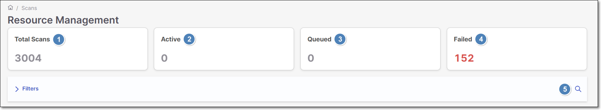
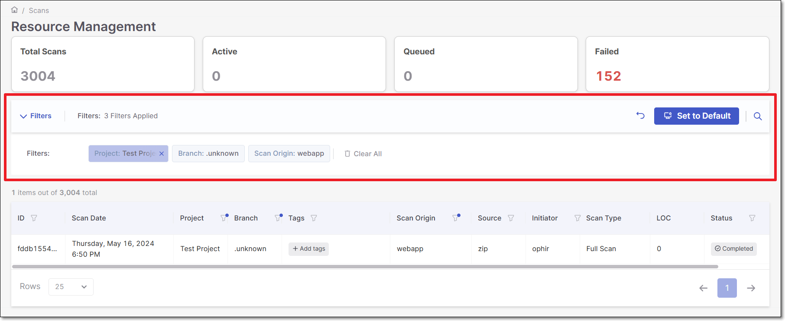
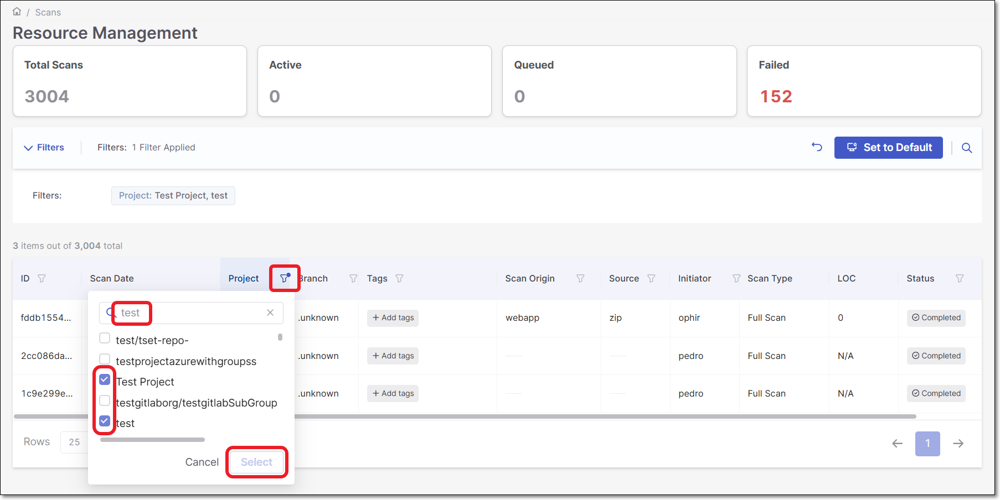
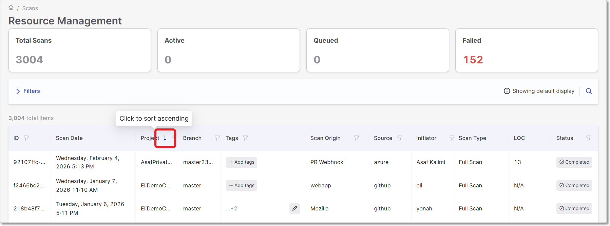
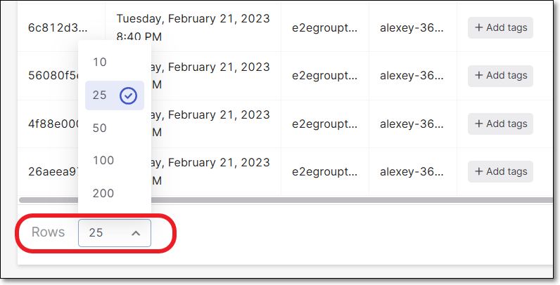
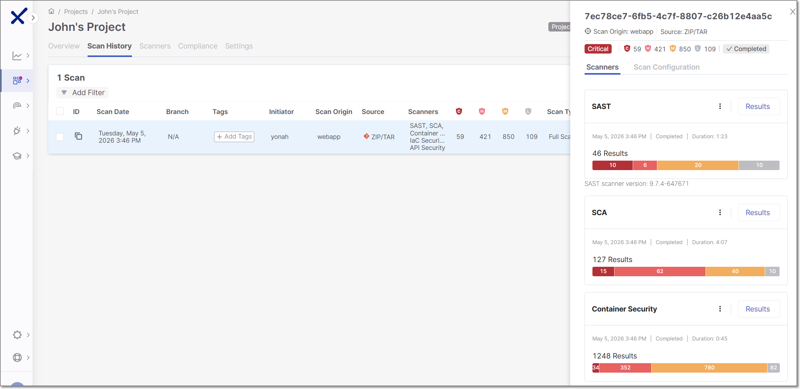

# Scans

The **Scans** page displays the scan history of **Projects** and **Applications** for the **Checkmarx One** tenant. A Group or Team Lead can obtain an overview of the risk to a project or feature in its entirety.

To view the **Scans** history, in the main menu, click on **Resource Management > Scans**.

The following table describes the information shown for each scan.

| **Column** | **Description** |
|---|---|
| **ID** | The system generated, unique identity, of the project or feature scanned. |
| **Scan Date** | The `day`, `date` and `time` when the scan was run. |
| **Project** | The name of the project or feature that was scanned. |
| **Branch** | The branch that was scanned for a specific project. |
| **Tags** | The tags specific to Scan Management. Providing these distinguishing tags is useful for filtering information. A specific scan can be tagged, which ensures that it is easily found when filtered. |
| **Scan Origin** | The scanned project location. |
| **Source** | This parameter indicates how the project is uploaded onto the system to be scanned. It can be a repository, such as **GitHub**, or a zipped file. |
| **Initiator** | The username of the individual who invoked the scan. |
| **Scan Type** | There are two types of scans, **Full Scan** and **Incremental Scan**. • **Full Scan** scans all the files in the project. • **Incremental Scan** can only be run once an initial **Full Scan** has been completed. When a developer adds code to the original file and only wants to scan the new data, an incremental scan can be run. The system will calculate if the new source code is less than 7% of the data and will run an incremental scan. Even if a developer selects the **Incremental** checkbox and the new source code is more than 7%, a full scan will run. This feature saves time when scanning for vulnerabilities in large projects. |
| **LOC** (Lines of Code) | Presents the number of lines of code that were included in the last scan. This feature is essential for users seeking a comprehensive view of their scans, enabling them to promptly spot gaps or missing data, ensuring a thorough analysis. CxOne Scan History LOC total is a summary of both SAST & IaCS scans. |
| **Status** | The scan status. For example, **Active** when a scan is running, **Failed** if an error occurs and the scan cannot continue, **Completed** if the scan is successful and **Queued** if the scan is waiting to be run. |

## Filtering and Sorting the Scans Table

The scans table can be filtered and sorted to display the relevant scans for your view in the correct order. By default, the scans table is sorted in descending order by the date of the scan.

### Quick Filtering

You can quickly filter the scans in the table to display only the selected scan status by clicking on the corresponding box at the top of the page or by performing a search.

<figure><figcaption></figcaption></figure>

1. **Total Scans** - The default view that displays all of the scans in the system.
2. **Active** - Displays the scans that are currently running.
3. **Queued** - The scans that are waiting to run, once previously executed scans are complete.
4. **Failed** - The scans that have failed and stopped running.
5. **Search** - Enter a search value. The table will be populated only by scans that match the search value.

### Filters Bar

The Filters bar is used to view and manage all of the filters applied to the table. When filters are applied, a description is shown on the bar indicating the number of filters applied.

<figure><figcaption></figcaption></figure>

**To manage the Filters bar:**

1. Click on the **Filters** bar to expand and show the applied filters.
2. If you would like to remove one of the applied filters, hover over the filter and click the **X**, or click on **Clear All** to remove all of the applied filters.
3. Click on the **Set to Default** button if you would like to set the applied filters as the default.
4. Click on the **Revert** icon to return to the default view.

### Filtering the Table

**To filter the table:**

1. Click on the filter icon on the column header desired for filtering.

   A dropdown list appears.
2. Select one or more checkboxes for the relevant filter. You can use the search box to search for a specific filter.
3. Click Select.

   The filters are applied to the table, and a blue dot indicator is added to the filter icon in the column header.

   <figure><figcaption></figcaption></figure>

The following columns support filtering:

- ID
- Project
- Branch
- Tags
- Scan Origin
- Source
- Initiator
- Status

### Sorting the Table

**To sort the table:**

1. Hover over the column header desired for sorting.

   The sorting arrow is displayed.
2. Hovering over the arrow will display a tooltip describing the order (Ascending / Descending) that the table will be sorted.
3. Click on the Arrow to apply the sorting.

   The sorting is applied, and the column header displays the arrow pointing in the direction of the sorting (Up = Ascending, Down = Descending).

   <figure><figcaption></figcaption></figure>

The following columns support sorting:

- Scan Date
- Project
- Branch
- Scan Origin
- Initiator
- Status

## Pagination

The **Rows** field indicates the number of scans that are displayed on the page. The default is 25.

**To select the number of scans displayed on the page:**

1. Click on the **Rows** field.

   A dropdown with row selections appears. Available options: 10, 25 (default), 50, 100, 200.
2. Select the number of scans to view per page.

   <figure><figcaption></figcaption></figure>

   The number of scans displayed on the page will change according to the selection made.

### Viewing the Scan Overview (Side Panel)

Click a scan to open the **Scan Overview** pane on the right side of the screen. which provides access to scan results, logs, and detailed analysis tools.

<figure><figcaption></figcaption></figure>

At the top of the pane, the following information is displayed:

- **Scan id**: the unique identifier of the scan (shown in bold).
- **Scan origin**: the platform used to initiate the scan.
- **Source**: the type of source code that was scanned.
- **Risk level**: The overall risk level of the scanned source.
- **Vulnerabilities**: A breakdown of vulnerabilities identified in the scan, categorized by severity.
- **Scan status**: The current status of the scan, e.g. completed.

Below this section, the pane is divided into two tabs: **Scanners** and **Scan Configuration**

#### Scanners Tab

The **Scanners** tab displays a card for each scanner included in the scan. Each card provides the following information and actions:

- **Scanner name**
- **Results**: Opens the scanner's results viewer.
- **More options** ( **menu**):

  - **Download logs** (SAST only): Exports detailed scan execution logs for troubleshooting and analysis.
  - **More details**: Displays a high-level timeline of the scan process.
  - **Audit Scan** (supported for SAST, IaC Security and Secret Detection scanners): Opens an audit session with a query editor for reviewing and analyzing scan results. For more information, see [SAST Query Editor](sast-query-editor/README.md), [IaC Security Query Editor](iac-security-query-editor.md) or [Secret Detection Query Editor](secret-detection-query-editor.md).
- **Scan date**
- **Scanner status** (for example, *Completed*)
- **Duration**: - The total time the scan took to complete.
- **Vulnerability bar**: A color-coded bar showing the number of vulnerabilities by severity.

#### Scan Configuration Tab

The **Scan Configuration** tab displays a detailed list of the configurations applied during the scan, organized by configuration type and indicating their origin—whether inherited from the environment, tenant, or project level, or defined directly at the scan level.
