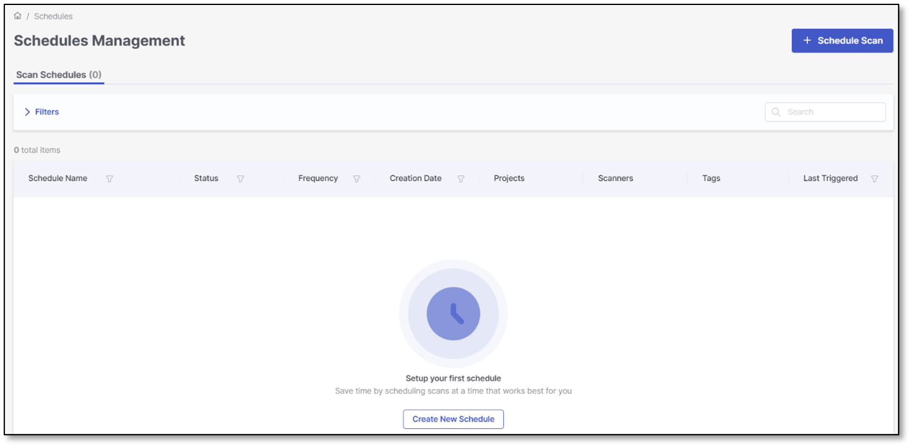
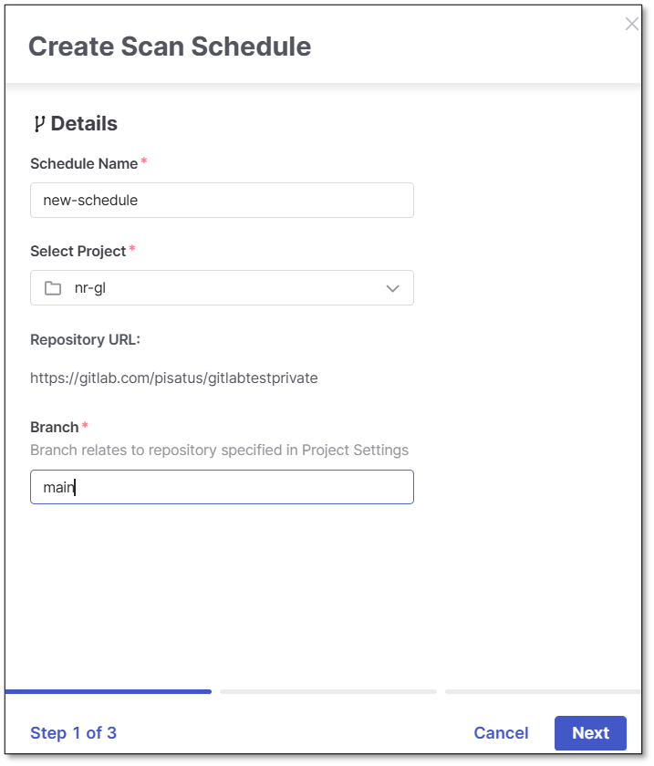
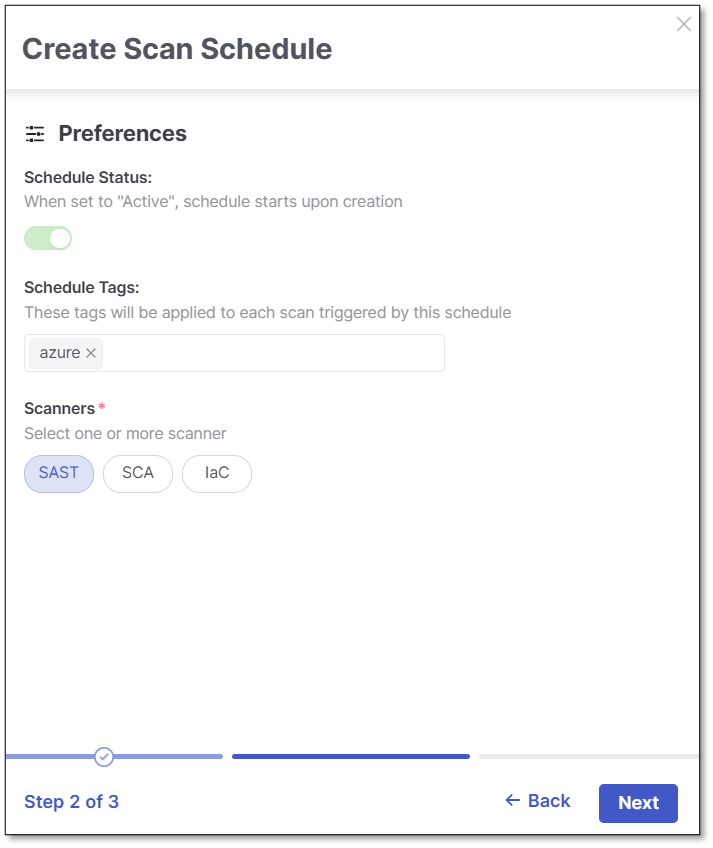
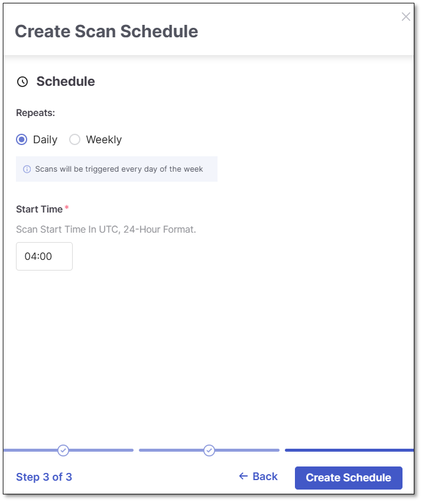

# Scheduling Scans

The Scheduled Scans feature allows you to configure and manage automated scan schedules for your projects. By enabling scheduled scans, you can ensure your code is analyzed regularly without manual intervention, improving security coverage, increasing efficiency, and reducing the risk of missing vulnerabilities.

Scheduled scans work across the full range of Code Repository Integration project types, so teams get consistent, automated scan coverage across their entire project portfolio regardless of how a project was imported.

## How It Works

Scheduled scans can be configured for both new and existing projects. Once a schedule is created, the system automatically triggers scans based on the frequency you define. For each project, one schedule can be set up and you can search, edit, or delete them when needed.

## Prerequisites (IAM1)

Before creating or managing scheduled scans, ensure that the following IAM1 requirements are met:

- **Tenant-level assignment** – Grants access to schedules and projects at the tenant level.
- **Explicit project assignment** – Ensures the user has access to the specific project.
- **Required permissions**:

  - `view-schedule-scan`
  - `view-project`
  - `view-project-params` (required for accessing the repository URL)

## Permissions Overview

The platform uses IAM1-based access controls. However, there are temporary differences between the UI and API behavior in Phase 1:

| Access type | Requirements |
|---|---|
| UI Page Visibility | Requires tenant-level assignment and the following permissions: • `view-schedule-scan` • `view-project` • `view-project-params` |
| API Access (Schedules) | Requires `view-schedule-scan` only. Tenant-level assignment is not enforced in Phase 1. |


This behavior is temporary. In Phase 2, both API and UI access will be fully aligned with IAM1 logic to ensure consistent enforcement of tenant-level assignment and permissions.


## Behavior Differences: UI vs API

During Phase 1, there is a deviation between how permissions are applied in the UI and API:

- **UI**: Enforces tenant-level assignment and requires explicit project access along with multiple permissions.
- **API**: Allows users with the view-schedule-scan permission to access schedules even if tenant-level assignment is missing.

This temporary relaxation on the API side was introduced to accelerate delivery and support migration scenarios. Full IAM1 alignment will be implemented in Phase 2.

## Schedules Management Page

Navigate to **Resource Management → Schedules Management** to view and manage all scheduled scans.

The page displays a grid listing all existing scan schedules and provides quick access to search, sort, and filter options. You can search by the **Schedule Name** parameter to quickly locate specific schedules.

The grid includes the following columns:

| Column | Description |
|---|---|
| **Schedule Name** | The name of the scheduled scan. Long names are automatically truncated in the list but can be fully viewed and edited in the details view. |
| **Status** | Indicates whether the schedule is Active or Inactive. Active schedules will run automatically based on the configured frequency. |
| **Frequency** | Displays how often the scan runs. Options include Daily or Weekly. Frequency can be configured when creating or editing a schedule. |
| **Creation Date** | The date and time when the schedule was created. This column supports sorting to help you identify recently added or older schedules quickly. |
| **Projects** | Displays the associated project(s) for the schedule. Hovering or expanding the link shows the full project name. |
| **Scanners** | Lists the scanners included in the schedule, such as SAST, SCA, or IaC. If multiple scanners are selected, a “+X” indicator shows the count of additional scanners. |
| **Tags** | Displays tags applied to scans triggered by this schedule. These tags are included in scan results and reports.  Tags are **not** used for filtering schedules.  |
| **Last Triggered** | Shows the most recent date and time when the schedule triggered a scan. This column supports sorting to quickly identify the latest or oldest runs. |

### Sortable Columns

The following columns support sorting for better schedule management:

- Schedule Name
- Status
- Frequency
- Creation Date
- Last Triggered

## Creating a Scheduled Scan

Click **+ Schedule Scan** in the top-right corner to open the Create Scan Schedule wizard. The workflow consists of three steps:

### Step 1. Details

- **Schedule Name** (required): Enter a descriptive name.
- **Select Project** (required): Choose the project associated with this schedule.

  
  As a precondition, the project must include a **repository URL**. This covers any project brought in through Code Repository Integration, regardless of how it was originally imported.
  
- **Branch** (required): Specify the repository branch to scan.

### Step 2. Preferences

- **Schedule Status** (default: Active): In Phase 1, the schedule is automatically active upon creation and cannot be disabled at this stage.
- **Schedule Tags** (optional): Tags are applied to scans triggered by this schedule and appear in scan results. Tags are for tracking purposes only and cannot be used to filter schedules in the grid.
- **Scanners** (required): Select one or more scanners. The following scanners are available: SAST, SCA, IaC.

The **Next** button becomes active once at least one scanner is selected.

### Step 3. Schedule

- **Frequency Options**: Define how often the scan should run:

  - **Daily** – Runs once per day at the configured time.
  - **Weekly** – Runs on a specified day of the week and time.

Once configured, the scan will automatically trigger based on the selected schedule.


All scheduled scan times are based on the **UTC time format**. Make sure to adjust the configured time accordingly if you are in a different time zone.



There is **always** a delay of **up to 15 minutes** before a scheduled scan begins. This delay helps prevent system overload when multiple scans are scheduled at the same time.


## Editing and Deleting Schedules

You can manage existing schedules from the **Schedules Management** grid via the three-dot menu next to each schedule.

To edit a schedule, select the **Edit** option from the menu next to it. You can update the schedule name, branch, tags, scanners, and frequency. You can also disable the schedule by turning off its status if you no longer want it to run automatically.

To remove a schedule, select the **Delete** option. This permanently deletes the schedule, but all historical scan results remain available.
