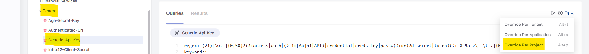
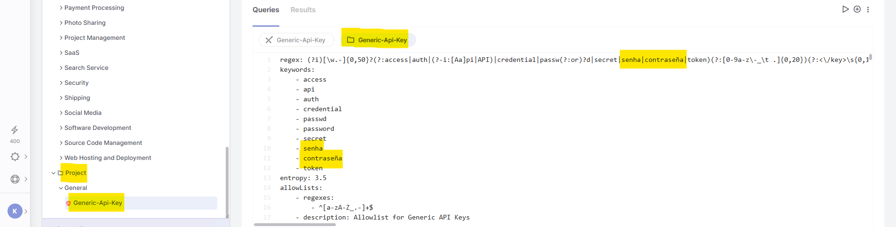

# Secret Detection Query Editor

Default secret detection rules provide solid coverage for common credential types and are effective in many cases. However, some environments use internal tokens, custom formats, or organization-specific conventions that require more precise detection logic.

The Secret Detection Query Editor lets you extend and refine this detection. It allows you to adjust existing rules or define new ones so secret scanning aligns more closely with your codebase, authentication patterns, and security requirements.

By using the Secret Detection Query Editor, you can:

- Detect internal and proprietary secrets that would otherwise go unnoticed
- Reduce false positives by tailoring detection logic and scope
- Enforce consistent security policies across projects, applications, and tenants

This results in higher detection accuracy, lower noise, and stronger organizational control over secret scanning.

## Accessing the Secret Detection Query Editor

To access the Secret Detection Query Editor, proceed as follows:

1. Go to **Workspace > Projects**.
2. Hover above a project that was scanned with the Secret Detection scanner.
3. Click ⋮ to open a drop-down menu.
4. Select **Query Editor**.
5. The Query Editor opens.

## Understanding the Editor Layout

The Query Editor is split into two areas:

- **Left side**: a navigation pane with sections
- **Right side**: the main workspace with panels

### Navigation pane

The left side is used for navigation and selection. It contains sections for:

- **Project Files** – Browse scanned files and open them for reference. You can open multiple files simultaneously in separate tabs.
- **Query Browser** – Browse and select secret detection queries
- **Results Browser** – View results from executed queries

### Workspace panels

The right side is where you view and work with content:

- **Source Code panel** – Shows the selected file
- **Query Editor panel** – Displays or edits the selected query
- **Results panel** – Shows findings from the last run

## Running a Query

When you first open the Audit page, the **Results** tab is blank. It remains empty until you run a query that returns results with vulnerabilities in the project code.

To run a query, do the following:

1. Select the **Queries** tab and the query from the hierarchy you want to run on the project, then click **Run Query**.
2. After the query completes, the **Results** tab is displayed in one of the following modes:

   - If no results are found, a **0** is displayed after the query's name, and the `No results found` message is shown in the first line of the **Results** sub-tab.
   - If results are found, the results are displayed grouped by file (or page) name and line number.

## Customizing Queries by Scope

Queries can be customized by creating overrides at different scopes. Overrides replace the query logic defined at broader levels and allow you to adapt Secret Detection to specific projects, applications, or the entire tenant.

When multiple versions of the same query exist, precedence is applied from the most specific scope to the broadest:

- **Project** overrides **Application**
- **Application** overrides **Tenant**
- **Tenant** overrides the **default query**

If a project-level override exists, it is always used for that project, even if application- or tenant-level overrides are defined. If no override exists at any scope, the default query is applied.


Project-level overrides are only available when the project belongs to a single application. If a project is associated with more than one application, the Project scope is not available.


To create an override query:

1. Select a query in the Query Browser.
2. Right-click the query source code.
3. Choose the override scope:

   - **Tenant** – applies to all applications and projects in the tenant
   - **Application** – applies to all projects within the application
   - **Project** – applies only to the current project
4. Modify the copied query logic as needed (for example, adding a new regex pattern or adjusting entropy thresholds).
5. Save the override query.
6. Click **Run Query** to validate the changes.

## Creating a New Secret Detection Query

You can create new queries to detect secret types that are not covered by the default rule set.

To create a new query, proceed as follows:

1. In the Query Browser toolbar, select **Add New Query**.
2. Fill out the query properties:

   - Query Name
   - Severity
   - Secret Type
   - Description
3. Write the query logic (regex, context rules, entropy checks).
4. Save the query.

The new query appears under the selected Secret Type category and is immediately available for execution and enforcement.

## Changing the Severity of a Query

You can adjust the severity of custom or override queries to align with internal risk policies.

To change severity:

1. Open the custom or override query.
2. Click **Edit Properties**.
3. Select a new value from the **Severity** dropdown.
4. Save the changes.
5. Re-run the query to see updated severity levels in the results.

## Adding Custom Keywords for Hardcoded Secret Detection

Hardcoded passwords and similar credentials are detected by the **Generic API Key** rule, which acts as a catch-all heuristic designed to identify unknown or unstructured secrets, that is, values that don't match a specific provider pattern (such as AWS keys) but still resemble credentials. The detection logic relies on a combination of three signals:

- Keyword-based context (for example, variable or field names that suggest a credential)
- Secret-like values matched through regex patterns
- Entropy analysis (a measure of how random or high-complexity a value looks)

A secret is flagged only when all three signals are present together.

Because this rule is generalized to catch a wide range of unstructured secrets, its keyword list is intentionally limited to common terms. It does not attempt to cover every naming convention, abbreviation, or language used across different codebases and organizations.


Modifying the rule carries a meaningful risk of increasing either false positives or false negatives, which is why the default rule remains unchanged out of the box.


The default keyword set may not recognize variable or field names that use different terminology than the built-in defaults - for example, internal naming conventions, project-specific abbreviations, or terms in a language other than the one the default rules were written for. In those cases, a hardcoded secret could go undetected simply because the surrounding context doesn't match a recognized keyword, even though the value itself looks like a credential.

### Adding custom keywords

The Secret Detection Query Editor lets you customize detection rules to better fit your specific projects or tenant environment. You can extend the keyword list used by the **Generic API Key** rule to include any additional terms relevant to your codebase, whatever naming conventions, abbreviations, or terminology your teams actually use.

To add custom keywords:

1. Open the Query Editor for the relevant project.
2. In the Query Browser, locate the default `Generic-API-Key` query.
3. Create an override of the query at the appropriate scope.

   
4. In the override, add the desired terms to the regex and keyword fields.

   
5. Save the configuration.
6. Click **Run Query** to validate the changes.

Once saved, subsequent scans will recognize the newly added keywords and flag hardcoded secrets associated with them.
