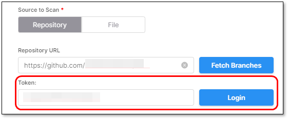
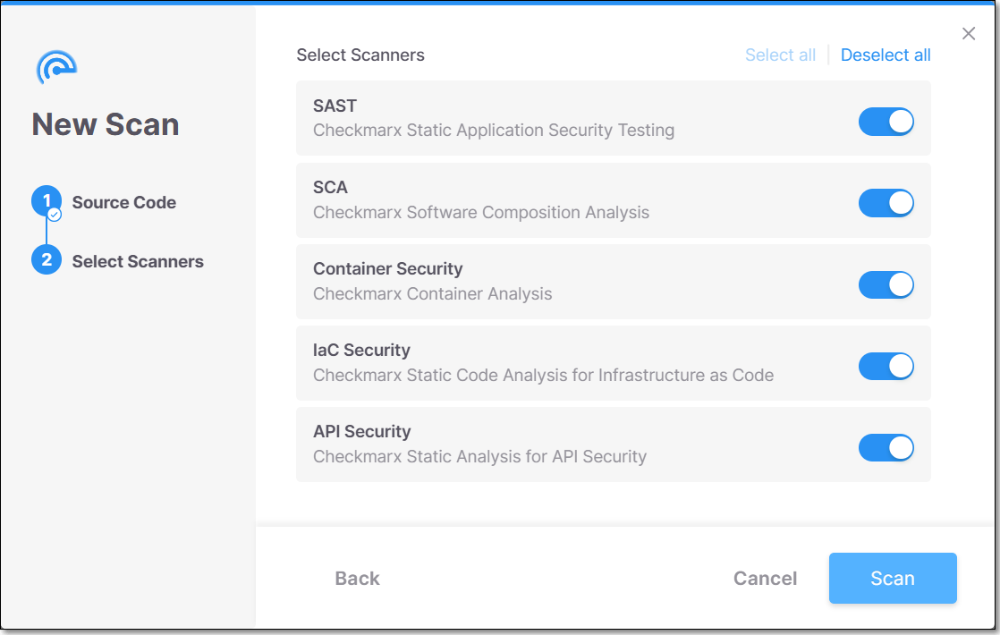
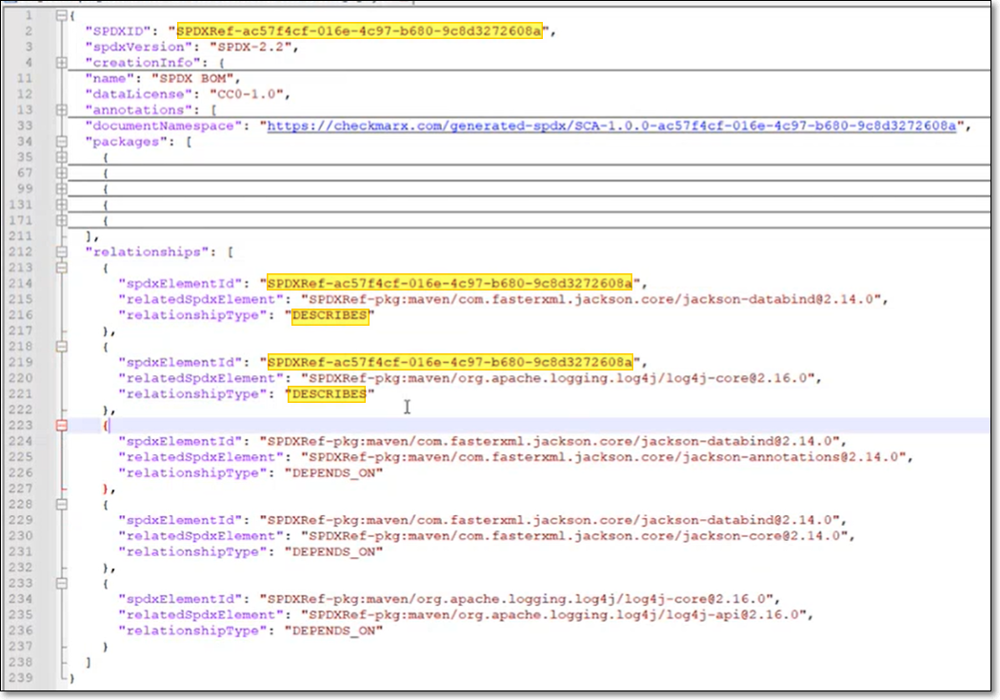

# Scanning Projects

Once a project is configured, you can run a scan within that project. Each time a scan is executed, the source code is uploaded as part of the scanning procedure.

There are 2 options to perform a scan:

- Upload the source code in a **zip** or **tar** file
- Scan a **repository path** - GitHub, GitLab, Bitbucket, Azure DevOps.

When scanning a repository, it is necessary to specify which branch of the project is being scanned.

You can also add tags to the scan. Tags are very useful for project filtering purposes.

Tagging has no dependencies in any other component, and it is possible to configure any required value.

## Running a Scan


Initiating a scan is possible only within an existing project.


There are three options scanning a project:

- Scan the source code from a repository URL.
- Scan the source code from a ZIP or TAR archive.
- Scan an SBOM of your project (supported only for SCA scanner).


When a scan is run using multiple scanners, all scanners run in parallel.

When multiple scans are run in your account, the number of concurrent scans is specified in your account's license. This info is available under **Account Settings** > **License** > **License Plan Summary**. When the limit is exceeded, the scans are added to a queue which runs on a "first in first out" basis.


### Running a Scan on a ZIP or TAR Archive


The maximum supported upload size is **6 GB** per compressed archive (ZIP or TAR). This limit applies to the archive file itself before extraction.


1. On the **Application and Projects** home page select the **Projects** tab.
2. Hover over the row of the project that you would like to scan, click on the Scan icon .

   <figure><figcaption></figcaption></figure>

   The **New Scan** window opens. By default, under **Project Name**, the project of the row in which you clicked the Scan icon is selected.

   <figure><figcaption></figcaption></figure>

   
   If you would like to scan a different project, it is possible to select it from the drop-down menu.
   
3. In the **Source to Scan** section, **File** is selected by default. In the box below, either drag a file into the box or click on **Select File** and navigate to the relevant file.

   <figure><figcaption></figcaption></figure>
4. In the **Branch** field you can specify the name of the branch of the project. (Optional)
5. In the **Scan Tags** field you can add tags to the scan. (Optional)

   Tags can be added in two different formats:

   - **Label:** \<string>
   - **key:value:** \<key string:value string>
6. Select the checkbox next to **Incremental Scan**, if you want to scan only the latest changes and not the entire project. For additional information on Incremental scans, refer to [Incremental Scans (SAST Scanner)](#incremental-scans).

   
   This option is relevant only for **SAST** and **API Security** scanners.
   
7. Click **Next**.
8. Select one or more scanners.

   <figure><figcaption></figcaption></figure>

   
   If you select **API Security**, **SAST** must be selected as well because API Security utilizes the SAST code to detect APIs.
   
9. Click **Scan**.

   The **New Scan** dialog closes and the scan starts.
10. You can monitor the scan's status in the Projects tab when hovering over the project.

    <figure><figcaption></figcaption></figure>

### Running a Scan on a Repository URL

1. On the **Application and Projects** home page select the **Projects** tab.
2. Hover over the row of the project that you would like to scan, click on the Scan icon .

   <figure><figcaption></figcaption></figure>

   The **New Scan** window opens. By default, under **Project Name**, the project of the row in which you clicked the Scan icon is selected.

   <figure><figcaption></figcaption></figure>

   
   If you would like to scan a different project, it is possible to select it from the drop-down menu.
   
3. In the **Source to Scan** section, click on the **Repository** tab.
4. In the **Repository URL** field, enter the URL of the repo that you would like to scan.
5. Click **Fetch Branches**.

   <figure><figcaption></figcaption></figure>

   If the repo is public, you will get a confirmation that it has **Connected Successfully**. If it is a private repo, then the **Token** field will be shown.
6. For private repos, in the **Token** field, enter your Personal Access Token (PAT) for the registry and click **Login**.

   <figure><figcaption></figcaption></figure>
7. In the **Branch** field, select from the drop-down list the branch that you would like to scan.
8. In the **Scan Tags** field you can add tags to the scan. (Optional)

   Tags can be added in two different formats:

   - **Label:** \<string>
   - **key:value:** \<key string:value string>
9. Select the checkbox next to **Incremental Scan**, if you want to scan only the latest changes and not the entire project. For additional information on Incremental scans, refer to [Incremental Scans (SAST Scanner)](#incremental-scans).

   
   This option is relevant only for **SAST** and **API Security** scanners.
   
10. Select the checkbox next to **Save as default repository for the project** if you would like to save this URL for use in future scans of the project.
11. Click **Next**.
12. Select one or more scanners.

    <figure><figcaption></figcaption></figure>

    
    If you select **API Security**, **SAST** must be selected as well because API Security utilizes the SAST code to detect APIs.
    
13. Click **Scan**.

    The **New Scan** dialog closes and the scan starts.
14. You can monitor the scan's status in the Projects tab when hovering over the project.

    <figure><figcaption></figcaption></figure>

### Running a Scan on an SBOM

You can run an SCA scan on an SBOM file. The scan is run as a Checkmarx One project, with the source specified as an SBOM file. The SCA scanner returns comprehensive results of all risks associated with your open source packages. This enables customers who don’t want to submit their actual code, to obtain comprehensive SCA results for their project and manage the remediation via Checkmarx One.

SBOM scans can be run from the UI as well as via CLI or [REST API](https://checkmarx.stoplight.io/docs/checkmarx-one-api-reference-guide/branches/main/3zac73jdvh6e8-scans-service-rest-api#scanning-from-an-sbom-for-sca).

For complete documentation on SBOM scanning, see [Scanning SBOMs](../../scanners/sca-scanner/scanning-sboms.md)


This capability is distinct from the capability to analyze an SBOM using the POST /analysis/requests API. The new method shows SCA results in the context of an actual Checkmarx One project, as opposed to just returning a report with the enriched SBOM data.


#### Limitations

- Only the SCA scanner can run on an SBOM
- Supported upload formats CycloneDX (v1.0-1.7) and SPDX (v2.3)
- Can only run on a “manual” project (not a code repository integration)
- It is mandatory to include the Package URL (purl) for each package in the SBOM. For more information about purl syntax, see [here](https://spdx.github.io/spdx-spec/v3.0/model/Software/Properties/packageUrl/).

##### SPDX Requirements

For SPDX, it is important to indicate in the SBOM which packages are "direct". This is done by designating the relationship DESCRIBES or DEPENDS_ON for the SPDXID of the main component of the SBOM. If not specified, all packages will be shown as "direct".

<details>

<summary>Example</summary>



</details>

#### SBOM Scan Procedure

1. On the **Application and Projects** home page select the **Projects** tab.
2. Hover over the row of the project that you would like to scan, click on the Scan icon .

   <figure><figcaption></figcaption></figure>

   The **New Scan** window opens. By default, under **Project Name**, the project of the row in which you clicked the Scan icon is selected.

   <figure><figcaption></figcaption></figure>

   
   If you would like to scan a different project, it is possible to select it from the drop-down menu.
   
3. In the **Source to Scan** section, select **SBOM**.
4. In the box below, either drag a file into the box or click on **Select File** and navigate to the relevant file.

   <figure><figcaption></figcaption></figure>
5. In the **Branch** field you can specify the name of the branch of the project. (Optional)
6. In the **Scan Tags** field you can add tags to the scan. (Optional)

   Tags can be added in two different formats:

   - **Label:** \<string>
   - **key:value:** \<key string:value string>
7. Click **Next**.
8. The SCA scanner is the only selected scanner because it is the only one supported when scanning SBOMs.

   <figure><figcaption></figcaption></figure>
9. Click **Scan**.

   The **New Scan** dialog closes and the scan starts.
10. You can monitor the scan's status in the Projects tab when hovering over the project.

    <figure><figcaption></figcaption></figure>

## Incremental Scans

### Definition


Incremental scans are relevant only for the SAST scanner.


An incremental scan is a mechanism to scan a small portion of code to deliver fast results. This mechanism scans only the code changed from the ***last full scan*** and any code close to it (called "closure").


With every incremental scan, the changes from the last full scan are accumulated.


### How does it work?

The results of every incremental scan are merged with its base full scan to provide a complete result set for the whole code. To understand the merge, we need to understand the different types of results. In the diagram below, only the "Changed files" and the "Closure files" are scanned by the incremental scan.

Each black line represents one result, flowing through several nodes:

<figure><figcaption></figcaption></figure>

- **A** – All of the result nodes are inside the changed files. New results like this returned from an incremental scan are "good results" that the total scan is expected to find.
- **B** – All of the result nodes are inside the closure files. New results like this returned from an incremental scan are "bad results" because these files weren't changed, so there cannot be a new result here. These result types are removed because they are filtered in the incremental scan, and the remaining results are those in at least one of their nodes inside the changed files (A, D)**.**
- **C** – All of the result nodes are outside the closure files. The incremental scan cannot find these because these files are not scanned. The last full scan results are merged with the incremental scan results and shown as "recurrent.”
- **D** – The result nodes are inside both the changed and closure files. New results returned from an incremental scan are "good results" that the incremental scan is expected to find.
- **E** – The result nodes are both inside and outside the closure files. The incremental scan cannot find this kind of result because some result files are not scanned. The last full scan results are merged with the incremental scan results and shown as "recurrent.”
- **F** - The result nodes are inside the changed files, the closure files, and the closure files. The incremental scan cannot find this kind of result because some result files are not scanned. The last full scan results are merged with the incremental scan results and shown as "recurrent.”

### Adjusting the Incremental Scan Threshold

You can adjust the incremental scan threshold at the tenant and project levels in the **Account Settings** and **Project Settings** pages. The variable range is 0.5% to 10% with increments of 0.5%. The increment threshold at the tenant level applies to all projects in the tenant unless adjusted otherwise and overridden by a specific project's **Project Settings**.

To adjust the threshold at the **Tenant** level:

1. Navigate to  then **Global Settings** to open the **Account Settings** page.
2. Select **SAST** to open its list of default parameters.
3. Select the threshold in the dropdown beneath **Incremental threshold**.
4. Click **Save** when done.

To adjust the threshold at the **Project** level:

1. Click the  at the end of a project's row.
2. Select **Project Settings**.
3. Navigate to **Rules**.
4. Click **+ Add Rule**.
5. Adjust the rule where the scanner is **SAST**, the parameter is **Incremental threshold**, and the increment threshold amount.
6. Click **Save** when done.

### Running Incremental Scans

There are several ways to run an incremental scan. The following are some of the possible methods.

- **Project Settings** - Go to **Project Settings** > **Rules** and create a **Rule** for the SAST scanner to run incremental scans. You can set whether or not this setting can be overridden when running an individual scan.
- **Running a scan** - When manually initiating a scan of a Project, you can mark the **Incremental scan** checkbox.
- **CLI** - When running the `scan create` command from the CLI, you can add the flag `--sast-incremental=true` to run an incremental scan.
- **API** - When running POST /scans, set the config value for sast scans to "incremental":"true".
- **IDE** - When a scan is initiated from the IDE (as described [here](https://docs.checkmarx.com/en/34965-68743-using-the-checkmarx-vs-code-extension---checkmarx-one-results.html#UUID-f6ae9b23-44c8-fcf3-bef2-7b136b9001a1_section-idm33333879576856)), it automatically runs as an incremental scan.

### Limitations

- Incremental scans are only relevant for the SAST scanner. All other scanners always run full scans.
- An incremental scan can only run if the project has at least one completed full scan.
- By default, the threshold is 7% unless configured otherwise.
- Any scan breaching the threshold is converted to a full scan.

### Incremental Scans of Branches

When working with branches within Checkmarx GitHub Integration, if you open a pull request to merge into the master branch, you could run a faster incremental scan instead of a longer full scan.

It is recommended to meet the following before running an incremental scan:

- Always have the base branch (master) run a full scan (preferably after every commit)
- Before every commit made to a pull request, rebase and merge from the base branch (master) to your branch


Incremental scans are most effective when the pull request source branch (master) is up-to-date with the pull request branch, and regular full scans are performed on the base branch (master) for accuracy. The existing logic prioritizes the most recent full scan in the two branches.


You can enable incremental scans for branches (API) by performing the following:

1. Access **Account Settings**.
2. Navigate to **SAST**.
3. Select **Incremental in branch (API)**.

   <figure><figcaption></figcaption></figure>
4. Change the value from **false** (default) to **true**.

#### API

- POST api/scans

  - in sast config payload, send a value for baseBranch (no changes needed)

    ```
    "config":[{"type":"sast","value":{"incremental":"true","baseBranch":"master"}}]
    ```

## Empty Scans - SAST Scanner

Checkmarx One has Improved the accuracy and visibility for empty scans.

Checkmarx One has updated the way it handles scan status returned by SAST when no files are found to scan. When SAST identifies a scan with no files to scan, it returns a specific code that clearly indicates that the scan is empty because no files were found.

Checkmarx One treats such scans as successful. As a result, the status of each scan is represented more accurately, providing a reliable overview of the security status across all projects.

## Scan Limitations

### Limitation

- There is a **22M LOC** (Line of Code) limitation for repository/zip files scans. In case that the source file contains more than the limit permits we block the scan and an error message is displayed.
- There is a **5.5M LOC** (Line of Code) for IaC Security. This allows seamless integration and utilization of IaC Security LOC metrics in generating reports and applying the maximum LOC logic within both multi-tenant and single-tenant environments.
- The maximum supported upload size is **6 GB** per compressed archive (ZIP or TAR). This limit applies to the archive file itself before extraction.
- If a project contains a .git folder larger than **5 GB** it won't be included in the scan. This will not cause the scan to fail, but it may impact on certain functionality related to analyzing git history.
- The IaC Security scanner does not support scanning of minified files.
- Checkmarx One supports repositories clone using **SSH** and **HTTPS** protocols.

  - Cloning using **HTTPS** protocol:

    - If the repository is private a token needs to be provided.
    - If the code contains submodules, the submodules also need to use HTTPS.
    - If any of the submodules is private the same key needs to grant access to the private submodule.
    - Cloning will fail for projects that use relative paths.
    - For security reasons, no token will be sent to submodules on a different SCM.

      For example: scanning a GitHub repository with a GitLab submodule will only work if the submodule under GitLab is public.
  - Cloning using **SSH** protocol:

    - A key needs to be introduced to access the repository.
    - If the code contains submodules using SSH, the same SSH key needs to grant access to the submodules.
    - If the code contains submodules using HTTPS, they should be public.
- The sub-module's address in .gitmodules file contains 1 or more info like the one bellow. The URL part can be a **HTTPS** or **SSH**.

  ```
  [submudule "src/MongoDB"]
      path = src/MongoDB
      url = git@github.com:docker-library/mongo.git
  ```
- **Max Concurrent scans** per Checkmarx One environment - The amount of concurrent scans appears in Viewing License Info and Upgrading a License
- **Queued scans** - The amount of queued scans appears in Viewing License Info and Upgrading a License
- **API Security** currently supports **Java - Spring 2.x** and **C# - ASP.NET 4.x Web API** only.

### Error Message

In case that the below error message appears during the scan, it usually means that the scan was triggered using HTTPS but a SSH submodule was found. So, the scan needs to use SSH protocol instead of HTTPS.

fetch-sources clone 'branch' failed, provided value:master : error creating SSH agent: "SSH agent requested but SSH_AUTH_SOCK not-specified"

#### Workaround

Changing the submodule's address inside .gitmodules file to **HTTPS** format, resolves the issue, but generally the best and accepted solution would be to use **SSH**.

## In this section

- [Recalculating SCA Scan Results](recalculating-sca-scan-results/README.md)
- [Running SCS Scans](running-scs-scans.md)
