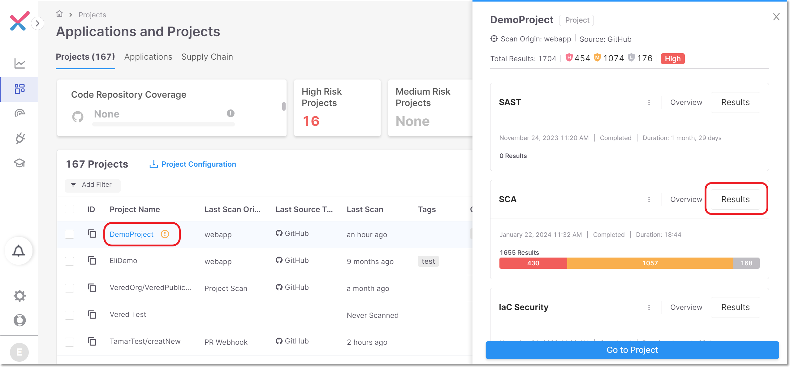
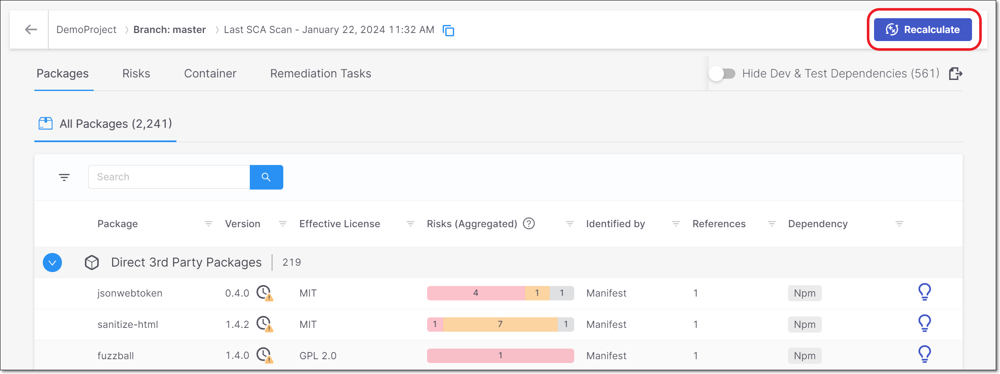

# Running Scan Recalculation

**To run scan recalculation for the SCA scanner:**

1. Navigate to the SCA **Results** for the desired project.

   
2. On the **SCA Results** screen, click on the **Recalculate** button in the header bar.

   

   When the recalculation is completed the results are shown as a new scan of the project.
