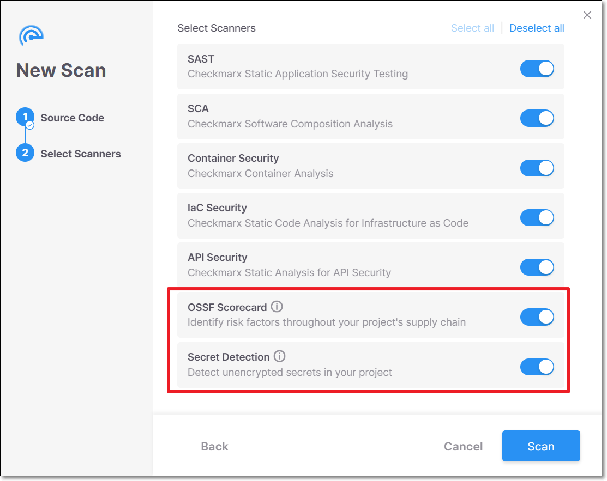
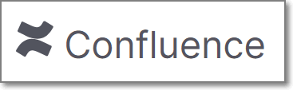
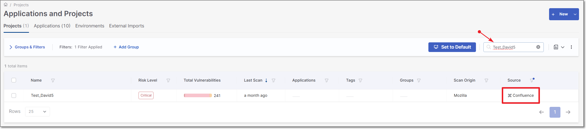
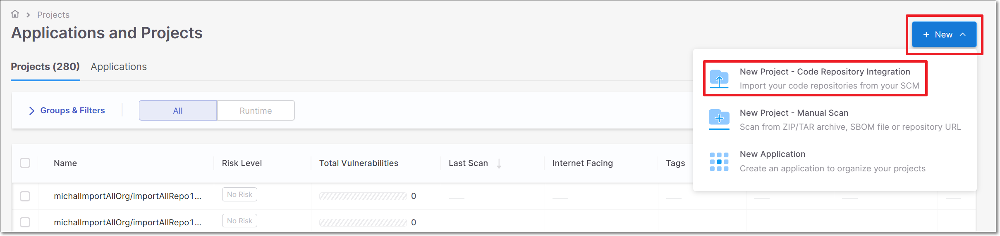
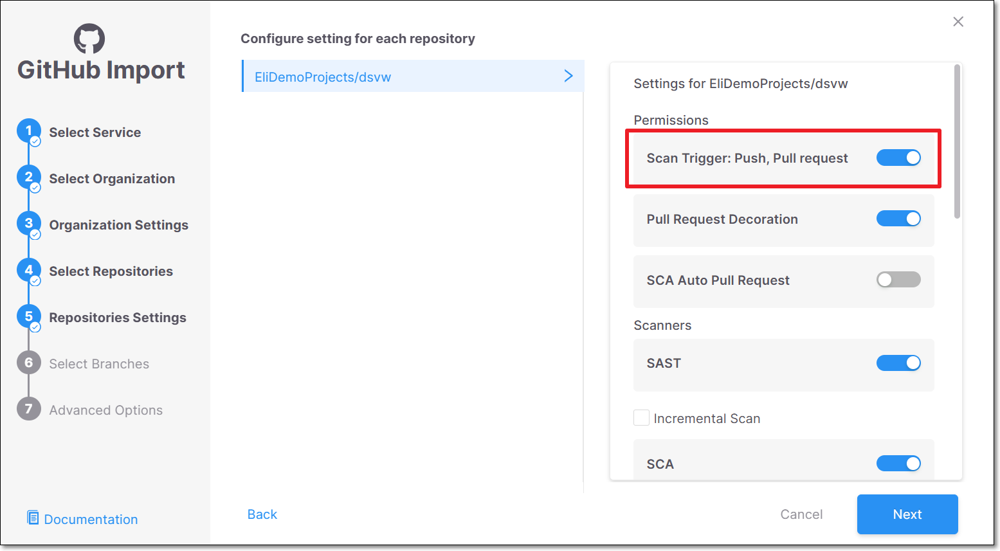
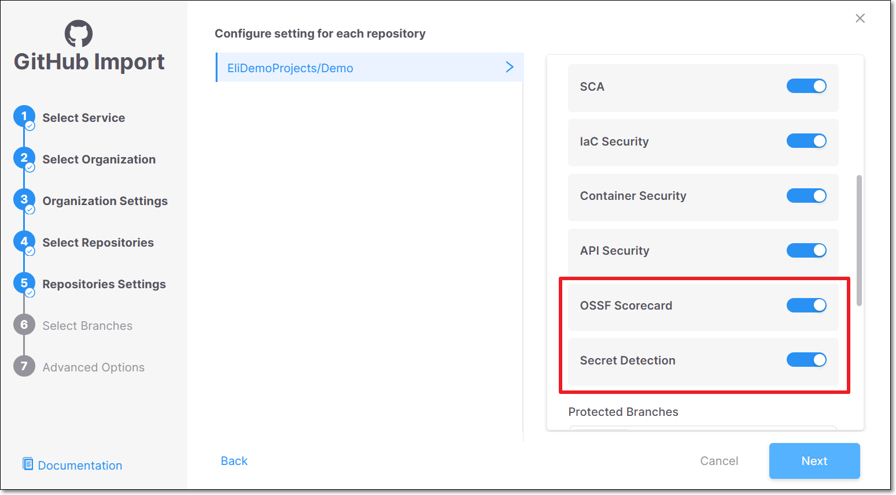

# Running SCS Scans

SCS scans can be run on your Checkmarx One projects via web application, CLI or REST API. In addition, Secret Detection scans can be run on a Confluence space **via REST API only**, as described below in [Running Secret Detection Scans of Confluence via REST API](#running-secret-detection-scans-of-confluence-via-rest-api).

## Running a Scan via the Web Application (UI)

When you run a scan on a project, a dialog opens enabling you to select which scanners will run. To run Secret Detection and Repository Health (OSSF Scorecard) scans, ensure that they are toggled on (default). OSSF Scorecard is supported only when scanning from a repo URL (as opposed to Secret Detection which is supported for scanning either a zip archive or a repo URL).

When you authenticate with your repo in the Source Code step of the scan creation, you need to submit a token with the permissions described in Prerequisites and you need to submit the URL in "http" format (not SSH) so that it authenticates using your access token.


OSSF Scorecard isn't shown when scanning from a zip file, because it isn't supported.



Running OSSF Scorecard scans from the web application (UI) is currently supported **only for private** repos. To run OSSF Scorecard scans on public repos you must initiate the scan via CLI or API, as described below.


<figure><figcaption></figcaption></figure>

## Running a Scan via the Checkmarx One CLI Tool

When running a scan via the CLI tool, you can now specify Software Supply Chain Security (SCS) as one of the scan engines to run. When running the Scorecard scanner, it is mandatory to submit the repo url and an access token with at least read permissions for that repo.

1. Prepare the command to run a scan, using the `scan create` command and specifying the project name, branch and zip file location or repository URL using the `--project-name` , `--branch` and `-s` flags. See [scan create](../../cli-tool/checkmarx-one-cli-commands/scan/scan-create.md)

   ```
   ./cx scan create --project-name <Project name> --branch <branch name> -s <path to zip archive>
   ```
2. By default, all licensed scanners are run, including SCS (assuming that all mandatory SCS parameters are specified). If you are using the `--scan-types` flag to specify the scanners that run, you need to explicitly include the `scs` scanner, e.g., `--scan-types sast,scs`.
3. By default, when scs is included, both Secret Detection and OSSF Scorecard are run. If you would like to run only one of these scanners, add the `--scs-engines` flag and specify the engine that you want to run: `secret-detection`, or `scorecard`.
4. When running the scorecard scanner, it is mandatory to add the following flags:

   - `--scs-repo-url <string>` - specifying the URL of the repo that you are scanning.

     
     Even when `-s` specifies a repo url, you still need to use this flag to submit the URL for the SCS scanner. This URL must be in "http" format (not SSH) so that it authenticates using your access token.
     
   - `--scs-repo-token <string>` - specifying a token with the permissions described in Prerequisites.

     
     This flag is required for both private and public repos.
     
5. If you would like to generate a scan report (optional), add the `--report-format` flag, specifying the desired format (e.g., `--report-format json`). For more information about scan reports, see [here](https://docs.checkmarx.com/en/34965-68643-scan.html#UUID-a0bb20d5-5182-3fb4-3da0-0e263344ffe7_section-idm4631465209593633552409907579).
6. Run the scan command.

   The following is an example of a command to run SAST on a zip archive and run Scorecard on the project's repo.

   ```
   user@laptop:~/ast-cli$ ./cx scan create -s . --branch master --project-name Test111 --scan-types sast,scs --scs-engines scorecard --scs-repo-url https://github.com/juice-shop/juice-shop --scs-repo-token <TOKEN> --report-format json
   ```

## Running a Scan via REST API

When running a scan using [POST /scans](https://checkmarx.stoplight.io/docs/checkmarx-one-api-reference-guide/i3mwd8u3zyoox-run-a-scan), you can now specify Software Supply Chain Security (SCS) as one of the scan engines to run. OSSF Scorecard is supported only when scanning from a repo URL. (Secret Detection is supported for scanning either a zip archive or a repo URL.)

When running POST /scans, in the "config" object specify "microengines" in the scanner "type" section and submit the "value" section indicating which of the scs scan engines to run: "scorecard" and/or "2ms".


There is no need to specify the repo url since that info is provided as part of the general "handler" object. In the "handler" object, make sure that you are using a token with the permissions described in Prerequisites and that the URL is in "http" format (not SSH) so that it authenticates using your access token.


The following is an example of the body for running an SCS scan using only the OSSF Scorecard scanner.

```
{"type":"git","handler":{"repoUrl":"https://github.com/k-tamura/easybuggy","branch":"master"},"project":{"id":"2be13e9a-88ea-431e-a276-010cb8f139b0","tags":{}},"config":[{"type":"microengines","value":{"scorecard":"true","2ms":"false"}}],"tags":{}}
```

### Running Secret Detection Scans of Confluence via REST API

You can now use [POST /api/scans](https://checkmarx.stoplight.io/docs/checkmarx-one-api-reference-guide/4fptcufpn3j9a-run-a-scan) to run a Secret Detection scan on your Confluence spaces. This capability is supported only for the Secret Detection scanner.

The scan scope can include all spaces accessible from a Confluence account, a specific space and all pages within it, or a specific page. Before running a scan, you must create a new Checkmarx One manual scan project. After the scan has completed, the project will be updated in the Web Application (UI), displaying the  icon in the source column of the project row.

Below is a workflow describing how to run a scan on a Confluence space and view results in the Secret Detection results viewer.

1. Create a new manual scan project - see [Manual Scan Projects](../managing-projects/creating-projects.md#manual-scan-projects).
2. Copy and save the new project ID.
3. Generate an API key in the account settings of your Confluence user. Copy and save the key.
4. Run a scan using [POST api/scans](https://checkmarx.stoplight.io/docs/checkmarx-one-api-reference-guide/branches/main/4fptcufpn3j9a-run-a-scan), submitting the project ID from step 2, the API key from step 3, and the required Confluence parameters. For complete instructions. see the API's documentation.
5. In the Checkmarx One Web Application (UI), navigate to the **Workspace** > **Projects** page, and search for your project by name.

   <figure><figcaption></figcaption></figure>
6. Hover over the  link and select the SCS scanner.

   The SCS Results Viewer is opened, displaying the project's Confluence scan results, See [Viewing Confluence Scan Results](../viewing-scan-results-in-the-results-viewers/secret-detection-results-viewer.md#viewing-confluence-scan-results).

## Code Repository Integrations

You can create a code repository integration that runs SCS scans automatically whenever a pull request or push event occurs in your repository.

**To set up a code repository integration:**

1. In the web application **Workspace** , click on **+ New** and select **New Project - Code Repository Integration**.

   
2. Fill in the integration wizard, following the relevant procedure for your SCM, as described in [Code Repository Integrations](../../integrations/code-repository-integrations/README.md).
3. In the **Repositories Settings** (step 5), ensure that **Scan Trigger: Push, Pull request** is turned on (default).

   <figure><figcaption></figcaption></figure>
4. Then, scroll down and and ensure that the relevant SCS scanners (Secret Detection and/or OSSF Scorecard are turned on.

   <figure><figcaption></figcaption></figure>
