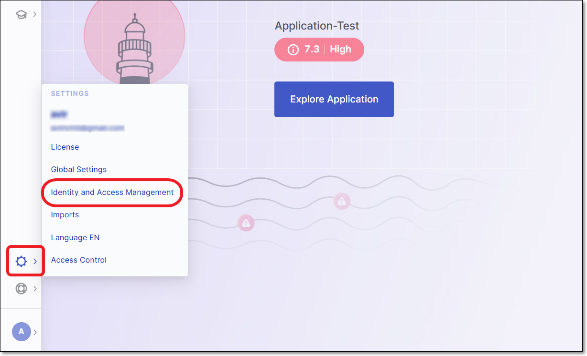

# Accessing the Identity and Access Management Console

To access the **Identity and Access Management** console, you must have user management privileges.

1. Log in to Checkmarx One using your Tenant, Username & Password.
2. Click on **Settings > Identity and Access Management**.

   <figure><figcaption></figcaption></figure>
