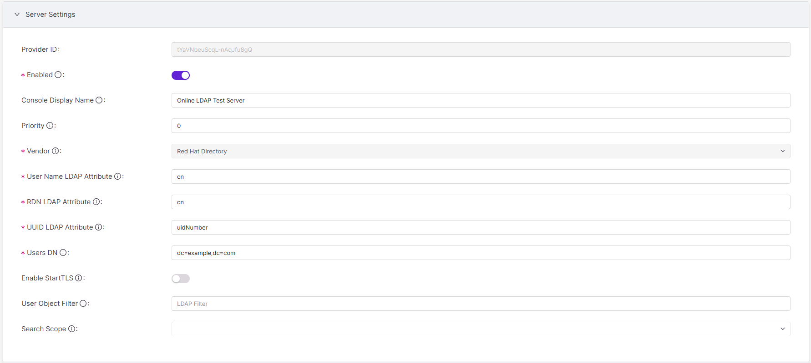
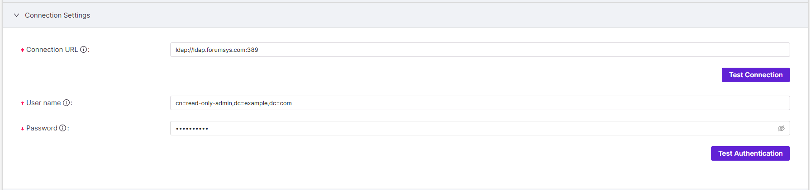
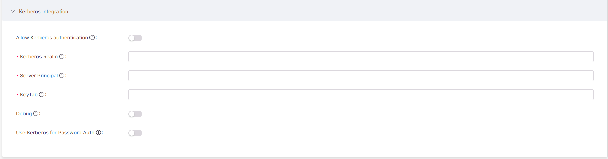
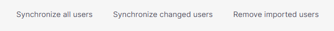
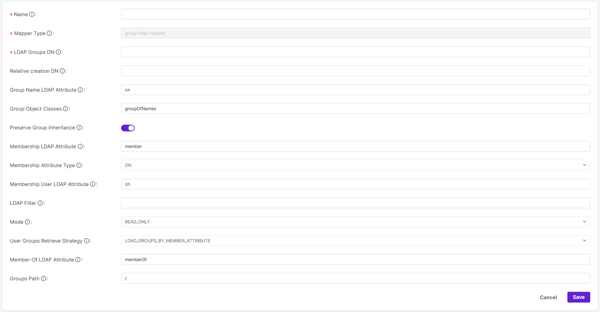
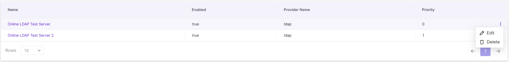
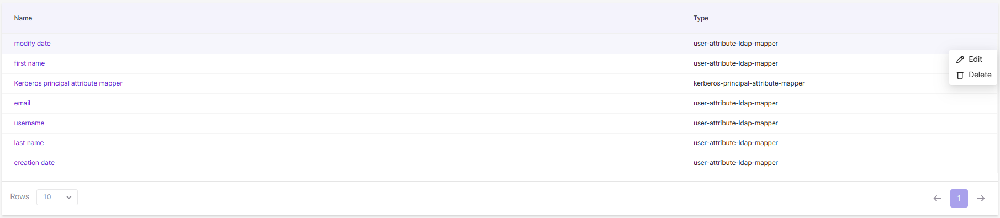

# Configuring LDAP Integration

Use the LDAP integration feature in Checkmarx One to import and synchronize users and groups from your organization’s LDAP directory server(s). LDAP integration enables Checkmarx One to securely connect to one or more servers, ensuring that identity information remains consistent between your enterprise directory and the platform. Once configured, the platform reflects the structure and membership defined in your LDAP environment.

## Integrating LDAPs

You can integrate multiple LDAP servers in Checkmarx One. The process has three sections. Mandatory fields are marked with a red asterisk (\*).

- [Server Settings](#server-settings)
- [Connection Settings](#connection-settings)
- [Kerberos Integration](#kerberos-integration)

Additionally, you can synchronize integrations, create mappers, and edit and delete integrations and mappers.

- [Synchronizing LDAP Integrations](#synchronizing-ldap-integrations)
- [Creating Mappers](#creating-mappers)
- [Editing and Deleting LDAP Integrations and Mappers](#editing-and-deleting-ldap-integrations-and-mappers)

After integrating an LDAP server, the following happens:

- All the selected users in the organization will appear in the **Users** tab as they appear in the LDAP organization tree. For more information, see [Managing Users](managing-users.md).
- All the selected groups in the organization will appear in the **Groups** tab as they appear in the LDAP organization tree. For more information, see [Managing Groups](managing-groups.md).

Server Settings

To integrate an LDAP server, navigate to **Settings > Identity and Access Management > LDAP**. Click **Create LDAP**.

In **Server Settings**, configure the settings of the LDAP server: directory configuration, attributes and naming, directory structure, TLS, and user search.

- **Provider ID:** A Provider ID uniquely identifies every LDAP integration instance. Two identical LDAP configurations get different Provider IDs. Once an LDAP integration is saved, Checkmarx One creates the field together with an alphanumeric value. The value doesn’t change and can’t be edited.
- **Enabled:** `On` (default) or `Off`.

  To enable the LDAP integration, toggle `On`. After an LDAP is integrated, the integration can be temporarily disabled to pause user access such as during updates to the LDAP server.

  
  Disabled LDAP integrations are automatically reenabled when synchronizing. For information on synchronizing LDAP integrations, see [Synchronizing LDAP Integrations](#synchronizing-ldap-integrations).
  
- **Console Display Name:** The console display name is the name for the LDAP integration instance in Checkmarx One.
- **Priority:** Enter an integer starting with 0 (highest priority) and increasing for lower priority.

  Priority is important if you integrate multiple LDAP servers to look up users and need to define in what order the integrated LDAP servers are accessed. You might also need to prioritize primary servers against backup/secondary servers.
- **Vendor:** Select your LDAP server vendor: `Active Directory` (default) or `Red Hat Directory`.
- **RDN LDAP attribute:** `cn` (default) or `uid`.

  The RDN (relative distinguished name) LDAP Attribute is the lowest-level, leftmost attribute of a user’s DN. Though it’s not required to be, it can be the same as the Username LDAP Attribute.
- **UUID LDAP Attribute:** Enter the attribute that contains the universally unique identifier (UUID) value: `objectGUID` (default), `uidNumber`, or other. The UUID LDAP attribute depends on your vendor. Every user’s UUID value is unique, stable, and independent of any changes.
- **Users DN:** Users DN is the full directory where users are stored. It is the parent location of the users you are synchronizing, for example: `dc=example,dc=com` (synchronized users would be stored under the domain “example,” found under the domain “com”).
- **Enable StartTLS:** To encrypt the communication between Checkmarx One and the LDAP server, enable StartTLS: `On` or `Off` (default). Encryption prevents interception attacks.
- **User Object Filter:** To restrict which users from the LDAP server are imported into and seen by Checkmarx One, use a user object filter. For information on formatting an LDAP filter, visit Atlassian’s [How to write LDAP search filters](https://support.atlassian.com/atlassian-knowledge-base/kb/how-to-write-ldap-search-filters/) page.

  For example, the filter `(&(objectClass=group)(cn=MarketingTeam))` would retrieve results that meet the following two attributes: (1) results that are groups and (2) the groups' names are “MarketingTeam.” The "&” prefix indicates that results must meet both attributes.

  For an additional custom filter, use an LDAP filter.
- **Search Scope:** Search scope defines which users are imported from the LDAP server based on their location under the Users DN. Select one of the following:

  | Scope | Description |
  |---|---|
  | `One level` | Imports only users directly in the specified Users DN. |
  | `Sub tree` | Imports all users under the specified Users DN, including those in subfolders. |

Connection Settings

In **Connection Settings**, provide the LDAP server URL, username, and admin password so Checkmarx One can access the LDAP server.

- **Connection URL:** Enter the LDAP server URL followed by a colon and the port number.

  Example: `ldap://ldap.forumsys.com:389`
- **User name:** Enter the user DN of the LDAP server admin, which Keycloak will use to connect to the LDAP server.

  Example: `cn=read-only-admin,dc=example,dc=com`
- **Password:** Enter the password of the LDAP server admin.

Kerberos Integration

Kerberos integration with LDAP enables single sign-on (SSO), allowing users to authenticate once without repeatedly entering credentials. If your LDAP server is integrated with Kerberos, you can enable Kerberos authentication as part of the LDAP integration in Checkmarx One.


Even if you’re not enabling Kerberos for this integration, you still need to complete the required fields in this section to finish the LDAP setup. Use the placeholders indicated in each step.


- **Allow Kerberos Authentication:** Enable Kerberos authentication: `On` or `Off` (default). If Kerberos integration is not configured, keep Kerberos authentication disabled. If Kerberos authentication is configured but disabled, authentication will fall back to the LDAP server.
- **Kerberos Realm:** Realms are typically written in uppercase and resemble domain names, such as `FOO.ORG`.

  If you are not configuring Kerberos, enter `N/A`.
- **Server Principal:** A Kerberos server principal is a unique identity for a network structure, in three parts (primary, instance, realm), formatted as `primary/instance@REALM`. For example, if the directory server runs on the primary `HTTP`, the domain name `www.mydomain.org`, and the realm `FOO.ORG`, the server principal is `HTTP/www.mydomain.org@FOO.ORG`.

  If you are not configuring Kerberos, enter `N/A`. To accept any server principal in the keytab file, enter `*`.
- **Keytab:** The principal’s password/secret is stored in a keytab file on the server, allowing the service to authenticate automatically without manual password entry. A keytab is a file containing Kerberos credentials that allows Checkmarx One to authenticate the Kerberos server without a password. Generate a keytab file from the Kerberos server. Then enter its file path here. If you are not using a keytab, enter `<none>`.
- **Debug:** To produce diagnostic logs for Kerberos startup, enable debug: `On` or `Off` (default). Logs are found in the Identity and Access Management service side of Checkmarx One and are not available to customers unless they are self-hosted and have access to the environment.
- **Use Kerberos for Password Auth:** To authenticate user passwords against the Kerberos server, enable `On` or `Off` (default). Enabling Kerberos for password authentication leverages Kerberos’ secure, ticket-based authentication mechanism, reducing reliance on the LDAP server for password verification.

Click **Cancel** to return or **Save** when done. The LDAP integration should now be listed in the **LDAP** tab.

Synchronizing LDAP Integrations

Once an LDAP server is integrated, use the three on-demand synchronization options to synchronize users from an LDAP server to Checkmarx One. Currently, there are no automated or bulk synchronization options. You must synchronize LDAP integrations manually and separately.

To synchronize an LDAP integration:

1. Navigate to **Settings > Identity and Access Management > LDAP**.
2. Open the LDAP integration you want to synchronize.
3. At the bottom of the screen, select an option.

   

   - **Synchronize all users:** synchronizes all users since last sync, including users that were added, edited, or removed from the server.
   - **Synchronize changed users:** synchronizes only existing users whose information was changed in the server since last sync.
   - **Remove imported users:** deletes all users imported from the LDAP server.
4. At the top of the screen, a confirmation will pop up after successfully synchronizing:

   -  (for **Synchronize all users** and **Synchronize changed users**)
   -  (for **Remove imported users**)


If you don't periodically synchronize, deactivated users will remain in Checkmarx One, existing ones won't be updated, and new ones won't be imported.


Creating Mappers

Mappers translate the rigid attributes of an LDAP server to the specific fields needed in Checkmarx One, smoothening the integration between the LDAP server and Checkmarx One.

There are seven default mappers created for every LDAP integration:

- first name
- creation date
- last name
- modify date
- Kerberos principal attribute mapper
- email
- username

In addition, custom mappers are available. Currently, the group mapper (`group-ldap-mapper`) is the only custom mapper available. It maps groups from an LDAP server to Checkmarx One.

To create a group mapper:

1. Navigate to **Settings > Identity and Access Management > LDAP**.
2. Select the LDAP integration you want to create a mapper for.
3. Navigate to the **Mappers** tab. Click **Create**.

   
4. Enter the mapper's parameters:

   - **Name:** This is the name for the mapper. In choosing a name, consider what groups and subgroups the mapper will read as well as the mapper’s purpose.
   - **Mapper Type:** Currently, the group mapper (`group-ldap-mapper`) is the only custom mapper available.
   - **LDAP Groups DN:** Enter the DN in the LDAP server where the group is located (ex. `ou=groups,dc=example,dc=org`).
   - **Relative creation DN:** Enter the path where you would like new groups in Checkmarx One to be created relative to the LDAP Groups DN. If this field is left blank, new groups will be written to the LDAP Groups DN.
   - **Group Name LDAP Attribute:** Enter the attribute in the LDAP server that holds the group’s name: `cn` (default), `sAMAccountName` or `displayName`.
   - **Group Object Classes:** Enter the group object class used by your LDAP server. For example, `groupOfNames` (default), `group` (Active Directory), `groupOfUniqueNames`, or `posixGroup`. Group object class determines how group entries are identified and which attributes are used to store group membership.
   - **Preserve Group Inheritance:** To control whether group hierarchy is inherited from the LDAP, enable `On` (default) or `Off`. When enabled, group hierarchy from the LDAP server is mirrored in Checkmarx One. When disabled, groups from the LDAP are mapped as flat-level in Checkmarx One.
   - **Membership LDAP Attribute and Attribute Type:** The Membership LDAP attribute depends on how the LDAP server declares its own members: by their full DN or UID. The mapper will scan users' DNs for this attribute. There are two pairings depending on attribute type.

     | Membership LDAP Attribute | Membership Attribute Type | Declaration |
     |---|---|---|
     | `member` (default) | `DN` | Members are declared by their full DN (ex. `ui=john,ou=users,dc=example,dc=com`). |
     | `memberUid` | `UID` | Members are declared by their user IDs only (ex. `memberUid:john`). It’s assumed that a user ID is enough to distinguish users. |
   - **Membership User LDAP Attribute:** If the Membership Attribute Type, immediately above, is `UID`, enter `UID` here to mirror it. In this case, the mapper searches for the string, most commonly UID, that maps users to the group. If the Membership Attribute Type is anything other than `UID`, leave this field blank because the mapper will ignore it.
   - **LDAP Filter:** An LDAP filter is an additional and independent custom filter in addition to the User Object Filter.

     For information on formatting an LDAP filter, visit Atlassian’s [How to write LDAP search filters](https://support.atlassian.com/atlassian-knowledge-base/kb/how-to-write-ldap-search-filters/) page.

     For example, the filter `(&(objectClass=group)(cn=MarketingTeam))` would retrieve results that meet the following two attributes: (1) results that are groups and (2) the groups' names are “MarketingTeam.” The “&” prefix indicates that results must meet both attributes.
   - **Mode:** Mode controls how updates to groups in the LDAP are reflected in Checkmarx One. There are three options:

     | Mode | Description |
     |---|---|
     | `LDAP_ONLY` | Group mappings are retrieved from and saved to only the LDAP server. |
     | `IMPORT` | Group mappings are imported to Checkmarx One at integration and not updated. |
     | `READ_ONLY` (default) | Group mappings are retrieved from and saved to both Checkmarx One and the LDAP server. |
   - **User Groups Retrieve Strategy:** User Groups Retrieve Strategy is how the mapper fetches the list of groups a user belongs to. It can retrieve users from group entries or groups from user entries.

     | User Groups Retrieve Strategy | Attribute | Description |
     |---|---|---|
     | `LOAD_GROUPS_BY_MEMBER_ATTRIBUTE` (default) | `member` | Groups are searched and retrieved if their `member` attribute contains the current user. |
     | `GET_GROUPS_FROM_USER_MEMBEROF_ATTRIBUTE` | `memberOf` | User entries are searched and and retrieved if their `memberOf` attribute contains the current group. |
   - **Member-Of LDAP Attribute:** If the User Group Retrieval Strategy, immediately above, is `GET_GROUPS_FROM_USER_MEMBEROF_ATTRIBUTE`, enter `memberOf`. Otherwise, leave blank.
   - **Groups Path:** Groups Path is the Keycloak group path the LDAP groups are added to. For example, if the path `/Applications/App1` is used, then LDAP groups will be available in Keycloak under App1, which is a child of Applications.

     The default value is `/`, which maps groups from the LDAP server to the top level of Keycloak.

     
     The chosen group path must exist in Keycloak when creating this mapper.
     
5. Click **Cancel** to return or **Save** when done. The created mapper should now be listed in the **Mappers** tab.

Editing and Deleting LDAP Integrations and Mappers

Editing and deleting LDAP integrations and mappers streamlines user administration, controls, and search within Checkmarx One.


Deleting an LDAP integration deletes all mappers associated with it.


To edit or delete an LDAP integration:

1. Navigate to **Settings > Identity and Access Management > LDAP**.
2. To edit an LDAP integration, simply select it or hover over it and click **Edit**.

   To delete it, hover over it and click **Delete**.

   
3. When editing, click **Cancel** to return or **Save** when done.

   When deleting, a pop-up window will ask whether you want to delete the integration. Click **Cancel** or **Delete**.

To edit or delete a mapper:

1. Navigate to **Settings > Identity and Access Management > LDAP**.
2. Select the LDAP integration the mapper belongs to.
3. Navigate to the **Mappers** tab.
4. To edit a mapper, simply select it or hover over it and click **Edit**.

   To delete it, hover over it and click **Delete**.

   
5. When editing, click **Cancel** to return or **Save** when done.

   When deleting, a pop-up window will ask whether you want to delete the mapper. Click **Cancel** or **Delete**.

