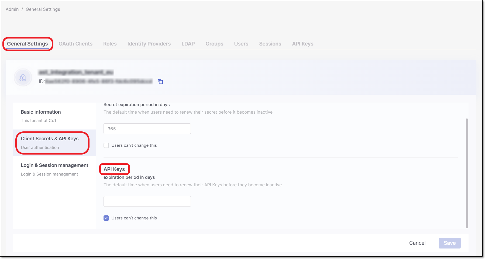

# Creating API Keys

You can generate an API Key to use for authentication with API calls, CLI tool and plugins. The roles (permissions) assigned to an API Key are inherited from the user who is logged in when the API key is generated. Therefore, make sure that you are logged in to an account with the appropriate permissions. The minimum required roles for running an end-to-end flow of scanning a project and viewing results are the out-of-the-box composite role `ast-scanner` as well as the IAM role `default-roles`. See [Managing Roles](managing-roles.md)


Whenever you update your Checkmarx One license (e.g., adding a new scanner) all existing API Keys become invalid. You will need to generate new API Keys to replace those that are used in your integrations and plugins.


## Generating an API Key



**To generate an API Key:**

1. Log in to the Checkmarx One web portal and select **Settings > Identity and Access Management** in the main navigation.

   The IAM portal opens.
2. In the main navigation, click **API Keys**, then click on the **Create Key** button.

   <figure><figcaption></figcaption></figure>

   The API Key configuration window opens.

   <figure><figcaption></figcaption></figure>
3. You can optionally adjust the configuration as follows:

   - **Note** - Add a descriptive note to the API Key.
   - **Expiration period** - Adjust the period of time until the key expires. The value can be from 30 to 365 days.

     
     If an administrator set the default expiration period to be "enforced", then this field will be locked.
     
   - **Notification emails** - Enter emails of each recipient who you would like to receive notifications regarding expiration of the key. After entering each email, click **Add**. By default the email of the current user is included.
4. Click **Create**.

   The API Key is created and a window opens showing the key.

   <figure><figcaption></figcaption></figure>
5. Copy the key and save it in a place where you will be able to retrieve it for future use.


Once you close the window, you will no longer be able to access this API Key.



You can obtain a curl for submitting the request for an access token, by clicking on **Show details** and copying the content.


## Configuring API Key General Account Settings

A tenant admin user can configure settings that effect all API Keys created in the tenant account. The settings are available on the **General Settings** screen of the Identity and Access management platform.

<figure><figcaption></figcaption></figure>

The following settings can be configured:

- **API Keys expiration period in days** - Specify the number of days that will be set as the default value for API Key expiration. By default, this value is set as 365. You can specify a period of 30 to 365 days.
- **Users can't change this** - Select the checkbox to set whether or not the default expiration period is enforced.

  - For new API Keys that will be created -

    - When the checkbox is **deselected**, the user can adjust the expiration period as part of the API Key creation procedure.
    - When the checkbox is **selected**, the value set as the **API Key expiration period** is enforced for all API Keys that are created.
  - For previously created Clients -

    - Whether the checkbox is **selected** or **deselected**, the expiration period that was set when the API Key was created remains valid.
