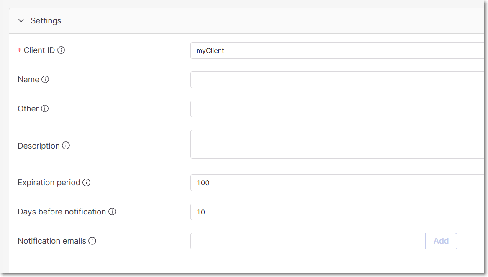
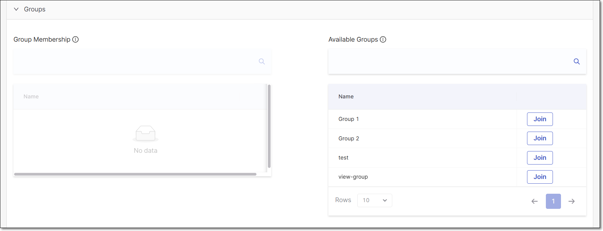
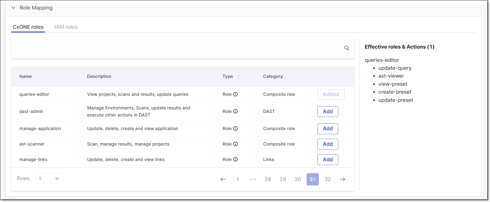
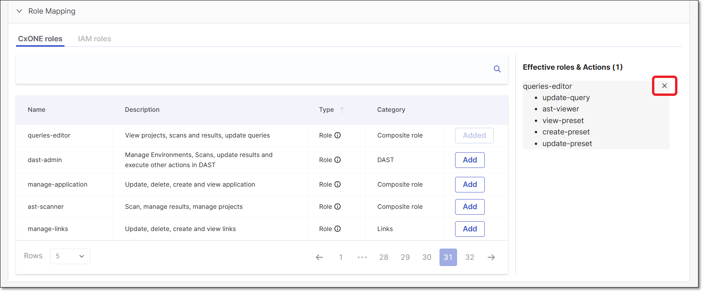
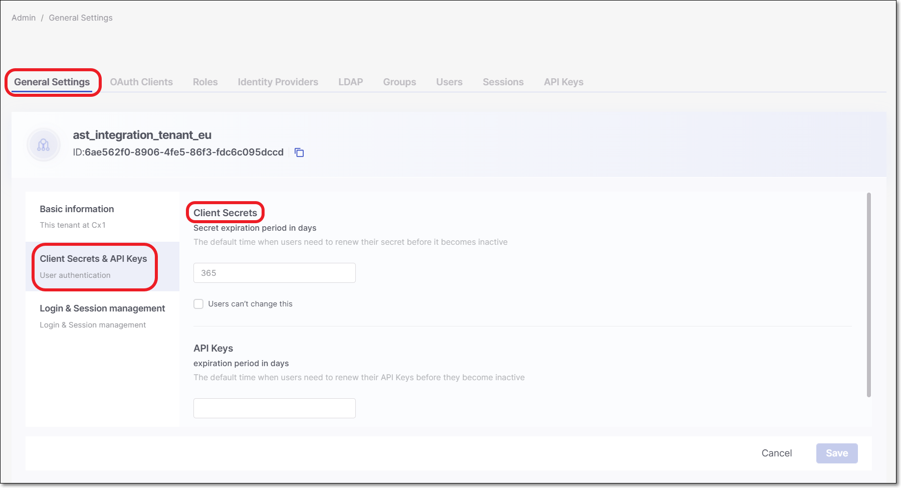

# Creating OAuth Clients


The OAuth 2.0 authorization framework enables a third-party application to obtain access to an HTTP service.

OAuth clients allow you to configure external services and applications to authenticate against Checkmarx One in a secure manner.

The OAuth client setup information also includes:

1. A client ID.
2. A redirect URI.
3. Client secret key.

These details will be used to validate your application and authorize the API calls.

For additional information see auth



The **manage-clients** role must be active to create an OAuth Client. See [here](managing-roles.md) for more information on managing roles.



If the new access management is enabled, the OAuth client must be granted resource-level authorization (at the tenant, application, or project level) to function properly.


## Creating an OAuth Client

To create an OAuth Client, you must have the following permissions:

- `assign-project-all-groups`: Allows assigning any existing group when creating or updating a project
- `view-access`: – Allows viewing endpoints.



**To create an OAuth Client:**

1. Log in to Checkmarx One and click on **Settings > Identity and Access Management** in the Menu panel.

   <figure><figcaption></figcaption></figure>
2. In the **Identity and Access Management** console, click **OAuth Clients** and then click **Create Client**.

   <figure><figcaption></figcaption></figure>
3. In the **Client ID** field, enter a descriptive name for Client, and then click **Create**.

   
   The **Client ID** field accepts only letters, numbers, spaces, and these symbols: `. ( ) [ ] { } - _`.
   

   

   The Client Settings screen is shown.

   <figure><figcaption></figcaption></figure>
4. Copy the **Client ID** for use in the plugin configuration.
5. Click on the **Regenerate** button to generate the Secret.
6. In the dialog that opens, copy the **Secret** for use in the plugin configuration, and then click **Ok** to close the dialog

   <figure><figcaption></figcaption></figure>
7. You can optionally adjust the **Settings** as follows:

   - **Name** - Specify the name that will be displayed for this Client.
   - **Other** - Enter additional information about this Client.
   - **Description** - Enter a description of this Client.
   - **Expiration period** - Specify the period of time until the key expires. The value can be from 30 to 365 days.

     
     If an administrator set the default expiration period to be "enforced", then this field will be locked.
     
   - **Days before notification** - Specify the number of days before the Client will expire that notifications will start being sent. Notifications will be sent on a daily basis from the day on.
   - **Notification emails** - Enter emails of each recipient who you would like to receive notifications regarding expiration of the key. After entering each email, click **Add**. By default the email of the current user is included.
8. Under **Groups**, you can optionally assign groups to the Client.

   For more information, refer to [Groups](#groups).
9. Under **Role Mapping** select the relevant roles, and click on **Add selected**.

   
   The minimum required [role](managing-roles.md) for running an end-to-end flow of scanning a project and viewing results via the CLI or CI/CD plugins is `plugin-scanner`.

   Alternatively, you can use the combination of the following roles: CxOne composite role `ast-scanner`, CxOne role `view-policy-management` (not required for IDE plugins) and IAM role `default-roles`.
   
10. Click **Save Client**.

## Settings

Settings section includes several configuration fields.

- **Client ID** - Update the client ID in case needed.
- **Name** (Optional) - Name the client.
- **Other** (Optional) - Provide additional information about the client.
- **Description** (Optional) - Provide a description of the client.
- **Expiration Period** - Configure the expiration period for the OAuth client (in days).

  - The out-of-the-box default is 100 days. This may have been adjusted by an admin under **Identity and Access Management** > **General Settings**. An admin can also "enforce" the default expiration, making this field un-editable, see [Configuring OAuth General Account Settings](#configuring-oauth-general-account-settings).
  - The value can be set between 30 - 365 days.
  - When changing the expiration duration, the change won’t affect existing secrets. Users will need to generate a new secret to get the new expiration duration configured, according to the following:

    - Set the new duration period.
    - Save the changes.
    - Click on **Edit** to reopen and regenerate the secret to update it with the new expiration period.
- **Notification emails** (Optional) - Configure one or more email addresses to receive an alert prior to the client expiration date.

  
  By default the client creator is set as the recipient.
  

  <figure><figcaption></figcaption></figure>

## Groups

In this section, users assign groups to the client. This allows limiting the access token created via the OAuth client to specific groups, just like for users. Consequently, tokens generated for such clients will include a list of groups in the claims, which the API/UI will utilize to restrict or permit actions.

It is also essential to take token roles into consideration.

To assign groups to a client, perform the following:

Select a group from the **Available Groups** section and click **Join**. The selected group will appear under the **Group Membership** section.

To remove a group, select it from the **Group Membership** section and click **Leave**.

<figure><figcaption></figcaption></figure>

## Role Mapping

Role Mapping section contains 2 different role tabs:

- **Checkmarx One roles** - Checkmarx One application roles.

  
  There are 2 **Checkmarx One role types** in the system:

  1. **Composite Roles** - Aggregative actions collected into a roles type.
  2. **Action Roles** - A single action role.

  For a detailed information regarding all role types see [Managing Roles](managing-roles.md)
  
- **IAM roles** - System roles.

To **add** a role to the Oauth client, click on the **Add** button on the right table side.

In case that a **Composite role** is selected, its actions will be presented for viewing.

For example:

<figure><figcaption></figcaption></figure>

To **delete** a role, click the **“x”** sign.

<figure><figcaption></figcaption></figure>

Click **Save Client**

## Configuring OAuth General Account Settings

A tenant admin user can configure settings that effect all OAuth Clients created in the tenant account. The **Client Secrets** settings are available on the **General Settings** screen of the Identity and Access management platform.

<figure><figcaption></figcaption></figure>

The following settings can be configured:

- **Secret expiration period in days** - Specify the number of days that will be set as the default value for Client Secret expiration. By default, this value is set as 100. You can specify a period of 30 to 365 days.
- **Users can't change this** - Select the checkbox to set whether or not the default expiration period is enforced.

  - For new OAuth Clients that will be created -

    - When the checkbox is **deselected**, the user can adjust the expiration period as part of the OAuth Client creation procedure.
    - When the checkbox is **selected**, the value set as the **Secret expiration period in days** is enforced for all OAuth Clients that are created.
  - For previously created Clients -

    - Whether the checkbox is **selected** or **deselected**, the expiration period that was set when the Client was created remains valid.
