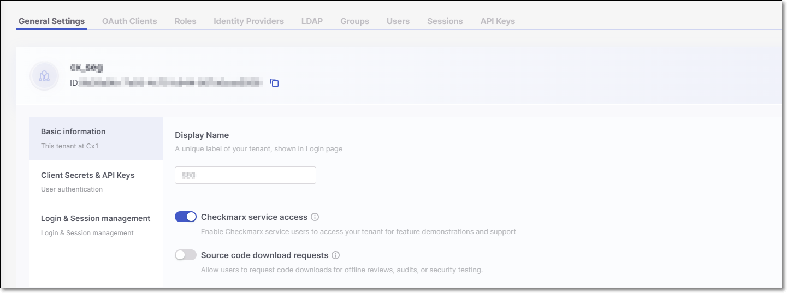
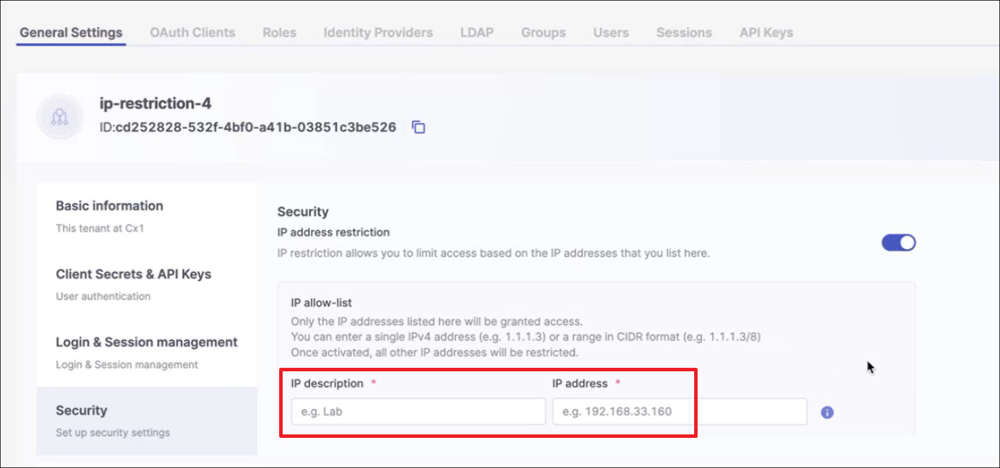

# General Settings

The Display Name and Tenant ID are displayed at the top of the page.

- **Display name** - A user-friendly tenant name that appears on the login screen.
- **Tenant ID** - The unique identifier assigned to your tenant.

The page content is divided into the following four sections:

## Basic information

- **Display name** - Edit the tenant name that appears on the login screen.
- **Checkmarx service access** - When enabled (default), service users can be created in the Checkmarx back office. This does not automatically generate service users; rather, they must be created by Checkmarx CloudOps.

  Service users give Checkmarx employees access to your tenant to demonstrate new features and provide support. These users are automatically assigned the roles of `ast-admin` and `iam-admin`.

  Access is automatically revoked after 15 days. If the feature is disabled before this period, any active service users will lose access immediately.

  
  Only users with the `iam-admin` role can enable or disable this feature.
  
- **Source code download requests** - When enabled, users can download the source code directly from Checkmarx One for offline reviews, audits, or additional security testing.

## Client Secrets & API Keys

- **Client Secrets**

  - **Secret expiration period in days** - Set the default expiration period for Client Secrets, ranging from 30 to 365 days. The Client Secret will automatically expire after the set period.
  - **Users can't change this** - When selected, this setting enforces the default expiration period on all Client Secrets.
- **API Keys**

  - **Expiration period in days** - Set the default expiration period for API Keys, ranging from 30 to 365 days. The API Key will automatically expire after the set period.
  - **Users can't change this**- When selected, this setting enforces the default expiration period on all API Keys, preventing custom expiration periods from being set.

## Login & Session management

**Enable MFA for IDP users** - When enabled, administrators are able to configure **Multi Factor Authentication** (MFA) for **Identity Providers** (IDP) users during their initial login.


This setting *only* applies to IDP users and does not affect users created within Checkmarx One. Toggling this option off will not disable MFA for Checkmarx One users.


**Log-in**

- **Login attempts** - Specify the number of failed login attempts allowed before the user is locked out.
- **Lock-out duration** - Specify how long the user will remain locked out after exceeding the allowed number of failed attempts (in minutes).

**Session run out**

- **User is idle** - Specify the session expiration time when a user has been inactive (in minutes or hours).
- **User is Active** - Specify the maximum session duration (in hours) for sessions with active users.
- **Limit concurrent user sessions** - When enabled, a limit of 3 concurrent sessions is applied to each user in the system. Default: disabled (i.e., no limit is applied).

- **Enable SSO-Only Access Login**: This setting makes sure users can log in only through Single Sign-On (SSO).

  Normally, users can still log in with a username and password even if they've been removed from your Identity Provider (like Okta). Enabling this option blocks that and forces SSO-only access.

  When you turn on Enable SSO-Only Access Login, you’ll see two exception options:

  - **All users except the tenant owner**
  - **All users except the tenant owner + iam-admin**: This option is helpful if you have several users with `iam-admin` permissions, since those users can change settings in the **Login & Session Management** section.

  
  The Tenant Owner is the designated Admin who represents your organization in all license-related matters with Checkmarx One (such as accepting EULAs and managing license packages). By default, the first Admin user created in the account is assigned this role, and each account always has exactly one Tenant Owner.
  

  The **Enable SSO-Only Access Login** setting is tied to the **Enforce SSO-Only Access** option for individual users:

  - If **Enable SSO-Only Access Login** is disabled, the **Enforce SSO-Only Access** setting won’t be available.
  - If **Enable SSO-Only Access Login** is enabled, the system automatically applies **Enforce SSO-Only Access** to all users *except* those covered by the selected exception.
  - Admins can manually disable **Enforce SSO-Only Access** for specific users if needed.

## Security

**IP address restrictions** - This setting enables restricting access to your Checkmarx One account to specific IP addresses and ranges.


When you activate this setting, all current sessions **are automatically terminated**. Make sure to take this action at a time that will not disrupt pipelines or interfere with user activity.


IP restrictions apply to users logging in to the web portal as well as to authentication via OAuth Clients and API Keys (which are used for accessing APIs, CLI and plugins).


This setting can only be configured by a user with `iam-admin` role.



IP restrictions do not apply to users with `iam-admin` role or to Service Users (i.e., Checkmarx support).

However, when the `iam-admin` role is assigned via SSO, then the user's initial login must be done from an allowed IP.


When you turn on IP address restrictions, a row of input fields opens for submitting an IP address.

- In the **IP description** field, enter a brief description of the identity of the IP that you are about to submit. In the **IP address** field, enter a valid IP address or a CIDR (representing a range of addresses) to include in the allowlist.
- For each additional IP or CIDR that you would like to add (up to 10 items), click **+ Add other IP addresses** and enter the additional IP or CIDR.
