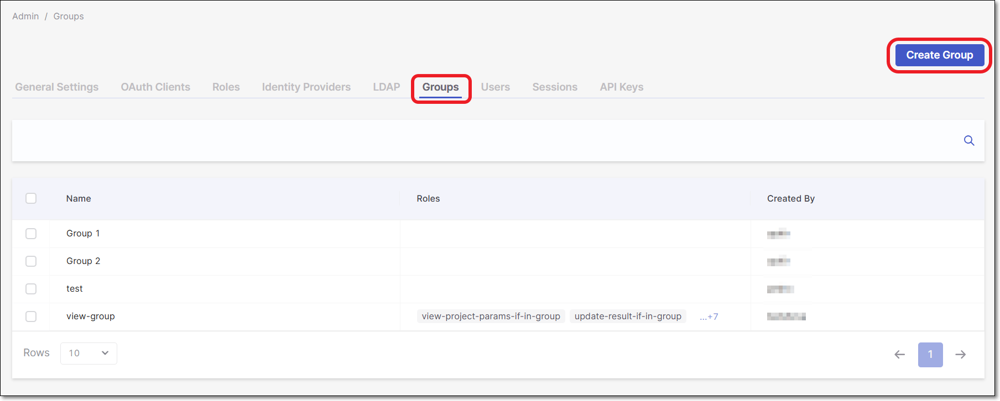
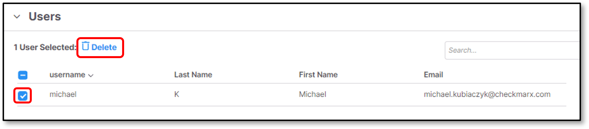
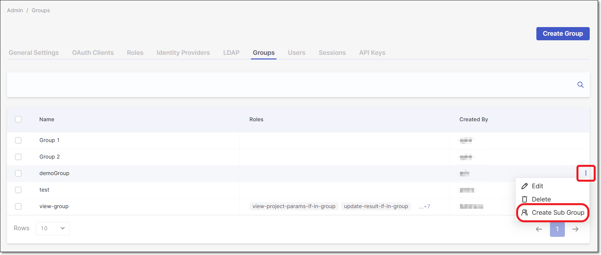
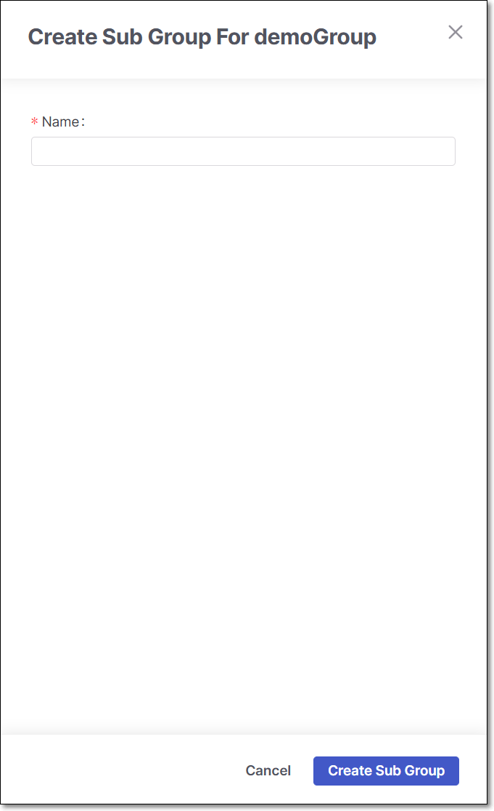
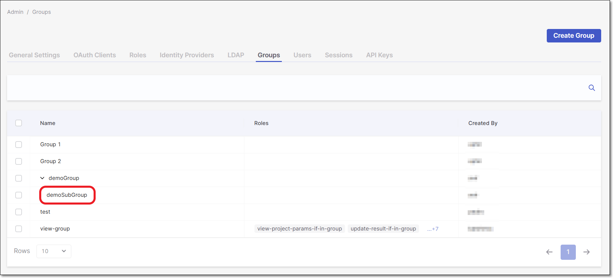

# Managing Groups

The Groups section allows you to manage a common set of attributes and role mappings for a set of users.

Users can be members of one or more groups.

Users inherit the attributes and role mappings assigned to each group.

It is possible to perform the following in the Groups section:

- Manually create groups in Checkmarx One.
- Manage the groups in Checkmarx One.
- Represent the reflection of all the organization groups via LDAP\\SAML\\OpenID Connect.

For a detailed procedure for connecting a provider (LDAP\\SAML\\OpenID Connect), see Configuring LDAP Integration or [Managing Identity Providers](managing-identity-providers/README.md) pages.

Groups are hierarchical. A group can have many subgroups, but a group can only have one parent.

Subgroups inherit the attributes and role mappings from the parent. This applies to the users as well.

If you have a parent group, a child group, and a user that only belongs to the child group, the user inherits both parent and child's attributes and role mappings.


When logging in for the first time to Checkmarx One, the **Groups** screen will be empty.


Checkmarx One imposes the following limitations on various aspects of group management:

- The maximum number of groups created in the platform is **20,000 per tenant**. The initial response time may take up to 1 minute, but subsequent responses will be faster as the data gets cached in the browser.
- The following characters are allowed for group names: Letters (A–Z, a–z), numbers (0–9), spaces, and the following special characters: . ( ) \[ \] { } - _ &amp; ' " : @
- A regular user can have up to 30 roles and be associated with up to 30 groups.
- Admin users can have up to 116 roles and be associated with up to 20 groups.
- Header token size has the following limitations:

  - When using GraphQL (as employed by the SCA inventory), the header size is limited to 10 KB.
  - When not using GraphQL, the header size can be up to 16 KB.

## Creating a New Group

To create a new group, perform the following: navigate to the **Groups** tab:

1. Click on **Settings** > **Identity and Access Management**.
2. On the **Identity and Access Management** console, click on the **Groups** tab.

   
3. Click **Create Group**.
4. In the **Name** field, enter a name for the group.

   
   The following characters are allowed: Letters (A–Z, a–z), numbers (0–9), spaces, and the following special characters: `. ( ) [ ] { } - _ & ' " : @`
   
5. Click **Create**.
6. The **Group Settings** page is displayed.

   
   You can click  at the end of a group row and then **Edit** to open the settings page for an existing group.
   

   The following configuration options are shown:

   - **Name**
   - **Role Mapping**
   - **Users**
   - **Managers**

### Role Mapping

Roles and actions can be set according to types. Role mapping consists of three role types:

- **Checkmarx One roles**
- **CB roles**
- **IAM roles**

**Checkmarx One roles** consist of two types of roles:

- **Composite role**
- **Action role**

#### Checkmarx One roles

##### Composite role

A composite role has one or several roles associated with it. Each composite role is a combination of action roles. When a composite role is mapped to a user, the user gains the roles associated with that composite. This inheritance is recursive, meaning that any composites are inherited. There are eight composite roles included in the system:

| **Name** | **Description** |
|---|---|
| ast-admin | Can do everything in the Checkmarx One app and manage users, groups, and permissions. |
| ast-risk-manager | Can manage applications, projects, scans, results, risks, and policies. |
| ast-scanner | Can scan, manage results, and manage projects. |
| ast-viewer | Can view projects, scans, and results. |
| manage-application | Can update, delete, create, and view the application. |
| manage-project | Can update, delete, create, and view the project. |
| manage-webhook | Can update, delete, create, and view webhooks. |
| queries-editor | Can view projects, scans, and results, and update queries. |

For a list of the permissions for Checkmarx One roles, see [Managing Roles](managing-roles.md).

##### Action role

An action role is a single action. This role type defines permissions for actions in the system.

For the full list of the action roles provided for Checkmarx One and their respective permissions, see [Managing Roles](managing-roles.md).

#### IAM role

IAM roles are identity and access management roles or system roles. The following IAM roles are available:

| **Name** | **Description** |
|---|---|
| iam-admin | Manages users, client credentials, identity provider, and user federation. |
| manage-keys | Manage keys. |
| manage-groups | Manages groups in the system. |
| manage-users | Manages the users in the system. |

### Assigning a Group to an Application


Currently, groups can only be assigned to a project or application via the Access Management settings, not during project or application creation. This limitation will be resolved in an upcoming release.


To assign a group to an application, perform the following:

1. Navigate to **Applications**.
2. At the end of the application's row, click  then **Application Settings**.
3. Click the **Authorization** tab. A side panel appears.
4. Select **Group**.
5. Search and select the **Group** and associated roles (optional) to assign to the application.
6. Select **Done**.

### Assigning a Group to a Project


Currently, groups can only be assigned to a project or application via the Access Management settings, not during project creation. This limitation will be resolved in an upcoming release.


To assign a group to a project, perform the following:

1. Navigate to **Projects**.
2. At the end of the project, click  then **Project Settings**.
3. Click the **Authorization** tab. A side panel appears.
4. Select **Group**.
5. Search and select the **Group** and associated roles (optional) to assign to the project.
6. Select **Done**.

### Assigning a Group to an Environment (DAST)

In DAST, groups can be assigned to an environment in the Environment Setup Wizard when creating a new environment or in the settings of an existing environment. Non-admins can only view the groups to which they are members. For more information on setting up a DAST environment, please see here.

To assign a group to an existing environment, perform the following:

1. Navigate to **Environments**.
2. At the end of the environment row, click  > **Settings**. The settings panel opens.
3. Click the **General & Config Files** tab.
4. Select the dropdown **Groups Permissions**.
5. Search and select the **Group** to assign to the environment. You may assign multiple groups.
6. Click **Save** when done.

### Assigning a Role to a Group

1. Select the name of the group to assign the role to.
2. The **Group Preview** pane slides in from the left, displaying an overview of the three role types.

   If any roles have been assigned to the group, they are displayed with the permissions listed.

   The **Members** tab shows a list of users included in the group.
3. Click **Edit Group**.
4. Select **Role Mapping**.
5. Select the type of role to apply to the group from **Checkmarx One roles**, **CB roles** and **IAM roles**.
6. Click **Add**. The role with all the Effective roles and Actions is added to the group.
7. Click **Save**. For additional information regarding roles & permissions, see [Managing Roles](managing-roles.md).

### Adding a User to a Group

1. Navigate to **Settings** and select **Identity and Access Management**.
2. Click on the **Groups** tab. This displays all groups in your environment.
3. Select the group you want to add users to. On the pop-up side panel, select **Edit**
4. Navigate to the **Users** dropdown and click **Add Users**.
5. In the **Add Users** pop-up, mark the checkboxes next to the users you want to add. You can also use the search or navigate the pages to help.
6. Click **Save** when done.

### Deleting a User from a Group

To delete a user from a group:

1. Navigate to **Settings** and select **Identity and Access Management**.
2. Click on the **Groups** tab and select the relevant group.
3. On the side panel, click **Edit**, then navigate to the **Users** tab.
4. Select the user by clicking the relevant checkbox.
5. Click **Delete**.

   <figure><figcaption></figcaption></figure>

### Adding Group Managers

The Group Manager feature is a distinct position with specialized permissions, based on the internal Keycloak permissions mechanism. A Group Manager has the authority to manage only the specific groups to which they are assigned. They can add or remove users from the group, view available users for adding, and see the list of other groups.

With the IAM role **manage-groups**, you can assign or remove group managers across all groups.

When a user is assigned as a Group Manager, they automatically become the manager of all subgroups recursively, extending down the entire group tree. If a Group Manager is assigned to the highest group level, all subgroups inherit the managerial role, creating a hierarchical structure.

However, it is important to note that once subgroups inherit a Group Manager, they cannot be removed from lower levels but only from the highest level.

**To add Group Managers, perform the following:**

1. Expand the **Managers** section.
2. Click **Add Managers**.
3. **Mark** the relevant user checkboxes to add.
4. Click **Add Managers**.
5. Click **Save**

### Deleting a Manager from a Group

To delete a manager from a group:

1. Select the manager by clicking the relevant checkbox.
2. Click **Delete**.

## Creating a Subgroup

Subgroups inherit the attributes and role mappings from the parent. This applies to the user as well.

If you have a parent group and a child group and a user who only belongs to the child group, the user inherits both the parent and child's attributes and role mappings.

To create a subgroup:

1. Click the ellipses at the end of the relevant group row to add the sub-group.
2. Click **Create a Sub-Group**.

   <figure><figcaption></figcaption></figure>

   The **Create Sub Group for...** panel opens.

   <figure><figcaption></figcaption></figure>
3. Enter a name for the Subgroup.
4. Click **Create Sub Group**.

   <figure><figcaption></figcaption></figure>

The subgroup is created below the parent. Users, Managers, and Roles can be added to the subgroup, as covered in the sections above.
