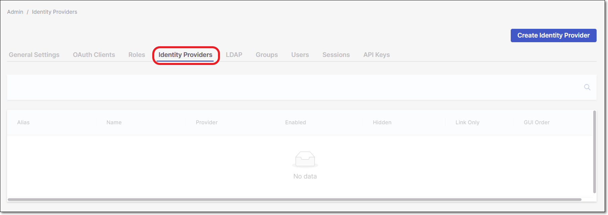

# Managing Identity Providers

The **Identity Providers** section enables organizations the ability to add an external identity management provider.

When setting an integration with an existing identity provider broker and Checkmarx One, the users are authenticated against the identity provider broker and *not* against Checkmarx One.

We support connecting to multiple identity providers, with the ability to configure their priority.

There are several provider protocols that are supported by Checkmarx One:

- [Configuring SAML Integration (Okta)](configuring-saml-integration-with-okta.md)/ [Configuring a SAML Provider with Azure Active Directory (AD)](configuring-a-saml-provider-with-azure-active-directory-ad.md)
- [Configuring OpenID Connect Integration](configuring-openid-connect-integration/README.md)

## In this section

- [Configuring SAML Integration with Okta](configuring-saml-integration-with-okta.md)
- [Configuring a SAML Provider with Azure Active Directory (AD)](configuring-a-saml-provider-with-azure-active-directory-ad.md)
- [Configuring OpenID Connect Integration](configuring-openid-connect-integration/README.md)
