# Configuring a SAML Provider with Azure Active Directory (AD)

This page provides details about SSO configuration on Checkmarx One when using Azure Active Directory.

## Instructions

1. Log in to Checkmarx One using your Tenant, Username and Password.
2. Click on the icon
3. In the Identity and Access Management screen click on  icon
4. Select **SAML v2.0**

   <figure>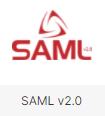<figcaption></figcaption></figure>
5. Copy the **redirect URI**

   <figure>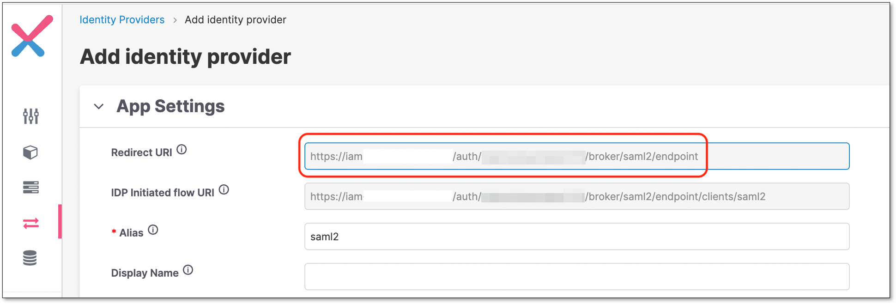<figcaption></figcaption></figure>
6. On the **Azure** webapp, set Identifier and Reply URL fields according to the copied Redirect URI.

   - **Identifier** = A portion of the Redirect URI (until the tenant name).
   - **Reply URL** = Redirect URI.

     
     To create a new Azure webapp go to **Enterprise Applications → Create your own application → Integrate any other application you don't find in the gallery (Non-gallery).**
     

     <figure>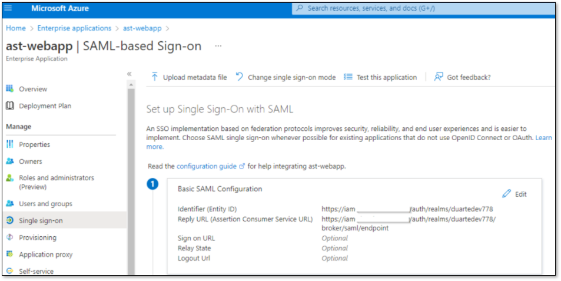<figcaption></figcaption></figure>
7. On **Azure**, copy the **App Federation Metadata Url**

   <figure>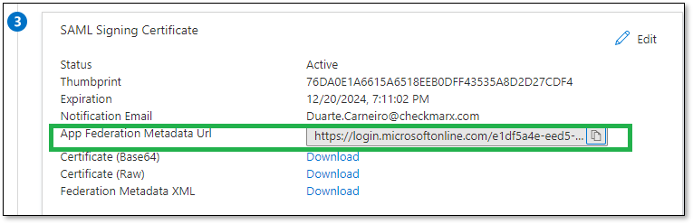<figcaption></figcaption></figure>
8. On **Checkmarx One**, use the copied link to import the metadata.

   Perform the following:

   1. Copy the URL to **Import from URL** field.
   2. Click **Import**
   3. Click **Save**

      <figure>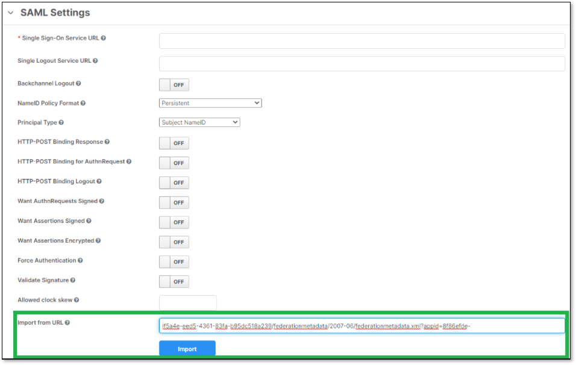<figcaption></figcaption></figure>
9. Check Checkmarx One SAML configuration.

   This is how SAML settings should look like:

   <figure>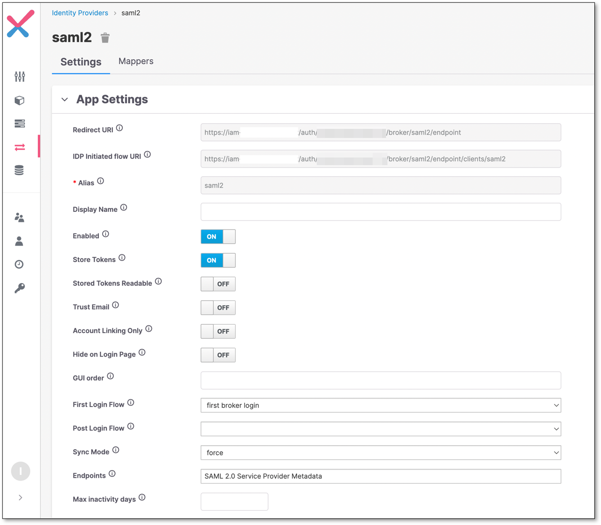<figcaption></figcaption></figure>

   <figure>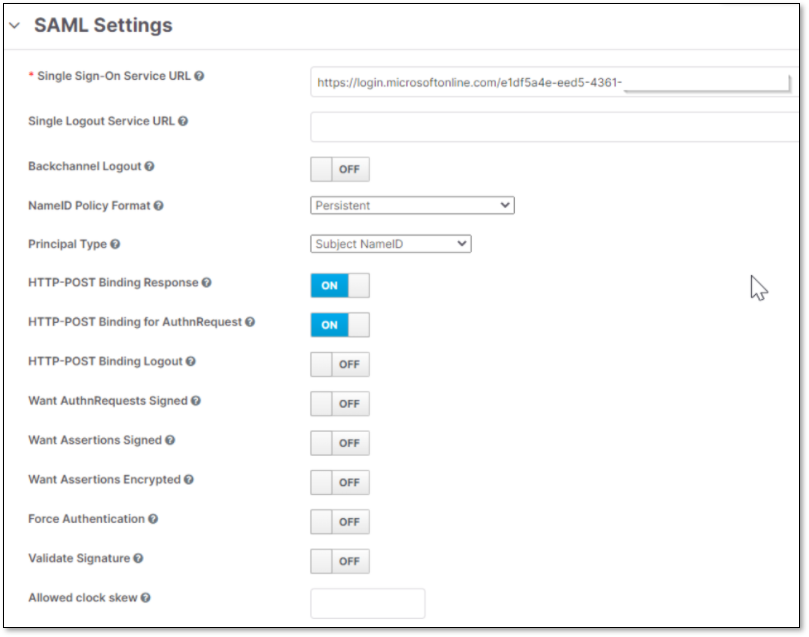<figcaption></figcaption></figure>
10. On **Azure**, check that the claims are correctly configured.

    <figure>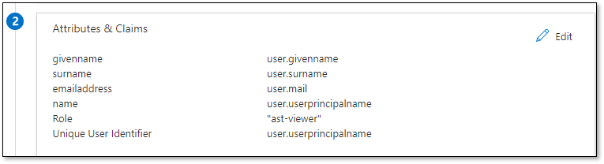<figcaption></figcaption></figure>

    <figure>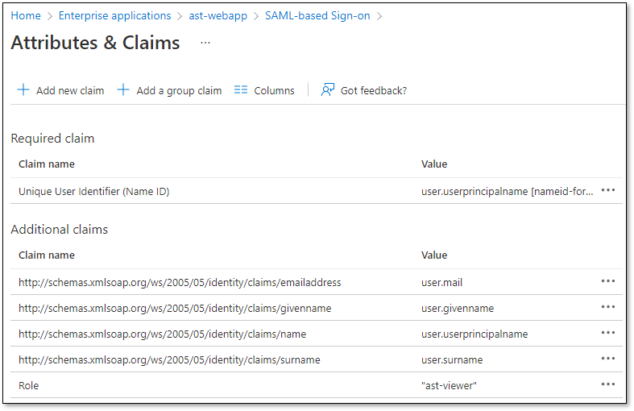<figcaption></figcaption></figure>
11. In Checkmarx One, create a mapper for the **Username**

    1. Click on **Mappers** tab.
    2. Click **Create**

       <figure>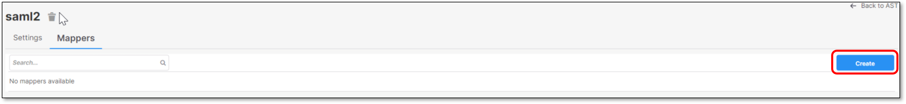<figcaption></figcaption></figure>
    3. Fill the information and click **Save**

       <figure>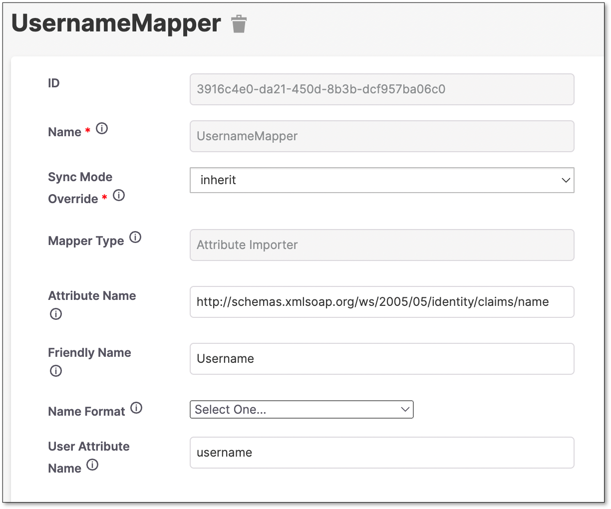<figcaption></figcaption></figure>
12. Create a **FirstName** Mapper.

    <figure><figcaption></figcaption></figure>
13. Create a **Surname** Mapper.

    <figure>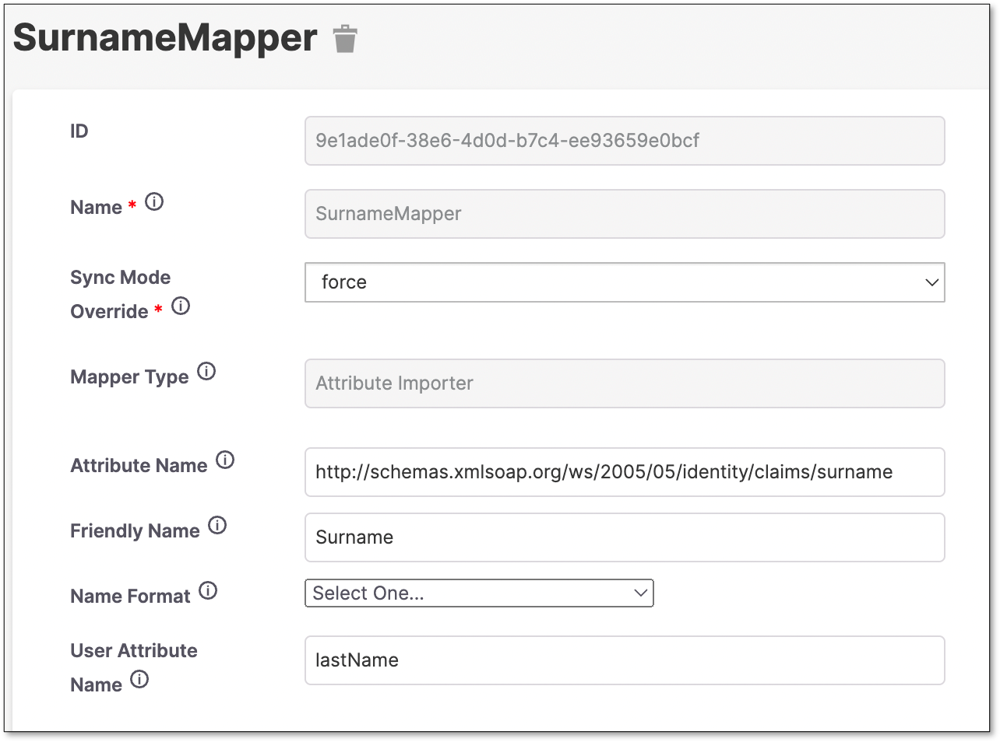<figcaption></figcaption></figure>
14. Create an **Email** Mapper.

    <figure>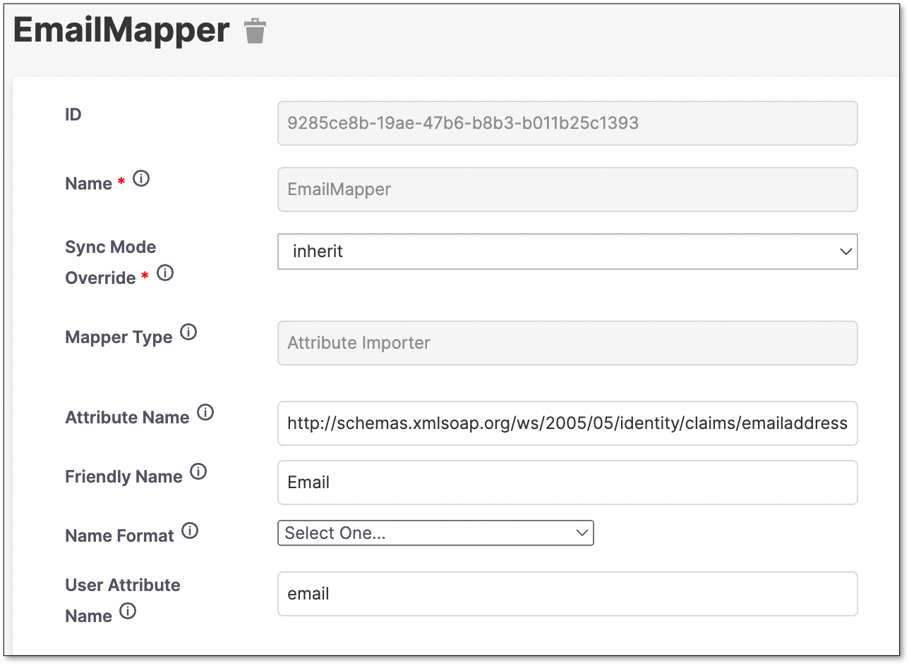<figcaption></figcaption></figure>
15. Create a **Role** Mapper.

    <figure>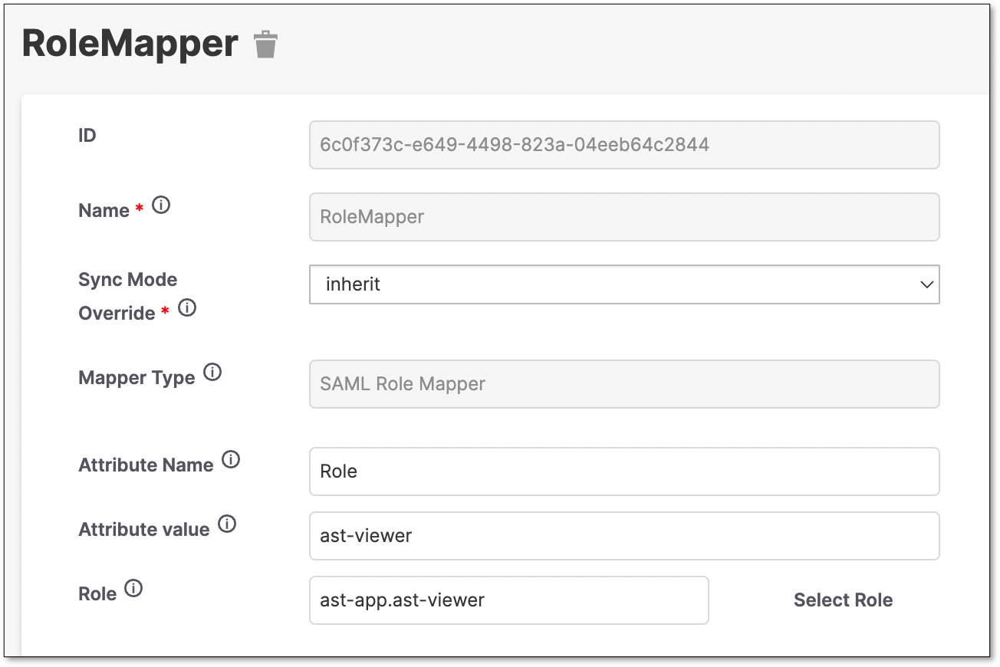<figcaption></figcaption></figure>


For this example, the Role claim configured on Azure is a constant “ast-viewer”.

This will map all users to assume the ast-viewer role.

Azure can send other values on this claim.

You will need to add a mapper for each value, to convert the azure claim value into a Checkmarx One role.

Explore other Mapper Types for other ways to map roles.


## Importing Groups

Checkmarx One can also import groups from Azure AD.

Create the **GroupMapper**:

<figure>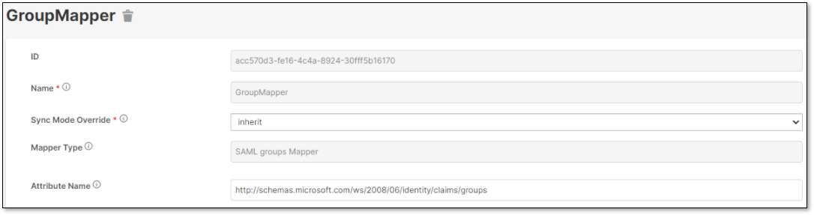<figcaption></figcaption></figure>

On Azure, add a group claim.

<figure>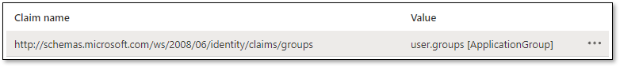<figcaption></figcaption></figure>


This azure configuration example will return the group ID's. Check Azure AD documentation on how to provide a friendly name.

Related article: [How To Work Around The Azure SAML Group Claim Limitations](https://techcommunity.microsoft.com/t5/microsoft-entra-azure-ad/how-to-work-around-the-azure-saml-group-claim-limitations/m-p/1778199)

If the integration is being done for groups that are not created within Checkmarx One, using the **Entra ID** group name, users can use the **sAMAccountName** as the source attribute instead of the Group ID and configure the **Entra ID** group name.


## Troubleshooting

A good way to troubleshoot issues with the configuration is to only configure one mapper, for example a Given Name.

When the information is incomplete, the user will be prompted to enter the user’s missing data.

<figure>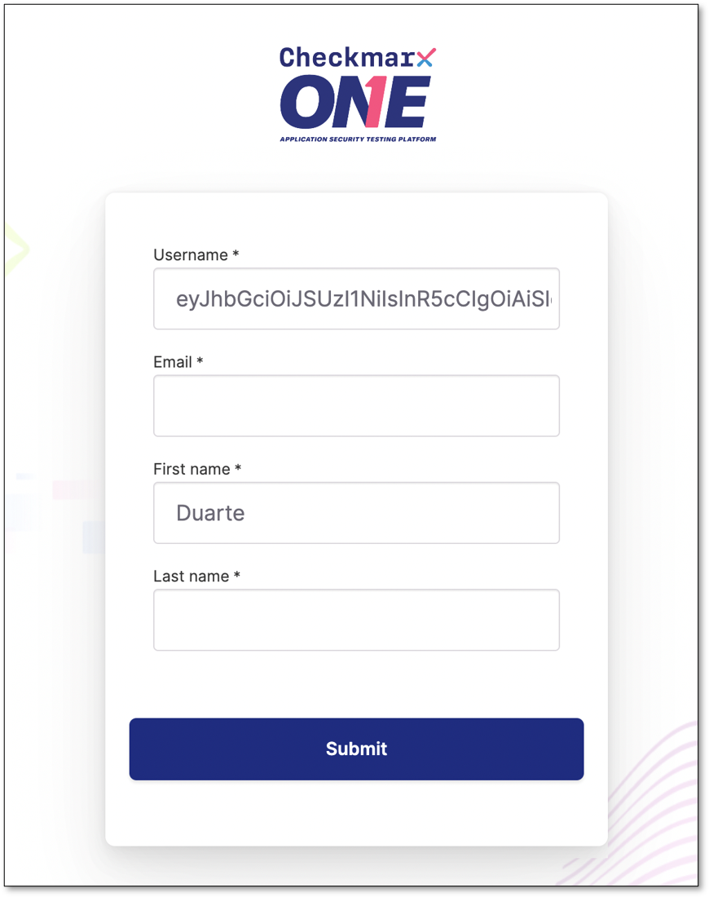<figcaption></figcaption></figure>

In the image above, we can check that Checkmarx One is being able to retrieve the First Name correctly.

This form is only shown when the user logs in for the first time.
