# Configuring an OpenID Provider via OKTA

## Create an Application via OKTA

1. Log in to the **OKTA** console using an admin account.
2. In the **OKTA** home page, click **Applications → Add Application**

   <figure>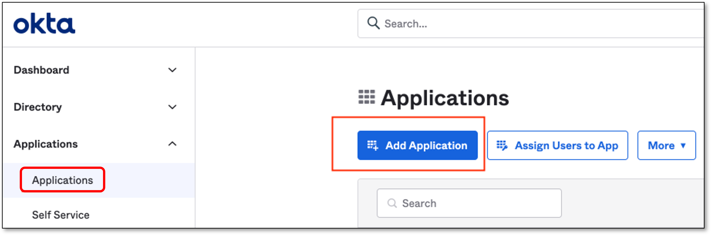<figcaption></figcaption></figure>
3. In the **Add Application** screen, click **Create New App**
4. In the **Create a New Application Integration** screen, perform the following:

   1. In the **Platform** field, verify that **Web** is selected (default).
   2. In the **Sign on method** section, select **OpenID Connect**
   3. Click **Create**

      <figure>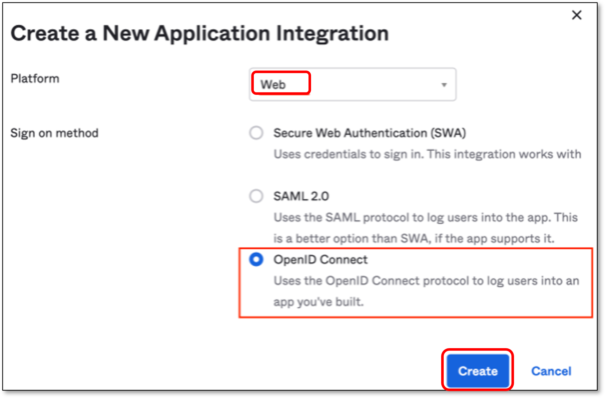<figcaption></figcaption></figure>
5. In the **General Settings** section, fill in the **Application name** field with a name for the SSO application.

   
   Other fields are optional
   

   <figure>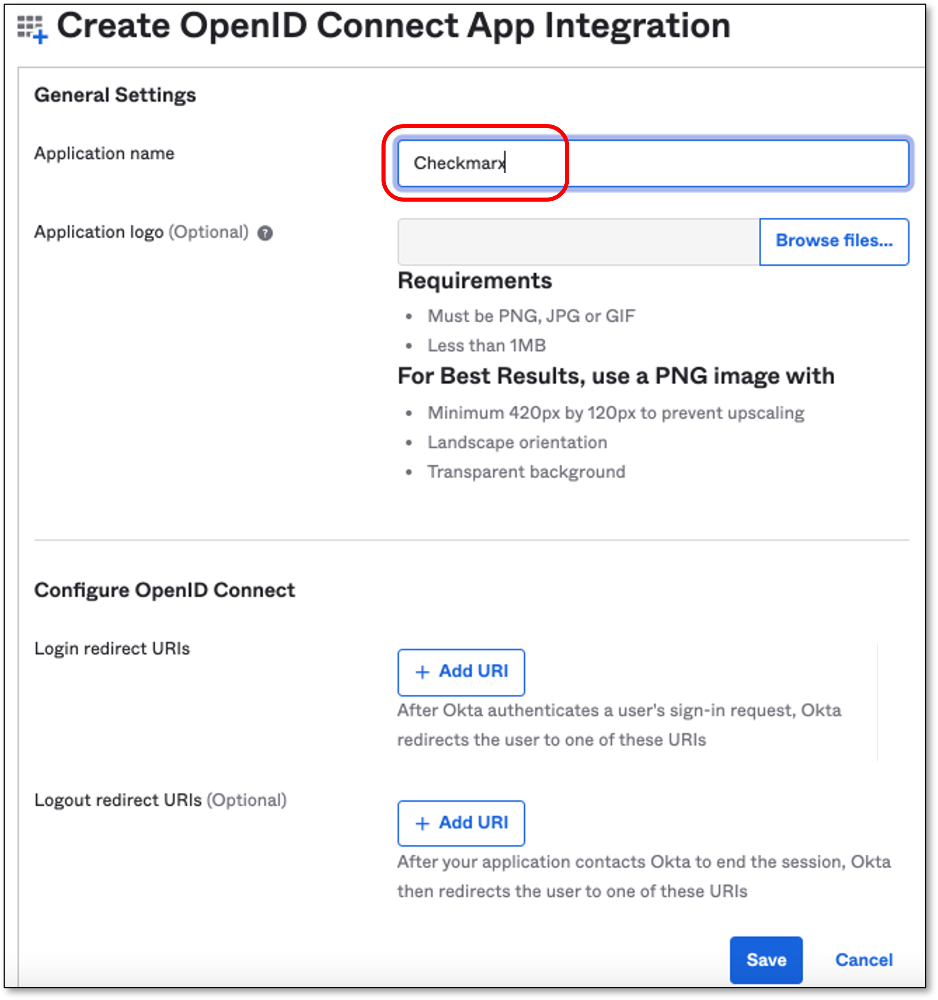<figcaption></figcaption></figure>
6. In the **Configure OpenID Connect** section, click **Add URI**

   
   The **Login Redirect URI** should be taken from Checkmarx Identity and Access Management console.
   

   <figure>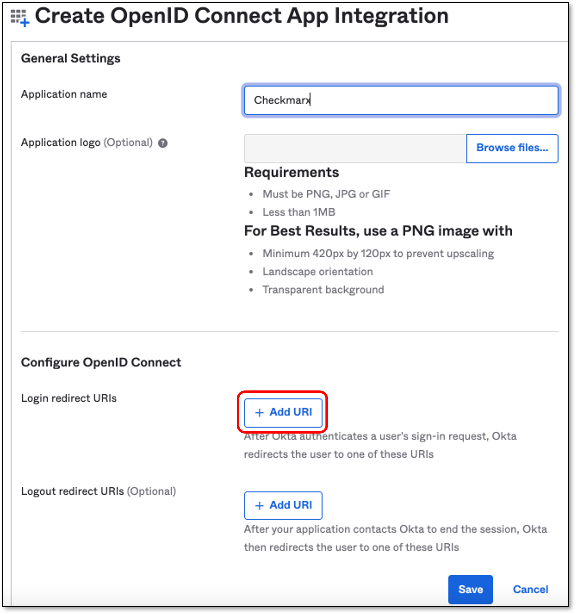<figcaption></figcaption></figure>

## Create an OpenID Connect Identity Provider via Checkmarx

1. Go to Checkmarx **Identity and Access Management** console **→ Identity Providers** and click **OpenID Connect v1.0**

   <figure>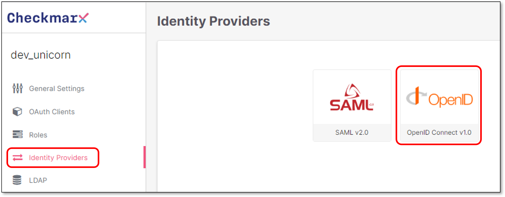<figcaption></figcaption></figure>
2. In the **Add Identity Provider** screen **→ App Settings** section, configure the Provider’s Alias.

   
   The Alias will be a part of the **Redirect URI**
   

   <figure>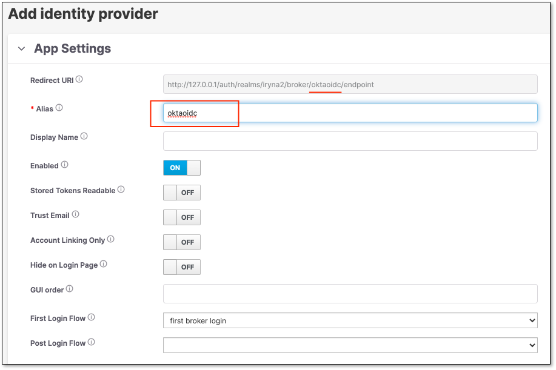<figcaption></figcaption></figure>
3. Copy the **Redirect URI** from the **App Setting** section.

## Configure Checkmarx Identity Provider Details via OKTA

1. Go back to **OKTA** and perform the following:

   1. In the **Configure OpenID Connect** section → **Login redirect URIs,** paste the copied **Redirect URI** from the previous step.
   2. Click **Save**

      <figure>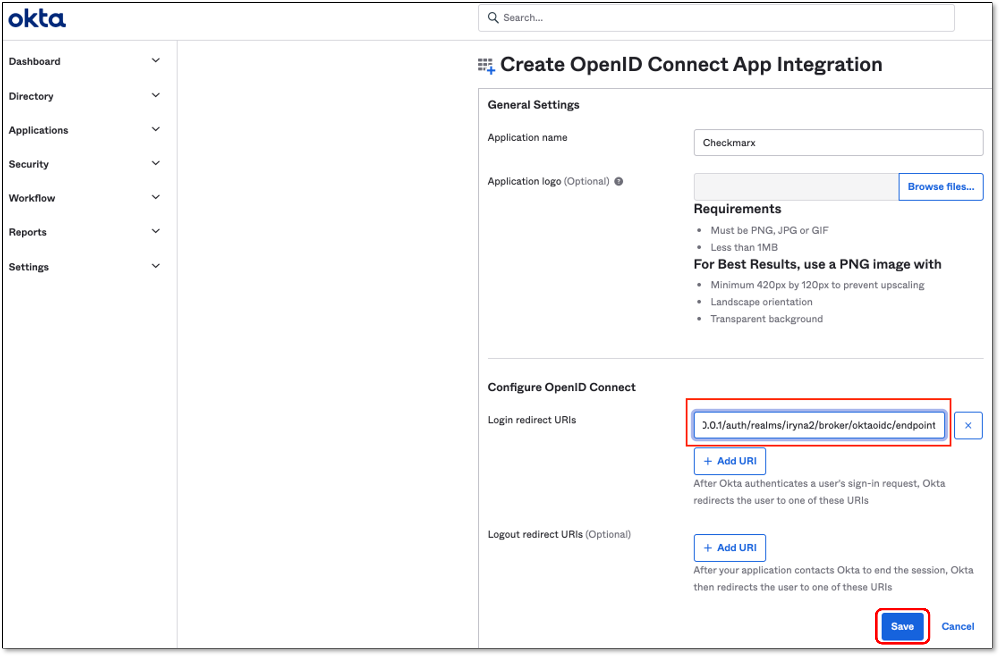<figcaption></figcaption></figure>

      The page with the Application details opens automatically.
2. Upon the save of the Application, OKTA will generate Client Credentials.

   1. Click on the **General** tab.
   2. Copy the **Client ID & Client secret**

   <figure>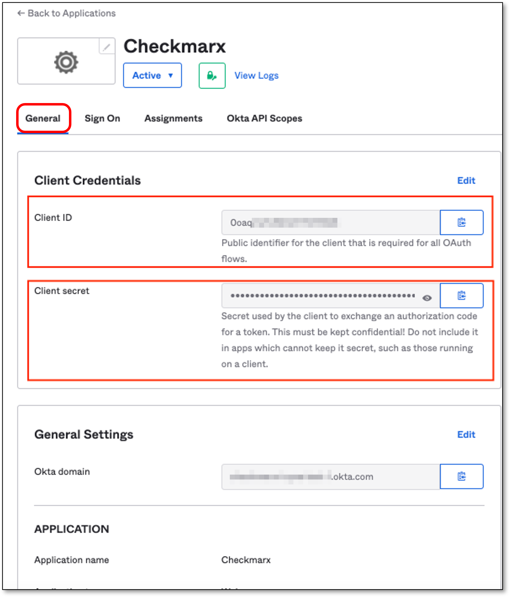<figcaption></figcaption></figure>

## Configure OpenID Connect Settings via Checkmarx

1. Go back to Checkmarx **Identity and Access Management** console.
2. In the **OpenID Connect Settings** section fill in the following fields:

   1. **Authorization URL** and **Token URL** - Should be taken from the following page:

      `https://<OKTA account URL>/oauth2/default/.well-known/openid-configuration?client_id=<Application Client ID>`

      Replace **\<OKTA account URL>** with your actual account URL and the **\<Application Client ID>** with the Application Client ID.

      For example, for Checkmarx OKTA it will look like:

      `{"errorCode":"invalid_client","errorSummary":"Invalid value for 'client_id' parameter.","errorLink":"invalid_client","errorId":"oaeFAmNeUfFQR2k5EQVEjlwpQ","errorCauses":[]}`

      <figure>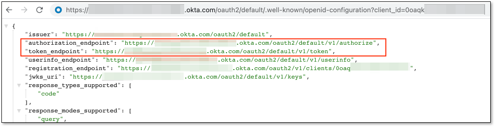<figcaption></figcaption></figure>
   2. **Client Authentication** - Should be **Client secret sent as basic auth**
   3. **Client ID** and **Client Secret** - OKTA Client ID and Client Secret.
   4. **Default Scopes** - Should be **openid profile email**

   <figure>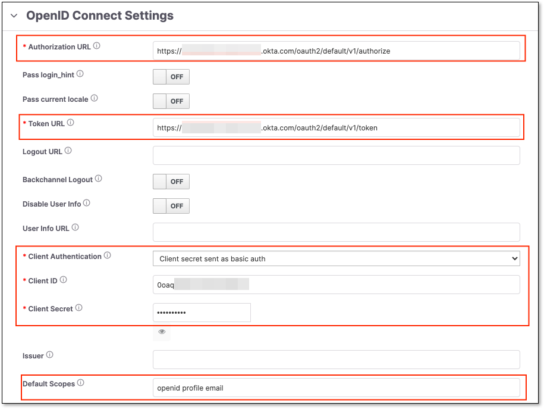<figcaption></figcaption></figure>

## Assign People via OKTA

1. Go back to **OKTA** and perform the following:

   1. Click on **Assignments** tab.
   2. Click **Assign → Assign to People**

      <figure>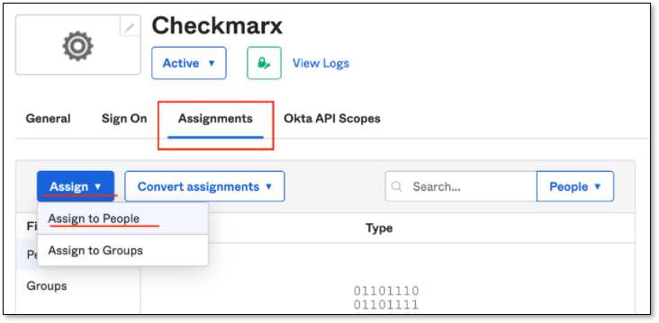<figcaption></figcaption></figure>

      The **Assign Checkmarx to People** popup will be presented.
2. Select people who will be able use the SSO.
3. **Login to Checkmarx One** using the created OKTA OpenID Connect account.

   <figure>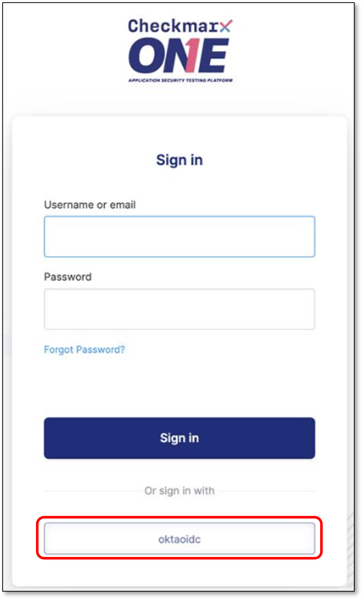<figcaption></figcaption></figure>

## OpenID Connect Mappers

The following are the OpenID Connect Mappers available in Checkmarx One:

- **Teams to Groups Mapper**: This mapper does not create new groups and only allows mapping values from the configured claim to existing groups.
- **Advanced Claim to Group**: If all claims exist, the user is assigned to the specified group.
- **Hardcoded User Session Attribute**: When a user is imported from a provider, a specific user session attribute is hardcoded.
- **Set Client Roles from Exchange Token**: When a user is imported from a provider, the client roles are set from the token claim.
- **Attribute Importer**: Imports the declared claim if it exists in ID, access token, or the claim set returned by the user profile endpoint into the specified user property or attribute.
- **Advanced Claim to Role**: If all claims exist, the user is granted the specified realm or client role.
- **Hardcoded Role**: When a user is imported from the provider, it hardcodes a role mapping.
- **Hardcoded Group**: Assigns the user to the specified group.
- **User Session Note Mapper**: Adds every matching claim to the user session note. This can be used together for instance with the **User Session Note** protocol mapper configured for your client scope or client, so that claims for 3rd party IDPs would be available in the access token sent to your client application.
- **Claim to Role**: If a claim exists, grants the user the specified realm or client role.
- **Hardcoded Attribute**: When a user is imported from provider, hardcode a value to a specific user attribute.
- **Username Template Importer**: Format the username to import.
