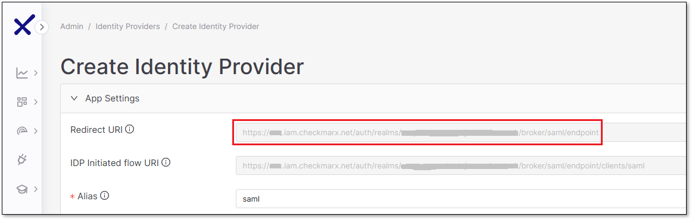
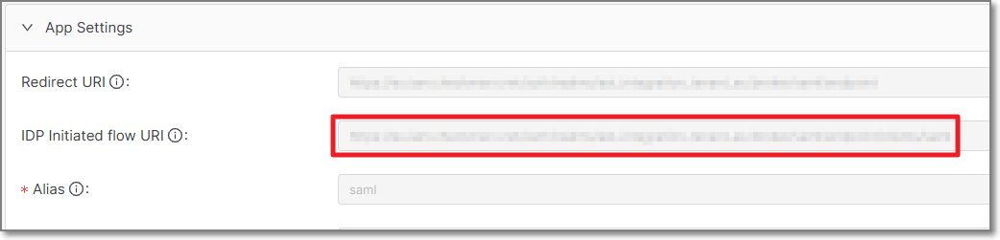
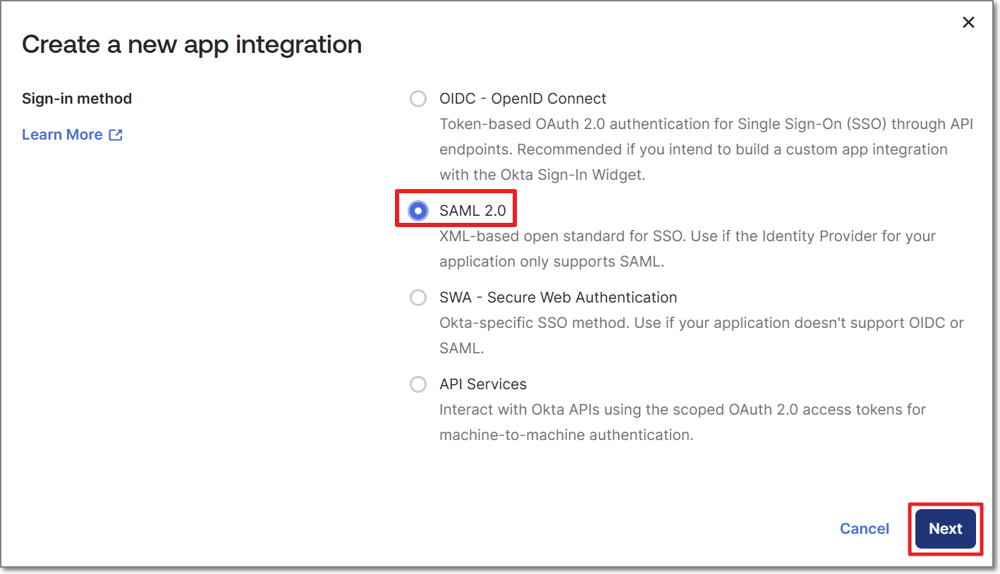
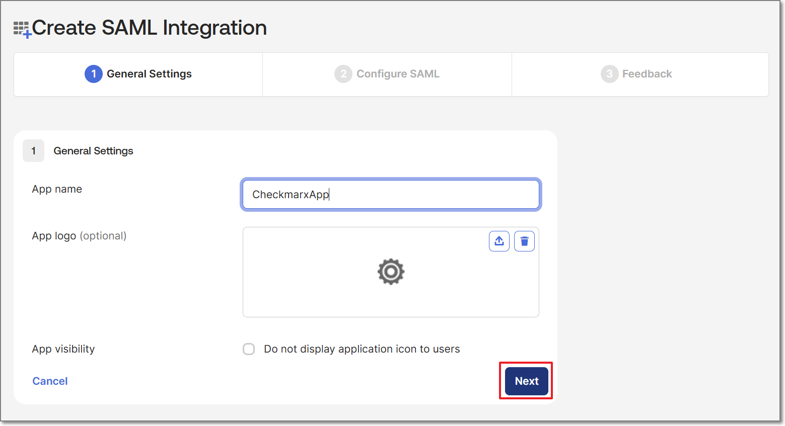
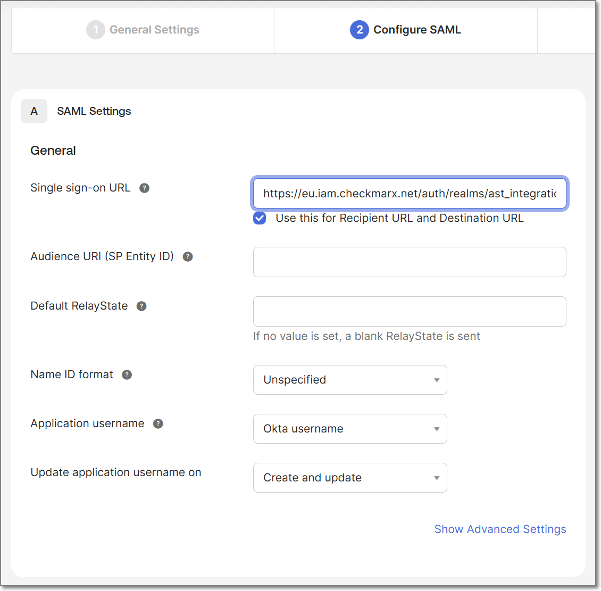
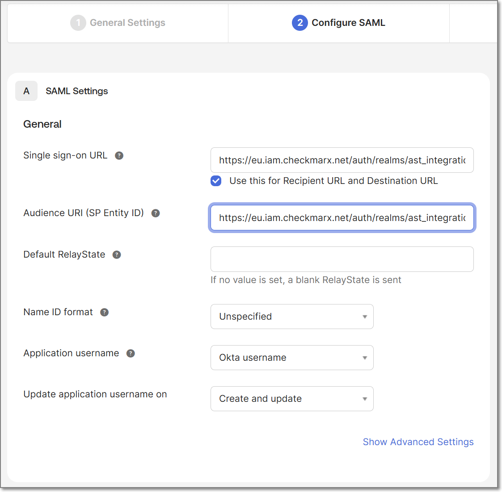
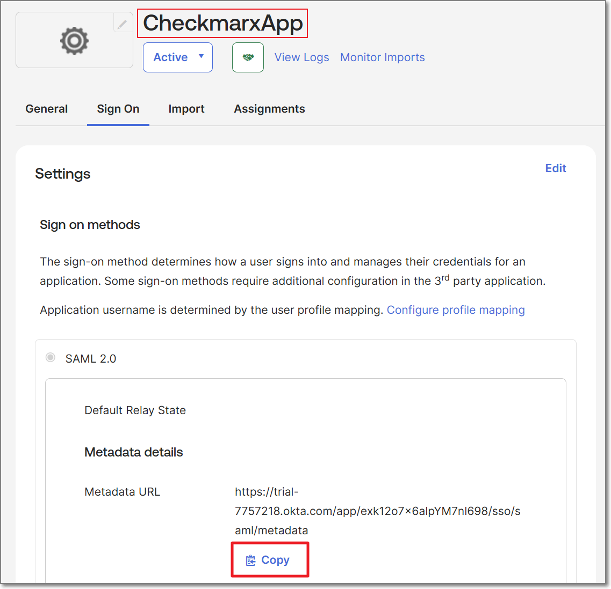
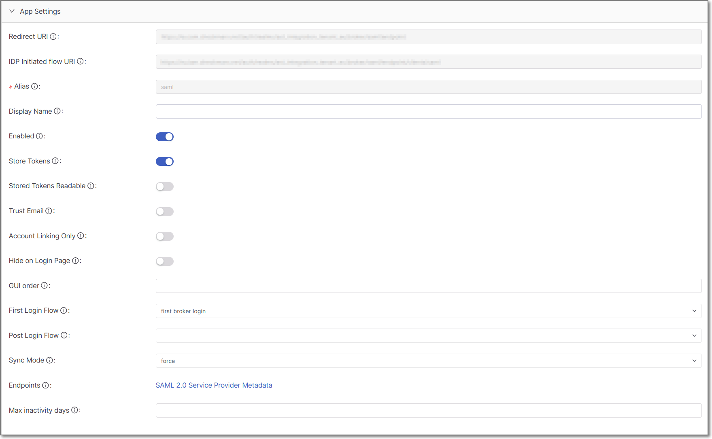
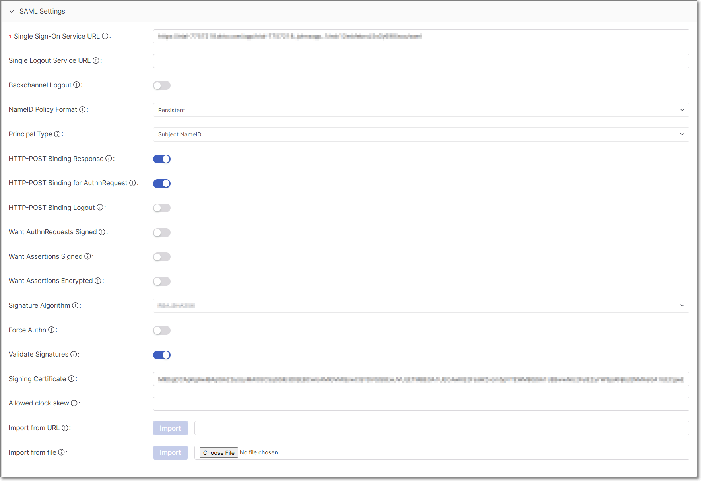
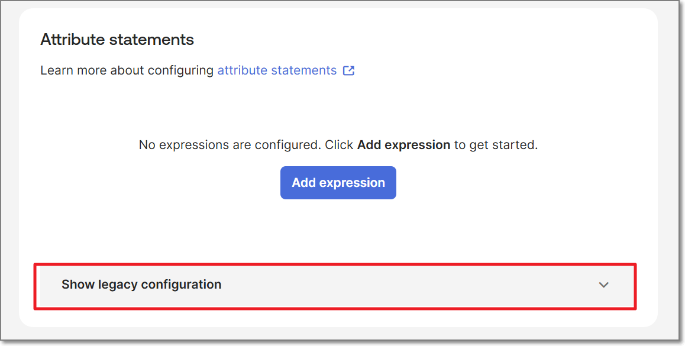

# Configuring SAML Integration with Okta

Configuring SAML integration requires working in both the Checkmarx One web application and Okta. This process includes establishing the SAML connection, configuring attribute mapping, and defining authorization to ensure users are granted the appropriate access after login.

The configuration process consists of three main stages: **Initial SAML Setup (Okta & Checkmarx)**, **Configure Attribute Mapping (Okta ↔ Checkmarx)**, and **Automating Access with SSO and Authorization**.

## Initial SAML Setup (Okta & Checkmarx)

This section describes the initial configuration required to establish a SAML integration between Checkmarx and Okta. During this process, you will create an identity provider in Checkmarx, configure a corresponding SAML application in Okta, and exchange the required metadata between the two systems to enable authentication.

When you complete this section, the SAML connection will be established and users will be able to authenticate via Okta. However, user attributes, roles, and group assignments are not yet configured. To complete the integration and ensure that user information is correctly passed and access is properly assigned, continue to the next section to configure attribute statements in Okta and corresponding mappers in Checkmarx.

### 1. Create Identity Provider in Checkmarx

1. Navigate to **settings**  > **Identity and Access Management** > **Identity Providers**.
2. Click **Create Identity Provider**.
3. In the side panel, verify that **SAML V2.0** is selected and click **Create**.

   The **Create Identity Provider** page is displayed.
4. Select and copy the URI that matches your desired sign-in flow:

   - **Checkmarx-initiated sign-in only**: copy the **Redirect URI**.

     
   - **Okta-initiated (and Checkmarx-initiated) sign-in**: copy **IDP Initiated flow URI**.

     

   You will need this URI in the next section.

### 2. Create a SAML App in Okta

1. Sign into Okta Admin Console using an admin account.
2. In the left-hand navigation, select **Applications** > **Applications**
3. Click **Create App Integration**.
4. In the popup window, select the SAML 2.0 radio button, and click **Next**.

   

   The **Create SAML Integration** screen is displayed.
5. In **General Settings**, name your app and click **Next**.

   
6. In **Configure SAML**, paste the URI copied in the previous section (**Redirect URI** or **IDP Initiated flow URI**, depending on your configuration) into the **Single sign-on URL** field:

   
7. In the **Audience URI (SP Entity ID)** field, paste the same URI up until and including your tenant name. The rest of the URI should not be included in this field.

   
8. Scroll down and click **Next**.
9. Click **Finish**.

   The Okta app is created and displayed on the screen:

   
10. On the new app's page, copy the metadata URL by clicking on **copy** (you will need this URL in the next section).

### 3. Import Okta Metadata into Checkmarx


This workflow uses only the basic configuration settings required to set up the integration. For a complete description of all available configuration options, see [Reference: Identity Provider Integration Settings](#reference-identity-provider-integration-settings).


1. Back in Checkmarx, in the **SAML Settings** of the **Create Identity Provider** page, paste the copied metadata URL (retrieved in step 10 of the last procedure) into the **Import from URL** field, and click **Import**.

   The relevant SAML settings from your Okta app are automatically filled in.
2. Click **Save**.

   The identity provider integration is created and displayed on the screen.
3. Confirm that your configuration matches the example shown below before proceeding:

   

   

## Configure Attribute Mapping (Okta ↔ Checkmarx)

In this section, you will configure attribute statements in Okta and corresponding mappers in Checkmarx to ensure that user identity data—such as name, email, roles, and groups—is correctly passed and interpreted during SAML authentication.

### 1. Assign Users and Groups to the Okta Application

After creating the Okta application, you must assign users and groups to it. If users or groups are not assigned, they will not be able to access the application via Okta, and SAML assertions will not include the necessary user or group information. As a result, attribute and group mapping in Checkmarx will not function as expected.

In the **Okta Admin Console**, navigate to your SAML application and open the **Assignments** tab. Click **Assign,** then select **Assign to People** to add individual users, or **Assign to Groups** to add groups.

If you are using group-based mapping, ensure that the relevant groups are assigned to the application. Only groups assigned to the application are included in the SAML assertion and available for mapping in Checkmarx. Ensure that the group names in Okta match the group names used in Checkmarx, as this determines how users are assigned to groups during login.

### 2. Configure Attribute Statements in Okta

1. In the Okta Admin Console, navigate to your SAML application.
2. Go to the **Sign On** tab.
3. Scroll to the **Attribute Statements** section.
4. Click **Show legacy configuration**.

   
5. Under **Profile attribute statements**, click **Edit**.
6. Add the following attribute statements:

   | Name | Name Format | Value |
   |---|---|---|
   | First Name | Unspecified | user.firstName |
   | Last Name | Unspecified | user.lastName |
   | Email | Unspecified | user.email |
   | Role | Unspecified | ast-viewer |
7. For **First Name**, **Last Name**, and **Email**, ensure the value uses the `user.` prefix.
8. For the **Role** attribute, you can set a constant value (e.g., `ast-viewer`) as a simple default. Alternatively, you can configure Okta to send different role values and map each one to a corresponding role in Checkmarx.
9. (Optional) Under **Group attribute statements**, add a new group attribute:

   | Name | Name Format | Filter | Value |
   |---|---|---|---|
   | Groups | Unspecified | Matches regex | `.*` (to include all groups), or adjust as needed |
10. Click **Save**

### 3. Configure Mappers in Checkmarx

In this section, you will configure SAML mappers in Checkmarx to process the attributes sent from Okta. These mappers define how incoming SAML attributes—such as user name, email, and role—are imported and assigned within Checkmarx. Each mapper corresponds to an attribute configured in Okta.


This workflow uses only the basic mapper types required to set up the integration. For a complete description of all available mapper types, see [SAML Mappers](#saml-mappers)


1. In Checkmarx, navigate to your Identity Provider Integration.
2. Go to the **Mappers** tab.

#### Create Attribute Mappers

Create the following mappers to match the attributes configured in Okta.

**First Name Mapper**

1. Click **Create**
2. Configure the following fields with these values:

   - **Name:** First Name
   - **Mapper Type:** Attribute Importer
   - **Attribute Name:** `First Name`
   - **User Attribute Name:** `firstName`
3. Click **Save**

**Last Name Mapper**

1. Click **Create**
2. Configure the following fields with these values:

   - **Name:** Last Name
   - **Mapper Type:** Attribute Importer
   - **Attribute Name:** `Last Name`
   - **User Attribute Name:** `lastName`
3. Click **Save**

**Email Mapper**

1. Click **Create**
2. Configure the following fields with these values:

   - **Name:** Email
   - **Mapper Type:** Attribute Importer
   - **Attribute Name:** `Email`
   - **User Attribute Name:** `email`
3. Click **Save**

**Role Mapper**

1. Click **Create**
2. Configure the following fields with these values:

   - **Name:** Role
   - **Mapper Type:** SAML Attribute to Role
   - **Attribute Name:** `Role`
   - **Attribute Value:** `ast-viewer` (or the value configured in Okta)
3. Under **Role**, click **Select a CxOne role** and choose the corresponding role.
4. Click **Save**

**Groups Mapper (if you configured a Groups attribute in Okta)**

1. Click **Create**
2. Configure the following fields with these values:

   - **Name:** Groups
   - **Mapper Type:** SAML groups Mapper
   - **Attribute Name:** `Groups`
3. Click **Save**

## Automating Access with SSO and Authorization

This section describes how to automatically grant users access to resources after SSO login.

Checkmarx introduces an additional **Authorization** layer that controls access to resources such as applications and projects. (for more details, see [New Access Management Capabilities](../new-access-management-capabilities.md))

As a result, SAML authentication alone does not grant users access to these resources.

Previously, users could gain access based solely on roles or SSO configuration. With the current model, access must be explicitly granted through **Authorizations**, which can be assigned to either individual users or groups. If no authorization is assigned, users may successfully authenticate via SSO but will not have access to applications or projects.

### Use Group-Based Authorization

To maintain automated access with Okta, configure group-based authorization as follows:

1. In Checkmarx, create groups that represent the access you want to grant (for example, Developers or Admins).
2. Assign these groups to the required **Authorizations** (tenant, application, or project level).
3. In Okta, ensure that users are assigned to groups with the same names as the groups created in Checkmarx, and that those groups are assigned to the Okta application.
4. In Okta, configure a **Group attribute statement** in the application (for example, using a filter such as `.*`) so that group membership is included in the SAML assertion.
5. In Checkmarx, configure a **SAML groups Mapper** so that group membership from Okta is mapped to the corresponding groups.

### Result

With this configuration in place, when a user logs in via SSO, Checkmarx automatically imports the user and assigns them to the appropriate groups based on the values received in the SAML assertion from Okta. Each group value is matched to a corresponding group in Checkmarx, and if the group does not already exist, it may be created automatically depending on the configuration. Because these groups are pre-assigned to Authorizations, users automatically inherit access to the relevant applications, projects, and other resources upon login, eliminating the need for manual assignment in the Authorization settings.

## Reference: Identity Provider Integration Settings


This section provides a full reference of available configuration options. Most settings are optional and are not required for the standard setup described in this guide.



Mandatory fields are marked with 


### App Settings

This configuration section refers to the **IAM** (Broker) side.

Below are all the configuration options that exist in this section.

| **Parameter** | **Description** | **Default** | **Notes** |
|---|---|---|---|
| **Redirect URI** | Client redirect URI | | |
| **IDP Initiated flow URI** | Used when login process is expected to start from the IDP side | | |
| **Alias** | The alias that uniquely identifies the identity provider. It is also used to build the redirect URI | | |
| **Display Name** | The name that will be presented in the identity provider’s table | | |
| **Enabled** | | **On** | |
| **Store Tokens** | Determine if to save the token in Checkmarx One DB in an encoded format, after the users' authentication | **Off** | |
| **Stored Tokens Readable** | Determine if to save the token in Checkmarx One DB in a Decoded format, after the users' authentication | **Off** | |
| **Trust Email** | | **Off** | • **On:** The provided email is not verified even if verification is enabled for the relm. • **Off:** The provided email is verified. |
| **Account Linking Only** | | **Off** | • **On:** Users cannot log in through this provider, they can only link to this provider. This is useful if you don't want to allow login from the provider but want to integrate with the provider. • **Off:** Users can log in through this provider. |
| **Hide on Login Page** | Determine if to hide the external provider icon in the Checkmarx One log in page | **Off** | |
| **GUI order** | Set the external providers icons order in the Checkmarx One log in page | | • 1 is the highest value. • This is useful when using several external providers. |
| **First Login Flow** | Alias of the authentication flow, which is triggered after the first login with this IDP. | First broker login | |
| **Post Login Flow** | Alias of the authentication flow, which is triggered after each login with this IDP | | Useful for additional verification of each user authenticated with this IDP |
| **Sync Mode** | Default sync mode for all mappers. Determines when user data will be synced using the mappers. | | • **legacy** - Keep the behavior before this option was introduced. • **import** - Import the user only once during the first login with this IDP. • **force** - Always update the user during every login with this IDP. |
| **Endpoints** | Shows the configuration of the Service Provider endpoint | | |
| **Max inactivity days** | The number of days an SSO user can remain inactive before the account is deactivated. | 30 | Valid values are **1–365**. If left blank, the default value of 30 days is applied. When an account is deactivated due to inactivity, its associated API keys are also deactivated. Logging in again reactivates the account and its API keys. |

### SAML Settings

This configuration section refers to the **external provider** side (not the client).

Below are all the configuration options that exist in this section.

| **Parameter** | **Description** | **Default** | **Notes** |
|---|---|---|---|
| **Single Sign-On Service URL** | The URL that is used for SAML SSO log in authentication requests | | |
| **Single Logout Service URL** | The URL that is used for *external provider log out* authentication requests | | For a user to log out from the external provider (When performing log out from Checkmarx One), you need to perform the following: • **Single Logout Service URL** needs to be filled with the log out URL address. • **Backchannel Logout** option needs to be enabled. |
| **Backchannel Logout** | In case this option is enabled, it supports logging out from the identity provider when logging out from Checkmarx One | **Off** | |
| **NameID Policy Format** | Specifies the URI reference corresponding to a name identifier format, or in other words, how to send the details in the SAML XML assertion format | **Persistent** | Optional Values: Persistent, Email, Kerberos, X.509 Subject Name, Windows Domain Qualified Name, Unspecified |
| **Principal Type** | Specifies which part of the SAML assertion XML will be used to identify and track external user identities | **Subject NameID** | • Optional Values: Subject NameID, Attribute \[Name\], Attribute \[Friendly Name\] • If **Attribute \[Name\] / Attribute \[Friendly Name\]** is selected, an additional **Principal Attribute** field will be added. |
| **HTTP-POST Binding Response** | Indicates how the external provider returns the information to the client | **Off** | • **On:** Use POST for Binding Response. • **Off:** HTTP-Redirect Binding will be used (GET) |
| **HTTP-POST Binding for AuthnRequest** | Indicates which SAML binding should be used when the client requests authentication from the external provider | **Off** | • **On:** Use POST for Binding Response. • **Off:** Redirect Binding will be used (GET) |
| **HTTP-POST Binding Logout** | Indicates which SAML binding should be used for logging out from the external provider | **Off** | • **On:** Use POST for Binding Response. • **Off:** HTTP-Redirect Binding will be used (GET). • If value is On, the system will use the **Single Logout Service URL** value for logging out. |
| **Want AuthnRequests Signed** | Indicates whether the identity provider expects a signed AuthnRequest | **Off** | In case this value is **On**, 2 additional fields will be added: • **Signature Algorithm:** Which signature algorithm to use for signing documents. Optional values are: RSA_SHA256 (Default), RSA_SHA1, RSA_SHA512, DSA_SHA1 • **SAML Signature Key Name:** Signed SAML documents contain identification of signing key in the KeyName element. Optional values are: Empty value (Default), None, KEY_ID, CERT_SUBJET |
| **Want Assertions Signed** | Indicates whether this service provider expects a signed Assertion | **Off** | |
| **Want Assertions Encrypted** | Indicates whether this service provider expects an encrypted Assertion | **Off** | |
| **Force Authentication** | Indicates if to force the user’s authentication, even if the user is already logged in to the external provider | **Off** | |
| **Validate Signature** | Enable/disable signature validation of SAML responses | **Off** | If this value is **On**, an additional **Validating X509 Certificates** field will be added. This is an indication of the certificate in PEM format that must be used for checking signatures. Multiple certificates can be entered, separated by a comma. |
| **Allowed clock skew** | Clock skew in seconds that is tolerated when validating identity provider tokens | **zero** | |
| **Import from URL** | Import metadata from a remote identity provider SAML entity descriptor | | |
| **Import from file** | Import metadata from a file | | If the import is being performed using a file, there is a need to click the **Select file** button, and to select the requested file. |

### SAML Mappers

The following are the SAML mappers available in Checkmarx One, along with their descriptions:

- **Username Template Importer**: Allows formatting the username to import via template.
- **Advanced Attribute to Role**: If the set of attributes exists and can be matched, grant the user the specified realm or client role.
- **XPath Attribute Importer**: Extract the text of a SAML attribute via XPath expression and import it into the specified user property or attribute.
- **SAML groups Mapper**: Allows you to map values from the SAML attribute directly to Checkmarx groups. Missing groups are created automatically.
- **Hardcoded User Session Attribute**: When a user is imported from a provider, a value is hardcoded to a specific user session attribute.
- **Attribute Importer**: Import the declared SAML attribute into the specified user property or attribute.
- **Hardcoded Role**: When a user is imported from the provider, it hardcodes a role mapping.
- **SAML Attribute to Groups**: Allows mapping of SAML attribute to one or more groups
- **Hardcoded Group**: Assigns the user to the specified group.
- **Advanced Attribute to Group**: If all attributes exist, the user is assigned to the specified group.
- **Hardcoded Attribute**: When a user is imported from a provider, a value is hardcoded to a specific user attribute.
- **SAML Attribute to Role**: If an attribute exists, this grants the user the specified realm or client role.
