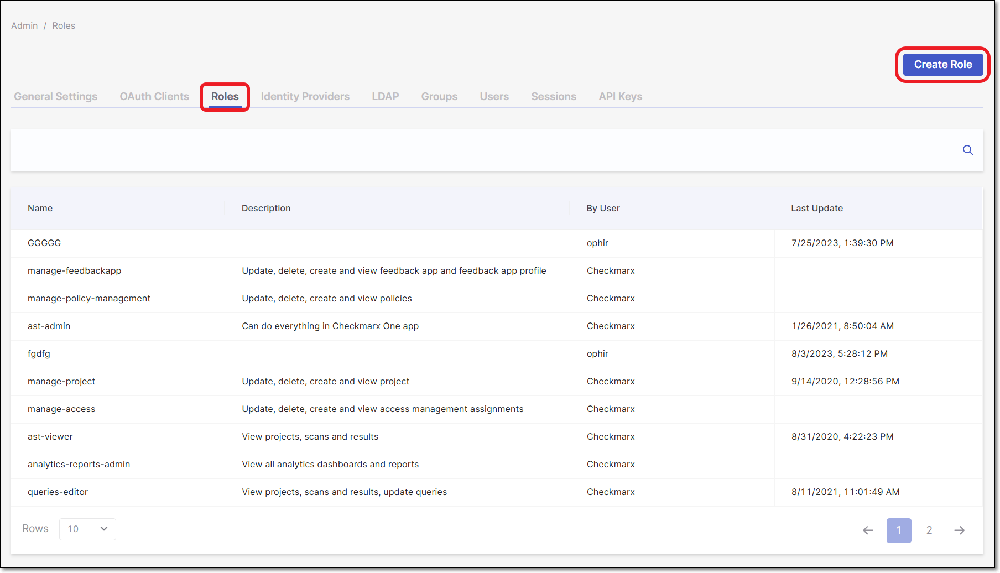
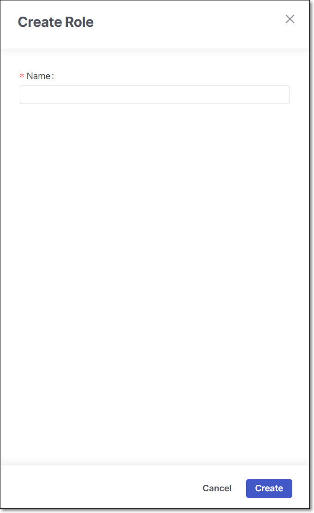
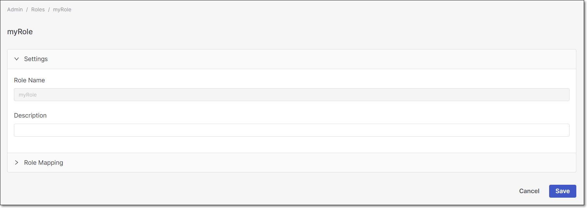
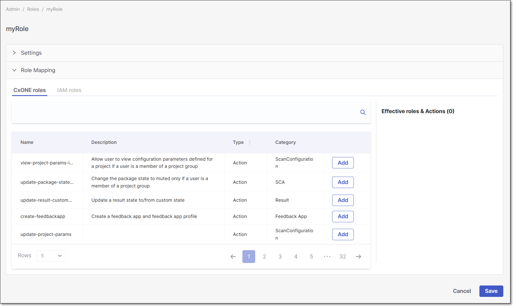

# Managing Roles

## Creating New Roles

To create new roles, perform the following steps:

1. Log in to Checkmarx One and click on **Settings > Identity and Access Management** in the Menu panel.

   <figure><figcaption></figcaption></figure>
2. In the **Identity and Access Management** console, navigate to the **Roles** tab and then click **Create Role**.

   <figure><figcaption></figcaption></figure>

   The **Create Role** window opens.

   <figure><figcaption></figcaption></figure>
3. In the **Name** field, enter a descriptive name for the role and click **Create**.

   The role configuration window opens.

   <figure><figcaption></figcaption></figure>
4. In the **Settings** section, write the role's **Description** (Optional). You should include the purpose for which you created the role.
5. Expand the **Role Mapping** section.

   <figure><figcaption></figcaption></figure>
6. Add (Composite and/or Action) roles from the **CxOne roles** and **IAM roles** tabs by clicking the relevant **Add** buttons.
7. Click **Save**. The new composite role is added to the composite roles list.

## Checkmarx One Roles

The following table lists the roles in Checkmarx One, along with their respective permissions:

| Name | Category | Permission |
|---|---|---|
| update-access | Access Management | Create, update and delete access management assignments |
| manage-access | Access Management | Update, delete, create and view access management assignments |
| view-access | Access Management | View access management assignments |
| send-report-email | Analytics | Send report to email |
| analytics-scan-dashboard-view | Analytics | View scan dashboard |
| manage-reports | Analytics | Export, share the dashboard, and generate a report |
| analytics-engineering-dashboard-view | Analytics | View engineering dashboard |
| analytics-reports-admin | Analytics | View all analytics dashboards and reports |
| analytics-vulnerability-dashboard-view | Analytics | View vulnerability dashboard |
| analytics-executive-overview-view | Analytics | View executive overview dashboard |
| view-applications | Application | View applications |
| create-application | Application | Create an application |
| update-application | Application | Update an application |
| manage-application | Application | Update, delete, create and view application |
| delete-application | Application | Delete an application |
| import-findings-external-platforms | BYOR | Import SARIF-formatted results into a project |
| update-cloud-connections | Cloud Connection | Update a Cloud Connection |
| manage-cloud-connections | Cloud Connection | Manage a Cloud Connection |
| create-cloud-connections | Cloud Connection | Create a Cloud Connection |
| view-cloud-connections | Cloud Connection | View a Cloud Connection |
| delete-cloud-connections | Cloud Connection | Delete a Cloud Connection |
| view-cnas | CNAS | View CNAS resources |
| manage-cnas | CNAS | Manage CNAS resources, including viewing, updating, creating, deleting |
| view-codebashing | Codebashing | View Codebashing application |
| dast-update-environment | DAST | User is able to update an Environment in DAST |
| dast-cancel-scan | DAST | User is able to cancel a Scan in DAST |
| dast-delete-scan | DAST | User is able to delete a Scan in DAST |
| dast-create-environment | DAST | User is able to create a new Environment in DAST |
| dast-update-result-state-propose-not-exploitable | DAST | Update the state of results only to Propose Not Exploitable and add notes |
| dast-create-scan | DAST | User is able to create a new Scan in DAST |
| dast-high-level-update-result-states | DAST | Change a DAST result to any state (except not exploitable) |
| dast-admin | DAST | Manage Environments, Scans, update results and execute other actions in DAST |
| dast-update-result-states | DAST | Change a DAST result to any state (except propose not exploitable and not exploitable) |
| dast-update-result-state-not-exploitable | DAST | Update the state of results only to Not Exploitable and add notes |
| dast-view-environments | DAST | User is able to view Environments in DAST |
| dast-update-result-severity | DAST | Update result severities |
| dast-delete-environment | DAST | User is able to delete an Environment in DAST |
| dast-external-scans | DAST | CI/CD user for executing actions related to External Workers |
| dast-update-scan | DAST | User is able to update a Scan's properties in DAST |
| dast-add-notes | DAST | Add notes |
| dast-update-results | DAST | User is able to update results in DAST (severity, comments |
| update-locked-scans | Data Retention | Lock or unlock scans |
| manage-data-retention | Data Retention | Manage data retention |
| abort-data-retention | Data Retention | Abort data retention |
| view-data-retention | Data Retention | View data retention |
| start-data-retention | Data Retention | Start data retention |
| view-engines | Engine | View engines |
| update-feedbackapp | Feedback App | Update a feedback app and feedback app profile |
| create-feedbackapp | Feedback App | Create a feedback app and feedback app profile |
| view-feedbackapp | Feedback App | View feedback app and feedback app profile |
| manage-feedbackapp | Feedback App | Update, delete, create and view feedback app and feedback app profile |
| delete-feedbackapp | Feedback App | Delete a feedback app and feedback app profile |
| view-audit-trail | General | Get the audit trail for the whole system |
| ast-admin | General | Can do everything in Checkmarx One app |
| open-feature-request | General | Allow service user to open feature request |
| queries-editor | General | View projects, scans and results, update queries |
| ast-scanner | General | Scan, manage results, manage projects |
| ast-viewer | General | View projects, scans and results |
| view-contributors | General | Download the contributing developers list (csv) |
| manage-advanced-triage-setting | General | Allows users to enable or disable the Advanced Triage capability in the SAST engine |
| open-support-ticket | General | Open support ticket |
| order-services | General | Allow to order onboarding and result reviews services |
| access-iam | IAM | Allow user to access IAM |
| manage-scm-configuration | Integrations | Manage SCM configurations |
| create-scm-configuration | Integrations | Create a SCM configuration |
| view-scm-configuration | Integrations | View a SCM configuration |
| update-scm-configuration | Integrations | Update a SCM configuration |
| delete-scm-configuration | Integrations | Delete a SCM configuration |
| view-license | License | View license |
| view-links | Links | User can only view the table and details drill down |
| create-links | Links | User can create links in the proper button |
| delete-links | Links | User can delete links |
| manage-links | Links | Update, delete, create and view links |
| update-links | Links | User can update fields in the drill down |
| update-policy-management | Policy Management | Update policies |
| delete-policy-management | Policy Management | Delete policies |
| create-policy-management | Policy Management | Create policies |
| override-policy-management | Policy Management | Override Policy Management evaluation |
| view-policy-management | Policy Management | View policies |
| manage-policy-management | Policy Management | Update, delete, create and view policies |
| delete-pool | Pool | Delete a pool |
| create-pool | Pool | Create a pool |
| update-pool | Pool | Update a pool |
| view-pools | Pool | View pools |
| view-preset | Preset | View preset |
| delete-preset | Preset | Delete preset |
| create-preset | Preset | Create or clone preset |
| update-preset | Preset | Update preset |
| view-projects | Project | View projects |
| create-project | Project | Create a project |
| manage-project | Project | Update, delete, create and view project |
| assign-project-all-groups | Project | Grants the ability to assign any existing group when creating or updating a project |
| update-project | Project | Update a project |
| assign-to-application | Project | Assign project to application |
| delete-project | Project | Delete a project |
| update-query | Query | Update a query |
| delete-query | Query | Delete a query |
| view-queries | Query | View queries |
| create-query | Query | Create a query |
| manage-vulnerability-assignees | Result | Assign IAM users/groups to vulnerabilities for ownership & email notification upon assign. Requires IAM manage-users and manage-groups roles |
| update-result | Result | Update results |
| delete-result-custom-state | Result | Delete a custom state |
| update-result-severity | Result | Update result severities |
| view-results | Result | View results |
| add-notes | Result | Add notes |
| update-result-not-exploitable | Result | Update results state to Not exploitable |
| update-result-custom-state | Result | Update a result state to/from custom state |
| update-result-state-not-exploitable | Result | Update the state of results only to Not Exploitable |
| create-result-custom-state | Result | Create a new custom state |
| update-result-state-propose-not-exploitable | Result | Update the state of results only to Propose Not Exploitable |
| update-result-states | Result | Update the state of results for all available states, except for Not Exploitable |
| view-risk-management-tab | Risk Management | View the risk-management tab content |
| view-risk-management-dashboard | Risk Management | View top 10 most risky applications |
| view-risk-management | Risk Management | View risk management |
| update-risk-management | Risk Management | Update risk management |
| ast-risk-manager | Risk Management | Manage applications, projects, scan, results, risks and policies |
| delete-runtime-cloud | Runtime & Cloud | Ability to delete a runtime and cloud configuration |
| create-runtime-cloud | Runtime & Cloud | Ability to create a new runtime and cloud configuration |
| view-runtime-cloud | Runtime & Cloud | Ability to view a runtime and cloud configuration |
| update-runtime-cloud | Runtime & Cloud | Ability to update a runtime and cloud configuration |
| sast-migration | SAST Migration | Ability to import data from SAST |
| update-package-state-snooze | SCA | Change the package state to snoozed |
| update-sca-license-state | SCA | Change the state of a license |
| add-package | SCA | Manually add a package to a project |
| update-package-state-mute | SCA | Change the package state to muted |
| update-sca-license-properties | SCA | Change the properties of a license |
| update-schedule-scan | Scan | Change, activate, deactivate scheduled scans |
| delete-scan | Scan | Delete a scan |
| create-scan | Scan | Initiate a scan |
| create-schedule-scan | Scan | Create new scheduled scan |
| delete-schedule-scan | Scan | Delete scheduled scan |
| view-scans | Scan | View scans |
| view-schedule-scans | Scan | View scheduled scans |
| update-scan | Scan | Cancel a scan |
| view-project-params | ScanConfiguration | Allow user to view configuration parameters defined for a project |
| update-tenant-params | ScanConfiguration | Allow user to update configuration parameters defined for the current tenant |
| view-tenant-params | ScanConfiguration | Allow user to view configuration parameters defined for the current tenant |
| update-project-params | ScanConfiguration | Allow user to update configuration parameters defined for a project |
| download-source-code | Source code | Download source code |
| delete-webhook | Webhook | Delete a webhook |
| manage-webhook | Webhook | Update, delete, create and view webhook |
| create-webhook | Webhook | Create a webhook |
| update-webhook | Webhook | Update a webhook |
| view-webhooks | Webhook | View webhooks |

### Pre-Configured Roles

Checkmarx One comes with several pre-configured roles, each of which comprises the set of permissions needed for that role.

#### plugin-scanner

The plugin-scanner role includes all permissions needed for running an end-to-end flow of triggering a scan and viewing results using Checkmarx One plugins.

| Name | Category | Permission |
|---|---|---|
| view-applications | Application | View applications |
| update-application | Application | Update applications |
| view-policy-management | Policy Management | View policies |
| manage-reports | Analytics | Export, share the dashboard, and generate a report |
| view-projects | Project | View projects |
| create-project | Project | Create a project |
| update-project | Project | Update a project |
| assign-to-application | Project | Assign project to application |
| view-results | Result | View results |
| create-scan | Scan | Initiate a scan |
| view-scans | Scan | View scans |
| update-scan | Scan | Cancel a scan |
| view-project-params | ScanConfiguration | Allow user to view configuration parameters defined for a project |
| update-tenant-params | ScanConfiguration | Allow user to update configuration parameters defined for the current tenant |
| view-tenant-params | ScanConfiguration | Allow user to view configuration parameters defined for the current tenant |
| update-project-params | ScanConfiguration | Allow user to update configuration parameters defined for a project |

## IAM Roles

IAM roles are related to the actions available in the User and Access Management console.

The following table lists the action roles that are provided for Checkmarx One, along with their respective permissions:

| **Checkmarx One IAM Roles** | **Permissions** |
|---|---|
| iam-admin | • Manages general settings, users, client credentials, identity provider, and user federation • iam-admin also inherits the ast-admin role (by design) |
| manage-clients | Manage O-Auth clients |
| manage-keys | View, create, edit, and delete API keys |
| manage-groups | Manages groups in the system |
| manage-users | Manages the users in the system |
| user | Access to query groups and OAuth client, view tenant configuration |
| assign-project-all-group | Allows assigning any existing group when creating or updating a project. |
| view-access | Allows viewing endpoints |
