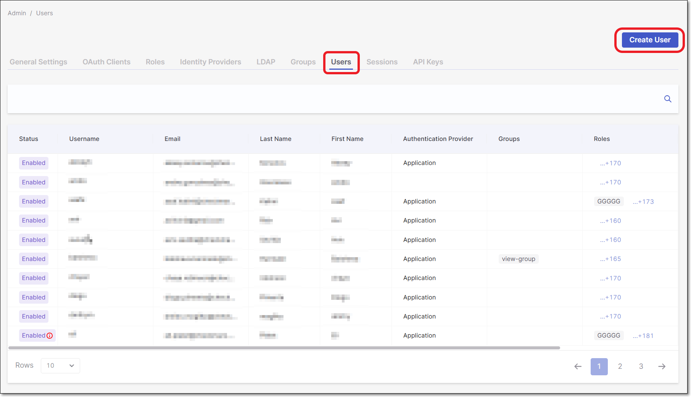
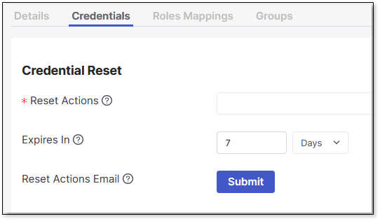

# Managing Users

## Creating a User

Only an Administrator can create new user accounts in the system.


Mandatory fields are marked with 


To create a new user:

1. Navigate to **Settings > Identity and Access Management**.
2. In **Identity and Access Management** , open the **Users** tab.

   <figure><figcaption></figcaption></figure>
3. Click **Create User**.

   The **Create User** dialog is displayed.
4. Configure the **Username**.
5. Enter the user's **Email**, **First Name** , and **Last Name**.
6. In the **Other** field, you may enter additional information regarding the user.
7. Set **User Enabled** to **ON** to activate the user on the system.

   The **OFF** setting allows the administrator to control when a user is activated on the system. The account remains inactive until it is toggled to **ON**.
8. Optionally, enable **Enforce SSO-Only Access**. This option prevents the user from logging in with a username and password, and ensures that the user can log in only through Single Sign-On (SSO).

   **Enforce SSO-Only Access** is linked to the global **Enable SSO-Only Access Login** setting in [Login & Session Management](general-settings.md#login-session-management):

   - If the global setting is disabled, the **Enforce SSO-Only Access** field is not available in the **Create User** dialog.
   - If the global setting is enabled, Enforce SSO-Only Access is applied automatically to all users except those covered by the configured exception (e.g., tenant owner or tenant owner + iam-admin).
9. Set **Email Verified** to **ON**.

   The system emails a link to the user’s email address. When the user clicks on the link, they must update the password, verify the email, and configure a one-time password.
10. Set the **Required User Action** to **Update Password** when the password needs to be reset on the next login.
11. Click **Save**.


After a user is created, a new entry is added to the list in the **Users** tab. In the user settings (accessible from the three-dot menu), two additional fields appear that are not part of the creation dialog: **ID** and **Created At**. These fields are automatically generated when the user is created and cannot be edited.


### Assigning Roles to Users


Click [here](https://docs.checkmarx.com/en/34965-68603-managing-roles.html) for more information on Roles.


Perform the following to assign roles to users:

1. Navigate to **Settings** and select **Identity and Access Management**.
2. Click on the **Users** tab. This displays all users in your environment.
3. At the end of the user's row, click , then **Edit**.
4. Click on the **Roles Mapping** tab. This displays all roles that are available to map to the user.
5. Select the roles you wish to assign to the user by clicking **Add**.
6. Click **Save** when done.

   
   Navigating away from the tab before clicking **Save** will not assign the roles successfully.
   

### Assigning Users to Groups

Perform the following to assign users to groups:

1. Navigate to **Settings** and select **Identity and Access Management**.
2. Click on the **Users** tab. This displays all users in your environment.
3. At the end of the user's row, click , then **Edit**.
4. Click on the **Groups** tab. This displays all groups the user is in and ones available to join.
5. Select the groups you want the user to join by clicking **Join**. Select the groups to leave by clicking **Leave**.
6. Click **Save** when done.

## Managing User Credentials

### Set Password

To set a user's password, at the end of the user's row, click , **Edit**, and navigate to the **Credentials** tab to fill out the relevant fields.

#### Password Restrictions

When setting a password, certain special characters or character combinations (for example, parentheses () or sequences involving `@#)` may result in a 403 Forbidden error.

This occurs because the AWS Web Application Firewall (WAF) may interpret these patterns as potential cross-site scripting (XSS) or SQL injection attempts and block the request before it reaches the application.


- This behavior is enforced by the built-in security rules of AWS WAF, not by Checkmarx One.
- Checkmarx One itself supports these characters; however, the request may be blocked at the WAF level during processing.


To avoid this, use a password that doesn't include parentheses () or @# sequences. Other special characters such as !, -, _, and $ are generally safe. Example of a valid password: 1stPASSWORD-123.

### Credentials Reset

To ensure that a user resets their password:

1. Select **Update Password** from the **Reset Actions** option.
2. Enter the maximum time before the credential reset expires. Type in the number and select **Minutes**, **Hours** , or **Days** from the dropdown list. Once it has expired, the administrator will need to reset it.
3. Click **Submit**.

   An email with an embedded link is sent to the user.

   The reset action can be executed by following the link without logging into the system.
