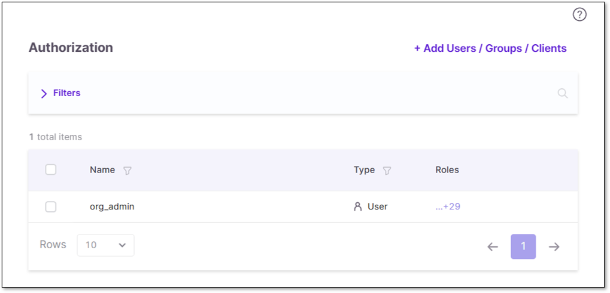

# New Access Management Capabilities

Checkmarx One's Access Management has undergone significant improvements. The new approach offers more granular and precise control over user access and permissions, focusing on simplicity, usability, and intuitiveness. Users, groups, and clients can now be assigned to various resources, which will determine their hierarchical access levels within the system.

The [existing Access Management](https://docs.checkmarx.com/en/34965-68600-user-management-and-access-control.html) model lacks the flexibility large organizations need, leading to inefficiencies and security risks. Its limited hierarchy, absence of role reuse, and poor alignment with real-world organizations make access difficult to control, govern, and audit. Two solutions have been introduced to address these gaps: hierarchical access control using resource levels and a universal role system with inherited privileges.

## Resource Levels

One of the new features in Access Management involves assigning entities (Users, Groups, and Clients) with various resources and determining their hierarchical access levels within Checkmarx One. Three resource levels are introduced: Tenant, Application, and Project. Users with `manage-access` permissions can assign users, groups, and clients to a resource level through its **Authorization** tab.

Every resource level's **Authorization** tab displays an identical table view of its assigned entities, entity type, and roles.

Below is a breakdown of the different resource levels and how to navigate to their **Authorization** tab:

- **Tenant Level:** Users assigned at the tenant level can access all components (applications, environments, and projects within) the tenant across Checkmarx One. To view assignments at this level, perform the following:

  1. Go to **Settings**.
  2. Select **Global Settings**.
  3. Click **Authorization**.
- **Application Level:** Users assigned at the application level gain access to all projects and environments associated with that application. To view assignments at this level, perform the following:

  1. Navigate to the **Applications** page.
  2. At the end of the desired application's row, click .
  3. Select **Application Settings**.
  4. Click **Authorization**.
- **Project Level:** Users assigned at the project level have access only to the specified project. To view assignments at this level, perform the following:

  1. Go to the **Projects** page.
  2. At the end of the desired project’s row, click .
  3. Select **Project Settings**.
  4. Click **Authorization**.
- **Environment Level:** (DAST only) - Groups (and their users) assigned at the environment level have access only to the specified environment, it's associated applications, and projects within. To view assignments at this level, perform the following:

  1. Go to the **Environments** page.
  2. At the end of the desired environment’s row, click .
  3. Select **Settings**.
  4. Click **General & Config Files** > **Groups Permissions**.

### Managing the Authorization Table

To add an entity to the resource, perform the following:

1. Click **+ Add Users/Groups/Clients**.
2. Search for and select the desired entity.
3. Click **Done** to confirm.

Entities can be deleted (unassigned) from a resource by clicking  at the end of its row and  **Delete**.

The table is searchable , and can be filtered and sorted according to your needs.

Before filtering the columns, adjust the table **Rows** view to your liking. The table's default setting displays 10 rows of results per page, as indicated in the **Rows** dropdown. Select the dropdown to toggle the view to 20, 50, or 100 rows.

Hover over a column header, click the filtering icon , and select your filter(s) from the dropdown list or search. Applied filters are listed in the **Groups & Filters** bar.

Hover over a column header and click the sorting icon  to toggle between sorting in ascending or descending order.

## Universal Roles and Privilege Inheritance

Admins can now use the centralized Identity and Access Management (IAM) module to ensure users' roles are universal across the platform and align with their access in Checkmarx One.

Roles are not project-specific but rather platform-wide. For example, a user is associated with Application A and assigned the role of `ast-scanner`. In this case, the user assumes this role universally across all projects associated with Application A.

If Application A contains two projects, a user with the `ast-scanner` role at the application level will have scanning privileges across both projects. If a new project is created within Application A, the user also inherits scanning privileges in this new project.

## Obsolescence of “if-in-group” Roles

Previously, the `if-in-group` roles were used to restrict access to specific areas by granting certain permissions or access rights based on the user's membership in specific groups.

In the current context of Access Management, this approach to role enforcement has become obsolete.

In the new architecture, users, groups, and clients are directly associated with the resources, such as tenants, applications, or projects, providing a simpler way of restricting group access according to the organization's needs.

## Customer Impact During Transition

The transition has been carefully designed to ensure minimal impact on customers:

- **Role Conversion:** All roles with `if-in-group` are automatically converted to roles without `if-in-group`, rendering them obsolete, but this change has no impact on functionality.
- **Group Association:** Groups already linked directly to a project or application are automatically reassigned to their respective resources. However, if a user previously saw an application because the project they were assigned to was linked to that application, they will no longer see the application automatically after migration and must be explicitly assigned to the application to regain visibility.
- **User Adjustment:** Users without `if-in-group` roles will be moved to the Tenant level. Administrators can now associate these users with different applications and/or projects without causing any disruption.
- **Access Restoration:** Users with `if-in-group` roles will regain access through their group association, ensuring a smooth transition with no impact.
- **API Consistency:** All existing APIs continue functioning as before, ensuring backward compatibility. New APIs have also been introduced to allow the association of users and groups with resources.

## Pre-Migration Preparation

Before starting the migration, make sure to:

- Identify the roles your team needs for day-to-day work.
- Verify that groups are assigned to the correct projects.
- Review any use of conditional logic (such as “if-in-group”) - these will not be migrated automatically and must be reassigned.
- List your API clients and confirm their required permissions.


If your setup depends on implicit group logic rather than explicit assignments, your CI/CD pipelines may fail after the update. Update these assignments in advance.


## Post-Migration Actions

After the migration, you should:

- Review group, user, and project access in the Access Management UI.
- Test key workflows, including scans, project updates, and API calls.
- If something fails, update OAuth clients with the required Fine-Grained Access Control (FGAC) roles.
- If access is missing, reassign the group or directly assign the user or service account.

## Troubleshooting

| Issue | Likely Cause | How to Fix |
|---|---|---|
| User cannot see a project | The group was never explicitly assigned; access relied on old “if-in-group” logic. | Assign the group (or user) directly to the project in Access Management. |
| User cannot see an environment | The group had no explicit assignments before migration. | Assign the group (and its users) directly to the Environment in Access Management. |
| User sees too many projects | A tenant-level role was added during migration. | Remove the tenant-level role and reassign only the scoped roles needed. |
| 403 error when opening project settings | Missing FGAC permission (e.g., `view-preset`). | Add the required FGAC permission to the role and retest. |
| API client or pipeline fails | Client is missing FGAC roles, or automation relied on implicit permissions. | Add the required roles (e.g., `update-access`, `create-project`) and retry. |
| Group shows “No Assignments” | The group had no explicit assignments before migration. | Assign the group to the required projects/applications. |
| Service account lost access | Group was not assigned to a resource. | Reassign the group, or directly assign the service account to the resource. |
| Pipeline fails to create a project with the following error: `Failed creating a project: CODE: 208, Failed to create a project, project name 'webapp' already exists` | Account (user API or Client ID) does not have access to see the existing project. Pipeline tries to create a new project but then fails as the project exists. | Add the user or client to the required authorization level for project visibility (global, application, project). |
