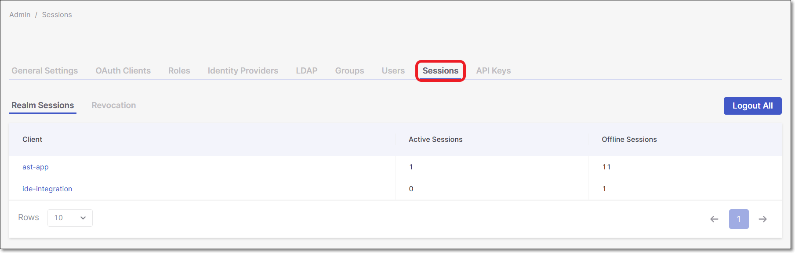
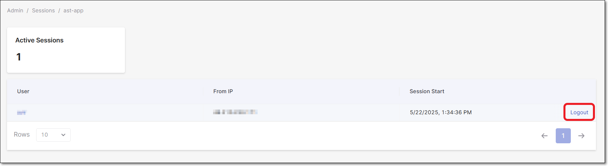
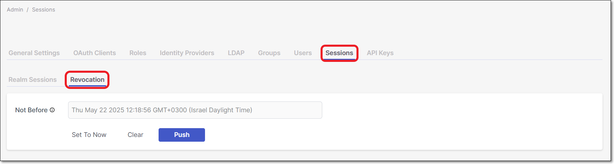

# Sessions

Administrators can quickly view active realm sessions or environments from the list of clients displayed on the system and manage sessions from this screen. For instance, if a user is no longer with the company but still has an active session, the administrator can log them out.

Checkmarx One does not limit the maximum allowed sessions for a single user. The idle timeout applied is 8 hours per tenant and is not customizable by users.

## Realm Sessions

The **Realm Sessions** tab displays the number of sessions per client, divided into Active Sessions and Offline Sessions.

<figure><figcaption></figcaption></figure>

- **Active Sessions** represent users who are currently logged in and have a valid interactive session. These sessions are created at login and remain active until the user logs out, the session expires, or an administrator revokes it.
- **Offline Sessions** represent long-lived sessions created for offline access (such as refresh tokens). They allow applications to obtain new access tokens without requiring the user to log in again. An offline session may exist even when the user is not actively logged in.

Active and offline sessions are related but independent. A single login may create both types of sessions. A decrease in offline sessions does not cause an increase in active sessions, and changes to one session type do not automatically affect the other.

## Active Sessions

Clicking on the client name opens the client and displays the **Active Sessions**. An active session displays the user, the IP address, and the date and time the session started.

To log out of all active sessions, click **Logout All**. All active Realm sessions are revoked, including your current session, and you will need to sign in again.

To revoke a token for a listed client, hover over the user and click **Logout**. The user will be required to log in again when navigating to another page.

<figure><figcaption></figcaption></figure>

## Revocation

Revocation enables the administrator to revoke/reset all active tokens on the system to the current date and time. A new token will be required to access the system on the next log in. This enables the administrator to log all sessions off and start afresh.

To run a Revocation:

1. Click on the **Revocation** tab.

   <figure><figcaption></figcaption></figure>
2. Click **Set To Now** to revoke all tokens to the current date and time.
3. Click **Clear** to reset the date.
4. Click **Push** to notify every administrator about the new revocation action.
