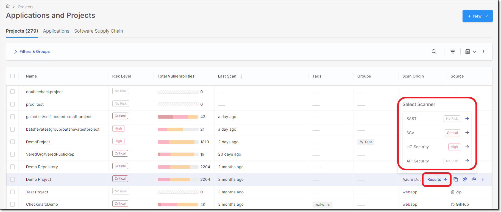
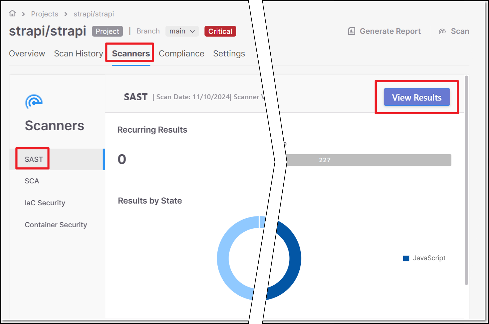
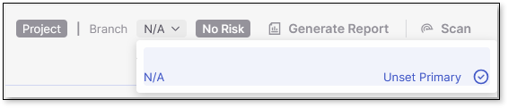

# Viewing Scan Results in the Results Viewers

Each type of scanner identifies different types of risks in your Project. Therefore, there is a designated results viewer for viewing scan results for each of the scanners. The following articles describe the information shown in each of the results viewers.

There are two methods for opening the scan results viewer for a specific scanner.

**Method 1**

1. Go to the **Workspace** > **Projects** page.
2. In the projects list, hover over the row of the relevant project. A **Results** link is shown.
3. Hover over the **Results** link. A panel opens with a list of scanners, displaying the severity level of each scanner for the last completed scan.

   <figure><figcaption></figcaption></figure>
4. To view scan results obtained by a specific scanner, click on the scanner from the list.

**Method 2**

1. Go to the **Workspace** > **Projects** page.
2. In the projects list, hover over the row of the relevant project and click on the **Overview** icon.
3. Click on the **Scanners** tab.
4. Select the relevant scanner in the left side panel, to show an overview of the results for that scanner.
5. Click on View Results to show detailed results in the results viewer for the selected scanner.

   


Switch between primary and branch views in SAST results using the branch selector in the top‑right of the project results viewer page. Branches let you scan different code versions within one Project using the same settings. Use the dropdown to set or unset the Primary branch.



## In this section

- [SAST Results Viewer](sast-results-viewer/README.md)
- [SCA Results Viewer](sca-results-viewer.md)
- [IaC Security Results Viewer](iac-security-results-viewer.md)
- [API Security Results Viewer](api-security-results-viewer.md)
- [Container Security Results Viewer](container-security-results-viewer.md)
- [Secret Detection Results Viewer](secret-detection-results-viewer.md)
- [Repository Health (Scorecard) Results Viewer](repository-health-scorecard-results-viewer.md)
