# API Security Results Viewer

The **API Security Result** page contains a list of risks, the Risks table, which can be sorted according to the parameters listed in that table. Additional information on these parameters is available under [Viewing the Scanners Tab (API Security)](../api-security/viewing-the-scanners-tab-api-security.md).

-  **Severity**
- **Risk Name**
- **Status**
- **Endpoint Path**
- **Method**
- **Data Origin**
- **Risk Discovered**

## Risks Table

The table illustrated below lists all the API security risks detected during the recent scans.

**To view the Risks table from the Project Preview:**

1. Under **Projects and Applications**, In the Projects list, click somewhere in the line of the desired project. The Project Preview appears.

   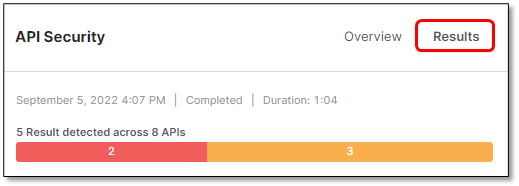
2. In the Projects Preview, click 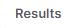 for the desired scanner, in this case **API Security**. The Risks table appears as illustrated below.

**To view the Risks table from the Project Overview:**

1. Open the Project Overview, for example by clicking 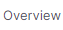 in the Project Preview.

   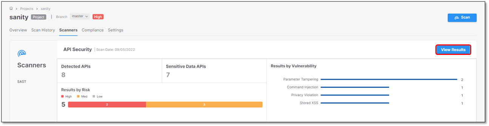
2. In the Project Overview, click . The Risks table appears with the scan results. This example reflects the results illustrated on the [scanners tab page](../api-security/viewing-the-scanners-tab-api-security.md) listed in the Risks table.

   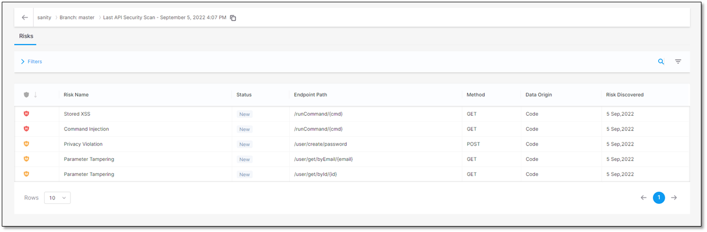

## Viewing Scan Results in Detail

This section explains how to view the scan results and what you see. For every detected risk, the risk itself (for example a privacy violation) and a list of sensitive data that appear in the code are displayed. The sensitive data is a [set of parameters in various categories](../api-security/viewing-the-scanners-tab-api-security.md) that have been defined as sensitive data by Checkmarx.


The list of sensitive data is not related to the detected vulnerabilities. It simply provides you with an overview of what is potentially vulnerable to threats.


**To display the details of the detected risk and a list of sensitive data in the code:**

1. Click the row of the respective risk, for example  **Privacy Violation**. The **Details** and **Parameters** widgets appear with information on the detected risk and the sensitive parameters in the code.

   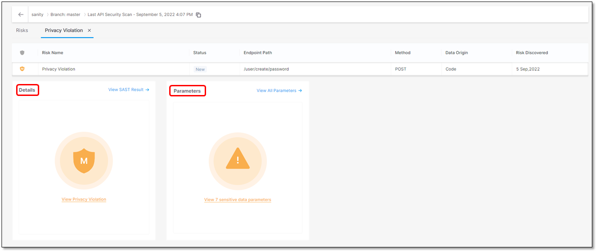
2. Click somewhere inside the **Details** and **Parameters** widgets. Further information on the risk and a list of [sensitive data](../api-security/viewing-the-scanners-tab-api-security.md) in the code and their location appear.

   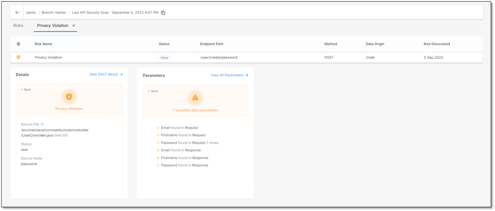

   To get more information, refer to the next sections on this page.

**To view the details on the detected risk:**

1. Click somewhere in the **Details** widget to view additional information on the detected risk. The table below lists and explains where the risk is located. The risk in this example is a **Privacy Violation**.

   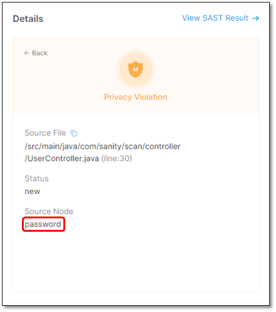

   | Parameter | Value | Description |
   |---|---|---|
   | **Source File** | **/src/main/java/com/sanity/scan/controller/UserController.java**(line:30) | The path and file name of the file with the **Privacy Violation**. |
   | **Status** | **New** **Recurrent**. The vulnerability has been detected at least once before. | The status of the privacy violation |
   | **Source Node** | The first node (input) of the vulnerable sequence. | The beginning of the attack vector. |

**To view all the SAST scan results around the detected risk:**

1. In the **Details** widget, click . A list of SAST vulnerabilities appears. In this example, **7** Java vulnerabilities have been detected.

   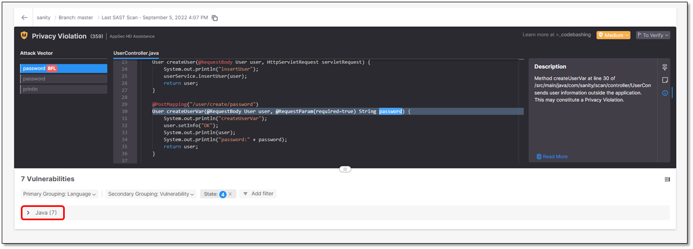
2. Expand the list by clicking 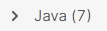.

   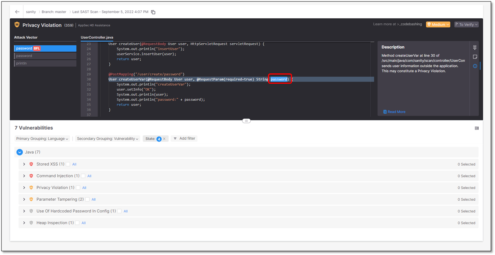
3. Expand a vulnerability. The vulnerability appears listed with additional information.

   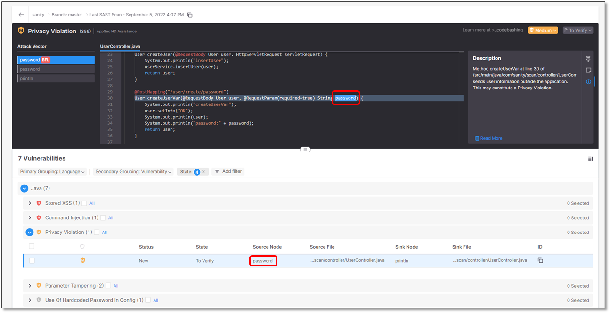

   | Parameter | Description |
   |---|---|
   | 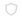(Severity) | Severity of the vulnerability: **Critical**  **High**  **Medium**  **Low** |
   | **Status** | Status of the vulnerability: **New** **Recurrent** - The vulnerability has been detected at least once before. |
   | **State** | **To Verify** - Vulnerability requires verification, for example, by an authorized user. **Confirmed** - Vulnerability has been confirmed as exploitable and requires handling. |
   | **Source Node** | The first node (input) of the vulnerable sequence. |
   | **Source File** | The file in which the source node is located. |
   | **Sink Node** | The last node (output) of the vulnerable sequence.  For vulnerabilities that affect a single node, the sink node is identical to the source node.  |
   | **Sink File** | The file in which the sink node is located. |
   | **ID** | To read the vulnerability ID, hover over . To copy the ID into the clipboard, click on . |
4. Expand a vulnerability and click inside the line that details it. A table with further information on that vulnerability appears and the exact location in the code is displayed.

   

   In addition, a short description of the vulnerability is provided. For a more detailed explanation, click **Read More**. A more detailed description opens in a new tab of your browser.

**To view a list of the sensitive data parameters in the code:**

- | Interface | Description |
  |---|---|
  | 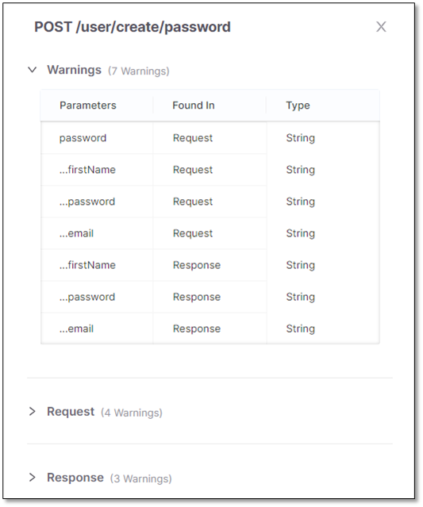 | List of all sensitive parameters in the API with warnings. This section is identical with the list of the sensitive data parameters above. |
  | 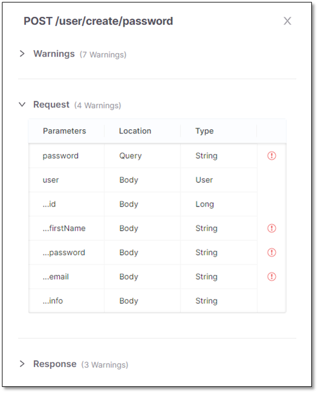 | List of all parameters in the request to the API. The sensitive parameters are labeled . |
  | 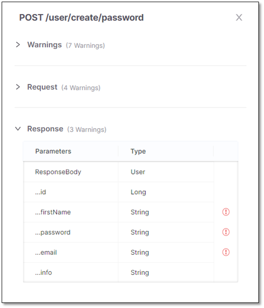 | List of all parameters in the response by the API. The sensitive parameters are labeled . |
