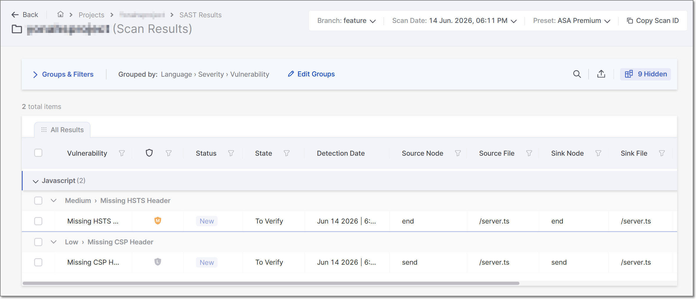
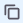
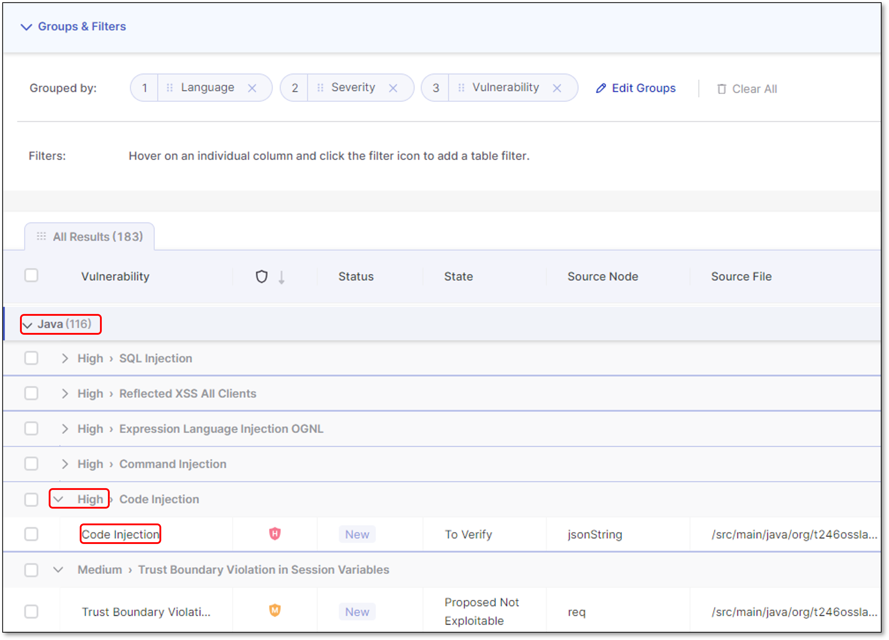
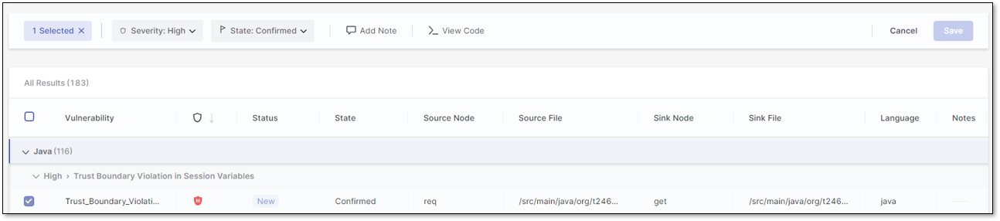
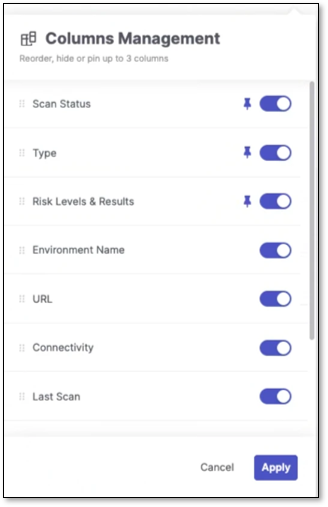
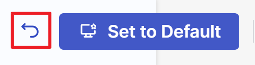
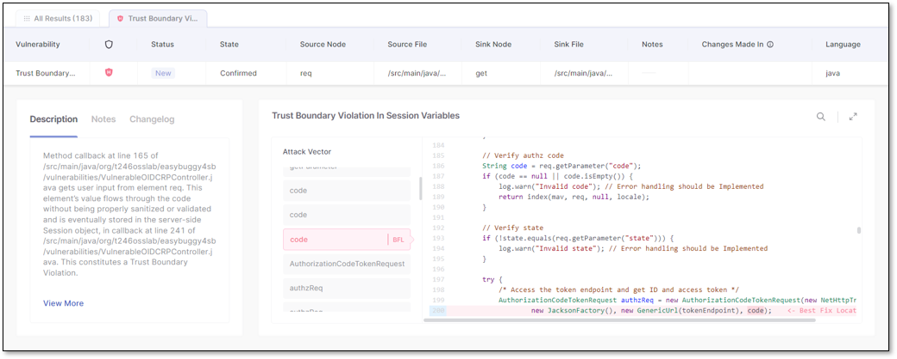
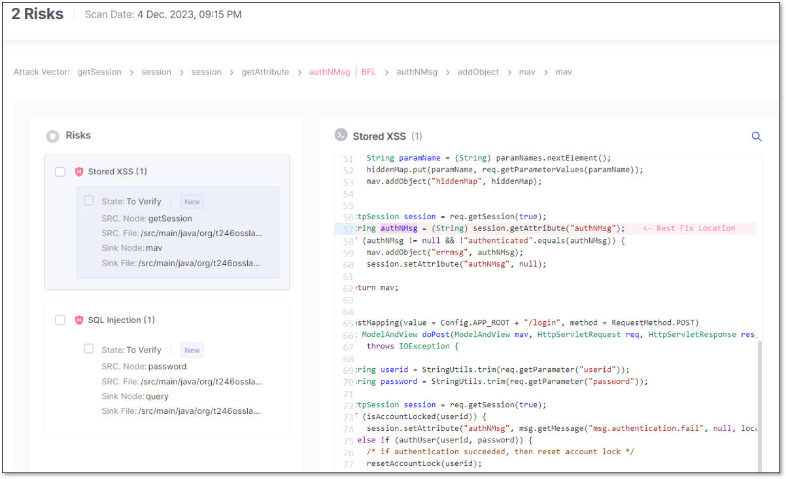
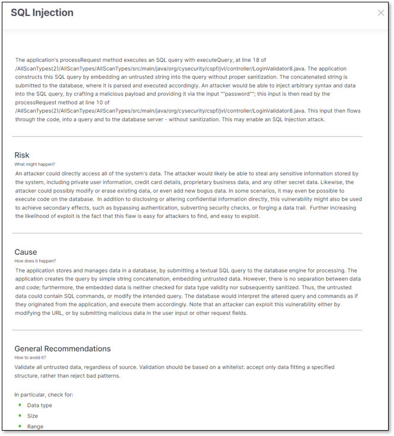
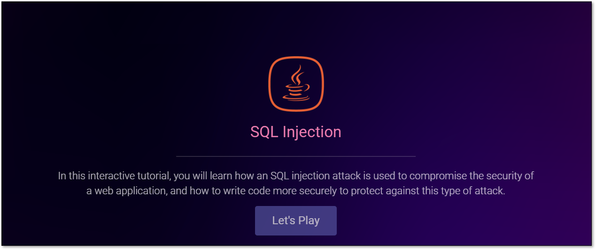

# SAST Results Viewer

The **SAST Result Viewer** helps identify and manage vulnerabilities in SAST-scanned projects and code, providing a comprehensive overview with its **Vulnerabilities Table** and **Code Viewer**.

## Understanding the Vulnerabilities Table

The **Vulnerabilities Table** is a great tool for understanding the vulnerabilities found during a project's SAST scan. It organizes the vulnerability details into columns. For more details on the vulnerability table columns, see [here](#vulnerability-table-columns). The table is customizable and can be filtered, sorted, and organized to best suit your needs. You may also add notes to specific vulnerabilities for yourself and for collaboration with colleagues. The table is searchable and can be exported as a .csv file for easy sharing or manipulation in an Excel worksheet.

<figure><figcaption></figcaption></figure>

Vulnerability Table Columns

The table below details the columns in the vulnerabilities table.

| Parameter | Description |
|---|---|
| **Severity** | The severity of the vulnerability: **Critical** **High** **Medium** **Low** **Info** |
| **Status** | Status of the vulnerability: **New** **Recurrent** - The vulnerability has been detected at least once before. |
| **Detection Date** | The **Detection Date** value varies between the UI and a CSV report. In the UI, it represents the initial vulnerability identification, whereas in the CSV report, it represents the most recent date the vulnerability was flagged. |
| **State** | **To Verify** - Vulnerability requires verification, for example, by an authorized user. Default state of a new result. **Not Exploitable** - Vulnerability has been confirmed as not exploitable (false positive). **Proposed Not Exploitable** (PNE) - A vulnerability proposed as not exploitable, for example, as a potential false positive. These vulnerabilities are a potential threat until their state is changed to **Confirmed** or **Not Exploitable**. **Confirmed** - Vulnerability has been confirmed as exploitable and requires handling. **Urgent** - Vulnerability has been confirmed as exploitable and requires urgent handling. |
| **Source Node** | The first node (input) of the vulnerable sequence. |
| **Source File** | The file in which the source node is located. |
| **Sink Node** | The last node (output) of the vulnerable sequence.  The sink node is identical to the source node for a single node's vulnerabilities.  |
| **Sink File** | The file in which the sink node is located. |
| **Changes Made in** | If the **Source code**, **Query**, or **Scanner** changed between the previous and the current scan, this column shows where the change was made. Hover over a result in this column and click on  to copy its vulnerability ID into the clipboard. You may send this ID to colleagues to collaborate on the vulnerability. |

## Customizing Your Table View


Refreshing a page or clicking **Revert to Default** will reset any results, groupings, or filtering changes. Before exiting or refreshing the page, ensure you click **Set to Default** to save your table as the default view for when you return.


### Using the Groups and Filters Bar

In the **Groups & Filters** bar above the vulnerability table, use groups to organize your data based on a vulnerability's details and find similar vulnerabilities quickly.

You can assign up to three group levels, which can be edited by clicking **Edit Groups**. As in the example image below, if a table has the default groups **Language**, **Severity**, and **Vulnerability**, it will first display the vulnerability's language (Java) as a dropdown, then the severity (High), and lastly, the vulnerability's category (Code Injection).

<figure><figcaption></figcaption></figure>

You can reorder groups by dragging their labels, which changes the order of the results on the table. To remove a group, click the **x** on its label or **Clear All** to remove all the groups.

When a scan result is checked, the **Groups & Filters** bar shows the number of selected results and displays different options, such as changing a result's Severity level or State. You may also **Add Notes** or view the code in detail using the **View Code** option.

<figure><figcaption></figcaption></figure>

At the end of the **Groups & Filters** bar, you can search the table, toggle column filtering, export your table results view as a .csv file for sharing, or reorder/ hide/ pin your table columns by clicking the **Columns Management** dropdown, . (If you have columns that are hidden, it will look like this: **Hidden**). If any changes are made to the organization of the table, the **Set as Default** and **Revert to Default** buttons will appear.

#### Columns Management

Use the Columns Management panel  to tailor your table view. You can show or hide columns, pin key ones to lock their place in the table, and drag others to reorder them for better visibility.

- Show/Hide Columns: Toggle columns on or off to display or remove them from the table.

  - Hiding columns clears any filters applied to them.
  - If you hide a column that was part of a sorting rule, that sorting will be cleared, and the table will revert to its default sort order. This ensures the table view remains consistent, displaying only visible data.
  - Hiding a column updates the counter (ex: **4**)
- Pin Columns: Pin up to 3 columns to lock their position in the table. Pinned columns move to the top of the list, just below the default pinned columns.

  
  The **Vulnerability**, **Severity**, **Status**, and **State** columns are pinned/locked by default: they cannot be moved or hidden. The default table view will remain unchanged unless you modify it through the column management panel.
  
- Reorder Columns: Drag columns up or down in the list to change their position. Columns listed from top to bottom will appear from left to right in the table.

Click the **Apply** button to confirm and apply your adjustments in the table.

To further tweak the table view, hover your mouse over the line between columns until an arrow icon appears, then drag to adjust the column width.

### Filtering and Sorting the Vulnerability Table

Filter your table view further by focusing on a vulnerability detail category. Before filtering the columns, adjust the table **Rows** view to your liking. The vulnerability table's default setting displays 10 rows of results per page, as indicated in the **Rows** dropdown. Select the dropdown to toggle the view to 20 or 50 rows.

Hover over a column header, click the filtering icon , and select your filter(s) from the dropdown list or search. Applied filters are listed in the **Groups & Filters** bar.

Hover over a column header and click the sorting icon  to toggle between sorting in ascending or descending order.

### Set Default Table Display

When you customize the display of a table by changing the grouping, applying a filter, sorting the results etc., the  button appears at the top of the page. Click on this button to save this view as your default. Each time that you log in to your account your **Default** view will be displayed.

If you then make changes while showing your customized **Default** view, a **Revert** button appears next to the **Set to Default** button . This will return you to the previously set **Default** view.

Alternatively, you can click on  again to set the current view as your Default. This will override and permanently delete the previous **Default** view.


Pagination and branch selection are not included in the **Default** view, as these tend to relate to a specific session.


## Inspecting a Vulnerability Result

Once your vulnerability table is customized to your liking, you can inspect a vulnerability's code and explore the best way to remediate it.

There are two ways to view a vulnerability's code, leading to different views.

The first method is to select a vulnerability by clicking on its row, which will add it as a tab at the top of the results view. You can open and maintain multiple results views. Toggle between them by clicking on their tabs or hovering over one and clicking the **x** to close it. Selecting a result tab opens its **View Code** panel.

The second method to view a vulnerability's code is to mark its checkbox and click **View Code**. This method enables you to mark and open multiple vulnerabilities simultaneously, displaying them all in a single panel.

*(L) Single-tab vulnerability view code panel; (R) Multiple vulnerabilities view code panel*

Use the following table to compare features between the different views and decide which better suits your needs:

| Feature | Single Vulnerability View Code | Multiple Vulnerability View Code |
|---|---|---|
| Risk Description | ✓ | X |
| Notes | ✓ | ✓ |
| Changelog | ✓ | X |
| Attack Vector | ✓ | ✓ |
| Best Fix Location (BFL) | ✓ | ✓ |


A result's description might not match the lines in the shown source code due to JSON beautification removing empty lines, while SAST preserves the original output.


### Viewing the Code

When opened in a new tab, the **View Code** risk panel includes the **Risk** (vulnerability name), attack vector, Best Fix Location (**BFL**), a **Description** of the vulnerability, **Notes**, and a **Changelog**. In the **Description**, clicking on **View More** will expand the description and open it in a new side panel, while clicking **Learn More at Codebashing** will redirect you to learn more about the vulnerability in Codebashing (where relevant).

*(L) Expanded description of an **SQL Injection** vulnerability; (R) SQL Injection course in Codebashing*

The **Changelog** details the history of your changes to the vulnerability. The attack vector (vulnerability flow) shows you the code that leads to the vulnerability, and the BFL is the code - when remediated - which fixes it. The BFL is highlighted and focused by default when opening the **View Code** risk panel. You can search within the code or zoom in with the icons in the upper-right corner. Note, on the ribbon, you may change the **Severity**, **State**, or **Add Note** to the result. Remember to click **Save** when done.

When viewing the code after results are marked or multi-selected, the **View Code** risk panel is similar to the above, except it doesn't display a description of the risk or the changelog.

By marking a risk's checkbox, you can adjust its **Severity**, **Result State**, or **Add Note**. Marking a risk's checkbox replaces the attack vector with the same ribbon mentioned above. Remember to click **Save** when done.

## In this section

- [SAST Scan Result Change Indicators](sast-scan-result-change-indicators.md)
- [Requesting AppSec HD (Help Desk) Assistance](requesting-appsec-hd-help-desk-assistance.md)
