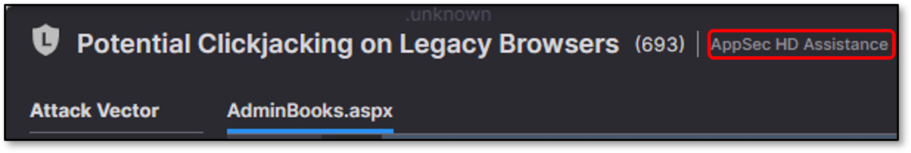
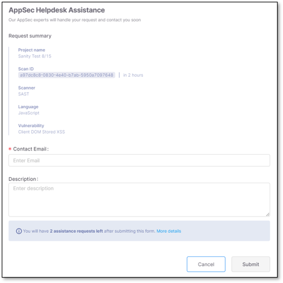

# Requesting AppSec HD (Help Desk) Assistance

A request for the Checkmarx AppSec (Application Security) assistance can be submitted for additional information or guidance about a discovered security vulnerability. You can receive specialist assistance from the Checkmarx AppSec Help Desk to understand a vulnerability, or the intricacies of a programming language that you are unfamiliar with.

Be aware that AppSec HD Assistance is contingent upon the license your organization holds. For more information, refer to Viewing License Info and Upgrading a License.


Mandatory fields are marked with 


Follow these steps to submit an assistance request:

1. Click **AppSec HD Assistance.**

   <figure><figcaption></figcaption></figure>

   The **AppSec Help Desk Assistance** screen is displayed:

   <figure><figcaption></figcaption></figure>
2. Review the **Request summary** section. It is populated automatically and includes the following: `Project name`, `Scan ID`, the name of the `Scanner` that performed the scan, the code `Language`, and the name of the `Vulnerability` that you need assistance with.
3. Enter the **Contact Email** that the help desk will respond to.
4. Provide a clear, concise explanation of the issue that clarifies what assistance you require in **Description**.
5. View the information note that indicates how many assistance requests will be available once the current form is submitted. To view your organization’s account settings, license specifications, and upgrade options click **More details**.
6. Click **Submit**.
