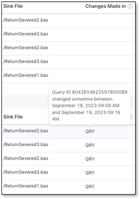
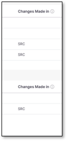

# SAST Scan Result Change Indicators

## Overview

Since version upgrades in SaaS environments happen seamlessly in the background, sometimes, a new scan will generate different results, which, while beneficial, may be unexpected. Likewise, you might be uncertain about what caused these new results, such as a change in the engine version, the query, or the source code. Indicators display the differences in the new results with high confidence so you can have a more approximate understanding of the change in results.

By comparing the current scan (id) with the previous one, you can determine the origin of the change in the result. You can also see the indicator in the **Changes Made In** column on the **Results Viewer** page. Hovering over a cell will prompt a detail of the engine version, query, or source code and a notice of when it changed:


Indicators can be displayed individually or in groups. Hovering over any or all of them will likewise display the detail.

